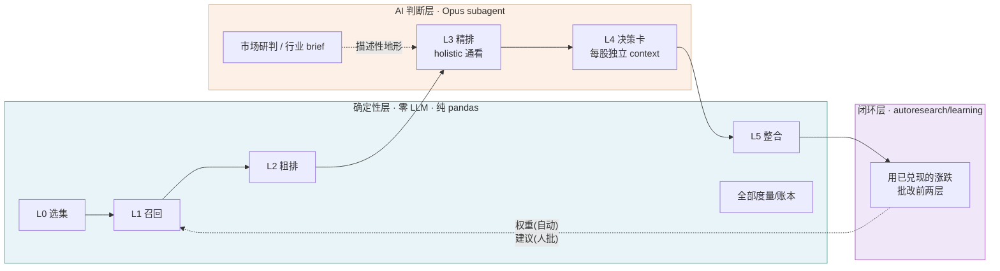
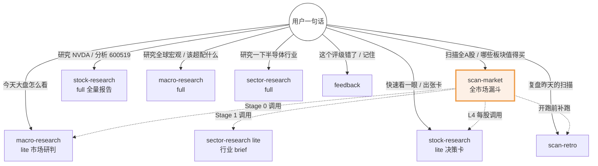
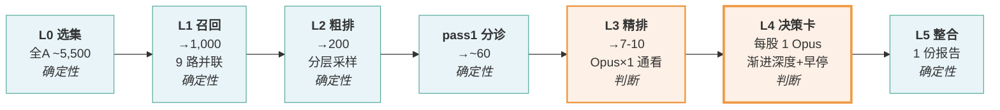
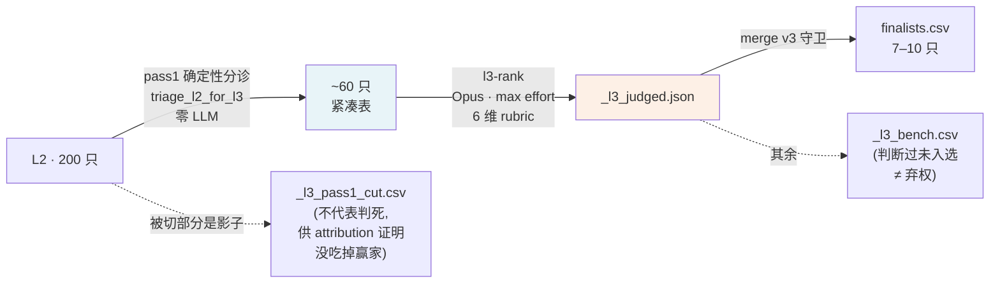
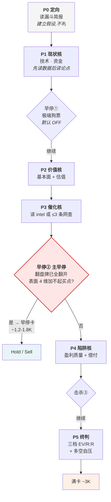
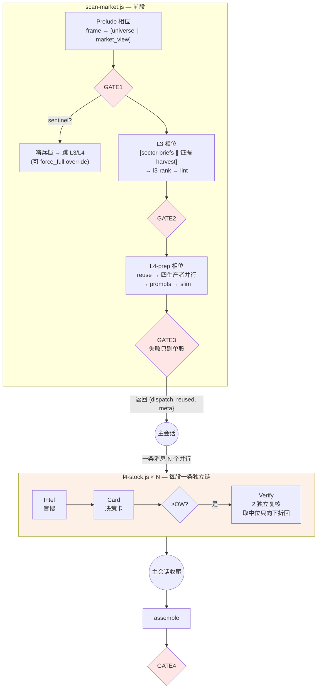
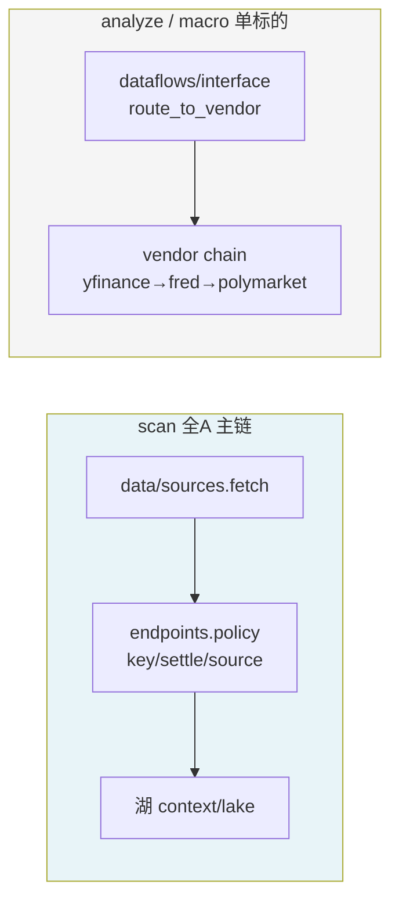
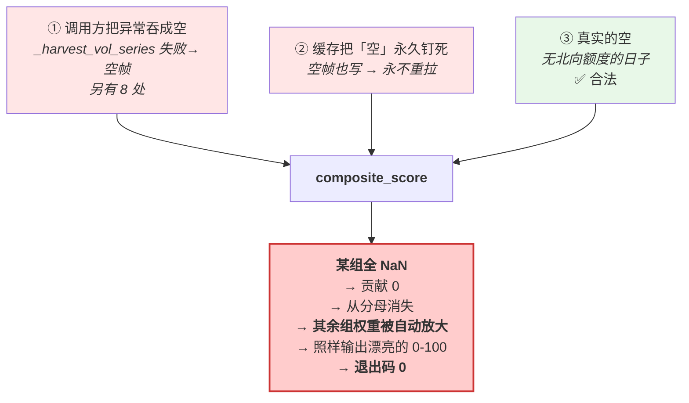
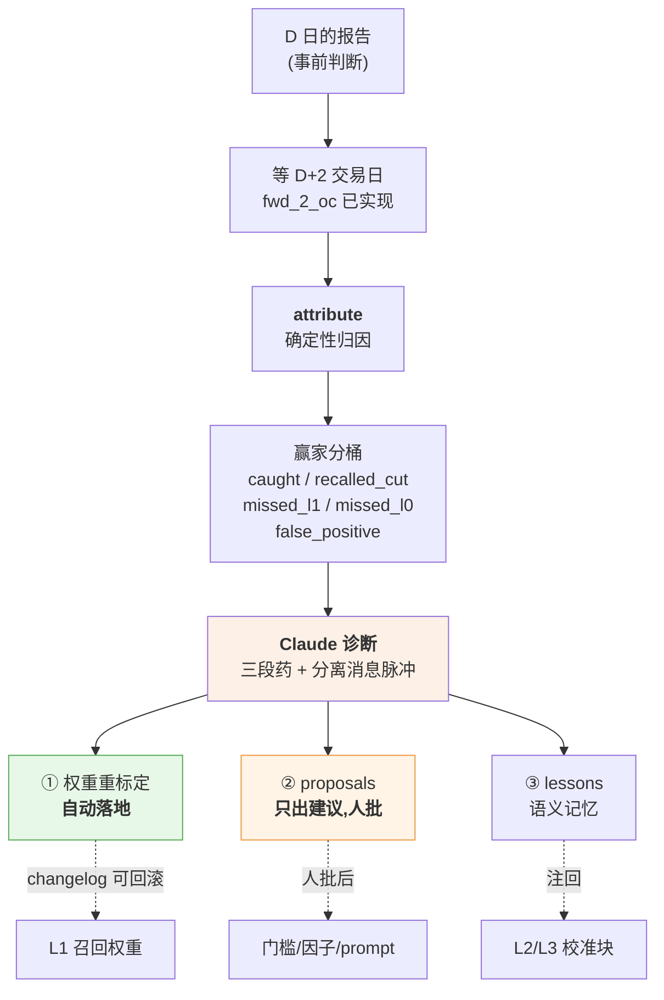
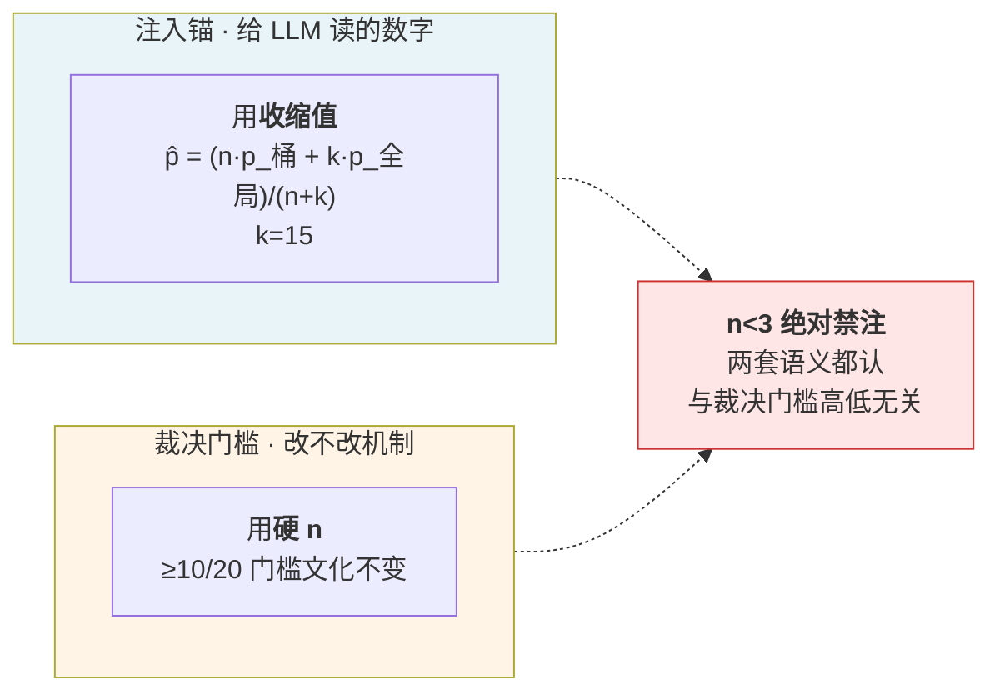

# TradingAgents · 项目全景

> **一句话**:把一个「用付费 LLM API 跑多 agent 交易分析」的框架**反向重构** —— 付费 LLM 那一半整个摘掉,判断力换成 **Claude 在 session 内当引擎**;剩下的全部工程,是**如何让有限的判断力花在最值得判断的几十只票上,并且知道自己有没有用**。
>
> 采集基线:2026-07-16 · main @ `075d3ac` + 未提交改动 · `autoresearch/` 26,487 行 Python / 126 个模块 · 1,280 测试绿
> 本文与源码冲突时**以源码为准**;凡文案已滞后于实证之处,本文单列「⚠️ 张力」不替上游圆场。

---

## 目录

| # | 章 | 一句话 |
|---|---|---|
| [1](#1-这是什么) | 这是什么 | 一次反向重构:删掉 12,969 行付费路径 |
| [2](#2-全景图) | 全景图 | 三层 + 六段 |
| [3](#3-核心命题让-token-与市场规模脱钩) | 核心命题 | 漏斗不是为了更准,是为了让 token 与市场规模脱钩 |
| [4](#4-确定性层零-llm) | 确定性层 | L0/L1/L2/L5,纯 pandas,不编数 |
| [5](#5-判断层claude-是引擎) | 判断层 | L3 通看比较 · L4 渐进深度 + 早停 |
| [6](#6-地基数据层) | 地基 | 湖 + 契约 + 打分数学 |
| [7](#7-闭环学习) | 闭环学习 | 用已兑现的涨跌批改前两层 |
| [8](#8-世界观我们怎么做决定) | ⭐ 世界观 | 13 条元方法论,几乎每条都有血 |
| [9](#9-账本说了什么) | 账本 | 实证读数汇总 |
| [10](#10-已知缺口诚实节) | 已知缺口 | 诚实节 |
| [11](#11-命令速查) | 命令速查 | 怎么跑 |

---

## 1. 这是什么

### 1.1 分叉点

```
2026-06-19  b5872c4  chore: rebrand to AutoResearch, remove paid-LLM path, prune to free data layer
            87 files changed, 424 insertions(+), 12,969 deletions(-)
```

上游 TradingAgents 是「用付费 LLM API 跑 LangGraph 多 agent」的框架。本项目**删掉了 LLM 编排层本身**(LangGraph 编排 / provider clients / CLI / 批量 runner),不是给它加了个 Claude provider。

> **这个项目的公式**:一条 pipeline 里「要钱的」只有 LLM 调用那一段,而那一段恰好可以被**正在跟你对话的这个 Claude** 顶替。数据层不要钱(yfinance / FRED / akshare / tushare,keyless + 两个免费 token),于是整条链的**边际现金成本 = 0**。

来源:`docs/specs/2026-06-20-macro-research-design.md:10`

### 1.2 于是基建全部由 harness 提供

| 传统框架要自己建 | 本项目 |
|---|---|
| LLM 编排引擎 | Claude Code 的 session 本身 |
| Agent 定义 | `.claude/agents/*.md`(人设烤进 system prompt) |
| 工作流引擎 | `.claude/workflows/*.js` |
| 记忆/向量库 | `context/knowledge/*.jsonl`(**刻意不要 FTS5/embedding**) |
| 调度器 | 用户开一个 session |

**刻意的「不做」**(`docs/specs/2026-06-20-closed-loop-learning-design.md:136`,hermes-agent 取舍节):

> **抄**:agent 自策展记忆、skill 自改进、闭环 + 定时补跑。
> **丢**:独立运行时、模型 provider、FTS5、消息网关 —— **CC 已给底座,引入只会重新引入付费 LLM + 第二套运行时**。

同一纪律:「借 hermes 的『agent 自策展』**纪律**,不借它的**基建**」。经验条目策展后保持精简(几十~上百条),按范围过滤后整体加载即可 —— **不要向量检索**。

### 1.3 三层角色分工(贯穿全项目的铁律)



- **确定性层**:零 LLM,纯 pandas,**不编数、不预测**。
- **AI 判断层**:全部是 Opus subagent(独立 context),**只回传紧凑结果**。
- **闭环层**:用已兑现的涨跌批改前两层。

来源:`.claude/skills/scan-market/STAGES.md:31-34`

---

## 2. 全景图

### 2.1 三条研究线



**skill 之间是**「full 独立入口 / lite 被 scan-market 复用」的两档结构 —— 同一份 playbook 出两档 prompt,避免两套人设漂移。

### 2.2 目录地图

```
autoresearch/                      26,487 行 / 126 模块
├── data/          湖 + 契约 + 源       ← 全项目唯一取数入口
├── dataflows/     vendor 路由(遗产)   ← 服务 analyze/macro 单标的
├── common/        打分原语 scoring     ← 10 因子组 + composite
├── research/      factor_lab / 回放器  ← 实证研究层
├── scan/    8,598 全A漏斗 L0→L5
├── analyze/       单标的 full/lite
├── macro/ sector/ 宏观 / 行业
├── learning/ 6,426 闭环(27 模块)
└── trace/         OTEL 计量(旁路)

.claude/
├── skills/     6 个(scan-market / stock-research / macro-research
│                    / sector-research / scan-retro / feedback)
├── agents/     5 个叶子(l3-rank / l4-card / l4-intel
│                       / macro-brief / sector-brief)
└── workflows/  2 个(scan-market.js 前段 + l4-stock.js 每股一条链)
```

---

## 3. 核心命题:让 token 与市场规模脱钩

### 3.1 不可能的算术

> 对 ~5,500 只逐个跑深度报告 = **几亿 token,不可行**。
> —— `.claude/skills/scan-market/SKILL.md:12`

### 3.2 解法:搜索/推荐系统式六段漏斗



| 段 | 引擎 | 进→出 | token |
|---|---|---|---|
| **L0** 选集 | 确定性 | 全A → ~5,500 | 0 |
| **L1** 召回 | 确定性 · 9 路并联 | → 1,000 | 0 |
| **L2** 粗排 | 确定性 · **分层采样(非模型)** | → 200 | 0 |
| 市场研判 | Opus · 旁路 | 1 份 | 小 |
| **L3** 精排 | Opus · holistic 单 agent | → **7–10** | 中 |
| **L4** 研究 | **每股 = 一个 Opus subagent** | ~10 张卡 | **大头** |
| **L5** 整合 | 确定性 | 1 份报告 | 0 |

> **这就是分层的全部理由**:漏斗**不是为了「更准」,是为了让 token 曲线与市场规模脱钩**。5500 → 1000 → 200 的三步全是零 token 的 pandas,收口不花钱;花钱的只有最后 ~10 张卡。
>
> 所以每一层的正确目标函数**不是「选得准」**,而是「**在不丢赢家的前提下,尽可能便宜地把候选交给下一层**」。

深挖数量 = **用户的预算旋钮**(`docs/specs/2026-06-20-scan-market-design.md:13`)。

### 3.3 省 token 靠早停,不靠降模型

> **全程 Opus,省 token 靠早停。** —— `SKILL.md:12`

这是 6/24 一次架构翻案的结论(见 [§5.2](#52-l4--一只票--一个独立-context)),而且是**全项目最诚实的一次成本决策**:

> **诚实**:全 Opus **非 token 净省**(≈打平/略贵),换的是**简单 + 全 Opus 质量**。

### 3.4 token 经济的四个旋钮

| 旋钮 | 机制 | 实现 |
|---|---|---|
| `delta=True` | 略去无变化的票 | `l3_table_md` |
| **L4 预算五旗** | 命中 1 旗 → 23;≥2 旗 → 15;0买连败≥7 → 压到 10 | `menu.l4_budget` |
| **卡片 TTL 复用** | 近 4 日已出卡 ∧ ≤Hold ∧ \|Δ价\|≤5% ∧ regime 未翻 → ♻️ 直接复用(约 20%) | `l4_reuse` |
| **哨兵档** | 全市场健康涨 <3% → 建议跳过 L3+L4,**省 ~70% token**;**由人拍板** | `menu.sentinel_advice` |

**L4 预算五旗**(`menu.l4_budget`,base=30 / floor=12,**只降不升**):

| 旗 | 判据 |
|---|---|
| 落刀 | `knife_share > 0.60` |
| **相对落刀** | `> 0.40 且 > 2× 全市场` —— 07-03 病灶 45% vs 20%,**绝对门抓不住** |
| 健康涨少 | `healthy <= 2` |
| risk_off | `meta.json` 的 `regime == "risk_off"` |
| **0买连败** | `streak >= 3`;**`>= 5` 计重旗** |

> ⚠️ **诚实**:落稿 token 估算 ~75k,**真实量级 ~1M**(主因 L4 输入未计,`STAGES.md:262`)。漏斗省的是**数量级**(几亿 → 百万),不是「小」。

---

## 4. 确定性层(零 LLM)

### 4.1 L0 选集 —— 每加一条硬门就是一块永久盲区

**硬门单一事实源** = `data/akshare_universe.py:149 _apply_universe_gates`(tushare 路径**复用同一函数**):

| 门 | 判据 | 阈值 |
|---|---|---|
| ST/退市 | `name` 含 "ST" 或 "退" | — |
| 市值地板 | `mktcap_yi >= cap_floor_yi` | **30 亿**(默认) |
| 停牌代理 | `amount_yi > 0` ∧ `close.notna()` | 无成交额/无价 |
| 北交所 | `^(8\|4\|920)` | 默认 **纳入** |
| 次新 | 上市 < 60 交易日 | 仅 tushare 路径 |

> **哲学**:只剔「**确定不可交易 / 不可研究**」的 —— **每加一条硬门就是一块永久盲区**。
> **已知局限**:`missed_l0` ≈ 赢家的 9%;「软化市值地板」提案已提、未批。
> —— `STAGES.md:50-53`

### 4.2 L1 召回 —— 多路并联 + floor 保底多样性

**注册机制**:`@channel(name, quota, floor, desc)` 装饰器 → **「加一路 = 写函数 + 注册,不动 stage/merge」**。

**已注册 11 路,生产启用 9 路**:

| channel | quota | floor | 判据 | 状态 |
|---|---:|---:|---|---|
| `composite` | 400 | 100 | 无门 | ✅ |
| `momentum` | 250 | 50 | 动量门 | ✅ |
| `reversal` | 200 | 50 | 反转门 | ✅ |
| `reversal_confirm` | 200 | 50 | 四段,**起爆日硬门** | ✅ |
| `growth` | 150 | 40 | 成长门 | ✅ |
| `value` | **250** | 50 | 行业内 PE + ROE | ✅ 配额上调 |
| `main_fund` | **150** | 50 | 主力净流入 > 0 | ✅ 配额下调 |
| `heat` | **150** | 50 | 无门,成交额量级 | ✅ 配额下调 |
| `healthy` | 150 | 40 | `0<pct60<40` ∧ 主力+ ∧ cmf+ | ✅ |
| ~~`accumulation`~~ | 120 | 30 | 底部放量 | ❌ **剔**(累计 unique 超额 −0.21% = 唯一实数据负路) |
| ~~`northbound`~~ | 120 | 30 | `hk_ratio > 0` | ❌ **剔**(T+2 IC −0.108) |

**`quota_union` 合并**(纯 quota union,**非 RRF**):每路 top-`floor` **无条件进 protected** = 多样性保证 → provenance 三列(`recall_channels` / `n_channels` / `best_rank`)→ trim → 不足则 backfill。

**`heat` 通道的机制注解**(值得单独一读):百分位混合行不通 —— rank 把 386 亿成交额压成 0.9998(与第 100 名仅差 2pt),而换手/量比却能 0→1 全摆 → 结果全是小盘异动股。改用**成交额量级当乘法主轴**,kicker ≤1.25× 压不过量级。目的 = **免疫 composite 的 T+1 IC froth 惩罚**(中际旭创成交额全市场第 2、composite 仅 32)。

### 4.3 ⭐ L2 —— 为什么是确定性分层采样器而不是模型

这是全项目**证据链最完整、也最反直觉**的一条决策。

#### 触发器不是回测,是用户肉眼

部署的 `l2_fwd5` champion 是 xgb,**OOS rank-IC = −0.023(负 = 反预测)**,只因 `gate=beats_linear` 当「最不伤切」上线;**leaderboard 全模型全 horizon 皆负**。后果:反转 regime 下它把全部动量/heat 票压出 L2(实测 momentum 0/200、heat 0/200、健康图形仅 1%)→ L3/L4 只剩超卖落刀可选 —— **用户实测「形态全很差」**。

> 🔑 回测是**事后**用来把直觉钉死成定论的。

#### 4 年回测(83 成型日 × 2022-06~2026-05)

| 口径 | 前瞻超额(vs 截面均值) |
|---|---|
| composite-top200 | **−1 bps**(t −0.09) |
| **random-200** | **+5 bps** |
| strat[composite] | −0 bps(**≈ top200 = 分层免费**) |
| strat[own_style] | −13 bps(更差) |

> 🔑 **最锋利的一条**:`random-200` 比 `composite-top200` **还好**。花力气排的序,还不如随机抽。

**regime 分段**:2022熊 +20 / 2023震荡 +14 / 2024含动量 **+28** / **2025-26反转 −24 bps** → 「负 IC」是当前 regime 现象。

#### 三条设计原则

1. **L2 不赌 regime**:固定 floor 保证每风格不为 0;regime 判断交 L3/L4(Claude)。
2. **L2 不预测**:配额是 policy(要多少多样性),桶内是同质选择 —— **都不是预测问题,故全程无 ML**。
3. **分层免费**:回测证 strat ≈ top200 ≈ 0 → **多样性零 alpha 代价,白拿**。

#### 实现:四步算法

```python
STYLE_CHANNELS = {"趋势": ("momentum","heat"), "反转": ("reversal",), "价值": ("value",),
                  "成长": ("growth",), "吸筹": ("accumulation",), "主力": ("main_fund",),
                  "健康": ("healthy",)}
DEFAULT_FLOORS  = {"趋势": 20, "健康": 15, "反转": 12, "价值": 12,
                   "成长": 12, "吸筹": 12, "主力": 10}      # Σ = 93

① _sn = sector_neutral(composite, industry)      # composite − 申万一级组均值,去行业 beta
② merit 核:merit_need = 200 − 93 = 107,按 _sn 降序取,过 sector cap(0.20×200=40)
③ floor 补:大 floor 先(趋势20→健康15→…),从线下补足每桶
④ 回填到 200;仍不足 → 松 cap 兜底凑满
```

**`select_l2` 返回 `engine = "stratified(sn_composite)"`。没有 GBDT / LightGBM / 模型。**

#### ⚠️ 张力:命名/文案债

| 遗留 | 真相 |
|---|---|
| 文件名 `L2_gbdt_top200.csv`、列名 `gbdt_score` | **历史遗留别名**,`gbdt_score = l2_score = composite` |
| `assemble._funnel_rows` L2 行仍写 `GBDT/{eng}` + 「LightGBM 学习重排」 | **描述已不成立** |
| `factor_lab.gbdt_features` docstring 自称「L2 粗排引擎」 | **旧文,以源码调用链为准** |

背景:L2 champion / Qlib 模型园区已于 2026-07-13 **整簇删除**(`32926fd`,~2803 行源码 + 1290 行测试)。

#### 换了定位就必须换 KPI

> L2 不再用 IC/keep-cut-lift 当 KPI(**那是预测标尺,L2 不预测**)。改看:**风格/行业均衡度** + **赢家存活率**(retro `recalled_cut` 桶占比)。

> 🔑 否则会**用预测的尺子去考一个不预测的部件**,考出来永远是「差」,然后引发**错误的改动冲动**。

### 4.4 影子漏斗 —— 免费的 A/B

每次跑 L2 时顺手跑四个反事实变体(零额外判断成本):

| 变体 | 问什么 |
|---|---|
| `nostrat` | 分层到底救了还是害了 |
| `nocap` | sector cap 挡了多少赢家 |
| `pre_healthy` | 旧 9 路口径的反事实 |
| `capfloor20` | 市值地板 20 亿会怎样(**唯一非零成本变体**,真重新取数) |

**纪律**:单日勿下结论,**≥10 日累计再提 proposal**。

### 4.5 L5 整合(零 LLM)

```
reports/scan/<运行日YYYYMMDD>_<HHMM>/     ← 目录名 = 实际运行时刻
├── summary.md          漏斗数量 / 各阶段概览 / buy-list / token 估算
├── manifest.json       {analysis_date, generated_at}  ← 数据日与目录名解耦
├── index.md            第二天复盘入口
├── details/<股票名称>.md   ← 文件名用名称非 ticker
└── trace/              留溯源(meta / run_health / weights_used / …)
```

---

## 5. 判断层(Claude 是引擎)

### 5.1 L3 精排 —— 通看、比较式

**为什么 subagent**:L3 一个 holistic agent(独立 context)+ L4 每只独立 context,**只回传紧凑结果,否则撑爆主线**。

**为什么 holistic 而非逐只**:一个 Opus **通看**这 ~60 只、**比较着选** —— **比较式 > 孤立逐只打分**(孤立打分各看各的、易集体虚高)。

**两遍法**:



**6 维 rubric**:① channel 共振 ② **资金**(`main_net_ratio` + `cmf_20` + `obv_mom_20` **三者同向为正**才算真主力)③ 基本面 ④ 情感/催化 ⑤ 脆弱(`winner_rate>90` = 抛压/见顶**非**筹码健康)⑥ **T+2 兑现机制**(thesis 必须回答「明天、后天谁来买」,**写不出不选**)

**硬约束 A–E(来自用户反馈,违反即失败)**:

| | 约束 |
|---|---|
| **A** | finalist 中「健康上涨」画像占比 **≥1/3** |
| **B** | **绝不选下跌趋势的票当 pick**(死叉/价在所有均线下/main_net<0),即便高股息·低 PE·防御 —— 除非「真吸筹 + 带日期催化」 |
| **C** | 保护超卖反转簇(可留 1–2 只龙头,仍须满足 B) |
| **D** | **trend lane 高确信历史被 L4 翻案 33%(n=52)** → 给高分前须先自证「为什么这次不会被翻案」 |
| **E** | 误读旗亮的票 thesis 必须自证为何非陷阱;**无法自证 → 不得入选** |

**conviction 的 T+2 行为化定义**(07-11 重锚,把 swing 残留挤出去):

> **≥70 = 我能说出 D+1 谁来买、且愿意明天开盘真金买入**(每日 ≥70 至多 ~5 只);50-69 = 值得 L4 深核但我不背书;<50 不该出现。

**merge v3 守卫**:conviction **≥75 强制补入**(误杀保险)/ **<55 剔除** / 健康画像比例守卫。

### 5.2 L4 —— 一只票 = 一个独立 context

#### 6/24 的架构翻案

从「Tier-1 Sonnet 全判 → Tier-2 Opus 平反 → Tier-3 Opus 辩论」**三层两模型**,改为 **一只 finalist = 一个 Opus subagent**:

> 把模型曲线弯成跟**判断深度**一致 —— 每只一个 Opus,**判断不好就早停、不深挖;只有看着像买点的才深核**。

#### 渐进深度 + 三个早停点



#### 防误杀的四道设计

| 设计 | 为什么 |
|---|---|
| **简报只定向、不判** | 信息太薄,据它直接早停 = 误杀 |
| **主早停 = P3 之后** | 永远不在读到「翻盘牌」(催化/forward 估值/资金回流)之前早停 |
| **漏斗能否决,不能确认买点** | 上游只有否决权 |
| **早停只向下** | 任何 **≥Overweight 必须走完 P4 + P5** |

#### 机器契约锚(被正则直接机读)

```
〔卡契约 v3·超短 1~2 日〕              ← 契约标记行
进入P4倾向: <Rating>                   ← 阶段效能计量硬契约,缺了 lint warn
**Rating** 必须 = **Rubric建议**       ← 不同则下一行写 **偏离**:<≤20字硬理由>
FINAL TRANSACTION PROPOSAL: **<BUY|HOLD|SELL>**
```

**评级 = 评分卡派生(非 gestalt)**:净分映射 **≥+4 Buy / ≥+2 OW / −1~+1 Hold / ≤−2 UW / ≤−4 Sell**;
**OW 三门(主力真在 · 业绩真兑现 · 估值不透支)任一未过 → ≥OW 一律压 Hold**。

**Grounded 铁律**:slim **>8KB 才可信**,≈4.8KB = NO_DATA → 直接回报「须重拉」,**不出盲卡**。未读的块**不许引用数字、不许编**,早停卡把未核维明写「未核·需深挖」。

### 5.3 活体情报站 —— 结构性盲

`l4-intel`(**sonnet** · max effort)在 l4-stock 链的第一相位盲搜六面:

> **你只攒料不判断**:不给评级、不喊多空。判断属于下游分析员。
> 你**没有也不该有** L3 论点、conviction、漏斗评分 —— **盲搜是防污染设计**(查询不被上游假设带偏),**你的工具也没有 Read(结构性盲)**。

这条被测试断言死:

```python
assert "Read" not in head.replace("WebSearch","").replace("WebFetch",""), "结构性盲:不得有 Read/Grep/Glob"
```

**六面**:① 公告增量 + **正文**解读 ② 突发新闻 ③ 题材归属 + 梯队位置 ④ 卖方/机构动向 ⑤ 互动易 ⑥ 负面增量。**查不到该面明写「无」,不许静默跳面**;「近 14 天无重大事件」是**合法且有价值**的输出。

### 5.4 编排真身:两个 workflow + 主会话收尾



**为什么每股一个 workflow**(fb_20260714_003,2026-07-14):

| 旧批量版缺陷 | 每股一 workflow |
|---|---|
| intel→card 全批 barrier | 股内链式衔接,**股间零 barrier** |
| 单帽排队 | 每股独立并发帽,**真并行** |
| **一票毙全局** | **单股失败只废单股**,单独重跑即可 |

> 🩸 这条改动的血:2026-07-14 **GATE3 因差 16 字节毙掉 60min / 1.6M token 的整条流水线**。

**四道门**:

| GATE | 判据 | 失败反应 |
|---|---|---|
| **GATE1** | L2 存在 ∧ 非空 ∧ code 全 6 位 | 毙 |
| **GATE2** | finalists 非空 ∧ 6 位 ∧ **`n_counted <= budget`** | 毙 |
| **GATE3** | 每份 slim 过 `_slim_defect`(**结构 + 内容**) | **只剔单股** |
| **GATE4** | `gate_fires.csv` 无 `severity == fail` | 挡发布 |

**GATE2 的 exempt 契约**:`{"pinned", "watchlist_trigger"}` 不计入预算 —— 预算数的是「L3 finalist tier 名额」。(第三个 lane `carryover` 随菜单滞回机制于 2026-07-16 退役移出,见 §8.4。)
**C-1 的真实触发路径**:铁律「pinned 不占名额」原实现只做了**注入序**,GATE2 记账却**按全行数** → **满员日 + 1 只 pinned = 确定性触发硬失败**。

---

## 6. 地基:数据层

### 6.1 架构双轨(容易误解,必须讲清)



> ⚠️ **`data_vendors` 配置不管 A 股 scan 主链**。改它不会影响扫描 —— 两套路由并存。

**四个后端**:

| 源 | key | 覆盖 |
|---|---|---|
| **tushare** | **`TUSHARE_TOKEN` 必需** | A 股主力:行情/估值/资金/筹码/技术/两融/龙虎榜/公告/质押 |
| **akshare** | keyless | 业绩 yjbb / 宏观中国 / 户数 / 解禁 |
| **fred** | `FRED_API_KEY` | 美国宏观时序 |
| **yfinance** | keyless | 跨资产历史价 |

> **被封的源**:东财 `push2.eastmoney.com` 被网络级封锁 → 默认走 tushare。但 `datacenter-web.eastmoney.com` **未封** → 业绩 yjbb 仍走 akshare。

### 6.2 ⭐ 数据契约 —— 为什么「降级不留痕」才是真病

#### 全项目最好的一句话

> **核心诊断:系统有降级能力,但没有「我降级了」的传达能力。真正要修的不是「有降级」,而是「降级是隐形的」。**
> —— `docs/specs/2026-07-12-data-contracts-design.md:29`

用户裁定(设计的根):**「为什么会有数据为空?取数以后要有一个全面校验,为空的时候要抛出异常阻断」**

#### 三条空,一个下水道



```python
comp  += (s - 0.5).fillna(0.0) * w          # 某组全 NaN → 贡献 0
wabs  += s.notna().astype(float) * w.abs()  # 该组从分母里消失
raw    = comp / wabs.replace(0, np.nan)     # 其余组权重被自动放大
```

**2026-07-12 实证**:lake 的 daily 被窄表毒化 → volprice 组整组 NaN → **全市场打分失真 98.8%、L2 名单 jaccard 掉到 0.36** —— 唯一的信号是**一行淹没在日志里的 warn**。

#### 为什么不是「见空就抛」→ 两级

| | **A 级(地基)** | **B 级(增强)** |
|---|---|---|
| 端点 | daily, daily_basic, moneyflow, cyq_perf, stk_factor_pro, stock_basic, trade_cal(7个) | 北向/两融/龙虎榜/公告/质押/新闻/宏观(~28个) |
| 反应 | **抛 `DataContractError` 阻断** + **拒绝入湖** | 降级 + **必须记账** |

**为什么 A 级要拒绝入湖**:**脏数据一旦落盘就被钉死,重跑也自愈不了**。

**为什么分级**:无差别抛异常会打断两类**合法**路径 —— ①真实的空 ②**presence-gated 的增强端点**(质押/席位/调研缺失时漏斗仍成立 —— **那是设计,不是 bug**)。

#### 五个挂载点(含原设计的盲区)

| # | 挂载点 | 备注 |
|---|---|---|
| ① | **湖命中** | **原设计的盲区** —— 历史脏数据读出来照样毒化,且不再经过取数路径任何检查 |
| ② | 未结算日取数(不入湖) | `cols=False`:只查空不查列 |
| ③ | 取数后入湖前 | A 级违约 → 抛 → **下一行 `_atomic_write` 不执行** |
| ④ | **因子帧出口** | 最后一道防线 |
| ⑤ | 直调降级点 | `record_degradation` |

④ 的存在理由,是全项目另一句好话:

> 前面每一道校验都可能被绕过(新的 try/except、新的取数路径、湖里的历史脏数据),但**打分帧本身残缺就是残缺**:这里查的是「喂给 composite_score 的东西到底全不全」,**与它从哪来无关**。

#### 规模检查 vs 结构检查必须分开

| | 判据 | 单测 |
|---|---|---|
| **结构性** | 空帧 / 缺列 / **整列全 NaN** | **永远启用** —— 无论数据规模都成立的 bug |
| **规模性** | 行数腰斩(< 3000) | 全局关掉 —— 合成小 fixture 会全是误报 |

> **窄表毒化的签名恰恰是「行数够、但缺 high/low/amount」** —— 两者性质不同,**别合并成一个开关**。
>
> ⚠️ 这条教训 **2026-07-14 又被违反了一次**:L4 的 slim 合格判据曾是**体积门槛**,把「差 16 字节的完整 slim」误杀、毙掉整条流水线 → 改成**结构 + 内容判据**。**同一条教训的第二例。**

#### 验收:同一个事故,修前修后

> 把 `daily/20260707.parquet` 改成窄表 → ① `doctor` 当场检出 ② 生产路径**被阻断**并给出自愈路径。
> **同一个事故,修复前是「静默失真 98.8% + 退出码 0」,现在是当场炸 + 告诉你怎么修。**

### 6.3 湖(lake)与三个坑

```
context/lake/<endpoint>/<key>.parquet   # ZSTD;key 由 policy 决定
```

| settle/key | 行为 |
|---|---|
| `live` | 总取新,**绝不缓存** |
| `date` 且已结算 且文件存在 | 读 parquet 命中,**命中也校验** |
| `date` 且未结算 | **拉新但不写** |
| 其它 | 文件存在即命中;否则拉 + 契约 + **原子写** |

#### 🚨 坑 #1:窄表 fields 毒化

**机制**:湖里一个 key 只有一个 parquet,而 **`_cache_key` 不含 `fields`** → 带窄 `fields` 的查询一旦成为某 key 的**首个写入者**,就把窄表钉成了这一天的湖快照。

**修法**:
```python
def _lake_params(params):
    return {k: v for k, v in params.items() if k != "fields"}   # 写湖一律剥 fields
```

> **一句话规矩:多几列无害,少一列是灾难。**

#### 坑 #2:factor_lab 的第二套缓存(≠ 湖)

`context/factor_lab/cache` 是 **pickle 缓存**,与 `context/lake` **是两套东西**。空 pickle 会永久毒化前向收益 → `_NEVER_EMPTY = ("daily",)` 防护 + 读时清除重拉。

#### 坑 #3:预热豁免 `LAKE_ASSUME_SETTLED`

19:30 夜间预热时 `d == today` 视为已结算正常入湖;`d > today`(未来日)**任何情况拒写**。

> 三坑同族,可归纳为一条:**静默降级 + 共享缓存键 = 无声毒化**。

### 6.4 打分数学

**10 因子组**(`common/scoring.py:_factor_groups`,**calibrate 与 composite 共用同一份定义**):

| 组 | 构成 | 先验权重 |
|---|---|---:|
| `momentum` | pct_60d 0.6 + pct_ytd 0.4 | +0.10 |
| `fund_main` | main_net_ratio | +0.06 |
| `fund_retail` | retail_net_yi | **−0.02** |
| `chip` | chip_concentration + price_to_cost | +0.02 |
| `north` | hk_ratio | +0.03 |
| `tech` | rsi6 + rsi12 | **−0.03** |
| `growth` | np_yoy + rev_yoy + roe | +0.03 |
| `value` | **行业内** PE 分位 | +0.03 |
| `volprice` | cmf_20 + obv_mom_20(**唯一多日序列组**) | +0.04 |
| `rz` | rz_buy_intensity | +0.02 |

注意 `fund_retail` 与 `tech` 是**负**权重(散户净流入 / RSI 高 = 看空)。

**两个后置调整**(不改 IC 权重,属「风险叠加」):**过热抑制 −8** / **吸筹加成 +5**。不对称是刻意的:

> 研究:底部放量 >70% 无基本面会败,故 **+5 < froth −8** —— **只保召回、不越级多报**。

#### 负结果记账 —— 这个代码库的独特文化

注释里直接写「**为什么剔了这个因子**」,防后人重做:

| 被剔 | 实证 |
|---|---|
| `vol_ratio`(量能项) | 对 T+1 **显著负**相关(rank IC **t=−2.31**)= 放量滞涨/派发;剔后复合 T+1 **ICIR +32%** |
| `winner_rate`(底部结构) | 该用法 **regime 翻转**(弱市反弹、强市续跌)且全样本净**负** |
| `dist_low_60` | 对 `fwd_2_oc` **反预测**(decile spread_t=**−2.06**)—— **「光有前置低位 = 接刀」** |
| **CMF-20 当日确认** | 窗口累积指标,对反转方向确认存在 **day-1/2 滞后** |

**`lens_reversal_confirm` 的三态设计**由此而来:①④ 缺列 → presence-gated 跳过;**③ 起爆确认缺值 → 整段判 False,不可跳(硬门)** —— **无量突破的票一律不入召回,不能降级成软加分让低位票混进来对冲低分**。

#### 单一事实源(反复出现的模式)

| 函数 | 保证 |
|---|---|
| `to_ts_code` | A 股任意写法 → tushare 码 |
| `_apply_universe_gates` | L0 硬门,tushare/em 两路复用 |
| `healthy_riser_mask` | menu_health 病灶指标 **=** healthy 召回通道同一定义 |
| `main_net_distortion_label` | L3 表 dist_flag **=** L4 简报标注 |
| `classify_regime` | **校准期与推理期同函数** |
| `_factor_groups` | calibrate 与 composite 共用 |

---

## 7. 闭环学习

### 7.1 环(2026-07-17 起为双环)

**快环 t1_review(D+1,用户裁定 fb_20260717_001)**:T 报告的**真选**票(保送 pinned 不算)vs **T+1 收盘** —— 哪些准哪些不准、为什么、不准的如何优化、准的如何强化。只做 T→T+1 相邻交易日间隔(周末顺延);尺 = cc1(T收→T+1收)+ oc1 参考,**权重校准主尺仍 fwd_2_oc,两把尺勿混**。编排 = `t1-review.js` workflow:确定性记分卡 → 每票一个诊断 agent(**只依据卡片+实现数字,禁网查禁编造,无法解释就写无法解释**)→ 综合官对照账本查重复模式、出**候选**经验(立案仍人批)。账本 `context/learning/t1_review.jsonl`;prelude 每日催办欠账。

**慢环 retro(D+2)** —— 下图,漏斗召回归因,喂唯一的自动腿:



### 7.2 赢家定义与分桶

```python
winner = tradable & (fwd_2_oc >= quantile(0.9)) & (fwd_2_oc >= 0.03)   # 前10% ∧ ≥3%
```

| bucket | 判据 | 指向 |
|---|---|---|
| `caught` | winner ∧ bought | ✅ |
| `recalled_cut` | winner ∧ 召回了 ∧ 没买 | 判断规则 |
| `missed_l1` | winner ∧ 进了打分面板 ∧ 没被召回 | **权重/因子方向** |
| `missed_l0` | winner ∧ 连面板都没进 | **门槛过严** |
| `false_positive` | bought ∧ 跌进底 10% | 误买 |

**消息脉冲隔离**:隔夜跳空 ≥7% 的赢家标 `news_pop` → **排除出重标定样本与「系统性漏判」结论**(不可预测,别拿去惩罚打分)。

### 7.3 ⭐ 半自动边界:为什么只有权重自动落地

| | 自动落地 | 只出建议(人批) |
|---|---|---|
| 内容 | **仅** factor_lab IC 权重重标定 | 新因子 / 改 L0 门槛 / 改 L2-L3 prompt 规则 |
| 为什么 | 纯函数(rank-IC + 行业层级收缩 + 多日滚动),**可审计、可回滚、可对拍** | **判断**,没有对拍基准 |

**三个判据**:
1. **确定性 vs 判断性**。
2. **可回滚性** —— 权重有 sha 快照 + changelog;**prompt 改了之后「改回去」不等于「回到原状态」**(LLM 非确定)。
3. **单日噪声** —— 自动落地 = 重跑多日滚动面板 + 收缩,**绝非单日翻权重**。

**三条加固的「不做」**:
- ❌ **prompt 自动改写回路(OPRO/TextGrad 式)** —— **小验证集在 n=5-20 量级已被文献证不稳,而本系统日 n=10-30,天然处在该量级**。
- ❌ **retro 诊断全自动化** —— 只自动化报警与备料,**判决留人**:诊断的信号源本就是同一套 agent 的事后自评。
- ❌ **ensemble 向上推置信** —— 现行「取中位只向下折回」的保守方向被反衬为正确。

### 7.4 知识库四件

```
context/knowledge/
├── feedback.jsonl    情节记忆(用户反馈)     9 条
├── lessons.jsonl     语义记忆(真值源)       6 条(全 active)
├── proposals.jsonl   待批结构性改动          23 条(14 open)
└── changelog.jsonl   重标定审计              17 条
```

**M2 写入四操作裁决**(判断由 Claude,执行确定性):

| op | 语义 |
|---|---|
| `ADD` | 独立入库 |
| `UPDATE` | 折入 target,**保 target 的 id / MTM 账** |
| `DELETE` | 语义「取代」:新条入库 + 旧条 `superseded_by` **退休不删** |
| `NOOP` | 重复,不动库 |

**`similar_lessons` 零 embedding**:`0.5·文本 + 0.3·scope + 0.2·regime`,文本 = **字符二元组 Jaccard**(CJK 亦 `isalnum()` → **中文无分词依赖**)。

### 7.5 MTM:给记忆装「被证伪能力」

```python
delta = 0.03 if verdict == "support" else -0.08     # clip [0.20, 0.95]
```

> **反驳惩罚 > 支持奖励:记忆宁可谦逊。**

`refute >= 3 ∧ refute > support` → **自动提名**摘 guard/退休 —— **人批,不自动动门**。
`decay_lessons`:30 日无强化 → −0.1/日,跌破 0.3 **自动退休**(防 regime 翻转后死守旧规则)。

### 7.6 双轨语义(不可混淆)



> **shrinkage 是对「注入锚」的精化,不是对「裁决门槛」的松动。**

**病灶**:「n<10 一律禁注」把小样本桶的真实观测直接弃用 —— **n=3-9 的桶比「什么都不说」更有信息量,只是方差大**。

四个消费点:l4_card 🔁基率 / cross_calib 翻案率 / buy_ledger 📐目标校准 / gate_ledger 左尾率。

### 7.7 发布前硬门 `self_review`

| # | check | severity |
|---|---|---|
| 1 | 覆盖率不足(卡 < 80%) | **fail** |
| 2a | 经验红线·获利盘满(`winner_rate > 88`) | **fail** |
| 5 | **违背经验·`<lesson_id>`**(带 guard 的经验命中) | **fail** |
| 2b/2c/3/4/6/7/8 | 过热 / 评级-因子矛盾 / 行业集中 / **空泛话术** / 评级超 rubric / regime 漂移 / 策略师未跑 | warn |

**空泛话术**禁词:`("基本面良好","前景广阔","值得关注","建议关注")` → 「改成有冲突感的定量金句」。

---

## 8. ⭐ 世界观:我们怎么做决定

> 这些不是功能,是**这个项目做判断的方式**。几乎每条都有血。

### 8.1 「机器已证有效的功能是**拒绝**,不是**挑选**」

这是全项目最重要的一条读数,**四条独立证据链**:

| # | 证据 | 数字 |
|---|---|---|
| ① | **纸面 NAV 三线对照** | 真实 −0.30% vs 影子无门 −4.65% vs 市场 −5.83% → **门价值 +4.35pp**;06-30 +3.8pp / 07-05 +4.5pp / 07-12 +4.35pp = **可重复** |
| ② | **买侧战绩** | 历史 OW n=7,已实现 2 笔 **T+2 胜率 0%、均值 −3.39%、目标命中 0%** |
| ③ | **L3 挑选层** | finalists **−0.39pp/2日**(t≈−1.2 不显著);**换任何一把尺子分半区,L3 挑的票在两个半区内部都比该半区随机抽差 ~0.5pp** |
| ④ | **L4 拒绝层**(07-14 第三次独立确认) | **rank-IC +0.55,分档单调**:UW −13.7%×3 < Sell −7.1%×1 < Hold −5.5%×9 < OW +2.0%×1;**L4 推翻 L3 高确信两次全对**;**OW 三门 4/4 拦对** |

**由此确立的定位:门 = 避雷器,不是 alpha 源。**

理由(文献 A13):**基本面/质量因子在 <1 月尺度基本无截面 alpha**,预测力在年级 horizon —— CFO/PE/质押门在 T+2 的正确定位是**尾部风险过滤器**,不是收益来源。

> **别再用「平均超额」考它,考不出来还引发松门冲动。** KPI 改用**左尾避免量**。

**纪律推论:0 买不是失灵。**

> 历史 0 买日,市场 fwd_1 **−0.48%** / fwd_5 **−0.60%** → 空仓方向是对的。
> **哪天 0 买日市场却涨,才是失明预警。**
>
> 「每天几乎没有 buy」不等于链路坏了 —— **当前被证明的能力是「避坑」(+4.35pp),从未被证明的能力是「抓肉」(n=2 全败)**。所以「让每天多出买单」**本身不该是目标**。

护栏:**别放宽资金门凑买单**(紫光国微三度被 CFO/FCF 门封顶 Hold)。

### 8.2 「先问『哪把尺子真的预测』,再谈谁无视了谁」

第一版因果故事(「L3 无视了正确的 composite 信号」)**被作者自己推翻** —— 因为**菜单内 composite 根本没信号**。

**2026-07-16 的变体**:**「先问『这把尺子量的是不是他做的事』,再谈他做得好不好。」**
—— retro 把 4 只 pinned 持仓 + 1 只 carryover 算进了「L3 选股成绩」,而 L3 对这 5 只**根本没有选择权**。拆开:L3 真选 −3.79% / 保送 −12.33% / 混算 −6.84%。**分列一旦只做一侧(报告做了账本没做),结论就建立在污染的分母上。**

### 8.3 换把尺子,病与药互换

**2026-07-10 用户裁定**:持仓周期 = **超短 1~2 天**。此前系统自述的「1–2 周 swing」是**错误假设**。

> 🔑 这不是一次优化,是**一次「发现系统在回答错误的问题」**。此前所有校准都在优化「1–2 周持有能不能赚」,而用户实际上只持 1–2 天。**尺子错了,所有读数都在测别人的成绩。**

```
fwd_2_oc = close[D+2] / open[D+1] − 1            # D+1 开盘买、D+2 收盘卖
hi_2_oc  = max(high[D+1..D+2]) / open[D+1] − 1   # 2 日触价(MFE),配目标价校准
```

**换尺之前**,「momentum 被压权重」是**病**(`pr_20260709_001` 提案要上调 quota);
**换尺之后**,同一个现象变成**正确行为**,提案当场作废。

> **同一份数据,换把尺子,病与药互换。**

**迁移纪律**:所有账本**加新列不改旧列**;一次性回填把已积累行补齐,**样本量 n 不清零**。
**明确不动**:L0/L1/L2 结构、门、presence-gated parity —— **只换尺,不换秤**。

**余震**(至今未完全消化):

> 整条链没有任何一层在回答 T+2 唯一要紧的问题:**「明天、后天,谁来买它?」**

药:conviction 行为化重锚 + 新增 rubric 维⑥「T+2 兑现机制」(**写不出不选**)+ 目标价锚改 `hi_2_oc` 分位。

### 8.4 什么该删:死簇的五种成因 + 一种「活着但为负」

三次清理 ≈ **6,600 行**(2026-07-13),测试套件 **1275 绿、24s → 8s**。

| 成因 | 实例 | 签名 |
|---|---|---|
| **平行实现**:建了第二条路,生产走第一条 | typed-trace / parity(921 行) | **只有测试在调用** |
| **方向被判死,基建成孤儿** | Qlib 模型园区(2803 行) | **唯一消费者被摘掉** |
| **职能被上游吸收** | L3.5 闸 | 生产路径上**恒 no-op** |
| **生产者从未接线** | harvest_l3_web_news | consumer 恒空 |
| *(对偶)* **消费者读了没人生产的产物** | recalibrate → plan.pkl | **退出码 0,像活着** |

> 🔑 **Qlib 园区是全项目最贵的一课**:护栏(「绝不部署比线性差的模型」)**做对了 —— 它确实拦住了坏模型**;但它拦住之后,**没有一个模型能过线**,于是整个园区变成了一台「永远输出『不部署』的机器」。
>
> **先问「这个方向有没有 alpha」,再建「部署它的基建」。**

> 🔑 **「知识内化 → 代码删除」是反复出现的模式**:回测的价值是**结论**,不是 **harness**。结论写进 prompt 定义,harness 删掉;将来要复验,用更通用的仪器(回放器)。

⚠️ 但**删的时候要划清边界** —— 曾有一次反例:删「红队」时,`assemble` 的 Tier-3 多空辩论 / L3-rubric 红队自评字段 / 哨兵红队对象是**独立的、该保留的**,**终审 reviewer 自己都混了边界**。

**第六种成因(2026-07-16 新增,与前五种不同族)**:**机制活着、天天跑、产物齐全 —— 但用它自己声称的 KPI 量是负的**。

实例 = **菜单滞回保席(carryover)**:它把昨天进过 L4、今天被 L3 刷掉的票强行保留在名单里,自称是 token 经济件(「救活复用率」)。全历史 18 只次的账本:♻️ 复用 7 次 / 🔄 重研 **11** 次 = **净多烧 11 个 Opus**,产出 **0 个买单**(Hold 15 / UW 3)。

> 🔑 **立论本身就是错的,不是参数没调好**:carryover 票按定义是**今日 L3 没选的**票 —— 没有保席,它们本就不在名单上,**不在名单上 = 0 卡 = 0 token**。所以保席**从不省 token**,它只有两种结局:复用(0 成本)或重研(+1 Opus)。「救活复用率」是**把分母做大让比率好看**,分子一个没多。
>
> 更重的一层:它在**系统性地推翻 L3 的拒绝** —— 而「拒绝」恰是这台机器**唯一被证明有效**的功能(§8.1)。
>
> 诚实标注:**裁决依据是 token 会计事实,不是收益**。收益侧 n=13 < 20 的门槛(超额 −1.91%,且同日对照混杂),**不足以裁决**;是会计恒等式先把它判死的。

> 🔑 **能自我否证的机制,要用它自己的 KPI 去量,而不是用它的故事去评**。carryover 的故事(「省 token」)听着无懈可击,直到有人去数那 18 行账。

### 8.5 其余元方法论

| # | 原则 | 血 |
|---|---|---|
| 1 | **配对/单例是假设发生器,面板才是裁决者;负结果必须记账** | n=1 配对给出漂亮的「筹码饱和度」规律 → 14 日面板 IC −0.034 t=−0.85 → **这条纪律拦住了一道本来会被错误加上的 OW 门** |
| 2 | **看累计账本,不看单日** | momentum 单日 −1.35% 是噪声,累计 +0.75% 才是读数 |
| 3 | **历史定方向,前向定生死** | 回放给候选方向,实改仍走「前向 ≥10 日 + 人批」 |
| 4 | **产物能证明「跑过什么」,不能证明「没跑过什么」** | 从产物反推「当日跑了哪几路」会**漏掉零召回的通道** |
| 5 | **规模检查与结构检查必须分开** | 已被违反两次(契约 / slim 体积门槛) |
| 6 | **每加一条硬门就是一块永久盲区** | L0 哲学 |
| 7 | **探针配方:凡「自动」的腿,必须有一个会变的量做断言** | sha / n_dates / 日期上界 —— **否则它死了也像活着** |
| 8 | **presence-gated parity 是默认交付形态** | 缺数据不加行、缺文件回退、缺配置 = 现行为。**新功能默认关,parity 不破** |
| 9 | **「已被实证否决的方向」清单是一等公民** | L2 上模型 / 预告事件路 / 北向召回 / 打板 / 放宽三门 / T+5 尺 / 常设买单 skeptic / 向量检索 / **菜单滞回保席** —— **不重启** |
| 10 | **「过度建设跑动不足」的自我诊断** | **解药是节奏,不是更多机制** |
| 11 | **诚实局限节是强制的** | 每份设计稿末尾 / STAGES 8 条 / L5 报告 |

---

## 9. 账本说了什么

| 读数 | 数字 | 含义 |
|---|---|---|
| **门的价值** | **+3.8 ~ +4.5pp**(四次独立快照) | ✅ 避坑已证 |
| **买侧战绩** | OW n=7,已实现 2 笔胜率 **0%** | ❌ 抓肉未证 |
| **L3 选股** | −0.39pp/2日(t≈−1.2) | ⚠️ 无正 alpha 证据,点估计为负,**不能说已证有害** |
| **L4 评级单调性** | rank-IC **+0.55**(07-14) | ✅ 拒绝/排序有效 |
| **L2 菜单** | +0.05pp ≈ 市场 | ✅ 符合设计(它不是 alpha) |
| **召回瓶颈** | `missed_l1` 是 `recalled_cut` 的 **5.7×** | 赢家死在召回线,**别冤枉判断层** |
| **L3 错杀验尸** | **= 0** | 同上 |
| **0 买日市场** | fwd_1 −0.48% / fwd_5 −0.60% | 空仓方向对 |
| **目标价** | 中位目标 **+8%** vs 中位 MFE **+4%**,触达 43% | **系统性 2× 过乐观** |
| **召回上限** | 赢家 91% 在池,仅 **4.8%** 过召回线 | **可能已接近该因子集的信息上限 → 方向 = 换原料,不是加 quota** |

---

## 10. 已知缺口(诚实节)

### 10.1 🚨 P0:闭环唯一的自动腿,已空转两周

```
07-08  b83a743d → 72b3d0af  ✅ 最后一次真实变化
07-09 / 07-10 / 07-13 / 07-14  72b3d0af → 72b3d0af  🔴 连续 4 次 NO-OP
```

**根因**:`calibrate` **只消费 `plan.pkl`、从不调 harvest 重新 plan** → plan.pkl 停在 07-02(F=107 日,范围 20250523→20260701)→ **07-02 之后的扫描日从未进过校准面板**。playbook 宣称的「单日只是把样本并进去让权重平滑漂移」**从未发生过**。

**为什么两周没人发现**:退出码 0 + 打印一张**像模像样的全市场 IC 表** + changelog 照记一笔 = **降级不留痕**。单测测的是 `calibrate` 纯函数,**没测「面板会不会长」**。

**勿盲修**:用旧参数(`form_span=24`)+ 今天 anchor 重跑 → **F 只剩 25 个**,比现有 107 **少 4 倍**。且 `fwd=10` holdback 与主尺 `fwd_2_oc`(只需 2 日)不匹配 → 面板永久晚 ~8 个交易日。

> 📌 「半自动闭环」这个设计是对的,但**它的自动那一半在 2026-07-08 之后事实上没有运行**。这不是设计问题,是仪器问题 —— 而这恰恰印证了本项目自己的核心教训([§6.2](#62--数据契约--为什么降级不留痕才是真病))。
>
> 🚨 **连带**:regime 块也没长过 —— **「107 成型日」这个数字从 07-02 起就是死的**。

`pr_20260716_001`

**✅ 2026-07-17 已修活(applied)**,修法与验收:

- **机制真相补全**:F=107 是**跨多次 harvest 历史累积**的(107 日横跨 270 个交易日,而 `form_span=24, step=1` 单次只会生成 25 日)—— 所以「重跑 harvest」不是修复而是**用参数重造小面板把历史冲掉**。
- **修** = `factor_lab.extend_plan()`:增量续(F 推进到 last−2,**holdback 对齐主尺 fwd_2_oc 只需 D+2**,不再被旧参 `fwd=10` 拖 8 个交易日;P 缓存洞逐夜自愈;全幂等),接在 `recalibrate_and_log` 的 calibrate 之前;extend 失败不阻断但 🚨 打 stderr。
- **监** = `changelog_ledger.heartbeat()` 进 prelude 每日汇总屏:连续 3 次 `after_sha` 不变 → 🚨。**必须修监同落**:6 月已有一段 `349fa46d`×3,这是复发病,只修不监必死第三次。
- **真数据验收**:`72b3d0af → e560aeb5`,面板 **107 → 117 日**(F 尾 = 今天−2),value IC +0.0245 仍全组第一。

### 10.2 其余接线缺口

| 缺口 | 症状 | 状态 |
|---|---|---|
| **`render_calibration_block` 零生产调用点** | feedback SKILL 宣称经验「自动注回 L2/L3 prompt」,实际只有 self_review guard + L5 报告节是真接线的 | ⏳ open(pr_20260716_005) |
| **`sector_memo` 半接线 + 空库** | `render_memo_block`(L3 注入)与 `upsert_memo` 零生产调用点;`sector_memos.jsonl` **不存在** | ⏳ open |
| **`stage_eval` L2 段 IC 恒 None** | 生产者写 `ic_gbdt_score_t1`,渲染读 `ic_l2_score_t1` —— **键名不一致** | ✅ 07-17 修(渲染对历史文件兼容回退) |
| **lessons 6/6 全无 guard** | `self_review` check#5「违背经验」**从未开火过**,程序性硬门空转 | ⏳ open;07-17 起 prelude 每日打 guard 覆盖警示行(空转至少可见了) |
| **`channel_ledger` 提议仍用 T+5 口径** | 而 ledger 主排序已切 T+2(07-10 裁定 T+5 作废) | ✅ 07-17 换轨 t2(t5 退位参考列);quota 基线同日改读 scan_config(pr_20260714_004) |
| **retro 的 L3 edge 被 pinned 污染** | 报告侧分列了,**账本侧没分列** | ✅ 07-17 修:stage_eval + l3_bench_shadow 头条只算真选,保送单列回显;lane 剔除集与 t1_review 同源 |
| **l4_intel 零 URL** | 9/9 稿 URL 数 = 0;**断言正确 ≠ 断言可审计** | ⏳ open(pr_20260714_007) |
| **l4_intel「日期焊接」** | 原子数字全真、**组合为假** —— 比捏造更难查 | ⏳ open(pr_20260716_003) |

### 10.3 文案债

| 文件 | 滞后 |
|---|---|
| `STAGES.md:40` | 仍写「判断层有 edge:L3 净 IC +0.144」,而 07-12 复盘给出 **L3 finalists −0.39pp** |
| `assemble._funnel_rows` / `menu.py` | L2 行仍描述 LightGBM,**实际是确定性分层采样** |
| `ls_l2_cuts_oversold_sector_rotation` | rule 文案机制归因写「L2 动量训练的 GBDT champion」—— **现象重演成立,机制描述已过时** |

---

## 11. 命令速查

```bash
# ── 全市场扫描(正常跑动直接用 workflow;下列是单步重跑入口)──
uv run --no-sync python -m autoresearch.scan.prelude <date>          # 确定性前奏一键(9 步)
uv run --no-sync python -m autoresearch.scan.universe <date> --regime-aware
uv run --no-sync python -m autoresearch.scan.menu <date>             # 菜单体检 + 预算 + 哨兵建议
uv run --no-sync python -m autoresearch.scan.frame <date> --json     # market_pack(Stage 0)
uv run --no-sync python -m autoresearch.scan.assemble <date>         # L5 整合
uv run --no-sync python -m autoresearch.scan.gates gate4 <date>
uv run --no-sync python -m autoresearch.scan.progress <date> --watch # 进度播报

# ── 单标的 / 宏观 ──
uv run --no-sync python -m autoresearch.analyze.harvest <ticker> [date] [stock|crypto] [PEERS] [--slim]
uv run --no-sync python -m autoresearch.macro.harvest [date]

# ── 闭环 ──
uv run --no-sync python -m autoresearch.learning.retro pending
uv run --no-sync python -m autoresearch.learning.zero_buy_ledger
uv run --no-sync python -m autoresearch.learning.gate_ledger
uv run --no-sync python -m autoresearch.learning.channel_ledger

# ── 体检 / 校准 ──
uv run --no-sync python -m autoresearch.data.contracts doctor [--purge]   # 湖体检
uv run --no-sync python -m autoresearch.research.factor_lab eval
uv run --no-sync python -m autoresearch.research.factor_lab --selftest    # 离线验 IC 数学
```

**前置**:项目根目录 · 必须 `uv run --no-sync`(不误删 venv-only 的 akshare/tushare)· `.env` 有 `TUSHARE_TOKEN` + `FRED_API_KEY`。

**配置**:`.claude/skills/scan-market/scan_config.jsonc`(白名单校验,支持 `//` 注释,**真 JSONC 直接生效**)· `pinned.jsonc`(保送票,cap=5,默认 TTL 10 交易日)。

---

> **诚实收尾**:召回/粗排是启发式 + `fwd_2_oc` 超短主尺 IC 校准(随 regime 漂移);L3/L4 是 Claude 推理产出。**仅供研究,非投资建议。**
