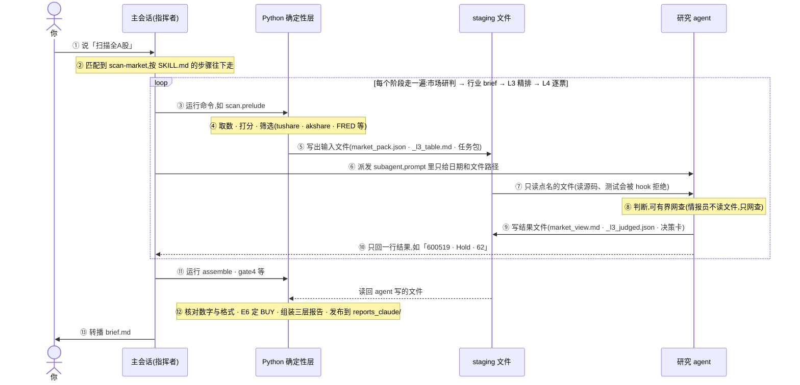
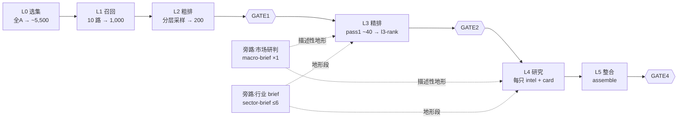
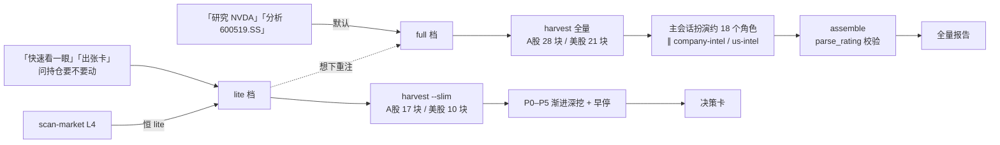

# TradingAgents 全流程手册

> **这份文档是什么**:研究 agent 的能力、scan-market 全链路、stock-research 全链路、编排方式与无人值守运维,合成一份。它合并并更新了三份 artifact:「研究 Agent 手册」(2026-09-27)、「scan-market 全链路」与「stock-research 全链路」(2026-09-13 快照;本文已按当前源码更正,改动清单见文末附录 A)。
>
> **快照**:main@4f20cc1(2026-09-27)。**契约唯一真身**:agent 契约在 `.claude/agents/*.md`,流程在 `.claude/skills/*/SKILL.md` 与 `STAGES.md`,参数在 `.claude/skills/scan-market/scan_config.jsonc`。本文与它们或源码冲突时,以它们为准。
>
> **路径约定**:`$CTX` = `context_claude/`(工作区),`$RPT` = `reports_claude/`(发布),`$SD` = `$CTX/scan_runs/<run_id>/staging/<date>/`(本次运行的 staging);数据湖 `lake/` 两引擎共享。所有命令在仓库根目录用 `uv run --no-sync python -m …` 运行。
>
> 研究结论均为 Claude 推理产出,仅供研究,非投资建议。

## 目录

1. 你说一句话之后,发生了什么
2. 名词解释
3. 四个研究入口
4. 编制表:10 个研究 agent
5. 能力卡
6. 所有研究 agent 共守的纪律
7. scan-market 全链路
8. stock-research 全链路
9. macro-research、sector-research、覆盖档案怎么跑
10. 编排方式:谁来指挥,三选一
11. 无人值守:launchd + headless
12. Codex 引擎
13. 状态一览与常用命令
- 附录 A:相对 09-13 链路图的更新
- 附录 B:依据

---

## 1. 你说一句话之后,发生了什么

以「扫描全A股」为例,按时间顺序:



1. **触发 skill(①②)**。你说「扫描全A股」,Claude Code 把这句话和项目里四个 skill 的描述比对,命中 scan-market。主会话(就是你正在对话的这个 Claude)读 `.claude/skills/scan-market/SKILL.md`,按里面写好的步骤往下走。说「研究 600519」会命中 stock-research,骨架相同,只是步骤和派的 agent 不同。
2. **Python 先干活(③④⑤)**。主会话不自己编数字。它先让 Python 确定性层(`autoresearch/` 包)跑命令:从 tushare、akshare、yfinance、FRED 取数,算因子、打分,把全 A 约 5,500 只筛到 200 只。结果全部写成文件,放进本次运行专属的 staging 目录 `$SD`,比如市场包 `market_pack.json`、L3 候选表 `_l3_table.md`、每只票的任务包 `_l4_prompt_<code>.md`。这一步零 LLM,同样的输入能重算出同样的结果。
3. **派研究 agent(⑥⑦⑧)**。需要判断时,主会话派出一个 subagent:一个独立的 Claude 实例,有自己的一份 context,看不到主会话的对话,也看不到别的 agent 的结论。派发 prompt 里只写日期和文件路径,agent 只读这些被点名的文件;想去翻源码、测试或 docs,会被项目的输入边界 hook 直接拒绝。情报员(l4-intel 等)更彻底:根本没有读文件的工具,只凭代码、名称、日期去网上查。
4. **agent 交回(⑨⑩)**。agent 把完整结论写成文件:市场研判 `market_view.md`、L3 精排 `_l3_judged.json`、每只票的决策卡 `details/<code>.md`。给主会话只回一行摘要,比如「600519 · Hold · 62」。这样十几个 agent 的长篇内容不会塞满主会话的 context。
5. **每个阶段走一遍(loop)**。scan-market 把 ③–⑩ 走四遍,每遍派的 agent 不同:市场研判派 1 个 macro-brief,和取数同时跑;行业 brief 派最多 6 个 sector-brief,彼此同时跑;L3 精排派 1 个 l3-rank;L4 给每只入选的票各派 1 个 l4-intel 和 1 个 l4-card,所有票同时派出(最近几场是 6–11 只),评级 ≥Overweight 的再加 2 张复核卡。
6. **收尾(⑪⑫⑬)**。主会话让 Python 读回所有 agent 写的文件:核对卡片里的数字和行情对不对得上、格式是否合规,用确定性规则 E6 决定最终 BUY,组装成 brief / summary / appendix 三层报告,发布到 `$RPT/scan/<目录>/`,同时封存本场的法证现场(capsule)。GATE4 检查报告有没有「说假话」,不过就不发布。最后主会话把 `brief.md` 原文转播给你。

**「谁来指挥」有三种实现,一场只用一种。** 图里「主会话」那一列是指挥者:决定下一步做什么、交给谁。这个角色在代码里有三种实现,叫**编排方式**:

- **legacy Workflow(现行默认)**:主会话启动一个 Workflow 脚本,由脚本按顺序跑命令、派 agent;主会话负责开场、派 L4 和收尾。
- **session_v1(PILOT)**:Python 冻结一张任务图,主会话按它的指示逐个领任务、交结果。
- **headless(未安装)**:launchd 在交易日 21:20 启动 Python,Python 为每个判断步骤单独起一个 `claude -p` 进程,全程没有交互会话。

三种方式用的是同一批 agent 定义和同一套 Python 命令,对比见第 10 节。

**三条贯穿全局的规则**

- **数字只出自确定性产物**(slim / pack / context)。agent 不编数、不凭记忆补;卡片里的行情数字会被 Python 拿数据湖逐条核对。
- **agent 只做判断**:正文写进文件,只回传一行紧凑结果;不读源码,不替解析器「预演」能否过机检。
- **零付费 API**:推理发生在 Claude Code 订阅会话里;headless 子进程还会剥掉 API key 类环境变量,只留订阅登录。

**判断层之外**:L0/L1/L2/L5 与全部度量是纯 pandas;所有门的判据都写在确定性 CLI 里,编排层只原样带回结果、不判断。BUY 不由卡片评级直接给出,而由确定性的 E6 相对层(`scan/relative_buy.py`)决定。每场运行有一份法证 capsule,完好性、完整性、可重放性三个结论分开给,互不替代。

---

## 2. 名词解释

| 名词 | 含义 |
|---|---|
| skill | 项目自带的操作手册(`.claude/skills/*/SKILL.md`)。请求匹配到哪个 skill,主会话就按它写好的步骤做。本项目有 4 个:scan-market、stock-research、macro-research、sector-research。 |
| 主会话 | 你正在对话的 Claude Code 会话。负责指挥:跑命令、派 agent、转播结果。在 scan 里它自己不写任何个股判断。 |
| 研究 agent / subagent | 主会话派出去的独立 Claude 实例,有自己的一份 context,只看被点名的文件,做完写文件、回一行。定义在 `.claude/agents/*.md`,那份文件就是它的全部契约。 |
| 确定性层 | `autoresearch/` 下的 Python 代码,零 LLM。取数、打分、筛选、检查、组装报告都在这里,同样输入得到同样输出。 |
| staging | 本次运行专属的工作目录 `$SD`。Python 和 agent 只通过这里的文件交换信息。 |
| slim / slim_deep | 单只票的精简数据包(`harvest --slim` 生成)。slim 是表面数据:行情、技术指标、资金流、估值、新闻、日历;slim_deep 是深核数据:利润表、盈利质量、偿付(现金流、质押、商誉)。决策卡到 P4 才读 deep。 |
| 任务包 | `_l4_prompt_<code>.md`,决策卡 agent 的全部输入说明:市场地形、漏斗简报(L1 画像、L2 分数、L3 论点)、昨天那张卡的摘要、档案摘要、数据文件路径、卡片落点。 |
| finalist / bench | L3 选中、要进 L4 出决策卡的票叫 finalist;判断过但没入选的叫 bench(候补),守卫剔掉 finalist 时从 bench 回填。 |
| 📌 持仓票(pinned) | `pinned.jsonc` 里手工指定的票(现在是 688981、300750,10-15 到期)。不管漏斗选不选都强制出满卡,并多写一节「持仓管理」:明天尾盘加减仓的否决条件、后天开盘怎么卖。上限 5 只,默认 10 个交易日过期。 |
| GATE(硬门) | 确定性检查点,不过就停。GATE1:L2 结果合法,并判定运行模式;GATE2:finalists 合法且不超卡数上限;GATE4:报告没有「说假话」。GATE3 只在回滚路径里存在。 |
| 运行模式 / 哨兵档 | GATE1 判定的四态。全市场「健康上涨」票占比 <3% 时判为哨兵档(材料枯竭):没有持仓就跳过 L3/L4 直接出报告(SENTINEL_EMPTY),有持仓只给持仓出卡(SENTINEL_PINNED);人工传 `force_full` 可强制全扫(FORCED_FULL);其余日子是 FULL。 |
| 早停 | 决策卡看完表面数据就判定不是买点,停在 Hold 或更低,不再读深核数据、不做三档情景。省 token 的主要手段,但只能往下停。 |
| OW 三门 | 主力真在、业绩真兑现、估值不透支。评级要到 Overweight 或 Buy,三门必须全过,任一不过就压到 Hold。 |
| 主尺 `gap_c1_o2` | 衡量对错的标准:T+1 收盘买、T+2 开盘卖的隔夜收益(`common.ruler.MAIN_RULER`)。决策卡的目标价、情景和催化都按这个窗口写(用户裁定持仓周期是超短 1–2 日)。10 日尺 `SWING_RULER` 目前只是影子。 |
| E6 · A 级 / R 级 | 决定最终 BUY 的确定性规则层(`scan/relative_buy.py`,e6.v4.1)。先剔除被卡片否掉的票,再按卡片「入场」行分级:写「允许」的是 A 级,写「条件」或没写的是 R 级;A 级为空才从 R 级选;两级都空就如实写 BLOCKED。 |
| run_id / capsule | 每场运行的唯一编号,以及这场的法证现场:执行过的命令、agent 事件的 hash 链、transcript、产物快照。事后可以分别核验完好性、完整性、可重放性。 |
| 编排方式 | 谁来指挥这些步骤的先后顺序:legacy Workflow、session_v1、headless 三种实现,一场只用一种。 |
| 命令壳 | legacy Workflow 里专门代跑一条 Python 命令的 general-purpose agent(Sonnet · low),只转述结果、不做判断。原因是 Workflow 脚本本身不能直接执行命令。 |

---

## 3. 四个研究入口

| skill | 怎么说 | 档位与产出 | 派哪些 agent |
|---|---|---|---|
| scan-market | 「扫描全A股」「全市场选股」「哪些板块值得买」 | 只有一档:每日全 A 扫描报告,唯一每天在跑的产品 | macro-brief ×1 · sector-brief ≤6 · l3-rank ×1(+修复 0–1)· 每只进 L4 的票各 1 个 l4-intel 和 l4-card;≥OW 或持仓 SELL 再加 2 张复核卡 |
| stock-research | full:「研究 NVDA」「分析 600519.SS」,可带同业 · lite:「快速看一眼」「出张卡」、问持仓要不要动 | full:全量报告,前半是决策主线(约 2 页,读了就能下单),后半是证据附录 · lite:一张五档决策卡 | full:company-intel(A 股)或 us-intel(美股)各 1 个,其余约 18 个撰写角色由主会话扮演 · lite:按 l4-card 契约出卡 |
| macro-research | full:「研究全球宏观」「现在该超配什么资产」 · lite:「今天大盘怎么看」 | full:regime 判断 + 跨资产配置表 + A 股行业配置表(都是 5 档) · lite:市场研判六小节 | full:global-intel 1 个,21 个分节由主会话写 · lite:macro-brief |
| sector-research | full:「研究半导体行业」「创新药板块怎么样」 · lite:由 scan 内部调用 | full:6 节行业深研 · lite:单段地形 brief | full:可选 sector-intel 1 个,6 节由主会话写 · lite:sector-brief |

**怎么选**

- 想从全市场找机会、看今天有没有值得买的 → **scan-market**。交易日收盘后、tushare 数据灌齐(约 21:10)再跑,一场约 50–75 分钟。
- 手里有一只具体的票:想深入研究 → **stock-research full**;只想快速判断要不要动 → **lite**。lite 卡按超短隔夜口径写,full 报告不受此限。
- 想看大方向,该超配什么资产、A 股哪些行业 → **macro-research full**;只想知道今天大盘处在什么状态 → **lite**。
- 想深挖一个行业的产业链、竞争格局和龙头 → **sector-research full**。

另有两个 Workflow:`l4-stock` 是单只票的 L4 全链(情报 → 决策卡 → 复核),由 scan 内部调用;`dossier-init` 给长期覆盖的票建常备档案,盘后逐只跑。

---

## 4. 编制表:10 个研究 agent

| agent | 类别 | 模型 · effort | 在哪出场 | 一场里同时跑几个 | 写什么 |
|---|---|---|---|---|---|
| macro-brief | Opus 写作 | opus · high,scan 里跑 max | scan Stage 0;「今天大盘怎么看」 | 1 个,和取数并行 | `market_view.md` |
| sector-brief | Opus 写作 | opus · high,scan 里跑 xhigh | scan 行业 brief | 最多 6 个,彼此并行 | `sector_briefs/<行业>.md` |
| l3-rank | Opus 判断 | opus · max(修复轮 medium) | scan L3 | 1 个;数字机检不过再派 1 次修复 | `_l3_judged.json` |
| l4-intel | Sonnet 情报 | sonnet · max | scan L4 | 每只票 1 个,全部同时派出(近几场 6–11 个) | `_l4_intel_<code>.md` |
| l4-card | Opus 判断 | opus · xhigh,scan 里跑 max | scan L4;单票 lite | 每只票 1 个,全部同时派出;≥OW 再加 2 个复核,先后跑 | `details/<code>.md` |
| dossier-init | Opus 写作 | opus · max | 盘后建档 | 逐只,每晚最多 3 只 | `knowledge/dossiers/<code>.md` |
| company-intel | Sonnet 情报 | sonnet · max | stock full · A 股 | 1 个,和主会话写报告并行 | `_company_intel.md` |
| us-intel | Sonnet 情报 | sonnet · max | stock full · 美股 | 1 个,同上 | `_us_intel.md` |
| sector-intel | Sonnet 情报 | sonnet · max | sector full(可选) | 1 个 | `_sector_intel_<行业>.md` |
| global-intel | Sonnet 情报 | sonnet · max | macro full | 1 个,和取数并行 | `_global_intel.md` |

**「5 种情报员」不是 5 个并发。** 情报员有 5 种,分别服务不同入口,从不一起出场:scan-market 只用 l4-intel;stock-research full 按市场二选一派 company-intel 或 us-intel;sector-research full 可选派 sector-intel;macro-research full 派 global-intel。真正大量并发的是 scan 的 L4:每只进 L4 的票同时派出自己的 l4-intel(之后是 l4-card),最近几场是 6–11 只。卡数上限由 `l4.max_cards` 控制(非持仓票最多 13 张,含 3 个证据席),📌 持仓另算。

**effort 怎么生效。** Workflow 派发时按 `scan_config.jsonc` 的 `agents.*.tier` 覆盖定义文件:critical = max · analytical = xhigh · repair = medium · relay = sonnet / low,表里「scan 里跑」即此。10 个角色的档位:strategist(macro-brief)、l3_rank、l4_intel、l4_card、ens_review(复核卡)、dossier_init 为 critical;sector_brief 为 analytical;l3_repair 为 repair;gp_shell、gp_shell_json(命令壳)为 relay。session_v1 的 host 模式里 Agent 工具传不了 effort,生效的是定义文件的值;headless 用 `--effort` 能传过去。模型(opus / sonnet)始终由定义文件决定。

---

## 5. 能力卡

### 5.1 macro-brief · 首席策略师(= macro-research lite)

**干什么**:每场扫描开头,先写一份「今天市场长什么样」的简报。后面的 L3 精排和每张决策卡都会读它的前 3 节来校准判断,L5 报告把它放在最前面。

- **谁派**:scan Stage 0,和 prelude(L0–L2 漏斗)同时跑,每场 1 个。单独问「今天大盘怎么看」时也是它写。
- **输入**:`strategist_pack.json`,即确定性层从当日全市场数据算出的市场包(regime、上涨宽度、估值分散、主力资金、板块红黑榜、北向与两融、指数估值分位、情绪温度)的单向投影,外加有效期内的宏观状态 `macro_state`。行业 top3 排名、运行配置等方向性内容在投影时就被剔掉,agent 看不到。
- **输出**:`market_view.md`,固定六小节:

```text
# 市场研判 — <date>
1. **一句话定调**:<regime + 结构 + 情绪>
2. **市场结构**:<宽度 / 主力资金 / 估值分散;北向、两融、指数 PE 分位>
3. **板块红黑榜**:<强 top3 / 弱 bottom3,各一句原因>
4. **操作基调**:<整体仓位姿态,只给 L5 用>
5. **关注**:<催化日历:财报窗口 / 政策会议 / 解禁>
6. 仅供研究,非投资建议。
```

- **规矩**:① 第 1–3 节只准描述,不准对个股给方向;第 4–5 节的建议只进 L5。② 数字全部出自 pack,缺了写「—」。③ 最多 2 条网查补最新头条,须标「实时网查」和日期。④ 不读昨天的 market_view。
- **为什么**:一段「避险别追」的定调如果喂给 L3/L4,会把十几张本应独立判断的决策卡带成集体附和,所以地形和建议必须分开。

### 5.2 sector-brief · 行业地形(= sector-research lite)

**干什么**:给当天值得关注的几个行业各写一段「地形」事实描述。L3 表尾和 L4 任务包会引用它,让判断个股时知道所在行业的整体状态。

- **谁派**:L2 之后,和 L3 的证据取数同时进行。行业由确定性层挑:红榜 top3 ∪ L2 候选集中度 top3 ∪ 观察单行业,最多 6 个,每个行业一个 agent,彼此同时跑。5 天内 regime 相同、行业中位 60 日涨幅变化 ≤3pp 的直接复用旧稿(♻️),不再派。
- **输入**:该行业的确定性 pack `$CTX/sector/<date>/<行业>.json`:成分数、中位 60 日涨幅、中位净利增速与 ROE、健康上涨家数、PE 的 P25 / 中位 / P75、PB、主力净流入为正占比与合计、中位获利盘、龙头座次、事件日历。
- **输出**:`sector_briefs/<行业>.md`,只有一段:

```text
# 行业 brief — <行业> @ <date>
## 地形段(喂 L3/L4 · 描述性)
- **链定位一句**:<需求驱动 / 产业链位置>
- **景气读数**:成分 N 只 · 中位60日 x% · 中位np_yoy y% · 中位roe z · 健康上涨 k 只
- **估值地形**:中位PE … (P25 … / P75 …) · 中位PB …
- **资金地形**:主力净流入为正占比 … · 合计 … 亿 · 中位获利盘 …
- **龙头座次**:名称(市值亿 / PE / 60日%) ×3–5
- **事件日历**:<近两周行业级事件>
```

- **规矩**:① 标题 `## 地形段` 是下游按字面匹配的接口(`sector/brief.py` 的 `TERRAIN_HDR`),改一个字,L3 表和 L4 简报会静默丢掉整段。② 禁止「超配 / 看多 / 回避」等方向词。③ 最多 2 条网查,须标「实时网查」和日期。
- **为什么**:行业方向由确定性的「看多行业 top3」负责;2026-08-19 用户裁定砍掉了原来的「研判段」,brief 只留地形,避免行业观点锚定个股评级。

### 5.3 l3-rank · L3 精排(投资总监)

**干什么**:整条漏斗里唯一一次「横向比较」。确定性层把全 A 约 5,500 只筛到 200 只、再分诊到约 40 只,l3-rank 通读这 40 只的紧凑表,像投资总监一样比较着挑出最值得深挖的 7–10 只 finalist,其余写成 bench。L3 负责比较研究优先级,L4 独立核验;旧选择/拒绝统计不能证明当前隔夜策略已有收益优势。[证据:overnight_l4_rejection_unproven](research/2026-09-30-agent-skills-evidence-register.md#overnight_l4_rejection_unproven)

- **谁派**:scan L3,每场 1 个。thesis 里的数字机检不过时,再以「L3 repair」身份派 1 次(effort medium),只读修复包、只改失败的那几行。
- **输入**:`_l3_table.md`:每只一行,含画像短语(如「高位·今日大涨·主力+·PE低」)、60 日与当日涨幅、距 60 日高点、ROE、净利增速、主力净占比、cmf、obv、RSI、获利盘、PE / PB、催化、龙虎榜,以及资金失真、监管、误读三类旗,按画像(lane)分块排列。另读 `market_view.md` 第 1–3 节和各行业地形段。个股数字只能引用表内值,一个字不能改。
- **6 维判断**:
  - **① 多路共振**:被几路召回同时选中。只在同画像内作次级 tiebreak,因为多路共振在数学上约等于「已经涨起来了」,不是独立确认。
  - **② 资金**:主力净占比、cmf_20、obv_mom_20 三者同向为正,才算真主力进场。
  - **③ 基本面**:净利增速、ROE、PE 的干净度;高 PE 要有成长兑现。
  - **④ 催化**:龙虎榜、业绩预告、催化列是主信号,新闻情感分只作辅证;有减持或监管旗的票,论点必须正面回应。
  - **⑤ 脆弱**:获利盘 >90%、RSI 或量比过高、抛物线顶,回避。
  - **⑥ T+2 兑现机制**:必须回答「明天、后天谁来买」,写不出就不选。
- **硬约束 A–I(违反即失败)**:
  - **A** 健康上涨是画像之一,不设比例,不为凑数塞票。
  - **B** 不选下跌趋势票(死叉、价在所有均线下、主力流出),即使高股息、低 PE 也不选;低位转强旗亮的例外。
  - **C** 超卖反转成簇时,可保留 1–2 只龙头,仍须满足 B。
  - **D** 趋势画像 conviction ≥70 的,要先自证不会被 L4 翻案(历史翻案率 33%)。
  - **E** 误读旗(低基数、资金背离、套牢)亮的,要一句话自证不是陷阱。
  - **F** 资金口径失真的票,主力资金不得作入选或看多论点。
  - **G** 低位转强席位 1–2 席,够格才给。
  - **H** 当日涨幅 ≥9.5% 一律不选。
  - **I** 同一行业最多 3 席。
- **输出**:`_l3_judged.json`,约 20–28 只,按 conviction 从高到低。每只字段:code、name、sector、lenses、conviction(0–100)、fragility、thesis、mechanism(两日内兑现机制 + 明天的买家)、risk、catalyst、triage_lean(OW / Hold / UW)、lane、pct_60d、sentiment、finalist(true / false)。conviction ≥70 的含义是「能说出明天谁来买、愿意明天开盘真金买入」,每天最多约 5 只;≥75 必须入选,<55 不许入选;够格的不足 7 只就少出,禁止凑数。
- **之后**:确定性守卫 ①–⑩ 按序再过一遍(明细见 7.6),最后注入 📌 持仓 → `finalists.csv` → GATE2。
- **回传**:入选数与画像分布、triage 分布、top5(名称 + 画像 + conviction + 一句)、主动放弃的 2–3 只「诱人但违反硬约束」的票及原因。

### 5.4 l4-intel · 单票活体情报员

**干什么**:决策卡开工前,先把这只票「今天收盘后到现在」发生了什么查清楚,做成每行带链接的事实表,供决策卡 P3(催化)和 P4(陷阱)读。它只攒料不判断:不给评级、不说多空、不写操作建议。

- **谁派**:scan L4,每只票 1 个,和该票的 slim 取数同时进行;所有票一次性派出,所以一场里会有 6–11 个 l4-intel 同时在跑。总开关 `l4_intel.enabled`(现为开)。
- **为什么盲搜**:如果它知道 L3 看好这只票,就会不自觉地去搜利好。所以派发 prompt 只给代码、名称、行业、日期;有常备档案的票再附一段「已知底」,只用来去重。它也没有读文件的工具,读不到任何仓库内容。
- **六面必查**(每面至少 1 条定向查询,查不到就写「无」,不许跳过):

| 面 | 查什么 |
|---|---|
| 公告正文 | 近 5 个交易日的新公告:重组、中标、合同(带金额量级)、回购增减持、业绩修正、停复牌、问询回复。先查当日盘后,要正文级含义,标题不够 |
| 突发新闻 | 点名本票或主业产业链的价格异动:涨价、断供、扩产 |
| 题材梯队 | 被归入什么概念、是不是当前主线、在梯队里是龙头还是跟风、同题材今日涨停家数 |
| 卖方与机构 | 近 1 月研报家数与方向、目标价区间变化、机构调研动向 |
| 互动易 | 近 1 周公司在投资者互动平台对热点问题的官方回复 |
| 负面增量 | 立案、警示函、媒体质疑、大股东风险 |

- **时效窗**(至少 60% 的查询额度花在 T0 和 24h;主尺是隔夜,一周前的旧闻不会在明天产生新的买盘):

| 窗 | 定义 | 净分系数 |
|---|---|---|
| T0 | 分析日 15:00 收盘 → 开工此刻。必查,查不到写「盘后无增量」 | ×1 |
| 24h | 近 24 小时,查询额度的大头 | ×1 |
| 背景 | 2–5 日前,只用来解释现在的价位 | ×0.5 |
| 超过一周 | 默认市场已经消化 | ×0 |
| 催化挂 | 指向还没发生的将来事件,如「8/25 披露中报」 | 不衰减 |

- **铁律**:① 每行「源」列必须是可点击的 http(s) 链接,只写站点名不算;拿不到链接的写成「未核实」,不计分。② 信息日期 ≤ 分析日,晚于分析日的一律丢弃。③ 本票的涨跌幅、涨停、成交额一律不写,这些由 slim 提供,写了只会和行情对不上。④ 点名他票涨停或连板必须带原文链接,否则被机检标「未核」,不能当题材强度证据(情报编造已发生过 3 次)。⑤ 查不到就写「无」,不编。
- **输出**:`_l4_intel_<code>.md`:

```text
# 活体情报 — <代码> <名称> @ <分析日>
〔intel v1·盲搜·as-of ≤ 分析日〕
## 事件段(≤10 行;按 T0 → 24h → 催化挂 → 背景 排序)
| 日期 | 时效窗 | 事件(一行,含量级) | 源(含 http(s) 链接) | 净分 |
## 题材段      归属 ｜ 主线? ｜ 梯队位置 ｜ 同题材今日强度
## 机构段      研报 ｜ 目标价区间 ｜ 调研
## 互动段 / ## 负面增量段 / ## 档案缺口(仅有已知底时)
## 声明行
网查 N 条 ｜ T0面=<有增量|盘后无增量> ｜ 六面覆盖:… ｜ as-of ≤ <分析日> ｜ 本文仅事实采集,无判断
```

- **额度与失败**:查询软顶 20 条(config),硬顶 30 条(代码);超软顶由 `intel_guard` 按时效裁剪,超硬顶整稿拒收。声明行里的条数会和当天冻结的 config 对账。限流、连接、超时这类瞬时错误最多重试 3 次;仍失败时,决策卡改为自己做 ≤3 条有界网查,不挡出卡。
- **影子中的死票门**:`l4_intel.skip_when_dead`(L1 因子三线同负 + 无催化 + 非持仓 / 证据席 → 免派情报)现为关闭,且派发端尚未接线,不影响任何一次真实派发。

### 5.5 l4-card · 单票决策卡(= stock-research lite)

**干什么**:对一只票做一次完整的渐进式尽调,输出五档评级和一份可执行的隔夜交易计划。scan L4 每只票一张;你说「688981 快速看一眼」时,单票 lite 也按同一份契约出卡。

- **为什么渐进**:大多数候选看完表面数据就能判定不是买点,没必要再读深核数据、做三档情景。早停是省 token 的主要手段,但只能往下停:想给 Overweight 以上,必须把陷阱核做完。实测早停几乎全停在 P3,停因是实质判断,不是取数失败。
- **谁派**:scan L4 每只票 1 个,所有票同时派出。评级 ≥Overweight 的,再派 2 个独立复核;📌 持仓出 SELL 的,也双复核。以下两种票禁止早停,必须写满卡:📌 持仓票;conviction ≥70 且(被 ≥4 路召回同时选中,或被 L2 配额救回)的强先验票。
- **输入**:任务包 `_l4_prompt_<code>.md`(市场地形、漏斗简报、昨卡回声、档案摘要、各文件路径)· slim · slim_deep · 情报稿 `_l4_intel_<code>.md`。
- **口径**:超短隔夜窗:T+1 收盘买入 → T+2 开盘卖出(主尺 `gap_c1_o2`)。目标带、三档情景、催化都按这个窗口写,时间框架恒为「隔夜」。
- **流程**:

| 阶段 | 读什么 | 回答什么 | 填哪一维 |
|---|---|---|---|
| P0 定向 | 漏斗简报 | L3 为什么选它、要证伪哪一条 | 只建假设,不判 |
| P1 现状 | 快照、主力净流、cmf、obv、量价形态、获利盘、龙虎榜席位 | 资金和技术前提真的在吗?是吸筹还是派发。先写 3 行「独立初判」,再看 L3 论点 | 技术 · 资金 |
| P2 价值 | 净利 / 营收增速、ROE、PE / PB、前瞻 PE、财报趋势 | 真便宜、真成长,还是只是 TTM 便宜 | 基本面 + 估值 |
| P3 催化 | 近 14 天新闻、预告快报、日历、卖方目标、情报稿(先看 T0 / 24h) | 有没有 T+2 开盘前能发酵的、带日期的催化 | 催化 |
| ② 主早停 | — | 表面 4 维撑不起买点 → 出早停卡,跳过 P4 / P5,不读 deep | — |
| P4 陷阱核 | slim_deep:现金流 / 净利、净债、质押、商誉、整张利润表、周期位置 | 是不是雷 | 盈利质量 + 偿付 |
| ③ 击杀 | — | 陷阱命中 → 降级或否决 | — |
| P5 终判 | 已读的全部 + 补查催化日期 | 三档情景 EV、R:R、预期差、多空对撞 | 终评级 |

  另有 ① P1 后的「极端狗票」早停点,默认关闭。进 P4 前要先写一行「进入P4倾向」。

- **评级**:6 维(基本面 · 估值 · 技术资金 · 催化 · 盈利质量 · 偿付)各打强 / 中 / 弱,记 +1 / 0 / −1,净分映射五档:

| 净分 | ≥ +4 | +2 ~ +3 | −1 ~ +1 | −2 ~ −3 | ≤ −4 |
|---|---|---|---|---|---|
| 评级 | Buy | Overweight | Hold | Underweight | Sell |

  OW 三门(主力真在 · 业绩真兑现 · 估值不透支)任一不过,≥OW 一律压到 Hold。卡上的 Rating 必须等于评分卡给出的建议,不一致要写一行 ≤20 字的偏离理由。L3 给了 conviction ≥80 却要停在 Hold 以下,要写明为什么推翻 L3。

- **入场行**:`**入场**: 允许 | 禁止 | 条件(一句前置条件)`,和评级分开:评级回答「值不值得持有」,入场回答「T+1 尾盘能不能按执行线开新仓」。
  - 满卡 ≥OW 写「允许」。
  - Hold 只有在 EV 中枢 ≥ +0.3%、R:R ≥ 1.0、三门至少过两门、情报 T0/24h 无负面时才写「允许」;否则能指出一条近端前置条件就写「条件(…)」,指不出就写「禁止」。
  - UW / Sell 写「禁止」;早停卡只能写「禁止」或「条件」;指数调样生效前夜一律「禁止」。
  - E6 据此把票分成 A 级和 R 级。
- **执行线**:每张卡都照抄这两行,不许改阈值。它和直觉相反:「T+1 尾盘收得强」的票隔夜反而更差,四年全市场数据逐年同号,所以强势收高是放弃理由。

```text
- [执行线] pct_chg <= 3.0 → 当日涨超 3% 放弃本次尾盘入场
- [执行线] pos_in_range < 0.7 → 收盘在当日区间上 30% 放弃入场
```

- **盯梢线**:📌 持仓必写,其他票可选。把退出条件写成机器可以每天检查的格式,prelude 每天对数据湖复核,命中就在汇总屏亮 ⚡:

```text
- [价格线] close < 303.28 → 隔日清仓
- [日期线] 2026-08-25 中报披露 → 兑现验证日
- [事件旗] 减持|质押|问询|立案 → 触发即重研
```

- **两种卡**:
  - **早停卡**(约 2K,正文 ≤44 行):决策仪表盘、独立初判、一段话研判、L3 论点裁决表、微研报(有档案的票)、评分卡(陷阱两维标「未核」)、已核数字摘录、早停行(停在哪一步;停因七选一:数据不足 / 涨停追高 / 题材透支 / 资金流出 / 估值透支 / 基本面恶化 / 其他)、入场行、执行线、`FINAL TRANSACTION PROPOSAL: **HOLD|SELL**`。
  - **满卡**(约 4.5K):再加「进入P4倾向」、6 维齐全的评分卡、研报体(对照常备档案:业务 / 驱动三情景 / 带位 / 风险矩阵)、三档情景与 EV、R:R、预期差、多空对撞(先写最强空头与认错位)、催化与认错位(带日期引用 ≥6 行)、T+2 开盘三分支预案(低开必须先写,跌停开盘是卖不出的)。
- **网查**:情报稿在场时,P3 只发 ≤1 条验证;缺情报时,催化 ≤3 条 + 机构面 ≤2 条。全卡硬上界 5 条。
- **复核**:≥OW 的卡再派 2 次独立的 l4-card:同一份任务包,互不知道对方结论。第 2 次和原卡同档,就不再跑第 3 次;三票取中位数,**只向下折回**,防止追高误买。📌 持仓出 SELL 同样复核,但**只向温和方向折回**,防止误卖。复核本身失败、票数凑不齐时不折回,报告里标出来留给人裁。
- **回传**:`{code, rating, conviction, proposal}`,卡片正文写文件、不贴回。

### 5.6 dossier-init · 档案首覆(券商 initiation 单人版)

**干什么**:给长期覆盖的票建一份「常备档案」,类似券商的首次覆盖报告。以后这只票每次进 L4,档案摘要都会注入任务包,决策卡只需研究「今天变了什么」。

- **谁派**:盘后跑 `dossier-init` Workflow,从覆盖池的待建队列逐只拉起,每晚最多 3 只。
- **流程**:① 确定性 prefetch(主营构成、一致预期 EPS、估值带)+ builder 生成八节骨架 → ② 本 agent 填四处 LLM 节 → ③ lint 校验格式(不过只记问题,不打回)。
- **只填四处**:
  - **§1 业务模型**:逐业务写收入驱动公式(量 × 价 / 订单 / 产能)和产业链上下游映射。
  - **§2 盈利驱动**:3–5 个关键驱动变量及可观察信号;Bull / Base / Bear 三情景各写驱动假设、触发信号、可证伪观察点;禁止给 EPS 点估。
  - **§5 风险矩阵**:现金流 / 净利、监管与审计前科、商誉与质押、大股东行为,每条都要写证伪触发点。
  - **摘要**:业务、驱动、风险、催化四条叙事锚,各 ≤60 字。
- **规矩**:确定性节(§3/§4/§6/§7/§8)与所有已有数字一字不动;网查 ≤4 条,须带原文引句、来源、日期;不写 1–2 日操作(那是决策卡的事);摘要 ≤3000 token。

**档案在系统里怎么流转**:

1. **进池**:覆盖池 `coverage_pool.json` 每天由 prelude 检查。📌 持仓或 20 日内被真选中 ≥2 次的票进池;20 日没被选中的出池;上限 30 只,按最近使用淘汰。
2. **首覆**:新进池的票排进待建队列,dossier-init 逐只建档,产出 `$CTX/knowledge/dossiers/<code>.md`。
3. **注入**:该票下次进 L4,任务包带「📚 覆盖档案摘要」;l4-intel 拿到「已知底」,只查增量。
4. **对账**:决策卡写「档案对账」节:哪个驱动变量动了、哪条风险触发或解除。
5. **回写**:assemble 收尾时按终评级把增量写回档案,并刷新确定性节。
6. **季度对账**:中报 / 年报披露后跑 `dossier.reconcile <period>`;prelude 用 📐 提醒还没对账的期,🕰️ 提醒超过 90 天没刷新的档案。

这和 `scan/dossier.py` 的「前科卡」(跨日入围史,强制卡内写「变化项」节)是两件事,并存不互替。

### 5.7 full 深研的四个情报员

这四个情报员只在用户单独触发的 full 深研里出场,每次派 1 个,和主会话写报告同时进行。它们都是 Sonnet · max,只有 Write / WebSearch / WebFetch 三个工具,拿不到报告的论点(盲搜),只采集事实、不给判断;产物只进 full 报告,不进决策卡、L3/L4 或任何账本。

| agent | 服务 | 网查上限 | 查哪些面 | 落点 |
|---|---|---|---|---|
| company-intel | stock full · A 股 | 12 | ① 官方公告与互动口径 ② 产业价格 / 订单 / 排产(要数值、单位、环比)③ 政策与监管 ④ 机构观点与盈利预测变化(写理由和改动的变量)⑤ 负面、诉讼、事故 ⑥ 海外客户 / 供应商 / 同业的财报与指引 | `$CTX/analyze/<TICKER>_<日期>/_company_intel.md` |
| us-intel | stock full · 美股 | 12 | ① 财报电话会与指引原话 ② 分析师升降级背后的理由 ③ 监管、诉讼、政策(出口管制、反垄断等)④ 产品、供应链、大客户(要量级)⑤ 内部人与大股东的媒体级增量 ⑥ 负面:做空报告、召回、会计争议、关键人离职 | 同目录 `_us_intel.md` |
| sector-intel | sector full | 6 | ① 产业价格、排产、订单 ② 海外同业最新财报与指引 ③ 政策监管 ④ 龙头事件 | `$CTX/sector/<date>/_sector_intel_<行业>.md` |
| global-intel | macro full | 派发注入,默认 8 | ① 央行(Fed / PBoC / ECB / BOJ)② 数据发布(实际 vs 预期)③ 地缘、关税、制裁 ④ 美股龙头财报与指引(标盘前 / 盘后)⑤ 中国政策 ⑥ 资金与仓位报道(二手转述,须标〔转引〕) | `$CTX/macro/<date>/_global_intel.md` |

**来源分四级**:

- **T1 官方 / 原始**:证监会、交易所、巨潮、互动易、部委、公司官网;美股为 SEC、交易所、公司 IR。
- **T2 高质量二手**:主流财经媒体、持牌数据商。
- **T3 发行人 / 行业二手**:供应商、协会、公司公众号、做空方报告。只能当「某方的说法」,不得冒充独立验证。
- **T4 聚合 / 发现**:搜索结果页、新闻 RSS、门户聚合。只能用来发现线索,必须追到原文、重新标级后才能入表;追不到的写进「未核实」,不计分。

**时效窗与衰减**:`intel_v2_full`(company / us / sector)为 24 小时 ×1、本周 ×1、本月 ×0.5、更早 ×0;`intel_v2_macro`(global)为 48 小时 ×1、本周 ×1、本月 ×0.5、更早 ×0。「催化挂」(指向还没发生的事件)一律不衰减。契约名要原样写进稿件头,下游按名取窗口审稿。

**海外那一面**(company-intel 第⑥面、sector-intel 第②面)只查 `readthrough_map.yaml` 里人工维护、在有效期内的映射名单;没有名单就写「不适用」,不耗额度。只许写海外公司说了什么,禁止写「海外涨了所以本票该涨」这类传导句。

### 5.8 由主会话扮演、不是独立 agent 的角色

三个 full 深研的正文不派 subagent,由主会话按 playbook 逐个扮演角色、逐节写成草稿文件,最后由 assemble 拼成报告。每节结尾都要写一行「置信度: 高/中/低 ｜ 最大不确定项: …」。

- **stock-research full**(`engine-playbook.md`):分析师 → Reality Check → 多空辩论 → 研究经理 → 风险辩论 → 预审红队 → PM。文件映射与 v4 报告骨架见 8.3。
- **macro-research full**(`macro-playbook.md`):21 个必需分节,顺序为区域(us · china · global)→ 跨资产(rates · fx · equities · commodities · crypto)→ 中美专题(divergence 货币分化 · desync 增长通胀错位 · geopolitics 贸易关税地缘 · relative 相对资产与资本流)→ 中观(sector_map · flows · sentiment · themes)→ 综合(variant · crossfire · calendar · premortem · decision)。可选 debate · credit · industry_cycle。两张 5 档表每行一条 `**Rating**`:跨资产(OVERALL 风险档、美债、美股、A 股·港股、USD、CNY、JPY、黄金、大宗、加密、信用)与申万一级行业。
- **sector-research full**(`sector-playbook.md`):§1 链结构(上下游、需求驱动、环节利润,产业证据要网查并标日期)· §2 景气位置 · §3 竞争格局 · §4 估值(行业内分布与自身历史)· §5 龙头映射(环节 × 代表公司事实表,不给个股评级)· §6 研判结论(情景与触发位,全文只有这一节允许写方向判断)。

### 5.9 命令壳:不是研究 agent

legacy Workflow 的 JS 脚本不能直接执行命令,所以每条 Python 命令都要包进一个 general-purpose agent 去跑。这个壳用 Sonnet · low,只原样执行命令、转述退出码或 JSON,不做任何判断;禁止后台化、禁止 kill、禁止改写命令(都有事故前科)。长命令改走 `autoresearch.trace.detach` 脱离壳的进程树,壳只做有界等待。09-17 那场实测约 141 个壳,占加权输入的 62%(约 $13.5),是 legacy 模式最大的额外开销。session_v1 与 headless 把这些改成 Python 进程内直跑;Codex 侧对应 `gp_shell` / `gp_shell_json`。

---

## 6. 所有研究 agent 共守的纪律

每条都有事故前科。

- **独立 context**:一只票或一个行业一个 agent,互相不知道对方结论,只回传一行。这样评级只来自这只票自己的数据,不会被「隔壁那只给了 Buy」带偏;主会话的 context 也不会被十几份长稿撑爆。
- **输入边界 hook**:研究 agent 只能读本引擎的 `context_*` / `reports_*`、`.claude/skills`、`.claude/agents` 和 CLAUDE.md / AGENTS.md;读源码、测试、workflow、docs、lake 会被 `scripts/hooks/agent_input_boundary.py` 直接拒绝(按放行名单判定,主会话和 general-purpose / Explore / Plan 不受管)。起因:09-15 夜里 agent 去翻解析器和 lint 规则「自证能过机检」,单卡轮次从 6–7 涨到 24,cache 读放大 5 倍。
- **数字 grounded**:只引用确定性产物。断言分三级:已核(出自数据)/ 网查(原文引句 + 来源 + 日期)/ 推断(明写「推断」)。信息日期一律 ≤ 分析日。卡片里的价格类断言会被 Python 拿数据湖逐条对账,对不上就在报告里标出来。
- **防锚定**:喂给 L3/L4 的只有描述性地形,不带方向。个股评级只由这只票自己的评分卡决定;L3 的论点在任务包里是「待证伪的前提清单」,决策卡先读数据、写下独立初判,再看论点。
- **声明行可机检**:情报稿写明网查了几条、T0 面有没有增量,这两项会和当天冻结的 config(`user_config_echo`)对账。2026-07-24 实测 11 份稿有 10 份超额却没人发现,之后加了这道探针。
- **主会话网查留痕**:主会话自己的 WebFetch / WebSearch 没有 subagent transcript,由 `scripts/hooks/webtrace_posttool.py` 记下工具、URL 或查询词、返回字数(不存正文),进 capsule。
- **诚实收尾**:所有报告末尾写明「Claude 推理产出,仅供研究,非投资建议」。

---

## 7. scan-market 全链路

### 7.1 漏斗全景与核心世界观

对全 A 约 5,500 只逐个跑深度报告不可行,所以用搜索 / 推荐系统式的六段漏斗:确定性层(零 token)收窄到 200 → Claude 比较着精排到 7–10 → 只对这几只跑决策卡 → 确定性整合。token 只跟最终深挖的几只成正比;省 token 靠早停,不靠降模型。只支持 A 股。



| 段 | 引擎 | 作用 | 进 → 出 |
|---|---|---|---|
| L0 选集 | 确定性 | 候选池 + 硬门(ST / 退市 / 停牌 / 次新 + 市值地板) | 全 A → ~5,500 |
| L1 召回 | 确定性 · 10 路 | 各路 top → 配额合并(floor 保底多样性) | → 1,000 |
| L2 粗排 | 确定性 · 分层采样 | 行业中性复合分 + 风格桶保底 + 落刀帽 + 行业席位;不预测 | → 200 |
| 旁路 市场研判 | macro-brief ×1 | 写 `market_view.md`,地形段喂 L3/L4 | 1 份 |
| 旁路 行业 brief | sector-brief ×K | 单段地形 brief 喂 L3/L4 | ≤6 份 |
| L3 精排 | l3-rank ×1 | pass1 分诊 ~40 → 比较着选 → finalist 7–10 + bench | → 7–10 |
| L4 研究 | 每只 l4-intel + l4-card | 决策卡(P0 → P3 早停② → P4 → P5;≥OW 双复核) | 约 6–15 张卡 |
| L5 整合 | 确定性 | brief + summary + appendix + 账本 | 1 份 |

**研究分工与证据边界**(当前主尺 `gap_c1_o2`):

- **L2 负责多样性采样**。原模型和旧持有尺的负结果解释历史退役选择,不证明所有确定性层都没有 alpha。[证据:historical_l2_model_value](research/2026-09-30-agent-skills-evidence-register.md#historical_l2_model_value)
- **拒绝效果须同尺核验**。历史旧尺 `fwd_2_oc` 的评级 rank-IC +0.55 缺完整窗口;门价值 +4.35pp 仅对应 2026-06-18→07-08 的旧 NAV,不能转成当前效果。[证据:historical_l4_rating_ic](research/2026-09-30-agent-skills-evidence-register.md#historical_l4_rating_ic) [证据:historical_l4_rejection_value](research/2026-09-30-agent-skills-evidence-register.md#historical_l4_rejection_value)
- **同尺拒绝优势尚未建立**。08-22 普查评级 IC +0.118(t=1.68),≥OW 只有 4 日;样本不足以确认当前拒绝收益。[证据:overnight_l4_rejection_unproven](research/2026-09-30-agent-skills-evidence-register.md#overnight_l4_rejection_unproven)
- **零买按当日链路归因**。历史 4.8% 过线率的赢家标签/分母待复核,不代表当前根因;旧零买日收益还存在分组身份疑点,单日市场上涨也不直接证明失明。[证据:historical_recall_capture](research/2026-09-30-agent-skills-evidence-register.md#historical_recall_capture) [证据:historical_zero_buy_market](research/2026-09-30-agent-skills-evidence-register.md#historical_zero_buy_market)

**两层角色分工**:确定性层(L0/L1/L2/L5 + 全部度量,纯 pandas,不编数、不预测;所有门的判据都在这一层的 CLI 里)/ AI 判断层(策略师、行业 brief、L3、L4,全是 subagent,独立 context,只回传紧凑结果)。原第三层「闭环学习」已于 2026-08-21 整体退役,L3/L4 prompt 不吃任何历史账本先验。

**编排真身(legacy 默认)**:① `.claude/workflows/scan-market.js` 跑 Prelude → L3 → L4-prep,到派发交接为止 → ② 主会话一次性派出 N 个 `.claude/workflows/l4-stock.js`(每票一个,真并行,单票失败只废单票)→ ③ 主会话收尾 L5。

### 7.2 agent 出场时序

| 阶段 | 确定性步骤 | 出场的 agent |
|---|---|---|
| 开场 · 前奏(L0–L2) | frame → prelude 12 步 → GATE1 | macro-brief ×1(max),与 prelude 并行 |
| 行业 brief ∥ L3 取证 | sector.reuse / sector.pack · L3 取证压表 | sector-brief ≤6(xhigh),彼此并发 |
| L3 精排 | 数字机检 · 守卫 ①–⑩ · GATE2 | l3-rank ×1(max);机检不过再派修复 ×1(medium) |
| L4 · 每只 finalist 并行 | 任务包 · 每只 slim · hash 校验 | 每只:l4-intel(与 slim 并行)→ l4-card →(≥OW 或持仓 SELL)复核 ×2 |
| L5 整合 | assemble 等 5 步 · GATE4 | 无,主会话直跑 |

legacy 下,前四个阶段里的每条确定性命令还要再包进一个命令壳 agent(Sonnet · low);09-17 那场约 141 个。

### 7.3 Stage 0:开场 · 前奏 · 研判

1. **先领 run_id,再取任何一个数**。`trace.capsule begin` 先落运行契约(RunContract)和代码 / 环境 / prompt 身份快照,再公布 run 目录;`RUN_ID` 随 `Workflow args.run_id` 传给 `scan-market.js`,再透传给每个 `l4-stock.js`;staging 从此按 run 分区,同日重跑不互相覆盖。上一次被打断的 run 由 prelude / prewarm 开头自动冻结,也可手动 `trace.capsule recover`。

   ```bash
   uv run --no-sync python -m autoresearch.scan.run_lock check || echo "无人值守场在跑,别开扫"
   DATE=$(uv run --no-sync python -m autoresearch.scan.trade_date)
   RUN_JSON=$(uv run --no-sync python -m autoresearch.trace.capsule begin scan-market "$DATE" \
     --engine claude --config-file .claude/skills/scan-market/scan_config.jsonc \
     --legacy-reason "session_v1 真实宿主验收 INCOMPLETE")
   export AUTORESEARCH_RUN_ID=$(printf '%s' "$RUN_JSON" | jq -r .run_id)
   ```

   数据日不手算:`scan.trade_date` 缺省取最近已结算交易日(19:15 前回退上一交易日)。交易日晚上等 tushare `stk_factor_pro` 灌齐(约 21:10,行数连续两次不变且 ≥5300)再开扫。扫描只在干净的新会话里开;run 失败要改代码时,先冻结 FAILED 并结束本会话,在另一个会话里修。

2. **frame 先行**。`scan.frame <date> --json-out $SD/market_pack.json`:全市场取数入湖(后面的 prelude 命中湖、不重拉),写出 `market_pack.json`(regime、宽度、估值分散、资金、红黑榜)和它的单向投影 `strategist_pack.json`(白名单键;行业 top3、运行契约、用户配置进不来)。frame 回显的 `user_config`(经 `user_config.py` 白名单校验)必须随 `args.config` 传入 Workflow;传 `{}` 会直接报错(07-21 事故:空配置静默关掉情报并降低 effort)。pack 失败重试一次,仍失败记 B 级降级、不阻断。

3. **并行:prelude(确定性)∥ market_view(判断)**。`scan.prelude <date>` 按 `prelude.STEP_NAMES` 顺序跑 12 步:

   | 步 | 做什么 |
   |---|---|
   | consensus | 卖方一致预期前向积累(限频 1 次 / 小时) |
   | temperature | 情绪温度计:涨停 / 跌停家数、连板高度、晋级率、炸板率、昨涨停今溢价 → 0–100 分 + 五相位 |
   | universe | L0 选集 → L1 十路召回 → L2 分层采样到 200 只(见 7.4) |
   | calendar | 解禁、预约披露、指数调样日历 |
   | catalyst | 催化事件 |
   | menu | 菜单体检、哨兵建议、L4 预算 |
   | l4_rejection | 拒绝价值读数 |
   | outcome_fill | 结果账本回填(只记不学) |
   | ledger_views | 运行日历视图 |
   | dossier_pool | 覆盖池日检 |
   | news_catalog | 新闻目录 |
   | overseas | 隔夜窗海外事件 |

   末尾生成汇总屏 `_prelude_summary.md`(含 ⚡ 持仓盯梢行,只给人看)。同时 macro-brief 只读 `strategist_pack.json` 写 `market_view.md`。

4. **L2 探针 + GATE1**。`L2_gbdt_top200.csv` 缺失就重跑一次 prelude(`--skip consensus`)。`scan.gates gate1 <date> --decide-run-mode` 检查 L2 非空、代码 6 位,并返回三组量:
   - **哨兵建议**:全市场健康上涨占比 <3% 判哨兵;3–5% 仅提示;≥5% 全扫。
   - **L4 预算** `l4_budget`:基准 30;五面旗(落刀 >60% / 相对落刀 >40% 且 >2× 全市场 / 健康上涨 ≤2 / regime 为 risk_off / 0 买连败 ≥3,≥5 计双份)1 旗降到 3/4(22),≥2 旗降到 1/2(15),地板 12,只降不升。
   - **卡数**(唯一算法 `scan/l4/card_count.effective_caps`):`max_cards`(默认 13)→ 证据席 `seat_m = min(3, max_cards − 1)` → finalist 名额 `max_cards − seat_m`(默认 10)→ `l3cap = min(finalist 名额, l4_budget)`(`budget_flags` 开时)。`l3cap` 进 L3 的区间与 `--budget`,`max_cards` 作 GATE2 预算。

5. **运行模式四态**(写进 `run_mode.json`,下游只读它,不从产物空否反推):

   | 模式 | 什么时候 | 跑什么 |
   |---|---|---|
   | FULL | 健康上涨占比 ≥3% | 正常全扫:L3 + L4 + L5 |
   | SENTINEL_EMPTY | <3%(材料枯竭)且没有 📌 持仓 | 跳过 L3/L4,直接出报告 |
   | SENTINEL_PINNED | <3% 且有 📌 持仓 | 只给持仓票跑 L4 全链(同一条 l4-stock、同 rubric、同双复核),不出全市场选股结论 |
   | FORCED_FULL | <3% 但人工传了 `force_full` | 照常全扫,报告诚实标注「人工 override」 |

   GATE1 失败(L2 缺、空或代码非 6 位)整条流水线停。

### 7.4 L0–L2:选集 → 召回 → 粗排(全确定性,零 token)

入口 `autoresearch.scan.universe`,生产由 prelude 的 universe 步直调;旋钮全吃 `scan_config.jsonc`,CLI flag 只作单次覆盖。

**L0 选集(全 A → ~5,500)**。单一代码路径 `frame.build_market_frame`:剔 ST / 退市 / 停牌 / 次新,市值地板 `l0.cap_floor_yi`(亿),北交所默认纳入,数据源 tushare(东财 push2 被封)。哲学:只剔确定不可交易 / 不可研究的,每加一条硬门就是一块永久盲区(漏在 L0 的赢家约 9%,以小盘 / 次新 / 北交所为主)。

数据契约(`autoresearch/data/contracts.py`):**A 级**端点(daily / daily_basic / moneyflow / cyq_perf / stk_factor_pro / stock_basic / trade_cal)空、行数腰斩或缺列 → `DataContractError` 阻断整条流程且拒绝入湖,不许被任何 `except Exception` 吞掉;**B 级**(北向 / 两融 / 龙虎榜 / 公告 / 质押 / 新闻 / 宏观)缺失只降级,但必须记账(`degraded.json` → 报告一行)。入湖一律全字段(窄字段写入会把窄表钉成当日快照)。湖体检:`python -m autoresearch.data.contracts doctor [--purge]`。

**L1 召回(→ 1,000,`autoresearch/scan/recall`)**。每路「过门 → 按信号排序 → 截 top-quota」,`quota_union` 合并(各路 floor 保底多样性,带 provenance)。已注册 14 路,默认启用 10 路(`funnel.recall_channels`;删掉该键 = 全部 14 路上线,别删整行):

| 通道 | quota / floor | 信号 |
|---|---|---|
| composite | 400 / 100 | 复合分 |
| momentum | 188 / 50 | 趋势龙头 |
| reversal | 200 / 50 | 困境反转(旧路,与 reversal_confirm 并存) |
| reversal_confirm | 150 / 50 | 低位 + 企稳 + 放量起爆硬门(vol_ratio_20 ≥1.5 ∧ 站回 MA20 ∧ MA5>MA10)+ 可交易 |
| lowturn | 120 / 40 | 低位转强:门与 L3 旗同一谓词同一阈值(阈值住 `l3.lowturn`),排序用 reversal_confirm 分 |
| value | 312 / 50 | 行业内低估;旧优势摘要待复核,不作当前效果保证。[证据:historical_value_channel](research/2026-09-30-agent-skills-evidence-register.md#historical_value_channel) |
| main_fund | 150 / 50 | 主力净流入 |
| heat | 112 / 50 | 成交额量级(捞巨额龙头) |
| growth | 112 / 40 | 成长加速 |
| healthy | 112 / 40 | 质量上涨:0 < pct60 < 40 且主力净流入 >0 且 cmf >0 |

**召回权重档**(`funnel.weight_profile`,唯一入口 `common.scoring.resolve_weights`):生产现档是 **`"preference"`**,固定符号「上涨趋势 + 有支撑 + 主力真在 + 散户不拥挤」(momentum .20 · tech .15 · volprice .15 · fund_main .15 · chip .05 · north .05 · growth .05 · value .05 · fund_retail −.05 · rz 0),量级是产品裁定、不是拟合,也不自动重标定。此档下 `regime_aware` 无效(`regime_applied` 恒 null),`weights.json` 只供研究。回滚杆是改回 `"calibrated"`:读 `$CTX/factor_lab/weights.json` 的 IC 校准权重并按当日 regime 取块。改档的原因:校准档 range 块里 momentum / tech / volprice / fund_main 全负,composite 实际成了超卖分,落刀逐级叠加(L0 23% → L2 40%)。

**L2 粗排(→ 200,`recall/l2_stratify.select_l2`,不用模型)**:

1. 行业中性复合分排 merit(去均值在东财「所处行业」129 个细标签组内做,**不是申万一级**)。
2. 8 个风格桶固定保底名额,生产值 `l2.floors`:趋势 20 · 健康 25 · 反转 6 · 价值 12 · 成长 12 · 吸筹 12 · 主力 10 · 低位转强 6 · 事件 0。未启用通道的桶运行时归零(吸筹一路已退役,故生效合计 91,merit 名额 109);新通道的回滚杆只剩一根:从 `recall_channels` 摘掉它。
3. 任一 industry ≤20%(`l2.sector_cap`;细标签下几乎不触发,真正拦同板块扎堆的是 L3 守卫⑧的 3 席帽)。
4. **落刀帽**(`l2.knife_cap`,已开):merit 核 / 保底桶 / 回填三步各自的落刀份额 ≤ 当日 L0 全市场的落刀面;反转与低位转强两桶豁免;被帽跳过的行由下一个非落刀候选顶上,顶替行打布尔列 `knife_cap_swap`。
5. **行业席位**(`l2.sector_seats`,已开:每行业 2 只、最多 3 个行业):在健康上涨 top3 行业里取非落刀的健康上涨成员,按复合分各取 2 只(剔 📌 / ST / 当日涨 ≥9.5%),`selection_reason="sector_seat"` 全程直通,不占 L2 名额,不净增 L4 卡数。

产物 `L2_gbdt_top200.csv`(名字是历史别名,没有 GBDT):`l2_rank` 选择序、`gbdt_score` = composite、`l2_lane_reserved` = 被保底桶救回。随后 `scan/menu.py` 做菜单体检(行业集中度 / 落刀面 / 健康上涨 / 估值,自动嵌进 L5;健康上涨 = 0 打 ⚠️ 菜单病)、哨兵建议与 L4 预算。

**旁路 · 情绪温度计**:tushare `limit_list_d` 入湖,五序列 → 0–100 分 + 五相位(冰点 <20 / 修复 / 发酵 / 高潮 ≥65 / 退潮,±3 滞回),只作展示,不接菜单或预算。

### 7.5 旁路:行业 brief(sector-research lite)

L2 之后、与 L3 证据取数并发(Workflow 的 L3 阶段内并行):

1. `sector.reuse <date> --apply`:5 日内 regime 相同、行业中位 60 日动量位移 ≤3pp 的旧 brief ♻️ 复用,已复用行业不再派 agent。
2. `sector.pack <date>`:选行业 K ≤6 = 红榜 top3 ∪ L2 集中度 top3 ∪ 存量 `watchlist.csv` 行业,每行业一份确定性 pack。
3. 每行业一个 sector-brief(见 5.2),只写 `## 地形段`。行业方向叙事改走确定性 top3(`market.sector_healthy_top3`),在 L5 显示为「🎯 看多行业 top3」。
4. 消费全自动、presence-gated:L3 表尾只渲染 L2 top200 覆盖的行业的地形行;L4 简报注入该行业地形段;L5 不嵌任何行业研判,只把 `sector_briefs/` 整目录拷进报告;L5 的「🔗 同链对比」拿 finalists 现算,与 brief 无关。行业 brief 不解决 0 买,也不设门。

### 7.6 L3:pass1 确定性分诊 + 一个 Opus 的比较式精排

200 → ~40 → finalist 7–10(另加 📌 持仓与 3 个证据席)。📌 保送票也走 L3:pass1 全入 → l3-rank 照常独立判 → 守卫之后把这份判断整段带进 finalists。保送 ≠ 免判。

1. **证据取数**(`l3_select prepare`):龙虎榜 / 业绩预告 / 快报 + 公告情感(cninfo 兜底,标题关键词粗打分 −1~1)。
2. **pass1 分诊**(`l3/triage.triage_l2_for_l3`,零 LLM):📌 全入 + 复合分前 5 + 低位转强强留 ≤8 + 行业席位与证据席强留 + 各召回通道 top-K 轮询,约 200 行收到 `l3.pass1_target` 行;被切的落影子 `_l3_pass1_cut.csv`(不代表判死)。
3. **压紧凑表**(`l3/prompt.prepare_l3_table` → `_l3_table.md`):按 lane 分块;每行带画像短语 pf(如「今日大涨」≥9.5、「贴顶」)、当日涨幅、距 60 日高点;三面旗:主力失真 `dist_flag`(反号 / 微量)、监管 `reg_flag`(近 10 日立案 / 问询 / 处罚)、误读 `misread_flag`(低基:np_yoy >100 且 roe <8;背离:cmf / obv 正但主力净占比 <0;套牢:获利盘 <25 且非多头排列且 60 日涨幅 >0);🏭 行业席位列;表尾接行业地形段。
4. **l3-rank**(见 5.3)写 `_l3_judged.json`。
5. **thesis 数字机检 → 可选修复**:`l3_select lint`(个股指标只能引用表内值;地形数字须带「全市场 / 行业」等出处词)→ 不过就 `repair-pack` 只写失败行 → 以 L3 repair 身份派 l3-rank 写补丁 → `apply-repair` 用同一谓词复验后原子合并。修复失败就带原 judged 继续,不二次检查。
6. **确定性守卫 + GATE2**:`l3_select finalists --budget <l3cap>` → `merge_l3_finalists_v3`,按下表顺序执行;各守卫依赖的列缺失时整段不动作(parity)。

| 序 | 守卫 | 动作 |
|---|---|---|
| ① | ins75 | conviction ≥75 却没标 finalist 的,强制补入(误杀保险) |
| ② | lt55 | conviction <55 的剔除进 bench |
| ③ | cap | 按 GATE1 回显的 `l3cap` 截尾 |
| ⑦ | chase_1d | 当日涨幅 ≥9.5% 的剔除,从 bench 回填(≥55 才够格) |
| ④ | healthy_quota | 现 `HEALTHY_QUOTA_FRAC = 0`,不动作 |
| ⑤ | trend_quota | 趋势画像软配额 2 席 |
| ⑥ | lowturn_quota | 低位转强软配额 1 席(够格线 55) |
| ⑧ | sector_cap | 同行业 >3 席剔最弱,回填异行业 |
| ⑨ | composite_seat | 当日 L2 菜单复合分最高的 3 只强制进 finalists(与 📌 同级,不占 finalist 名额但计入 `l4.max_cards`,不受 ②③ 约束;剔 📌 / ST / 当日涨 ≥9.5%) |
| ⑩ | max_cards | 非 📌 行(含证据席)总数 ≤ `l4.max_cards`;超出按「席位优先、conviction 从高到低」截尾进 bench |
| 末 | 📌 注入 | `_inject_pinned_finalists` 在全部守卫之后注入持仓,不受 ⑦⑧ 影响 |

   产物:`finalists.csv` + `_l3_bench.csv` + `L3_judged_full.csv`。**GATE2**(`scan.gates gate2`):`finalists.csv` 存在、非空、代码 6 位;非豁免 lane 的全部行(证据席也算)≤ `max_cards`;豁免 lane 为 pinned 与 watchlist_trigger。哨兵仅持仓档记为「不适用」,不是「通过」。失败则整条流水线停。

### 7.7 L4:一只票 = 一个 l4-stock Workflow

**派发前(L4-prep,确定性,生产者都跑在任务包之前)**:

1. `l4_card shared` → `_l4_shared_instructions.md`(全卡一致的共享块,现为只有标头的稳定骨架)。
2. 四个生产者并行:`l4_card pledge` → `pledge.csv`(质押 >40% 爆雷、>20% 偏高,只作提示)· `l4_card seats` → `seats.csv`(龙虎榜席位,机构 / 游资净买)· `scan.calendar`(解禁 / 披露 / 调样)· `l4_card consensus` → `consensus.csv`(卖方修正)。没有任何复用层(TTL 复用与菜单滞回均已退役)。
3. `l4_card dispatch-plan` → 派发名单与 meta(名称 / 行业 / pinned / 档案摘要)。
4. `l4_card prompts` → 每票 `_l4_prompt_<code>.md` + `_harvest_list.txt`;`l4_tasks init` → 任务簿 `_l4_tasks.json`,逐票记录状态(PENDING / RUNNING / SUCCEEDED / FAILED / BLOCKED)、prompt / slim / card 三件产物的 hash、第几次尝试、错误类别、pinned、时间戳。任何一只票缺任务包,整体拒绝初始化,整条线停在派发前。派发帽 `budgets.concurrency.l4_stock = 64`(实际一次全派);发生限流后下一批降宽一档。
5. `scan-market.js` 到此返回派发清单;主会话在**一条消息里**派出 N 个 `Workflow({scriptPath: '.claude/workflows/l4-stock.js', args: {date, run_id, code, attempt: 1, name, sector, cfg, pinned, dossierSummary}})`。派发前逐一核对 📌 票都带 `pinned: true`(漏传会让持仓 SELL 双复核整段不跑);`cfg` 必须是 frame 回显的配置原样,不能传 `{}`。同时挂 Monitor 跑 `scan.l4_watch <date> --watch`(= CP5)。

**任务包 `_l4_prompt_<code>.md` 的构成**(`scan/l4/prompts.py`):

- 固定标头 → 共享块 → 逐卡块。
- 逐卡块依次是:📌 保送标记与持仓管理要求(仅持仓票)→ ⛔ 强制满卡(📌 恒强制;或 conviction ≥70 ∧(被 ≥4 路召回同时选中 ∨ 被 L2 配额救回))→ 漏斗简报(`compose_funnel_brief`:L1 画像与子分、L2 分与 lane、L3 的 thesis / mechanism / risk / catalyst / conviction 作为中性前提清单、市场地形块、主力失真旗、质押旗、龙虎榜席位行、催化行、误读预警、机构面(卖方修正 / 基金重仓)、🏭 行业地形段、📚 覆盖档案摘要、📁 前科档案、📅 日历与 ⛔ 调样前夜)。
- 昨卡回声:最近 ≤5 个自然日已发布报告里同一只票的卡片摘要,防锚定但不省研究。
- 尾部四条路径:slim(>8KB 才可信)、slim_deep(过 P4 才读)、`_l4_intel_<code>.md`(在场则 P3 先读)、卡片落点 `$SD/details/<code>.md`。

**每票链内(`l4-stock.js`)**:

1. **preflight**:认领任务(置 RUNNING 抢锁,不是只读探针)。三件产物 hash 都对得上才 SKIP;BLOCKED / WAIT 直接返回。
2. **slim ∥ l4-intel**:`l4_tasks prepare` 调 `harvest --slim` 落到 run 目录,并复用 L1 因子行产出「量价形态」「派发风险」两块(零取数);l4-intel 同时盲搜(见 5.4)。slim 合格判据是结构与内容(全部锚点齐全且 OHLCV 收盘价有真数值),4KB 的体积地板只兜真垃圾;不合格记 DATA_INTEGRITY,只废这一只(07-14 曾因单纯体积门槛差 16 字节毙掉整条流水线)。
3. **intel_guard / intel_status**:按条数软顶 / 硬顶裁剪或拒稿,逐票落状态文件 `_l4_intel_status_<code>.json`;情报不可用时卡片回退卡内网查。
4. **l4-card**(见 5.5)写 `details/<code>.md`,回传 `{code, rating, conviction, proposal}`。
5. **复核**(条件触发):评级 ≥OW → ow_review;📌 且提议 SELL → sell_review。复核卡落 `ensemble/<code>.run{2,3}.md`,结果 `_ensemble_<code>.json`;assemble 再按同一规则折一遍,以它为准。
6. **l4_tasks success**:写回前重新核验三件产物 hash 与 slim 结构,对上才记 SUCCEEDED。

**失败分类**:任务级只有 RATE_LIMIT / CONNECTION / TIMEOUT(及陈旧任务)允许第 2 次尝试;schema / 契约 / 数据完整性失败直接 FAILED 或 BLOCKED,不重试、不碰其他票、不删任务簿。情报的瞬时重试(最多 3 次)是另一套口径。

**完成判据**是任务簿全部进入终态且 SUCCEEDED;`batches` 为空不等于完成(可能还有 RUNNING 或 BLOCKED)。重放只派未完成的票(`l4_tasks batches <date>`)。`l4_watch` 只认任务簿终态:SUCCEEDED 播评级,FAILED / BLOCKED 播错误类;BLOCKED 表示这只票废了,不是出了卡。进度记在 `outbox/l4_watch_cursor.json`,重挂不重播,要重播加 `--replay-all`。

**回滚路径**:`performance.streaming_l4 = false` 时回到旧的批量 `harvest-slim` + GATE3(批量剔除不合格票,全灭才停)。默认路径没有 GATE3。

### 7.8 L5:整合 · 发布 · 冻结

全部 l4-stock 完成后(哨兵档跳过 L3/L4 也走这里),主会话把五条命令在**同一个 shell 里用 `&&` 串起来**一次跑完(分开跑曾被中继壳杀掉):

```bash
STAGING=context_claude/scan_runs/$AUTORESEARCH_RUN_ID/staging
uv run --no-sync python -m autoresearch.scan.assemble "$DATE" && \
uv run --no-sync python -m autoresearch.scan.gates gate4 "$DATE" && \
uv run --no-sync python -m autoresearch.trace.usage_harvest --engine claude --run-id "$AUTORESEARCH_RUN_ID" \
  --out reports_claude/scan/<report_dir>/token_usage.md --json-out "$STAGING/$DATE/_token_usage.json" && \
uv run --no-sync python -m autoresearch.trace.usage_reconcile "$DATE" --json-out "$STAGING/$DATE/_usage_reconcile.json" && \
uv run --no-sync python -m autoresearch.scan.post_run "$DATE" observe --report-dir reports_claude/scan/<report_dir>
# <report_dir> = assemble 打印的报告目录名,如 20260925-0925_2215
```

| 命令 | 做什么 |
|---|---|
| `scan.assemble` | 实现链 `l4/parsers → decision_finalize → report_sections → publisher → post_run`:解析每张卡的评级、早停停因、入场行、执行线 → 按复核结果折回 → `_final_ratings.json` + `decision_records.json` → 一次 `prepare_report_model()` 冻结报告模型 → 纯渲染 brief / summary / appendix → publisher 用 E6 写 BUY 决策并注入仪表盘 → 发布前自检 `self_review.brief_lint`,问题写进 `gate_fires.csv` → 按终评级回写常备档案 |
| `scan.gates gate4` | `gate_fires.csv` 任一行 `severity=fail` 就拦:数字对账失败 / brief 与 summary 不一致 / 白名单外取数 / active 期 BUY 契约不符。缺失、超预算、边表缺失或过期只 warn(放行但入账并播报) |
| `trace.usage_harvest` | 主会话 + 每个 subagent 的 token 真计量,按 message.id 去重,分 input / output / cache / 模型 / effort,按公开计价加权;量不到写 UNMEASURED,绝不写 $0 |
| `trace.usage_reconcile` | 配置里声明的模型 / effort 与实际用量逐角色对账;`ok=false` 直接进 CP7 播报 |
| `scan.post_run observe` | 预算观察(只告警,不截断)→ 复核 E6 决策(重算并逐字节比对,不一致只留证据并报警,不覆盖)→ 不可买归因 `_buyability.json` → 把每个业务 agent 的期望配上真实 transcript(五态:BOUND / UNVERIFIED_BY_PRODUCT / AMBIGUOUS / GONE / ERROR)→ 镜像 staging 进 `trace/` → capsule finalize 并复验,裁决随 stdout JSON 返回 |

**报告两层,一个发布包**:

- **`brief.md`**:入口,确定性模板,≤3,000 字节,同 run 重放字节稳定。六节:① 市场一句 ② 漏斗一行 ③ BUY 结论区 ④ 持仓动作表 ⑤ 风险哨(自检 fail / warn、降级字段、隔夜海外事件)⑥ 昨日变化。CP7 原文全量转播,不设「收编官」agent。
- **`summary.md`**:决策层 11 节(目标 12KB,超 16KB 告警):自检 banner → 仪表盘 → 行动 → 候选表 → 📌 保送 → 为什么没有 BUY → 市场地形切片 → 行业 top3 → 未来 14 天 → 运行事实 → 诚实局限。
- **`appendix.md`**:现场层 A–G(目标 20KB,超 24KB 告警):自检明细 / 漏斗现场 / 研究全文 / 门柱口径 / 运行观测 / 方法 / 局限。
- 机器消费者不读、不解析 summary 正文,结论都在结构化文件里;红线文件 `details/*.md`、`finalists.csv`、`decision_records.json` 一字不动。

**E6 相对 BUY(唯一 BUY owner,`scan/relative_buy.py`,`RULE_VERSION = "e6.v4.1"`)**:

| 件 | 内容 |
|---|---|
| 候选池 | `relative_buy.pool = "finalists"`(生产);`"composite"` = 只在守卫⑨的证据席里选 |
| 硬门 | `data_a`(票级数据)/ `contract`(卡片契约)/ `no_redflag`(UW / Sell、FINAL SELL、早停停因 ∈ {基本面恶化, 估值透支, 涨停追高, 数据不足}、入场「禁止」)/ `rebalance_close`(指数调样生效前夜的调样票) |
| 分级 | A 级 = 过硬门 ∧ 非持仓 ∧ 入场「允许」;A 级空才退到 R 级(入场「条件」或没写);两级都空 → 诚实写 BLOCKED |
| 执行线 | 卡片两行 `[执行线]` 是 T+1 尾盘入场条件;tripwire 日检解析但不报警,事后由结果账本计量 |
| 盲卡 | 任务簿非 SUCCEEDED 或 slim 缺失的票不写 `_final_ratings.json`,落 `_blind_cards.json` |
| 记录 | `stage_rulers.csv` 的 `E6/e6_a_tier_day_share` 只记录不设门(A 级结构性为 0:早停卡不得写「允许」,而约 70% 是早停卡) |

用户裁定「成功交易日至少 1 个 BUY」由 R 级照常满足。

**不可买归因**(`scan/buyability.py`,零 LLM):`_buyability.json` 的 `wall` 五态之一:`menu`(L2 落刀比 L0 高 6pp 以上,或 L2 健康上涨占比低于 L0)/ `cards_silent`(解析成功的卡里没有一张写过入场行)/ `cards_refused`(写了入场行但都不是「允许」)/ `gates`(有卡写「允许」但全被硬门否决)/ `none`(出了 A 级)。brief ③ 固定格式转译一行。

**capsule 三个结论互不替代**:`integrity_ok`(已归档文件有没有被改:MANIFEST + 脱钩 ROOT + 账本三重锚定)/ `completeness_ok`(按本次模式与终态,该有的证据齐不齐)/ `replayability`(只用冻结输入,L0–L2 / L5 能否重放出同样字节)。**MANIFEST 通过 ≠ 现场完整**:它列不到没人写下的文件。事后找回证据走叠加层 `capsule repair` → `_repairs/<run_id>/revision-N/`,原始根永不变动。失败与中断也冻结到 `$RPT/scan/_failed/<run_id>/`。回放和研究仪器一律写 scratch 或 `$RPT/research/`,禁写 run 目录与 staging。

**发布目录** `$RPT/scan/<数据日YYYYMMDD>-<发布MMDD_HHMM>/`(首段是研究哪天的行情,尾段是写完的时刻):`index.md`(第二天回看从这进)· `brief.md` · `summary.md` · `appendix.md` · `details/<code>.md` · `token_usage.md` · `run_health.json` · `trace/`(staging 镜像 + inputs + transcripts)· `capsule/`。事后核验全部只读:`trace.capsule verify <RUN_ID>`、`scan.chain_view <run_id> <6位码>`(这只票是怎么被推上来的)。

### 7.9 过程直播与盘后

主会话在 8 个检查点主动播报,素材全是现成的确定性产物,只转播不加工:

| 点 | 时机 | 播什么 | 怎么拿 |
|---|---|---|---|
| CP0 | 前奏完 | regime、情绪温度、策略师定调句 | `market_pack.json` + `market_view.md` §1 首句 |
| CP1 | GATE1 过 | 前奏汇总屏全文 | 全量读 `_prelude_summary.md` |
| CP2 | 行业 brief 齐 | 每行业一句地形(可与 CP3 合并) | `sector_briefs/*.md` 首句 |
| CP3 | GATE2 过 | 入围名单逐只 + 被切影子 | Workflow「L3入围」日志 + `_l3_pass1_cut.csv` |
| CP4 | L4 派发 | 派发只数、预算旗、情报开关、📌 名单 | Workflow 日志 |
| CP5 | L4 进行中 | 每出一张卡播一行:k/N 代码 名称 评级 | `l4_watch` Monitor |
| CP6 | L4 全完 | 评级分布、早停原因分桶、OW 三门直方图 | `scan.render <date> --view gate_hist` |
| CP7 | GATE4 过 | brief.md 原文全文、产物路径、分段耗时、token 真计量、reconcile 结果、capsule 三结论 | 读 `brief.md` + `render --view timing` + `usage_harvest` + observe 输出 |

唤醒纪律:派发一次性全派,收到通知只领不播,不出分析文字。Monitor 通知文本可能不是进程的真实输出,收到「完成」先看真实输出并读任务簿。0 买日的停因分桶由 brief ③ 自带,照贴即可。计量缺 JSON 写 UNMEASURED,不能写 $0;成本 / 墙钟成熟门是 10 次真实扫描,之前恒为 IMMATURE。

**盘后(不占扫描窗)**:

- 覆盖档案:`dossier.pool <date> --status` 看待建队列,逐只派 `dossier-init.js`(≤3 只 / 晚);中报 / 年报披露后 `dossier.reconcile <period>`。
- 结果账本只记不学:prelude 的 `outcome_fill` 回填已发布 run 的推荐票事后读数 → `$RPT/scan/_ledger/outcome/<run_id>.json` + `recommendations.csv`;夜间 nightly-close 另跑一遍。读 BUY 战绩先看 mode / src / actionability 三列,再核 outcome JSON 的 t1 / t2。
- 夜间预热:交易日 19:30(新版 plist 加 21:00 重试)跑 `scan.prewarm`:全市场取数入湖、L3 证据预拉、温度计、热度快照。

### 7.10 配置与产物

全部用户可调参数只有一个家:`.claude/skills/scan-market/scan_config.jsonc`(白名单外的键 load 即报错,错类型同样报错)。例外两个:保送票清单 `pinned.jsonc`、L1 校准权重 `$CTX/factor_lab/weights.json`(只在 calibrated 档读)。装载链:`frame --json` 白名单校验回显 → `Workflow args.config` → L4 每股 `args.cfg` 原样透传;agent 档位由 `user_config.resolve_agent_bundle` 唯一解释成 `_resolved_agent_config.json`,Workflow 的 `AG()` 照它派发,`usage_reconcile` 照它对账。优先级:CLI 显式 flag > `scan_config.jsonc` > 代码内建默认;模型档再往下落到 agent 定义文件。新增参数三件套 = 白名单 + 真实消费点 + 测试锁;性能开关不拥有评级。

键、类型、缺省、分区、宿主与生效点的唯一事实源是 `autoresearch/contracts/scan_config.py`(注册表),现值只住 `scan_config.jsonc` 本身(每键一行尾注 = 作用);本手册不再复述任何键值。代码里尚未进 config 的可调常量登记在注册表的 `CODE_CONSTANTS`(每条带「P2/P3 待迁」或「不进 config」的理由),`python -m autoresearch.scan.config_standard` 按九条规则对账(见 SKILL.md「配置」节)。

**staging 关键产物**(`$SD`):

- **Stage 0 – L2**:`market_pack.json` · `strategist_pack.json` · `market_view.md` · `_prelude_summary.md` · `run_mode.json` · `user_config_echo.json` · `_resolved_agent_config.json` · `L1_scored_full.csv` · `L1_recall_top1000.csv` · `L2_gbdt_top200.csv` · `weights_used.json` · `degraded.json` · `sector_briefs/<行业>.md`(pack 在 `$CTX/sector/<date>/`)
- **L3 – L4**:`_l3_table.md` · `_l3_pass1_cut.csv` · `_l3_judged.json` · `L3_judged_full.csv` · `finalists.csv` · `_l3_bench.csv` · `_l4_shared_instructions.md` · `pledge.csv` · `seats.csv` · `consensus.csv` · `_l4_prompt_<code>.md` · `_l4_tasks.json` · `<ticker>_<date>_slim.md` / `_slim_deep.md` · `_l4_intel_<code>.md` · `_l4_intel_status_<code>.json` · `details/<code>.md` · `ensemble/` · `_ensemble_<code>.json`
- **L5 – 收尾**:`_final_ratings.json` · `decision_records.json` · `gate_fires.csv` · `_relative_buy_decision.json` · `_blind_cards.json` · `_buyability.json` · `_token_usage.json` · `_usage_reconcile.json` · `_budget_observation.json` · `_transcript_bindings.json`

**铁律速查**:确定性层零 LLM;L3 / L4 必须 subagent;每只 finalist 走 stock-research lite 契约;中间名单全在 staging,L5 发布到 `trace/` 留溯源;两引擎除 `lake/` 外不共享任何可变状态;裸 `context/`、`reports/` 目录重新出现 = 有代码绕过了 `common/workspace.py`,按 bug 处理;务必 `uv run --no-sync`、仓库根目录、默认 tushare 源。同一会话失败重跑会把主会话上下文撑爆(实测 61k → 494k),要开新会话。

---

## 8. stock-research 全链路

单标的研究,一个 skill 两档:**full** = v4 全量报告(全量取数约 90KB context,约 18 个角色逐节产出,决策主线 + 证据附录);**lite** = 一张决策卡(`harvest --slim` 只取决策驱动块,渐进深挖 + 早停,约为 full 的 20–30% token)。lite 同时是 scan-market L4 逐票调用的主力,也是持仓单票复核的路径。

### 8.1 档位路由



| 情形 | 档 | 执行者与契约 | 产物 |
|---|---|---|---|
| 被 scan-market L4 调用(finalists 批量出卡) | 恒 lite | l4-card agent(opus · max),契约 `.claude/agents/l4-card.md` | `$SD/details/<code>.md` |
| 用户单独触发(默认) | full | 主会话按 `engine-playbook.md` 扮演约 18 个角色 | `$RPT/analyze/<YYYYMMDD_HHMM>/<名称或TICKER>.md` |
| 「快速 / 看一眼 / 出张卡 / lite」,或问持仓要不要动 | lite | 主会话或 l4-card agent,契约同上;`lite-playbook.md` 只记 standalone 差异 | `$RPT/analyze/<YYYYMMDD>_<HHMM>/<名称或TICKER>_lite.md` |
| lite 结论想下重注 | 对该票再跑 full | `engine-playbook.md`(live 重取最全) | 同 full |
| 首覆建档(覆盖池待建队列) | full 的另一种产出形态 | `dossier-init.js` → builder 骨架 → dossier-init agent → lint | `$CTX/knowledge/dossiers/<code>.md` |

**前置(两档同)**:仓库根目录运行;`.env` 有 `FRED_API_KEY`;A 股需 akshare / tushare(只装在 venv 里,务必 `uv run --no-sync`)。TICKER 带交易所后缀,A 股可只传 6 位(6 / 9 开头 → .SS,0 / 2 / 3 → .SZ,4 / 8 → .BJ);港股 .HK;加密 -USD(第 3 参传 crypto);同业作第 4 参,逗号分隔。默认中文。

### 8.2 full 档六步

1. **取数(零 LLM)**:`analyze.harvest TICKER [YYYY-MM-DD] [stock|crypto] [PEER1,PEER2,...]` → `$CTX/<TICKER>_<DATE>.md`(约 90KB)。块清单的机器真身是 `harvest.HARVEST_PLAN[(market, "full")]`;每块失败写降级行,永不阻断(A 级数据契约除外)。开了 RUN_ID 时自动 checkpoint。
2. **读 context**:分页读(offset / limit 或 Grep 定位),锁定验证快照、新闻、8 条 FRED、4 张财报。以 `get_verified_market_snapshot` 为价格与指标唯一真值,冲突标注,不私自调和。
3. **读 `engine-playbook.md`**:拿决策主线 / 证据附录骨架、各角色顺序与输出格式、五档评级、已知数据坑。
4. **派情报员**:A 股派 company-intel,美股派 us-intel(见 5.7),与后面的撰写同时进行。
5. **扮演各角色**:主会话逐节写到 `$CTX/analyze/<TICKER>_<分析日YYYYMMDD>/` 四个子目录(顺序见 8.3);每节结尾写置信度行;附录每节首行写「→ 对决策的影响(so-what)」;每个数字出自 context,实时网查须标来源与日期。
6. **组装 + 校验 + 汇报**:`analyze.assemble $CTX/analyze/<TICKER>_<日> [--name <A股中文简称>]` → `$RPT/analyze/<YYYYMMDD_HHMM>/<名称或TICKER>.md` + 同目录 `manifest.json`;`parse_rating` 校验五档,缺必需节报 `[MISSING]`(补齐再跑)。A 股务必带 `--name`。最后汇报评级、目标价、持有期、仓位、止损与诚实局限。

**harvest 全量块(A 股 28 块,按落盘顺序分组)**:

| 组 | 块 | 内容 / 来源 | 喂哪个角色 |
|---|---|---|---|
| 行情 · 技术 | price_history_compact · technical_indicators_compact · verified_snapshot | 400 天 OHLCV(周聚合表)· 12 个指标摘要 · 验证快照(唯一真值;A 股走 tushare 前复权) | 市场 |
| 市场环境 | ashare_market_context | tushare 优先:大盘 regime、主力资金**逐日表**(近 5 日)、龙虎榜、涨停家数与连板、真技术(多头排列 / RSI / MACD)、筹码获利盘、北向;失败回退 akshare,再回退 WebSearch | 市场(先大盘再个股,判共振 / 背离) |
| 可交易性 | tradeability | ADV 20 / 60 日、按板块的涨跌停规则、近 60 日触板次数、止损可达性 | PM 执行段 |
| 新闻 · 预期 | ticker_news · global_macro_news · prediction_markets | 个股新闻 14 天三层(akshare / WebSearch 兜底)· 全球宏观新闻 · 预测市场(封锁时 WebSearch 取赔率) | 新闻叙事 |
| 持仓 · 筹码 | insider_transactions · ownership_short · ashare_shareholder | 内部交易(A 股只看方向)· 持仓 / 做空(美股为主)· 股东户数(↓集中 ↑分散) | 定位与资金流 |
| UZI 透镜 | uzi_fundamentals · uzi_margin · uzi_seats | A 股原生财报 5 年 ROE / 毛利 / 负债率 / 分红 · 融资余额趋势 · 龙虎榜席位识别(机构净买实测偏反指) | 基本面 / 定位 |
| 宏观 | macro_series · china_backdrop | 8 条 FRED 序列 · 中国宏观背景 | 新闻叙事 |
| 财报 | fundamentals_overview · income_statement · balance_sheet · cash_flow | 概览 + 季度三表 | 基本面 / 估值 |
| 派生 | earnings_quality · solvency | 应计 = NI − CFO、CFO/NI、FCF/NI、SBC · 净债务 / D-E / 流动比率 / 利息覆盖 / 商誉;A 股质押率走 tushare `pledge_stat` | 盈利质量 / 偿付与再融资 |
| 外源 | external_evidence | 按 `external_sections(slim=False)` 派发的 B 级块(见 8.4) | 定位 / 催化日历 / 附录 |
| 预期 · 日历 | analyst_consensus · earnings_calendar · ashare_calendar · fwd_pe · peer_relative | 卖方一致预期与目标价 · 财报日历 · A 股业绩预告 / 快报 / 解禁 · 同花顺 keyless 前瞻 PE · 同业相对估值与相对强度 | 估值 / 催化日历 / 同业 |

美股 full 为 21 块:去掉 A 股专属块(ashare_shareholder / uzi_* / china_backdrop / ashare_calendar / fwd_pe),市场环境换成 `us_market_context`(SPY 相对 50 / 200 日线、RSP 广度、板块 ETF、VIX)。加密和其他市场与美股同表。未指定同业时只对基准(A 股自动换沪深300 / 创业板)。

### 8.3 角色序与 v4 报告骨架

**顺序**(默认 1 轮辩论;先产明细,再做综合,最后 PM 封装;[ ] 为可选 lens,缺了 assemble 自动跳过):

分析师:市场 → 新闻叙事 → 基本面 → [盈利质量] → [估值] → [定位与资金流] → [同业] → [偿付与再融资] → [Reality Check:证伪 + 基率] → 多空辩论(Bull ↔ Bear)→ 研究经理 → [风险辩论三合一] → 预审红队(含监控 KPI)→ 投资组合经理。

- **合并角色**:新闻叙事 = 个股新闻 + 情绪 + FRED 宏观 + 社交(抬头写整体情绪档);Reality Check = 证伪表 + 基率,放在辩论之前;风险辩论 = 激进 / 保守 / 中立三段短立场 + 综合;交易执行不单列,入场阶梯 / 止损 / 仓位上限和 `FINAL TRANSACTION PROPOSAL` 行并入 PM。
- **市场角色**:先市场环境(A 股看大盘 regime + 主力资金逐日表 + 龙虎榜 + 涨停;美股看 SPY regime + 广度 + 板块 ETF + VIX),再个股技术,最后判共振还是背离。主力资金要写成逐日表:涨停日大额流入、随后连续净流出 = 拉高出货。量比 / 换手高不等于强势;主力净流入对 T+1 / T+2 近中性,只作共振确认。
- **定位与资金流(A 股)**:股东户数、北向持股占比(看趋势不看绝对值)、筹码获利比例(低获利盘不能当超跌买点)。

**文件映射**(须与 `analyze/assemble.py` 一致):

```text
$CTX/analyze/<TICKER>_<分析日YYYYMMDD>/
  1_analysts/   market · news · fundamentals · [quality] · [valuation] · [positioning] · [peer] · [solvency]
  2_research/   [reality_check] · variant · bull · bear · faceoff · manager
  3_risk/       [debate] · premortem
  4_portfolio/  decision · calendar
```

必需 11 节(缺则 `[MISSING]`):decision / variant / faceoff / calendar / premortem / market / news / fundamentals / bull / bear / manager。

**报告结构**(目录 → 决策主线 → 证据附录;决策主线目标约两页,读了就能下单):

- **S1 执行摘要 · PM 决策**(decision.md):顶部是决策仪表盘(评级 / 现价 / EV 目标 / 上行下行 / R:R / 时间框架 / 建议仓位 / 止损 / 置信度)+ 6 行维度评分卡(基本面 / 估值 / 技术市场 / 资金筹码 / 盈利质量 / 催化,强中弱)。
- **S2 投资逻辑与预期差**(variant.md,≤180 字):市场在 price-in 什么、我们哪里不同、靠什么何时收敛;无差异化就直说「跟随共识,无 alpha」。
- **S3 多空对撞一张表**(faceoff.md):≤8 行争点 × 多 / 空 / 谁占上风。
- **S4 催化剂日历与触发位**(calendar.md):按日期,标多空与是否触发加减仓。
- **S5 风险 · 认错 · 持仓监控**(premortem.md + debate.md):设想「12 个月后亏 30%」写 3–4 个最可能的失败原因,各配早期预警触发位与监控 KPI。
- **附录 A 分析师证据**(market / news / fundamentals / quality / valuation / positioning / peer / solvency)· **附录 B 研究与验证**(reality_check / bull / bear / manager)。

**PM 的 decision.md 格式**(`parse_rating` 读 `**Rating**`):

```text
<决策仪表盘表> + <维度评分卡表>
**Rating**: <Buy|Overweight|Hold|Underweight|Sell>
**Executive Summary**: <2-4 句:入场 / 仓位 / 风险位 / 时间框架>
**Investment Thesis**: <锚定 Reality Check + 预期差 + 风险辩论 + 红队>
**Scenarios**: Bull (≈P%) / Base (≈P%) / Bear (≈P%),各给目标与触发条件,概率和 ≈100%
**Expected Value**: <概率加权目标 + 对现价隐含 %> ｜ **R:R**: <上行 / 下行;至 base 也算一遍>
**Tripwires / Invalidation**: <红队失效位:价 / 指标 / 事件>
**Execution**: <入场阶梯 + 止损 + 仓位上限;消化可交易性(涨跌停 / 停牌会让名义止损跳空穿越)+ 组合相关性>
**Time Horizon**: <如 6-12 个月>
FINAL TRANSACTION PROPOSAL: **<BUY|HOLD|SELL>**
```

A 股全量卡还可用 UZI 增量透镜:对重注票调 `uzi_lenses.simple_dcf` + `dcf_sensitivity`(WACC × 增长敏感性),作区间参照而非点估,并与同业 PE / PB 分位交叉。

### 8.4 full 专属:外源扩面(D-3)与两个情报员

派发清单的单一事实源是 `analyze.harvest.external_sections(ticker, date, slim=)`;`slim=True` 返回空,所以 lite 与 scan L4 一条都拿不到。四个外源块全是 B 级:缺了写降级行、永不阻断;没内容就整节省略,别把「没有这一节」读成「取数失败」。

| 块 / agent | 档 · 市场 | 内容 | 读法铁律 |
|---|---|---|---|
| 期权与仓位地形(options v2) | full · 美股 | 30 日平值隐含波动 vs 过去 N 次财报实际波动中位(盘前 / 盘后锚对齐)、IV 分位(同方法同期限、≥40 个时段)、偏度代理 / PCR | 隐含波动是量级不是方向,必须成对写「市场定价 ±x% vs 历史中位 ±y%」;`UNMEASURED` 原样带出,不写 0;不得由期权推评级;不做 max-pain、OI 磁吸、异动期权网查 |
| EDGAR 近 90 日 · 分析师行动近 30 日 · Google News 14 日(en) | full · 美股 | T1 官方申报 · 评级变动与目标价区间 · T4 候选线索 | 「近 90 日 0 条申报」是合法空;目标价区间的变化没有历史快照就写 UNMEASURED;T4 恒为未核实,必须追到原文重新标级才能引用 |
| 海外映射(≤4 名)· Google News 14 日(zh) | full · A 股 | 人工维护 `readthrough_map.yaml` 的有效映射:上一日涨跌、5 日涨跌、下次财报日、30 日隐含波动,原样搬运关系 / 方向 / 理由 / 证据链接;无有效映射整块省略 | 映射只表示「值得观察的关系」,不表因果、涨跌方向或评级方向;ETF / 指数不得当公司主体;缺数写数据状态,不用 0 |
| us-intel · company-intel | full · 美股 / A 股 | 见 5.7 | 与 harvest 并行派发;输入只有代码 / 名称 / 行业 / 分析日 / 输出路径;时效契约 `intel_v2_full`;产物只进 full 报告 |

### 8.5 lite 档三步

1. **slim 取数(零 LLM)**:`analyze.harvest <ticker> <date> --slim [--out-dir …]` → 两段落盘:`$CTX/<ticker>_<date>_slim.md`(表面块,尾部插 `<!-- P4 深核分界 -->` 指针)+ `…_slim_deep.md`(深核块:利润表 / 盈利质量 / 偿付)。独立跑的 slim 不进 run 现场;只有 scan L4 显式传 `--out-dir` 写进 run 目录。slim 约 4.8KB 是空稿(NO_DATA),不出盲卡、要重拉。
2. **渐进深挖 + 早停**:P0 → P1–P3 表面 4 维 → 主早停② → survivor 读 deep 做 P4 陷阱核 → ③ 击杀 → P5 满卡。流程表、评级规则、入场行、执行线、两种卡的内容见 5.5。
3. **(可选)校验**:`parse_rating` / `scan.assemble` 直接读卡(两种卡都靠 `**Rating**` + `FINAL TRANSACTION PROPOSAL` 行)。

**slim 块**:

- **A 股 17 块**。表面(P1–P3 读):verified_snapshot · ashare_market_context(主力逐日 / cmf_20 / obv_mom_20 / 筹码 / 北向)· tradeability · ticker_news · ashare_shareholder · uzi_fundamentals · uzi_margin · uzi_trap · uzi_volprice(后两块只在 scan L4 路复用 L1 因子行产出,独立跑没有)· fundamentals_overview · analyst_consensus · earnings_calendar · ashare_calendar · fwd_pe。深核(P4 读):income_statement · earnings_quality · solvency。
- **美股 10 块**。表面:verified_snapshot · us_market_context · tradeability · ticker_news · fundamentals_overview · analyst_consensus · earnings_calendar。深核:income_statement · earnings_quality · solvency。
- slim 不拉 400 天 OHLCV、指标序列、宏观、做空、同业全表、期权、资产负债与现金流全表;slim 没取的块不得在卡里引用数字,要用就升 full。

### 8.6 独立 lite 与 scan L4 路的差异

| 环节 | 独立 lite(用户直接触发) | scan-market L4 路 |
|---|---|---|
| 取数 | `harvest --slim` 落 `$CTX/`;没有 L1 行,所以没有量价形态 / 派发风险两块 | `l4_tasks prepare` 调 `harvest --slim` 落 run 目录;复用 L1 因子行产出这两块;结构不合格记 DATA_INTEGRITY 只废单票 |
| 输入包 | slim + deep | 任务包 `_l4_prompt_<code>.md`:共享块 + 📌 持仓管理要求 + ⛔ 强制满卡 + 漏斗简报 + 昨卡回声 + 四条路径(见 7.7) |
| 活体情报 | 不派 agent;卡内网查 ≤3 + ≤2 条 | l4-intel 与 slim 并行,卡 P3 先读;价格断言须与 slim OHLCV 对账 |
| P0 | 没有简报,P0 改为读 slim 快照建立假设;L3 论点裁决表写「standalone:无 L3 前提」 | 读简报定向;composite 证据席的票可能没有 L3 前提(不是缺数据),P0 不做证伪,直接从 P1 起判 |
| 档案节 | 没有档案摘要注入时,研报体 / 微研报写一行「档案未建」 | 有档案的票注入「📚 覆盖档案摘要」,卡片写「档案对账」节 |
| 入场行 | 约定,不是硬门:缺了不会被挡,也不影响任何决策(lite 卡从不被 E6 读取) | 机读契约:`card_contract_lint` 在 `scan/report_sections.py` 里检查;E6 据此分 A / R 级 |
| 复核 | 无 | ≥OW → ow_review 两次取中位只向下折;📌 且 SELL → sell_review 只向温和折 |
| 落点与消费 | `$RPT/analyze/<ts>/<名称>_lite.md`,没有下游消费者 | `$SD/details/<code>.md` → `scan.assemble` 解析评级、早停停因、入场、执行线 → decision_records / brief / E6 硬门 / tripwire 日检 |
| 留痕 | 可选 `runctl begin --mode LITE` | 随 scan capsule:任务簿 hash、agent 事件边界、transcript 绑定 |

### 8.7 铁律 · 已知数据坑 · 现场留存

**铁律(两档共同;违反即作废重来)**:

- 每个价格 / 指标 / 财务数字出自本档 context(full = 全量 md,lite = slim);不凭记忆或训练知识填数。
- `get_verified_market_snapshot` 为价格与指标唯一真值;冲突标注、不私自调和。
- 分析窗口钉死分析日,绝不用未来数据;已知数据坑如实标注。
- 产出契约:`**Rating**`(五档)+ `FINAL TRANSACTION PROPOSAL` 行必须在(`parse_rating` / assemble 依赖)。full 的 PM 含仪表盘 + 评分卡 + 三档情景 / EV / 触发位 + 执行段;lite 满卡含三档 EV / R:R + 认错位,早停卡陷阱维标「未核」。
- 多空与风控辩论必须有真实张力;lite 不水化也不补全。
- 收尾写明:Claude 推理产出、非自动引擎;仅供研究,非投资建议。

**已知数据坑**(`engine-playbook.md` 共 20 条,择要):

- **财报口径**:头条净利含一次性投资收益 → 同时报营业利润;FCF 字段冲突以报表为准;Reported EPS ≠ GAAP 摊薄 EPS;存货高增是双刃;内部人减持多为 10b5-1 预设。
- **数据源缺失**:预测市场 / 社交源常被封 → WebSearch 取赔率并标「实时网查」;期权 / 分析师 / 做空以美股为主,A 股 / 港股自动降级注明;做空数据双月滞后;未指定同业时只对基准。
- **A 股**:yfinance 个股新闻近乎零 → akshare / WebSearch;insider 金额是单位 bug,只看方向;OHLCV 真值走 tushare 前复权(含北交所);主力资金流要落逐日表(涨停日大额流入 + 随后连续净流出 = 拉高出货),取数失败要网查补回逐日颗粒度,不能塌缩成一个累计数。
- **可交易性**:名义止损 ≠ 可执行止损。涨跌停硬封板(主板 ±10%、创业板 / 科创板 ±20%、北交所 ±30%),连续跌停可能卖不出 → 执行段要为止损预留缓冲。
- **筹码与偿付**:股东户数 ↓ 集中、↑ 分散;质押率 >40% 爆雷红旗;利息覆盖 <3 或流动比率 <1 偿付脆弱。
- **外源扩面**:UNMEASURED ≠ 0;财报波动的盘前 / 盘后锚必须对齐,时段未知的不纳入;T4 发现源不是证据;海外映射不表因果。

**现场留存**(可选但推荐;不开 RUN_ID 一切照旧、零留痕):

1. **开场**:`analyze.runctl begin <TICKER> <日期> --mode FULL|LITE --session-ref <本会话 sessionId> --legacy-reason '<为何这次不走 session_v1>'` → 回显 `RUN_ID=…`,`export AUTORESEARCH_RUN_ID=<回显>`;此后 harvest / assemble 自动 checkpoint(取数读点、prompt 哈希、产物快照、事件链)。缺 `--legacy-reason` 会在创建 run 之前失败。期望阶段:FULL = harvest → intel → write → assemble → publish;LITE = harvest → card。
2. **绑 transcript**(full 派了情报员时,第 5 步之后):`analyze.runctl bind $AUTORESEARCH_RUN_ID ~/.claude/projects/<slug>/<sessionId>/subagents/agent-<id>.jsonl --role company-intel|us-intel`。
3. **收尾**:`analyze.runctl finalize $AUTORESEARCH_RUN_ID --report-dir $RPT/analyze/<YYYYMMDD_HHMM>`;中途放弃用 `--status INTERRUPTED --reason <一句话>`。读结论用 `analyze.runctl verify <RUN_ID>`:完好性 / 完整性 / 可重放性三个结论互不替代。

### 8.8 session_v1 下的 stock 任务图(PILOT)

- **LITE**:`stock.harvest`(确定性)→ `stock.card`(推理,l4-card 契约)→ `stock.validate`(确定性)→ `stock.publish`(确定性)。可以用 `session_agent run` 全自动跑完。
- **FULL**:`stock.harvest` → `stock.intel`(A 股 company-intel / 美股 us-intel)→ 7 个分析师并行(market / news / fundamentals / quality / valuation / positioning / solvency;news 额外依赖 intel)→(可选)peer → reality_check → bull → bear → manager → risk / premortem → pm(出 decision / calendar / variant / faceoff)→ `full.validate` → `assemble`(报告 + manifest + 发布包)。共 18 个任务(带同业 19 个)。撰写角色没有登记成可自动派发的角色,只能由主会话手动循环。

---

## 9. macro-research、sector-research、覆盖档案怎么跑

### macro-research

- **full(6 步)**:① `macro.harvest [日期]` → `$CTX/macro/<date>/data.md`(美国 / 中国 / 全球宏观、跨资产价格含 USD / CNY / JPY / 黄金 / 大宗 / BTC、A 股中观:北向官方日频汇总、两融余额、行业资金净流入、涨停情绪、指数估值分位,tushare 优先,akshare 补龙虎榜游资),同时派 global-intel ② 分页读 data.md ③ 读 `macro-playbook.md` 拿骨架与机读约定 ④ 主会话写 21 节(判断性内容如情景概率、政策路径、央行反应函数显式标「判断」或「实时网查」)⑤ `macro.assemble $CTX/macro/<date>` → `$RPT/macro/<YYYYMMDD>/<HHMM>_summary.md`,两张配置表逐行过 `parse_rating`,并落 `macro_state.json` 供 lite 引用 ⑥ 汇报 regime 判断、两张配置表的关键超 / 低配与触发位。
- **铁律**:中美对撞与风险辩论必须有真实张力;北向个股实时披露 2024-08 已停,中观北向只用 tushare `moneyflow_hsgt` 官方日频汇总;跨资产相关性随 regime 漂移,配置表要声明当前相关性假设。
- **lite**:`scan.frame <date> --json-out <staging>/market_pack.json` → 派 macro-brief 写 `market_view.md`。
- launchd 每周日 20:00 自动跑 `macro.harvest`,只取数,不写报告。

```bash
uv run --no-sync python -m autoresearch.macro.harvest
uv run --no-sync python -m autoresearch.macro.assemble context_claude/macro/<date>
```

### sector-research

- **lite**:由 scan 内部调用,流程见 7.5。
- **full**:`sector.pack <date> --industries <行业>` 取包(依赖当天的 scan staging,没有就用 `--scan-dir` 指到最近一次)→ 可选派 sector-intel → 主会话按 6 节写 → `$RPT/sector/<date>/<行业>.md`。pack 的 `readthrough` 键(海外映射,有才写)与 sector-intel 只在 full 消费;没有收尾记账(`sector_memo` / `sector_ledger` 已随 learning 层退役)。
- **铁律**:地形段只许数字、事实、日历;方向性判断只允许出现在 full 报告第 6 节。行业弱不等于该行业的票不研究,本 skill 不参与 L0–L3 筛选。行业指数序列(tushare `sw_daily`)未接,别引用不存在的指数数字。

```bash
uv run --no-sync python -m autoresearch.sector.reuse <date> --apply
uv run --no-sync python -m autoresearch.sector.pack <date>
uv run --no-sync python -m autoresearch.sector.pack <date> --industries 半导体
```

### 覆盖档案

```bash
uv run --no-sync python -m autoresearch.dossier.pool <date> --status     # 看待建队列,逐只派 dossier-init.js
uv run --no-sync python -m autoresearch.dossier.reconcile 20260630        # 中报 / 年报披露后季度对账
```

流转见 5.6。

---

## 10. 编排方式:谁来指挥,三选一

「编排方式」指谁来决定下一步做什么、交给谁去做。三种方式调用的是同一批 agent 定义、同一套 Python 命令,产出同样的报告;区别只在三处:谁当指挥、确定性步骤怎么执行、判断步骤怎么派。一场运行只用其中一种。

```mermaid
flowchart TB
    subgraph LEG["① legacy Workflow · 现行默认"]
        L0["主会话<br/>开场 · 派 N 个 l4-stock · 跑 L5 · 播报"] -->|调用 Workflow 工具| L1["Workflow 脚本 = 指挥<br/>scan-market.js · l4-stock.js"]
        L1 -->|确定性命令| L2["命令壳 agent<br/>Sonnet · low,只转述"]
        L2 --> L3["Python 命令"]
        L1 -->|判断步骤| L4["研究 agent<br/>agent() 可传 effort"]
    end
    subgraph SV1["② session_v1 · PILOT"]
        S0["Python 任务图 = 指挥<br/>session_agent · 冻结计划"] -->|直接执行| S1["确定性步骤<br/>进程内直跑"]
        S0 <-->|领任务 / 交结果| S2["主会话 = 宿主<br/>next · claim · submit"]
        S2 -->|Agent 工具| S3["研究 agent<br/>传不了 effort"]
    end
    subgraph HL["③ headless · 未安装"]
        H0["launchd · 交易日 21:20<br/>scripts/scan_run.sh"] -->|启动| H1["Python runner = 指挥<br/>scan_run → session_agent run"]
        H1 -->|直接执行| H2["确定性步骤<br/>进程内直跑"]
        H1 -->|起子进程| H3["claude -p 进程<br/>每个判断步骤一个"]
    end
```



- **① legacy Workflow(现行默认)**:主会话开场后调用 Workflow 工具运行 `scan-market.js`,脚本按顺序完成前奏、行业 brief、L3 和 L4 准备,然后把派发清单交还主会话;主会话再一次性启动 N 个 `l4-stock.js`(每只票一个),最后自己跑 L5 并播报。scan-market 和 dossier-init 走这条路;stock / macro / sector 没有 Workflow 脚本,由主会话按 SKILL.md 直接执行。Workflow 脚本不能直接执行命令,所以每条确定性命令都要经命令壳转一跳。三个脚本顶行都标 `LEGACY_ORCHESTRATION_FALLBACK`,那是为 session_v1 转正后准备的回退标签,不代表它们现在是备胎。
- **② session_v1(PILOT)**:Python 在 begin 时冻结一张任务图,主会话反复问「下一步是什么」:确定性任务由 Python 进程内执行,推理任务由主会话派 agent,完成后提交结果文件,Python 校验后才算完成。交付只认 `verify-report` 的机器结果。
- **③ headless(未安装)**:没有交互会话。launchd 在交易日 21:20 启动 `scan_run.sh`,Python 等数据湖灌齐后按 session_v1 的任务图推进,每个判断步骤单独起一个 `claude -p --agent <角色>` 进程。代码已合 main,本机还没装(见第 11 节)。

| | legacy Workflow | session_v1(host / mailbox) | headless(launchd) |
|---|---|---|---|
| 状态 | 现行默认 | PILOT,需显式启用 | 代码已合,本机未安装 |
| 指挥 | Workflow 脚本 + 主会话 | Python 冻结任务图 | launchd 启动的 Python runner |
| 确定性步骤 | 每条命令一个 Sonnet · low 命令壳 | Python 进程内直跑 | 同 session_v1 |
| 判断步骤 | `agent()` 按 config 档位传 model / effort | host:主会话用 Agent 工具派,传不了 effort;mailbox:runner 写请求文件,主会话领取后派 | 每个任务一个 `claude -p --agent <角色> --effort …` |
| 单票失败 | 只废这只,出盲卡、继续出报告 | 整场停在 BLOCKED,到不了 L5 | 同 session_v1 |
| 交付依据 | brief.md + GATE4 + capsule verify | `verify-report --level full` 四项机器结果 | 同 session_v1,另加送达 |
| 覆盖入口 | scan-market、dossier-init | 五类都有任务图;全自动只到 scan、三个 lite 档、dossier | 只有 scan-market(Claude 引擎) |

### 10.1 session_v1 的任务图

| 入口 | 任务图 | 能否用 `session_agent run` 全自动跑完 |
|---|---|---|
| scan-market | frame → [market_view ∥ prelude] → gate1 → 按运行模式动态展开:sectors(prepare + 每个未复用行业一个 sector.brief)→ l3(prepare + l3.rank + lint)→ l3.repair(按需)→ gate2 → l4(每只:ticket + slim + intel + intel_status + card)→ review.plan → reviews(review2,不同档再 review3)→ finalize → l4.complete → L5 五步 | 可以,但单票终态失败会停住整场 |
| stock LITE / FULL | 见 8.8 | LITE 可以;FULL 不行 |
| macro LITE | frame → macro.brief → validate → publish | 可以 |
| macro FULL | harvest → 21 个分节(同一角色 macro.research,逐段依赖)→ validate → assemble | 不行 |
| sector LITE | prepare → sector.brief → validate → publish | 可以 |
| sector FULL | prepare → sector.intel → sector.research → validate → publish | 不行(research 需手动) |
| dossier-init | prefetch → skeleton → dossier.init → lint → publish | 可以 |

角色目录在 `autoresearch/session_agent/roles.py`:30 个逻辑角色,每个指向现有的 `.claude/agents/*.md` 或 skill 正文,不复制 prompt。只有登记在 `executors/base.py` 的 `ROLE_DISPATCH` 里的角色能被自动执行器派发;full 档的撰写角色不在其中。

### 10.2 CLI 与宿主循环

`uv run --no-sync python -m autoresearch.session_agent <子命令>`;必须先显式 `export AUTORESEARCH_ENGINE=claude`,缺了直接报 `EXPLICIT_ENGINE_REQUIRED`。

| 子命令 | 作用 |
|---|---|
| begin | `--request-file`(BeginRequest v1)· `--orchestration session_v1` · `--legacy-reason` · `--ignore-scan-lock`。`--orchestration legacy` 不代跑旧 Workflow,只返回 `LEGACY_ENTRYPOINT_REQUIRED`;宿主能力不足返回 `HOST_CAPABILITY_REQUIRED`;无人值守场持锁返回 `SCAN_LOCK_HELD` |
| status / next / resume / finish | 查看状态 / 下一步(只读)/ 恢复 / 收尾发布 |
| claim | `--task-id --expected-attempt`:冻结这次尝试的输入快照并取得所有权 |
| execute | 执行确定性任务(`--params-file`) |
| calculate | 4 个登记的计算器:财务比率 / A-H 溢价 / 条件基率 / DCF 敏感性 |
| bind-host-evidence | 把宿主 transcript 片段绑定到任务尝试 |
| submit | 提交推理任务的结果;要求独立上下文的任务必须带宿主回执 |
| fail | 记录宿主观测到的失败;瞬时类才给下一次尝试 |
| retry-l4 | 冻结某只票的第 2 次尝试子树(最多到 attempt 2) |
| verify-report | 只读核验,`--level integrity` 或 `full` |
| run | `--executor mailbox\|headless`:启动自动循环 |
| mailbox wait / pending / complete | 宿主领取请求 / 列出未答请求 / 回填结果 |

退出码:0 正常(含等待)· 2 参数或契约错误 · 3 领域校验失败 · 4 宿主能力不足 · 5 可重试的工具失败 · 6 身份或状态冲突 · 7 入口选择错误(如需走 legacy)· `run` 未完成时返回 8。

```bash
export AUTORESEARCH_ENGINE=claude
uv run --no-sync python -m autoresearch.session_agent begin --orchestration session_v1 --request-file <req.json>
uv run --no-sync python -m autoresearch.session_agent next --run-id "$RUN_ID"
uv run --no-sync python -m autoresearch.session_agent claim --run-id "$RUN_ID" --task-id <task> --expected-attempt 1
# 确定性任务 → execute --params-file …;推理任务 → 宿主完成后 submit --submission-file …
uv run --no-sync python -m autoresearch.session_agent finish --run-id "$RUN_ID"
uv run --no-sync python -m autoresearch.session_agent verify-report --report-path <canonical> --expected-run-id "$RUN_ID" --level full
```

scan-market 的 host runner + 邮箱循环(PILOT):用 `trace.detach` 在后台起 `session_agent run --executor mailbox --max-parallel 8`,宿主反复 `mailbox wait --timeout 90`,拿到请求就用 Agent 工具按请求里的 agent_type 派发,agent 返回后 `mailbox complete --task-id … --attempt … --context-ref <agentId>`。

### 10.3 执行器

| | host(交互会话) | mailbox | headless |
|---|---|---|---|
| 怎么派 | 宿主对 claim 返回的角色说明自己调用 Agent 工具 | runner 写 `_dispatch/<task>.a<n>.request.json`,宿主领取(`.taken`)后派发,回填 `.result.json` | runner 为每个任务起一个 `claude -p` 进程(独立进程组) |
| 超时 | 无执行器层超时 | 从 `.taken` 起算:L3 40 分 · intel 15 分 · card / 复核各 30 分 · 市场研判 15 分 · 行业 brief 与 L3 修复各 10 分,其余 30 分;没人领的请求 4 倍后超时 | intel 12 分 · card / 复核 25 分 · L3 30 分 · 市场研判 15 分 · 行业 brief 与 L3 修复各 10 分;超时杀整个进程组 |
| 重试 | 由 runner 的通用语义处理 | 超时冻结为 ABANDONED,迟到结果只作证据 | TIMEOUT / overloaded / 5xx 各以新 attempt 重试一次;重试前旧产物挪到 `stale/`,旧会话先停掉 |
| 单实例 | 受宿主会话约束 | `_dispatch/runner.lock` 排他,第二个 runner 直接拒绝 | 同 mailbox |
| runner 重启 | — | 可重挂在飞请求 | 不能接管在飞的 `claude -p`,该 attempt 记为孤儿 |

### 10.4 验收状态与已知缺口

`verify-report` 按报告的实际字节定位发布身份,给出四项结论:**report_covered**(字节绑定到一次发布)· **publication_ok**(发布收据在 hash 链里)· **orchestration_verified**(执行来源与冻结计划自洽)· **completeness_ok**(`--level full` 才算:每个任务的证据闭包齐全)。定位不到返回 `UNBOUND_REPORT`,不能借同一个 run_id 或旧根顶替。另有 `compute_status`(这次重算做到什么程度)与恒为 `EVIDENCE_ONLY` 的 `model_status`(不假装重新推理)。

五类入口的自动化与合成回归都通过,但 Claude 与 Codex 双宿主的**真实会话**验收全部是 INCOMPLETE(机器门 `evaluation.accept_workflow` 要求两边在各自场景分母上都有可解引用的 REAL_SESSION proof),所以没有任何入口的 legacy 默认被移除。场景分母:stock 需 A 股 FULL / 美股 FULL / LITE 早停 / LITE 满卡;macro、sector 需 FULL / LITE;dossier 需 INIT / 恢复;scan 需 FULL / FORCED_FULL / SENTINEL_EMPTY / SENTINEL_PINNED。

仍开着的缺口(真跑前必须知情):

- 单票终态失败会让整场停在 BLOCKED,到不了 L5;legacy 遇到同样情况会降级成盲卡继续出报告。
- 市场研判两次失败后直接 BLOCKED;legacy 会带「无市场地形」降级继续。
- L4 情报没有尝试内的瞬时重试,只能靠 `retry-l4` 整棵重来;slim 超时算非瞬时失败,不会自动重试。
- 复核失败没有降级路径,直接停整场;复核还要求真实 transcript 的独立上下文回执。
- host 模式传不了 effort,生效的是 agent 定义里的值;headless 用 `--effort` 才能透传。
- macro LITE 独立路径的六小节校验正则比 scan 路更严,仍可能误拒。

---

## 11. 无人值守:launchd + headless

把「一场 scan-market」交给 macOS 的定时任务 launchd:交易日晚上自动开扫、自动收尾、把 brief 推到手机,全程不需要打开 Claude Code。它用的是 session_v1 的任务图和 headless 执行器,派的是同一批 agent。

| launchd 任务 | 时间 | 做什么 | 本机现状(2026-09-27 查) |
|---|---|---|---|
| scan-prewarm | 交易日 19:30,新版加 21:00 重试 | 夜间预取数据入湖(`scripts/prewarm.sh` → `scan.prewarm`) | 装的是旧版,只有 19:30;09-25 那次退出码 1 |
| scan-run | 交易日 21:20 | 无人值守全扫(`scripts/scan_run.sh` → `scan.scan_run`) | **未安装** |
| nightly-close | 交易日 23:30 | outcome fill / ledger_views / populations build / populations rulers / analyze ledger 五步,只记不学;扫描锁被占就每分钟再看,最多等 150 分钟,仍被占则跳过四个 scan 账本步 | 装的是旧 label(20:45);09-25 撞上 exec_anchor 时区 bug 退出 1,09-26 已修(4d27143) |
| macro-harvest | 周日 20:00 | 宏观取数,只取数不写报告 | 已装,上次正常 |

**scan-run 一晚的流程**:

1. `scripts/scan_run.sh` 用 `zsh -l` 载入环境,固定 `AUTORESEARCH_ENGINE=claude`,用 `caffeinate -i` 包住整场防闲置睡眠;拿扫描锁 `$CTX/.scan_run.lock`,被占就推「未开」并退出。
2. 只在 21:10–22:30 的窗口开跑;没带 `--date` 且在窗口外(睡眠 / 关机后补触发)就推一次「错过」并退出,不在早上占锁轮询。
3. 非交易日静默退出;同引擎有人工场(ACTIVE 且心跳 90 分钟内)就不开并推送,等数据后、begin 前再查一次。
4. 等数据湖灌齐:`stk_factor_pro` ≥5300 行且连续两次不变(5 分钟查一次),22:30 仍不齐就推「未开」;就绪后把预热写下的半载分区改名 `.partial` 隔离,扫描重取全量。
5. `session_agent begin --orchestration session_v1 --ignore-scan-lock`(本进程就是持锁者);距硬截止(次日 01:00)不足 10 分钟就不 begin。
6. `session_agent run --executor headless`:每个推理任务一个 `claude -p --agent <角色> --output-format json --permission-mode bypassPermissions --session-id <uuid> --max-turns N [--effort] [--model]`。子进程环境剥掉 `ANTHROPIC_*`、`CLAUDE_CODE_{SUBAGENT_MODEL, EFFORT_LEVEL, USE_BEDROCK, USE_VERTEX}` 和所有 `*_API_KEY` / `*_TOKEN` / `*_SECRET`,只留 `CLAUDE_CODE_OAUTH_TOKEN`(订阅登录);调用记录只列被剥变量的名字。整场墙钟 = min(180 分钟, 距硬截止)。
7. 完成 → `verify-report --level full` → 送达 brief(摘要里 `result` 与独立的 `delivery.status`:SENT / SKIPPED / FAILED);未完成、异常或收到信号 → 停掉 runner 与在飞的 `claude -p`(先 TERM,5 秒后 KILL)→ `capsule finalize FAILED` → 推送「FAILED · 阶段 · 原因 · run · 日志」。不自动改代码,不自动重跑。

**看什么**:日志 `$RPT/_ops/scan_run_<日>.log`;摘要 `$RPT/_ops/scan_run_<交易日>.json`;每次 `claude -p` 一份 `<staging>/_dispatch/headless/<task>.a<n>.json`(脱敏 argv、pid、exit、usage、`total_cost_usd`、transcript 路径、`env_stripped`)+ stdout / stderr。

**权限与安全**:`bypassPermissions` 意味着这些子进程不会弹权限确认。安全靠三件事:研究角色本身没有 Bash 工具;输入边界 hook 仍然生效(没用 `--dangerously-skip-permissions`);API 类环境变量已剥掉,`.env` 里即使填了 API key 也不会把整场挪出订阅。

**送达**:由 `scan_config.jsonc` 的 `delivery.channel` 决定,现为 `"none"`(什么都不发,日志首尾各打一行 `⚠ 送达渠道 = none`)。Bark:仓库根 `.env` 加 `BARK_TOKEN=<Bark App 里的 key>`,channel 改成 `"bark"`,用 `scripts/notify.sh "测试"` 试发,正文是 brief 原文(超 3000 字节截断)+ 报告路径。mail:`.env` 加 `DELIVERY_MAIL_TO`。file:填 `delivery.file_dir`。送达失败不改 run 状态。

**电源**:`caffeinate -i` 只挡闲置睡眠,合盖(无外接显示器)照样睡,会让 `claude -p` 中途睡死、整场 FAILED。交易日晚上要插电、开盖。可选 `sudo pmset repeat wakeorpoweron MTWRF 21:15:00`(会覆盖已有的 repeat 计划)。睡过了窗口,第二天用 `scripts/scan_run.sh --date <交易日> --skip-readiness` 补跑(新 run_id)。

**安装**(完整 runbook 在 `docs/ops/scan-ops.md`):

```bash
# 先退役旧的、不带引擎后缀的 nightly-close,否则一晚会跑多次
launchctl bootout gui/$(id -u)/com.tradingagents.nightly-close 2>/dev/null
rm -f ~/Library/LaunchAgents/com.tradingagents.nightly-close.plist
for E in claude; do            # 两个引擎都要:for E in claude codex
  launchctl bootout gui/$(id -u)/com.tradingagents.nightly-close.$E 2>/dev/null
  sed -e "s|__REPO__|$PWD|" -e "s|__ENGINE__|$E|g" scripts/com.tradingagents.nightly-close.plist \
    > ~/Library/LaunchAgents/com.tradingagents.nightly-close.$E.plist
  launchctl bootstrap gui/$(id -u) ~/Library/LaunchAgents/com.tradingagents.nightly-close.$E.plist
done

# 无人值守扫描(只装 Claude 引擎)
sed "s|__REPO__|$PWD|" scripts/com.tradingagents.scan-run.plist \
  > ~/Library/LaunchAgents/com.tradingagents.scan-run.plist \
  && launchctl bootstrap gui/$(id -u) ~/Library/LaunchAgents/com.tradingagents.scan-run.plist
launchctl list | grep tradingagents      # 验证
```

人工会话开扫时,`run_lock check` 被占就停;`capsule begin scan-market` 与 `session_agent begin` 在锁被占时也会在代码里拒绝(退出 3),确需并跑才显式加 `--ignore-scan-lock`。

---

## 12. Codex 引擎

- 会话第一件事 `export AUTORESEARCH_ENGINE=codex`。产物落 `context_codex/` 与 `reports_codex/`,除 `lake/` 外与 Claude 侧不共享任何状态;账本、档案等状态两边不通,Codex 首跑从零积累是预期行为。引擎判定不得写进 `.env`(两个引擎都会加载它)。
- 四个项目 skill 软链进 `~/.codex/skills/`;项目 agent 定义在 `.codex/agents/*.toml`,研究角色的契约仍读 `.claude/agents/*.md`,不读 CLAUDE.md 和 skill 说明书。
- hook:`.codex/hooks.json` 在 Bash 工具上挂同一份输入边界 hook;首次出现或改动后,要在 Codex 启动审查里批准一次才生效。改过 `.codex/agents` 或 hooks 要重开 Codex。
- 手动跑 GATE1 必须带 `--decide-run-mode`,否则 `run_mode.json` 不存在,哨兵日会被 GATE4 按全扫口径误判。

| Claude agent | Codex 名 | 模型 · reasoning |
|---|---|---|
| macro-brief | scan strategist | gpt-5.6-sol · xhigh |
| sector-brief | sector brief | gpt-5.6-sol · high |
| l3-rank | L3 rank | gpt-5.6-sol · xhigh |
| l3-rank(修复轮) | L3 repair | gpt-5.6-sol · medium |
| l4-intel | L4 intel | gpt-5.6-sol · xhigh,live web search |
| l4-card | L4 card | gpt-5.6-sol · xhigh |
| l4-card(复核) | ensemble review | gpt-5.6-sol · xhigh |
| dossier-init | dossier init | gpt-5.6-sol · xhigh |
| 命令壳 | deterministic command relay / JSON relay | gpt-5.6-luna · low |
| company / us / sector / global-intel | 没有对应定义 | — |

fallback 模型是 gpt-5.6-terra。toml 的模型与 reasoning 由测试锁定,必须等于 `scan_config.jsonc` 里 `agent_engines.codex` 解析出的值。

---

## 13. 状态一览与常用命令

| 项 | 状态 |
|---|---|
| scan-market legacy Workflow | 现行默认,每天在用 |
| stock / macro / sector 按 SKILL.md 的手动流程 | 现行默认 |
| session_v1 五类入口 · runner(mailbox / headless) | PILOT,待真跑验收 |
| launchd scan-run 无人值守 | 代码已合 main,未安装、未验收 |
| 死票门 `l4_intel.skip_when_dead` | 影子,未接入实际派发 |
| 10 日尺 `SWING_RULER` | 影子,不替换主尺 |
| learning 闭环、L4 卡片复用、观察单 | 已退役 |

```bash
uv run --no-sync python -m autoresearch.trace.capsule verify <RUN_ID>       # 完好性 / 完整性 / 可重放性,互不替代
uv run --no-sync python -m autoresearch.scan.chain_view <run_id> <6位码>     # 单票全链路
uv run --no-sync python -m autoresearch.scan.l4_tasks stats <date>          # L4 任务簿状态
uv run --no-sync python -m autoresearch.scan.l4_watch <date> --watch        # L4 逐卡播报
uv run --no-sync python -m autoresearch.scan.tripwire_watch <date>          # 持仓盯梢线日检
uv run --no-sync python -m autoresearch.data.contracts doctor               # 数据湖体检
```

**别被这些误导**:

- README 里的 Installation、Required APIs、CLI Usage 三节是上游 fork 的遗留(OpenAI / Anthropic API key 那一套),别照着配。
- `docs/PANORAMA.md` 是 07-16 基线并已冻结,末尾的命令速查还列着已退役的 learning 命令。
- 会话里看到的 `stock-deep-analyzer:*` 是用户级插件,不属于这个仓库。

---

## 附录 A:相对 09-13 链路图的更新

**scan-market 全链路**:

1. **卡数**:`l3.finalist_max` 退役(写了即报错),`l4.max_cards`(默认 13,含 3 个证据席,📌 不占)成为唯一卡数旋钮;GATE1 回显 `l3cap` / `max_cards`(唯一算法 `card_count.effective_caps`);新增守卫⑩ max_cards;GATE2 预算改为 `max_cards`(修掉「8 只以上 finalist + 3 个席位的日子必毙」的潜伏 bug)。
2. **L1 权重**:生产档从「regime-aware 读 `weights.json` 校准块」改为 `weight_profile = "preference"` 固定符号;`regime_aware` 在此档下无效。
3. **L2**:保底名额生产值改为趋势 20 / 健康 25 / 反转 6 / 低位转强 6 等(生效合计 91);新增落刀帽 `knife_cap` 与行业席位 `sector_seats`(后者 09-25 才真正在生产配置里打开)。
4. **E6**:v3.0(`pool = composite`)→ e6.v4.1(`pool = finalists`;A 级 / R 级分级;入场「禁止」进硬门;新增调样生效前夜硬门 `rebalance_close`);新增不可买归因 `_buyability.json`。
5. **决策卡**:新增机读入场行(允许 / 禁止 / 条件),与评级分离,E6 据此分级;指数调样生效前夜入场一律「禁止」。
6. **日历**:新增指数调样第三腿(`calendar.index_rebalance`)。
7. **slim 合格判据**:从「>8KB」改为结构 + 内容判定(锚点齐全且 OHLCV 收盘价有值),体积地板 4KB 只兜垃圾。
8. **长命令**:改走 `trace.detach` 脱离中继壳的进程树(09-26 prelude 被杀事故);L5 五条必须在同一个 shell 里 `&&` 串联。
9. **情报**:新增逐票 `_l4_intel_status_<code>.json`;死票门 `l4_intel.skip_when_dead` 为影子(关闭、未接线)。
10. **运维**:新增 `delivery.channel`(现为 none)与无人值守 launchd scan-run(代码已合,未安装);nightly-close 从 20:45 改到 23:30。
11. **编排**:新增 session_v1(PILOT)与 mailbox / headless 执行器;文档瘦身后 agent 定义文件是契约唯一真身,playbook 只剩指针。

**stock-research 全链路**:

1. lite 的契约唯一真身改为 `.claude/agents/l4-card.md`;`lite-playbook.md` 只记 standalone 差异。
2. `analyze.runctl begin` 现在必须带 `--legacy-reason`,否则在创建 run 之前失败。
3. 决策卡新增入场行;standalone 卡缺入场行不会被挡(入场行 lint 只在 scan 路生效)。
4. 新增 session_v1 下的 stock 任务图(LITE 4 个任务 / FULL 18–19 个任务)。
5. 未变:harvest 块数(A 股 full 28 / slim 17,美股 full 21 / slim 10);已知数据坑现为 20 条。

---

## 附录 B:依据

- agent 定义:`.claude/agents/{macro-brief, sector-brief, l3-rank, l4-intel, l4-card, dossier-init, company-intel, us-intel, sector-intel, global-intel}.md`
- skill:`.claude/skills/scan-market/{SKILL.md, STAGES.md, scan_config.jsonc, pinned.jsonc}`、`.claude/skills/stock-research/{SKILL.md, engine-playbook.md, lite-playbook.md}`、`.claude/skills/macro-research/{SKILL.md, macro-playbook.md}`、`.claude/skills/sector-research/{SKILL.md, sector-playbook.md}`
- 编排:`.claude/workflows/{scan-market.js, l4-stock.js, dossier-init.js}`、`autoresearch/session_agent/`、`docs/session-agent/`
- 运维:`docs/ops/scan-ops.md`、`scripts/{scan_run.sh, nightly_close.sh, prewarm.sh, notify.sh}`、`scripts/*.plist`、`scripts/hooks/`、`.codex/agents/*.toml`、`AGENTS.md`
- 源码抽查:`autoresearch/analyze/harvest.py`(HARVEST_PLAN)、`autoresearch/scan/{gates, menu, run_mode, l4_tasks, relative_buy, report_sections, post_run}.py`、`autoresearch/scan/l4/{card_count, prompts, producers, intel_gate}.py`、`autoresearch/contracts/stages.py`、`autoresearch/session_agent/executors/headless_claude.py`
- 本机状态:`launchctl list`(2026-09-27)
