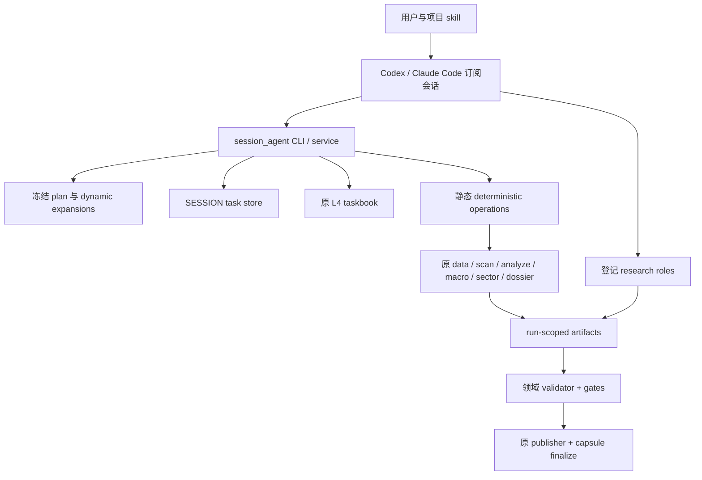

# Session Agent 架构

## 分层

依赖方向只从 `session_agent` 指向原领域模块。评分、评级、门、数据源、taskbook、DecisionRecord 和发布器没有复制实现；迁移层只负责编排和边界验证。

## 冻结身份

`begin` 精确校验 BeginRequest v1，创建领域 capsule 后冻结 `request.json`、`host_profile.json`、`plan.json` 和角色说明哈希。计划身份包含 engine、run、input contract、config、host profile、roles 和 orchestration version。动态候选出现后，expansion 记录输入 artifact hash，并且只能使用模板允许的角色；已冻结 expansion 不能被另一份候选覆盖。恢复时按任务依赖拓扑加载 expansion，不依赖文件名字典序。

TaskSpec 只引用 artifact ID。artifact registry 将 ID 绑定到当前 run 内相对路径、读写方向、device、inode 和 SHA-256；symlink、越界路径、绑定后替换和上游输入变化都会被拒绝。唯一受控替换是已失败 L4 卡进入合法第二 attempt 后的晋升：服务先核对旧绑定仍完整和旧任务处于 `WAITING_RETRY`，再原子替换并登记新 inode/hash。

## 两种 owner

`SESSION` 管理普通确定性和推理交接任务，状态为 PENDING、RUNNING、SUCCEEDED、FAILED 或 BLOCKED。claim 使用递增 attempt 和 session_ref；submit 只有在 envelope、plan、输入快照、输出 hash 与领域契约全部通过后才写接受回执。

`L4_TASKBOOK` 继续管理扫描中的整只股票。intel、slim、card 和 review 是带 `parent_task={owner:L4_TASKBOOK, subject:code, attempt:n}` 的 SESSION 子动作。每次接收和执行都重新确认父票仍是同一 RUNNING attempt。瞬时失败可以冻结 `a2` 子树；旧 `a1` 状态保留并标为 superseded，不能满足 `a2` 回执。整票只有在原卡、复核、stage result 和 hash 验证后调用原 `mark_success`。

## 扫描动态链

扫描固定起点是 frame、market view、prelude、GATE1。随后按实际 `run_mode.json` 展开行业、L3、L3 局部修复、L4 和两级复核。FULL、FORCED_FULL、SENTINEL_EMPTY、SENTINEL_PINNED 四态仍由原模块决定。L3 修复最多展开一次且只读取失败行 repair pack；修复推理或 patch 应用失败会记录 `DEGRADED` 并保留原 judged 继续 GATE2。L4 整票最多两次 attempt；第 2 次复核同档即早止，分歧才展开第 3 次。最终链继续调用原 assemble、GATE4、usage reconcile、observation 和整目录原子发布。

## 宿主证据

HostProfile 表示本次会话已观测能力，不是平台能力猜测。普通推理提交可以没有 host receipt，但会影响 capsule 完整性；声明独立上下文的任务必须提供可验证 receipt，证明 child context 与 parent context 不同。request、completion 和 receipt 只是控制面证据，只有实际 transcript 绑定后才能声明模型执行和 token 计量完整。

完好性、完整性和可重放性分别报告。manifest 通过不能替代缺失 transcript，输出存在也不能替代 owner 成功。
