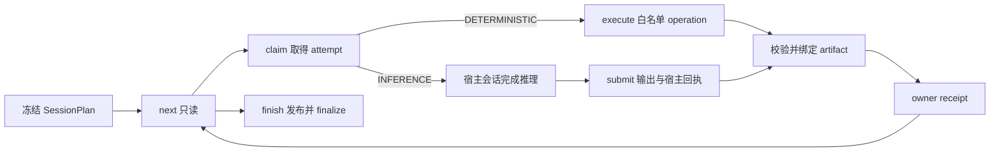

# Session Agent 开发与运行教程

本文面向在 Codex 或 Claude Code 官方订阅会话中运行本仓研究流程的开发者。Python 负责可验证的状态、数据和命令；当前会话负责模型推理。系统不调用模型 API，也不把一份 Markdown 请求文件当成模型执行记录。

## 1. 进程边界

每条命令都先显式设置引擎：

```bash
export AUTORESEARCH_ENGINE=codex   # Claude Code 使用 claude
uv run --no-sync python -m autoresearch.session_agent --help
```

CLI 在导入 `autoresearch.common.workspace` 之前检查这个变量。后续命令的 `--run-id` 也会在导入前绑定到 `AUTORESEARCH_RUN_ID`。这样模块级路径常量从进程启动起就只指向一个引擎根。

Codex 只读写 `context_codex/` 和 `reports_codex/`，Claude 只读写对应的 Claude 根。`lake/` 是唯一共享的可变数据目录。

## 2. 六个核心对象

`TaskSpec` 是冻结计划中的一个节点。`kind=DETERMINISTIC` 节点引用静态登记的 operation；`kind=INFERENCE` 节点引用逻辑角色。任务只通过 artifact ID 传递文件，不接受任意路径或任意 shell。

`operation` 是 Python 可以执行的白名单动作。登记项把固定操作名映射为经过参数校验的 argv，并声明该动作是否幂等。`execute` 仍通过现有 `trace.exec_capture` 保存进程身份、退出码和输出日志。

`artifact` 是 run 内文件的稳定身份。登记时固定 run、相对路径和读写方向；提交时重新打开文件并检查 symlink、device、inode 和 SHA-256。上游文件或输出在绑定后被替换会立即失败。

`attempt` 是任务的一次所有权。初始值为 0，第一次 `claim` 必须请求 1。相同 session 对同一 RUNNING attempt 的重复认领是幂等读取；其他 session、过期 attempt 或已经成功的任务不能接管。

`receipt` 是 owner 已接受某次结果的凭证。接收顺序是：验证任务身份和真实输出 → 写接收意图 → 更新 owner 状态 → 写 accepted receipt。崩溃发生在最后一步时，`resume` 从 owner 状态恢复相同回执。

`owner` 只有 `SESSION` 和 `L4_TASKBOOK`。普通任务由 session store 管理；扫描逐票任务继续由既有 L4 taskbook 管理，桥接层不能另写一个竞争状态。



## 3. 启动请求

`begin` 只接受精确的 `BeginRequest v1` JSON。没有值的字段也必须写 `null`：

```json
{
  "schema_version": 1,
  "kind": "stock-research",
  "requested_mode": "LITE",
  "analysis_date": "2026-09-14",
  "subject": "600519.SS",
  "peers": [],
  "asset_type": "stock",
  "name": "贵州茅台",
  "host_profile": {
    "schema_version": 1,
    "engine": "codex",
    "session_ref": "当前官方会话的稳定引用",
    "deterministic_exec": true,
    "capture_binding": true,
    "inference_handoff": true,
    "safe_resume": true,
    "independent_context": false,
    "native_dispatch": false,
    "web_search": false,
    "web_fetch": false,
    "observed_model": null,
    "observed_effort": null,
    "evidence_refs": ["本次能力观测引用"]
  },
  "predecessor_run_id": null
}
```

能力字段使用 `true / false / null`。`null` 表示本次没有足够证据，不能按 `true` 使用。`predecessor_run_id` 仅用于冻结 run 的后继任务；旧 run 必须属于同一引擎并已经终止，新 run 会把引用冻结在自己的 identity 中。

```bash
uv run --no-sync python -m autoresearch.session_agent begin \
  --orchestration session_v1 \
  --request-file /tmp/request.json \
  --kind stock-research --mode LITE --date 2026-09-14 --subject 600519.SS
```

四个可选标量只是对请求文件做一致性断言，不能覆盖文件内容。成功后，`session/request.json`、
`host_profile.json`、`plan.json` 及角色来源哈希同时冻结到 run 和 capsule identity；
`capsule/identity/execution_origin.json` 绑定实际 entrypoint、plan hash 与 host profile hash。
缺少必需宿主能力时在创建 run 前返回 `HOST_CAPABILITY_REQUIRED`。选择
`--orchestration legacy` 只返回 `LEGACY_ENTRYPOINT_REQUIRED`；调用方必须转到明确的旧入口并记录
`legacy_reason`，session_agent 不代为回退。

## 4. 宿主执行循环

先读取而不认领：

```bash
uv run --no-sync python -m autoresearch.session_agent next --run-id "$RUN_ID"
```

返回状态含义：

- `READY`：`tasks` 中至少有一个依赖已经成功的 PENDING 任务。
- `WAITING`：任务仍被某个 session 或进程持有，或动态模板还没有合法展开。
- `BLOCKED`：存在不能自动恢复的身份、能力或领域错误。
- `DONE`：所有必需 owner 状态和展开条件都成功；尚未代表已经发布。

领取一个任务：

```bash
uv run --no-sync python -m autoresearch.session_agent claim \
  --run-id "$RUN_ID" --task-id stock.harvest --expected-attempt 1
```

确定性任务随后读取该 operation 定义要求的参数文件：

```bash
uv run --no-sync python -m autoresearch.session_agent execute \
  --run-id "$RUN_ID" --task-id stock.harvest --attempt 1 \
  --params-file /tmp/stock-harvest.json
```

推理任务的 claim 结果包含九字段 envelope、plan hash、instruction refs、输入 artifact ID 和输出契约。宿主会话读取登记输入，按角色说明产出到登记路径，再构造提交文件：

```json
{
  "schema_version": 1,
  "envelope": {
    "schema_version": 1,
    "engine": "codex",
    "run_id": "20260914T010203000000Z",
    "task_id": "stock.card",
    "role": "stock.card",
    "input_artifact_ids": ["stock.harvest.bundle"],
    "input_contract_hash": "<64 hex>",
    "expected_output_contract": "stock.lite.v1",
    "attempt": 1
  },
  "plan_hash": "<64 hex>",
  "outputs": [{"artifact_id": "stock.card.output", "sha256": "<64 hex>"}],
  "host_receipt_id": null
}
```

```bash
uv run --no-sync python -m autoresearch.session_agent submit \
  --run-id "$RUN_ID" --submission-file /tmp/submission.json
```

需要独立上下文的任务必须同时提供 `--host-receipt-file`。receipt 要证明子 context 与父 context 不同；其 canonical SHA-256 必须等于 submission 中的 `host_receipt_id`。普通主会话顺序执行不能声称自己是独立复核。

在 `submit` 前调用 `bind-host-evidence`，把导出的宿主 transcript 精确区段绑定到本次
`task_id/attempt`。host receipt 的 `evidence_refs` 只接受可解引用的
`host-binding:<sha256>`；字段自洽但 binding 缺失、归属不符或归档 hash 变化都会拒绝提交。

每轮提交后继续调用 `next`。全部任务为 `DONE` 后才可运行：

```bash
uv run --no-sync python -m autoresearch.session_agent finish --run-id "$RUN_ID"
```

`finish` 不补做研究。它先检查完整任务图与 evidence closure，再将五类能力统一转换为
`PublicationBundle v1`，按 `PREPARING → EVIDENCE_CLOSED → BUNDLE_SEALED → PROMOTED →
VIEWS_APPLIED → COMMITTED` 推进。不可变真值落在
`reports_<engine>/<kind>/runs/<run_id>/<publication_id>/`；只有 capsule 完成、收据写入该
kind 的 `receipts.jsonl` hash-chain 且独立收据可验证后，状态 reader 才把版本视为可见。
日期/时间命名的旧报告路径只是兼容交付视图，并带 `delivery.json` 或
`<filename>.delivery.json` 指回 canonical path、bundle hash、capsule root 和 receipt hash。

发布 journal 位于 run 内 `publication/journal.json`。seal、promote、状态指针、finalize、收据
或兼容视图任一点崩溃，重复执行同一个 `finish` 会从已持久化阶段继续，不重跑研究；已经提交的
重复 finish 是只读校验。多个 workflow 共享的状态（当前为 coverage pool）在 pointer 中记录
收据 scope，因此 dossier 与 scan 的收据都能被同一 reader 验证。最终结果仍分别保留业务状态、
证据完好性、完整性和可重放性。

推理任务需要临时补算时，只能在该 task/attempt 仍为 RUNNING 时调用：

```bash
uv run --no-sync python -m autoresearch.session_agent calculate \
  --run-id "$RUN_ID" --task-id stock.fundamentals --attempt 1 \
  --params-file /tmp/calculation.json
```

参数文件只含 `calculator_id`、该任务已冻结的 `input_artifact_ids` 和 calculator-specific
`parameters`。允许值固定为 `financial_period_ratios.v1`、`ah_premium.v1`、
`conditional_base_rates.v1`、`dcf_sensitivity.v1`。系统不接受源码、模块名、shell 或任意路径；
结果绑定父 attempt 并写入 `capsule/evidence/calculations/<calculation_id>.json`，不改变父任务状态。

## 5. 可观测性

一次真实推理认领会写 `AGENT_DISPATCHED`，接受结果后写 `AGENT_COMPLETED`。未 claim 的计划节点不会产生派发事件；确定性节点只留命令捕获证据。事件写失败时命令失败，owner 已成功的提交可由 `resume` 按冻结 completion payload 幂等补写。

任务 request、plan 和 receipt 只是控制面证据。只有宿主 transcript 经过既有 `trace.capsule.bind_transcript` 绑定后，才计入模型执行和 token usage。没有 transcript 时完整性明确缺失，usage 保持未知；系统不会用输出文件反推 token。

`RunProfile.role_stages` 只在 `session_v1` profile 中记录逻辑角色到既有领域阶段的映射。历史 profile 缺少该字段时继续使用旧全局角色表，因此新旧 capsule 可以同时验证。

每次供应商返回和宿主外部工具返回都写入 `capsule/lineage/source_receipts.jsonl`。
收据绑定 `task_id + attempt + provider + endpoint + normalized_params + occurrence`，所以相同参数的
失败后重试、两次不同成功返回都不会被“最后值覆盖”。DataFrame 使用稳定 parquet，JSON 使用
canonical JSON，文本和字节使用非可执行 codec；失败保存经过脱敏的固定异常类别与消息。回放按
occurrence 顺序逐次消费：调用次数不足、次数超出、成功 payload 缺失或 hash 无法解析都直接失败，
不会回退网络、湖或当前工作树。失败响应本身有完整 payload 时属于已捕获事实，不会被误报为
“成功数据缺 blob”。

确定性 operation 的子进程环境携带精确 `AUTORESEARCH_TASK_ID` 和
`AUTORESEARCH_ATTEMPT`；推理任务的 WebSearch/WebFetch 则从已绑定 transcript 中转换为
`provider=host_tool` 的同一收据。`TaskEvidence.source_receipt_ids` 只接纳本 task/attempt 的收据，
闭包验证器会重新解析收据契约并检查 payload blob，不能靠手填一个 64 位 ID 过门。

### 可执行源码与 runtime 身份

每个 identity snapshot 除 Git head、dirty patch 和 untracked 增量外，还会生成：

- `identity/source_tree.tar.zst`：`autoresearch/`、三类项目 instruction/workflow 目录和
  `pyproject.toml`、`uv.lock`、`AGENTS.md`、`CLAUDE.md` 在捕获时实际存在的完整字节；
- `identity/source_tree_manifest.json`：逐文件路径、模式、字节数、SHA-256、
  `TRACKED|TRACKED_DIRTY|UNTRACKED` 分类及整树 hash；
- `identity/runtime_manifest.json`：Python 实现/版本、OS release、architecture、byte order、
  locale/timezone、`uv.lock` 和精确 dependency snapshot hash，以及当前离线可用状态。

源码树不包含 `.git`、`.env`、lake、任一引擎的 context/reports 或允许根外文件。捕获遇到凭据、
特殊文件或 symlink 时 fail closed，不写半包；identity component 明确为 `MISSING`。恢复入口
`autoresearch.trace.source_tree.restore_source_tree` 会在创建 target 前完成 zstd/tar 上限、路径
穿越、重复成员、文件类型、清单 membership/mode/size/hash 全校验，再通过独立 staging 原子晋升。
它不调用 Git，也不会从当前 checkout 补缺失文件，返回值固定声明
`uses_current_checkout=false`。

runtime 可用性只有三态：当前平台与 dependencies 精确相等为 `LOCAL_ENV_MATCHED`；显式从调用方
授权目录导入且摘要匹配的离线包为 `PACKAGED`；其余均为 `UNAVAILABLE`。接口没有安装分支，
`network_install_allowed=false`；缺 wheel/runtime 包时应停止可执行重放，不能联网补装后声称复现。

## 6. 恢复与故障判断

```bash
uv run --no-sync python -m autoresearch.session_agent resume --run-id "$RUN_ID"
```

宿主明确观察到推理失败时使用 `fail` 写真实错误；扫描整票符合 TASK_ATTEMPT 瞬时分类且未耗尽次数时，再用 `retry-l4 --code <CODE> --expected-attempt 2` 冻结新的 `a2` 子树。`retry-l4` 不直接认领，后续仍走 next/claim。详见 `operations.md`。

恢复遵循以下规则：

- RUNNING 的确定性进程仍有匹配身份时只报告等待，不启动副本。
- 已成功但 receipt 写入中断时，从 owner 状态恢复相同 receipt。
- 已绑定输出被替换时拒绝提交或恢复。
- 已 finalize 的 run 由 `require_active_run` 拒绝，不会重新激活。
- 发布已进入 `VIEWS_APPLIED` 或 `COMMITTED` 时，即使 run 已被 finalizer 标成终态，`finish`
  仍可只恢复提交/兼容视图；更早阶段的终态 run 拒绝猜测性恢复。
- journal、独立 receipt、receipt hash-chain、sealed manifest 或 committed canonical 字节任一
  不一致都 fail closed；不会拿旧路径或当前工作树补齐后继续。
- 旧 attempt 的迟到提交、不同 plan hash、不同引擎或不同 input contract 都按身份冲突拒绝。
- 能力不足保留任务包并返回阻断；不会把未知能力自动改成可用。

CLI 退出码为：`0` 有效执行（含正常等待），`2` 参数或契约错误，`3` 领域验证阻断，`4` 宿主能力不足，`5` 可重试工具故障，`6` 身份冲突或不安全恢复。

## 7. 扩展一个领域步骤

1. 在领域包中保留或建立纯 validator、发布器和确定性命令入口。
2. 在 `session_agent.operations` 登记固定 operation 及严格参数 builder。不要接收 shell 字符串。
3. 在 `session_agent.roles` 登记逻辑角色、现有 instruction refs、输出契约、工具策略和阶段。
4. 在对应 workflow planner 中加入 TaskSpec；输入输出全部使用 artifact ID。
5. 在 workflow begin 时登记每个 artifact 的 run 内路径和访问方向。
6. 为领域输出接入 `validation`，为最终目录接入 `publication`。
7. 先用无网络合成夹具覆盖成功、失败、重复提交、替换文件和恢复，再做真实宿主实验。

真实宿主实验必须记录实际 session/context/transcript 引用。合成测试中的假 handle、固定 hash 和回调只证明状态机与协议，不证明 Codex 或 Claude 的实际派发、联网和 token 计量能力。

架构、运维、验收和学习实验分别见 `architecture.md`、`operations.md`、`acceptance.md` 与 `learning-lab.md`。

## 8. 验证

```bash
export AUTORESEARCH_ENGINE=codex
uv run --no-sync python -m pytest -q tests/session_agent tests/contracts tests/common/test_workspace.py
```

完整仓回归会受本机数据依赖、Tushare token 和 Codex harness 环境标识影响。任何跳过或环境性失败都应与功能失败分开报告，不得把缺少真实 transcript 的测试夹具描述为端到端模型调用成功。
