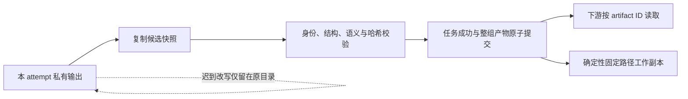

# Session 输出隔离与接受

状态：C3 核心实现与独立复核完成。实际完成范围、测试与兼容性见 [第三批记录](../research/2026-09-30-agent-skills-batch3-readout.md)。

## 结果什么时候可以被使用

任务把文件写完或提交回执，不代表下游已获准使用。确定性接受过程核对当前 run/task/attempt，复制输出，校验复制后的内容，最后在任务状态 owner 内一次提交整个输出集合。只有提交成功的快照可成为下一任务输入。



任务状态文件是接受事实的 owner；注册表保存逻辑声明。receipt、恢复记录和固定路径工作副本不能独立把尚未接受的内容升级为成功结果。

## 三种路径

| 路径用途 | 谁写 | 谁读 | 约束 |
|---|---|---|---|
| attempt 私有输出 | 本次研究任务 | 接受过程 | 首次与重试均隔离，完整 task ID 和 SESSION attempt 共同标识 |
| 已接受快照 | 确定性接受过程 | 下游任务、取证与发布 | 真实复制，按提交身份和哈希读取，不是原文件硬链接 |
| 固定路径工作副本 | 确定性物化过程 | 需要既有目录布局的领域命令 | 可重建，不承担接受事实；不能重新绑定其字节来替代已接受快照 |

新运行冻结 `output_layout_version=2`；`session/tasks.json` 保存接受事实，`session/storage.json` 与 capsule 身份声明绑定运行和计划。实际布局为：

```text
staging/session_outputs/
  attempts/<完整 task_id>/a0001/outputs/
  accepted/<完整 task_id>/a0001/<generation>/
```

已接受文件真实复制并设为只读；文件权限不作为操作系统隔离保证。任务 owner 在一次原子写入中同时保存成功状态和完整产物集合，历史版本通过 accepted_history 保留。

L4 ticket 的 `a<n>` 和 SESSION attempt 是两个身份。重试路径同时保留这两个层次，不能仅用证券代码覆盖旧输出。

多文件任务整体接受：任何必需输出缺失或校验失败，都不公布其余输出。拒绝越界、非普通文件、符号链接、硬链接、未声明输出和捕获时检测到的改写。输出哈希绑定复制后的快照。

## 恢复规则

| 中断位置 | owner 状态与恢复原则 |
|---|---|
| 私有文件未完成 | 任务尚未接受，按既有失败/超时政策处理 |
| 候选快照已复制，owner 尚未提交 | 不得向下游公布，残留文件不构成成功 |
| owner 已提交，receipt 尚未写完 | 根据 owner 重建 receipt，不要求原私有文件仍存在 |
| 固定路径工作副本生成中断 | 从同一已接受快照重新物化，不重做研究 |
| 旧 attempt 迟到写入或回执 | 不改变当前接受指针；回执仍受有效 attempt 与 abandoned 标记约束 |

接受事务按 mailbox → taskbook → SESSION 锁序覆盖 abandoned 检查到 owner 提交，取消与接受依据锁内先后顺序确定结果。已提交结果不被随后落盘的取消标记撤销。L3 可选修复失败时，从原 accepted judged 恢复，避免进程被杀后遗留的半修复工作副本进入下游。

相同 submission 重复提交应幂等；同一已成功任务提交不同结果必须冲突。宿主无法确认取消时如实记录，不能用“已发送取消请求”证明旧任务停止。

## 兼容、回放与发布

新运行冻结存储布局；历史缺版本的运行保持旧语义。升级代码不能自动迁移旧计划、输出身份或宿主请求，恢复应使用原来冻结的输出映射。

内容证据中的逻辑身份与机器物理路径分开：输入字节由已接受 artifact 读取，需精确回放的派生产物不应无意包含随机 generation 目录。回放从冻结输入与原请求恢复身份，不能依赖活体配置或补造缺失字段。

发布准备、状态变更的 before-hash、最终报告及兼容镜像都必须消费同一已接受版本。仅保护报告正文，而从固定路径读取 publication metadata 或档案权限，仍会产生不一致。

## 能力边界

此机制隔离迟到 writer 对其原输出路径的修改，不证明任意宿主进程无法主动访问其他目录。任务访问清单、hook 与操作系统隔离能力归 C4 分别验证；不把合成测试称为 REAL_SESSION 证明。评级、主尺、BUY 语义和 `session_v1` 默认切换门保持既定规则。
