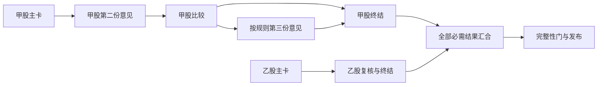

# session_v1 调度与计量

状态：C5 软件实现、独立审查与离线集成已完成，实际验证见 [第六批开发记录](../research/2026-09-30-agent-skills-batch6-readout.md)。

## 逐票研究与最终汇合

新计划按每票已接受主卡和必需证据启动复核。第二份意见与本票主卡完成比较后，按既有规则决定是否需要第三份；其他股票的研究进度不构成本票复核依赖。

新冻结计划使用 `scan.reviews.per-stock-v1` 与 `scan.review3.per-stock-v1` 模板，scope 分别绑定唯一已接受的 `scan.review.plan.<code>` / `scan.review.decision.<code>`。跨证券独立展开，同一 scope 的锚定哈希变化仍报冲突。`scan.review.join` 在必需逐票判断齐备后展开，最终 complete 继续等待全部必需 finalize，并恢复全局 `scan.review.plan` / `scan.review.decision` 产物供下游消费。旧冻结计划保留原有全局模板，不被静默重写。评级、复核触发、只向下折回以及最终 gate/assemble 的完整性要求不因调度顺序改变。

## 单一状态写入者

计划展开、claim、submit、retry、artifact 接受都由 owner 串行执行。共享 staging、taskbook、取数、gate 与组装等确定性操作继续独占；推理结果可等待 owner 提交。

只有预先冻结为字节的纯计算核可以在执行期间允许 owner 处理其他推理任务。`research.card.facts` 使用 prepare 冻结字节，捕获子进程只计算并输出 JSON，commit 复验 attempt 后写输出与状态。保留既有命令、日志、operation request 与终态证据。

实现复用 `run_captured`：纯核子进程执行时，其等待轮询可调用 owner 回调，处理就绪的推理结果及派发。其他确定性操作直接在 owner 同步执行，不再由后台线程写任务状态；未能证明安全的操作不启用该回调。短于捕获轮询周期的纯核计算可能不会触发回调，不能据此承诺实际扫描提速。

捕获等待期间的 owner 回调只处理推理，不递归执行确定性任务，不结束或恢复 run。收到取消信号后停止新派发，等待子进程清理并恢复信号处理器；回调异常也走同样的捕获收尾。

## 计量口径

调度耗时按单调时钟计算，并记录 runner segment、墙钟和来源。恢复后的历史缺失区间不能填成零。首末主卡、首末复核须区分开始与完成；排队等待、空闲槽位与确定性 lane 忙碌时间分别记录。

容量与预算沿用冻结配置；满额时排队，不增加隐蔽并发上限。

输出位置为 run 的 `runner.json.scheduling`、runner 返回的 `outcome.scheduling`，以及 `_dispatch/scheduling-<segment_id>.json`。每次启动生成独立 segment，不能直接跨进程拼接单调时钟。

| 字段 | 含义 |
|---|---|
| `segment_id` / `source` / `started_at` | 本段身份、`RUNNER_PROCESS_MONOTONIC` 来源、墙钟起点 |
| `elapsed_seconds` | 本段单调时钟耗时 |
| `first_card` / `last_card` | 主卡首次/末次 `started` 与成功 `accepted`，各自独立记录 |
| `first_review` / `last_review` | 第二/第三份意见首次/末次启动与接受 |
| `ready_queue_wait` | 按 `task_id@attempt` 记录从首次观察 READY 起的等待、原因和墙钟；标记 `OBSERVED_LOWER_BOUND` |
| `slot_idle_seconds` | 空闲推理槽位数乘以持续秒数后累加，单位为槽位秒 |
| `deterministic_lane_busy_seconds` | 确定性 lane 占用秒数 |
| `historical_measurements` | `UNKNOWN`，不将恢复前未测量区间补零 |

主卡初步评估不计入最终卡 milestone。`accepted` 指 owner 已接受并提交的结果，不是模型刚返回；失败/待重试结果不计为成功。尚未发生的 milestone 为 `null`。快照使用锁内深拷贝，指标不作为业务状态来源。

同一冻结输入的实际 runner 模拟对比：旧图 47.0 秒，新图 44.9 秒；模型调用均为 9 次，模型调用/重试序列与所比较业务产物哈希一致。确定性调用从 29 次变为 33 次，来自逐票 plan/decide 拆分。该样例对每次确定性操作设置 0.1 秒模拟成本，不能外推真实吞吐。

## 验证边界

受控事件和模拟时钟用于证明依赖、启动顺序、重试次数及同输入结果一致。合成对比明确标注 SIMULATED，不代表真实市场任务的提速，也不替代 C6 双宿主验收。`session_v1` 继续显式 PILOT。
