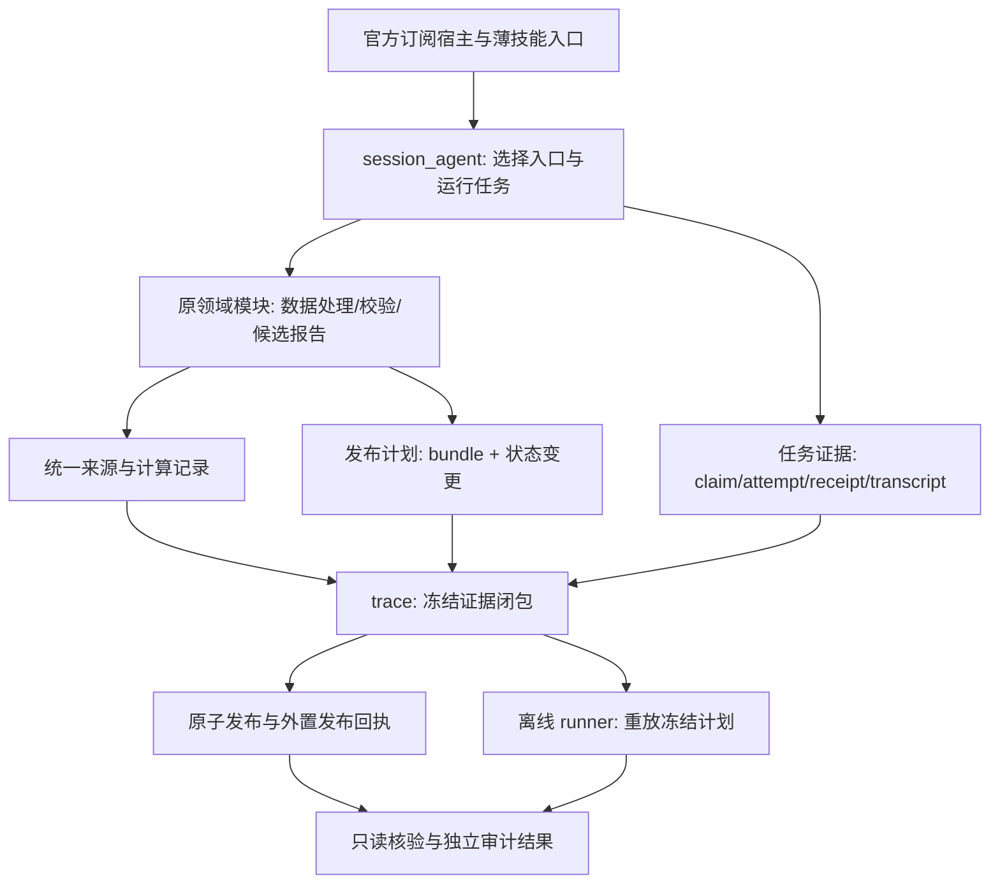

# 全研究入口编排与法证可复现修复 Implementation Plan

> **For agentic workers:** REQUIRED SUB-SKILL: Use superpowers:subagent-driven-development or superpowers:executing-plans to implement this plan task-by-task. Steps use checkbox (`- [ ]`) syntax for tracking. 本文只交付开发设计；选择执行方式后再实施代码。

**Goal:** 让全项目研究入口实际运行于可核验的 `session_v1`，使最终交付与封存版本一致，并为五类研究及其依赖服务提供明确、有测试支撑的证据还原与离线重放能力。

**Architecture:** 沿用 `session_agent → 领域模块 → data/trace/contracts` 分层，以共同的运行身份、写入前检查、证据闭包、发布事务和重放计划连接现有实现。Python 不调用模型；LLM 输出作为冻结输入回注确定性重放，模型调用本身通过可导出的真实 transcript 核验。

**Tech Stack:** 现有 Python、uv、pytest、JSON/JSONL、SHA-256、Parquet、zstandard、文件锁与原子目录发布；不引入新的 agent 框架、消息队列或付费模型 API。

---

日期：2026-09-14。代码核查基线：`9b613a8cfa45185935ec0275a3154f331c3c57ec`。

状态：**待开发、待验收**。本文的新增接口、文件、命令和测试均为开发目标，不表示当前已可调用。此次只增加本文，不修改运行状态、历史 capsule、研究规则或技能入口。

本文包含设计决策、数据契约、文件职责、分阶段任务、故障注入、上线矩阵与历史补救。实施时保留现有未提交改动，不覆盖 `.claude/skills/scan-market/pinned.jsonc` 或其他无关文件。

## 1. 两个问题及完成定义

### 1.1 问题 A：代码登记了新编排，真实会话仍执行旧入口

五类 workflow 已在 `session_v1` 中登记，但技能同时包含“显式选择新编排”与完整 legacy 操作步骤，验收文档又保留 legacy 默认。模型可以遵循旧 playbook 完成报告，然后把新代码、新报告骨架误当作新编排已经执行。

修复不能只改一句提示词。必须有机器可验证的执行来源：入口选择、冻结计划、任务所有权、attempt、接受回执及最终交付身份形成闭环；正式报告中的编排声明由代码生成。

**完成定义 A：** 五类研究的所有支持模式在两个宿主分别经过真实运行验收；新会话默认走 `session_v1`；显式 legacy 回退有原因和持久记录；无法走新编排时不得静默切旧、更不得把旧 run 标成新 run。

### 1.2 问题 B：报告生成成功被误读为法证完整、可复现

本次审计发现了两个相互独立的问题：封存后的新报告沿用了旧 run 身份；单股及其他非扫描入口没有默认重放单元。主会话和临时补算未完整进入 capsule，也使推理和外源证据只能依赖开发机上尚存的日志。

**完成定义 B：** 指定最终报告文件即可验证其所属 bundle、根哈希与发布回执；已消费数据、失败响应、代码、配置、任务输入输出和可导出的宿主记录可查；在隔离环境中，使用冻结输入真实执行全部应重放的确定性节点，比较业务输出与状态变更计划。缺失节点不能缩小分母。

“LLM 再运行一次生成逐字相同的研究”不作为承诺。报告事实是否正确、策略是否有效也不由法证证明；这些仍由既有数据契约、研究审查和业务门判断。

### 1.3 审计实例与可重用回归场景

run：`20260914T020912767414Z`；标的：`688981.SS`；宿主：Claude。

| 事实 | 证据 | 对修复的要求 |
|---|---|---|
| 实际执行 `analyze.runctl begin/bind/finalize` | 原会话对应命令与无 session plan 的工作区 | 用执行事实识别编排，不能只看代码版本或 run_id |
| 10:40 封存后，10:41 再次 assemble | 新版改净利率并新增一行；checkpoint 报 `not ACTIVE: SUCCEEDED`，报告仍写出 | 运行身份检查必须在第一笔业务写入之前 |
| 10:41 manifest 继续带旧 run_id | verify 原 run 仍命中 10:40 | 核验入口必须支持报告路径与内容哈希 |
| 10:40 的 215 个文件、88 条事件、账本和归档通过 | manifest、事件链、根锚点重新计算 | 完好性通过不能掩盖未覆盖的交付文件 |
| 缺 intel/write/publish 阶段证据 | completeness 为 `EVIDENCE_INCOMPLETE` | 任务完成证据按实际计划生成，不靠补造旧阶段回执 |
| 只冻结情报员 transcript | 主会话两次 WebSearch 未进入外源链 | 主会话与子上下文均须绑定，工具往返不能只收子 agent |
| 79 个登记读点中 76 成功、3 个当日请求失败 | 失败有错误记录、无 DataFrame blob | 区分成功源缺失与已记录失败，不把失败响应填成空成功 |
| 单股 replay specs 为空 | `analyze/run_profile.py`、`trace/replay.py` | 重放能力按五类工作流补齐，不能只改标志为 FULL |

原现场为 gitignored、引擎隔离产物。自动测试应使用**合成复现夹具**重现上述顺序与差异，不依赖本机真实目录、不把真实会话或供应商数据提交到 Git。历史补救由原引擎执行，见 §14。

## 2. 范围：五类入口、嵌入任务及配套服务

| 能力 | 纳入模式与分支 | 必须冻结/重放的确定性部分 | 发布副作用 |
|---|---|---|---|
| scan-market | FULL、FORCED_FULL、SENTINEL_EMPTY、SENTINEL_PINNED；AUTO 由 GATE1 决定实际模式 | frame、prelude、L0–L2、行业准备、L3 准备/修复合并、L4 slim、复核规则、各门、assemble、observe | 完整报告目录、明确登记的观察/账本输出 |
| stock-research | FULL/LITE；早停/满卡；A 股、美股及当前支持的其他市场/crypto；有无 peers | harvest 的解析和派生、补算、validate、assemble、publication bundle | 报告与身份 sidecar |
| macro-research | FULL/LITE；独立入口及 scan 中的市场研判 | harvest/frame、各派生块、validate、assemble、macro_state 候选 | 不可变报告、macro_state 最新视图 |
| sector-research | FULL/LITE；独立入口及 scan 行业 brief；复用命中/不命中 | pack、前置来源检查、reuse 判定、validate、报告组装 | 不可变行业报告、日期级兼容视图 |
| dossier-init | INIT；新建/已有档案/并发更新 | prefetch、skeleton、权限模板、受限分段合成、lint、pool 更新计划 | 不可变档案版本、当前档案和覆盖池 |

以下服务继续是确定性服务，不为它们新造 LLM agent：

- `data/dataflows`：tushare、yfinance、FRED、akshare、其他现有供应商，以及所有 cache/live 返回边界。
- `news/derivatives`：搜索与原文、事件日历、期权和海外映射等被研究消费的输入；同样保存返回内容、时间与缺测状态。
- `research/common`：DCF、盈利质量、基率等补算；被报告使用的临时计算必须转为登记计算或明确缺证据。
- `dossier.reconcile`、预热、broker 导入/对账、离线评估：保持独立工具入口，增加操作级输入/输出/代码/副作用证据；被研究消费时建立来源引用。重放仅在 scratch 生成候选状态，不改真实湖、交割表、覆盖池或研究参数。
- `ops`：只核验运行与归档身份；备份删除、迁移真实存储、账户操作不属于 replay。应登记为不允许重放的管理副作用，不能直接从重放 argv 执行。

嵌入 scan 的 macro/sector/stock 任务归父 scan run，通过 task_id/attempt/subject 标识；不另开 capsule，不重复计 usage。独立入口才拥有自己的 run。

本次不调整评级、资金/行业方向注入、T+1/T+2 主尺、LITE 早停、复核折回、评分权重、数据 A/B 级契约，也不恢复学习闭环或新增交易权限。

## 3. 方案选择与既有设计的关系

| 方案 | 优点 | 代价/不足 | 决定 |
|---|---|---|---|
| 仅修 legacy assemble 和单股 snapshot | 能最快堵住本次具体错版 | 其他入口继续分叉；新编排是否执行仍靠人工判断 | 仅作为工作包 A 的第一步止血 |
| 在 session_v1 与 trace 边界统一修复 | 复用现有 owner、业务规则、数据源和 publisher；可分阶段验收 | 要处理证据闭包和多目标发布事务 | **采用** |
| 重写成新的 agent 框架/远程服务 | 可以另设执行沙箱 | 引入第二套状态机、模型接入和迁移风险，不能直接修复现有现场 | 不采用 |

复用而不重复实现：

- [session 迁移设计](../specs/2026-09-13-session-agent-migration-design.md)的任务协议、分层、双 owner、零付费模型 API 原则继续有效。
- [现场重建设计](../specs/2026-09-12-scene-reconstruction-transcript-binding-design.md)的精确归属、区段覆盖和历史只追加规则继续有效。若对应代码尚未落地，本计划 T06/T16 负责实现；不可只引用旧计划即算完成。
- [原 capsule 设计](../specs/2026-08-27-scan-forensic-run-capsule-design.md)的完好性/完整性/重放分离继续有效。
- 本文提议替换“新编排仅显式试跑、未验收入口默认旧流程”的最终切换规则：开发期间保持现状，完成 §13 的相应验收后原子切换入口；切换后 legacy 只接受显式选择。不能在文档落盘这一步提前改变默认行为。
- 证据缺失仍不改变业务评级或选股门。身份冲突、错版、文件被替换属于发布正确性错误，必须阻止错误交付；证据不完整可以产生清楚标注的降级报告。

## 4. 目标架构与责任边界



依赖方向保持 `session_agent → domain/trace → contracts/common`。公共写入检查位于 `trace`；领域代码可以调用 trace，不能反向导入 session_agent。重放核心只消费声明及允许执行的 operation 标识；领域重放适配登记在上层，避免 trace import 具体 planner。

遵守现有 `tests/contracts/test_layering.py` 的实际层级：`dataflows/common` 位于 trace 之下，不能为取数留痕新增 `dataflows → trace` 或 `common → trace`。新增 `common/execution_context.py` 提供 RunClock 和注入式 source hooks，协议声明放 contracts，具体 trace recorder 由上层 operation 启动时注入。下层只调用 hook；无 run 的旧调用保持正常数据行为，新 session 未安装所需 recorder 时记录明确的执行接缝错误。

`common/published_state.py` 只用 contracts/common 的路径、canonical hash 和提交链读原语；需要下沉的通用账本 hash 校验从 trace 提取为 `common/commit_chain.py`，trace 保留旧名称代理。不能用字符串动态 import 上层绕过分层测试，也不能新增 KNOWN_UPWARD 豁免。

继续使用原 `RunState` 作为 run 生命周期权威、原 session store 作为普通任务权威、原 `l4_tasks` 作为扫描整票权威。新增发布 journal 只记录一次发布事务的进度，不能独立认领研究任务或把终态 run 重新激活。

### 4.1 共用不变量

| ID | 要求 |
|---|---|
| R01 | 每条 shell 首先固定本宿主 engine；任何路径参数都验证所属引擎；进程不能中途换引擎 |
| R02 | 已终止 run 的普通产物写入在创建文件/目录之前失败；恢复已存在发布事务是专门路径 |
| R03 | 同一 `(engine, run_id, publication_id)` 只对应一组不可变业务文件；新内容必须有新 revision/run |
| R04 | 新版编排声明必须有可验的计划、任务和接受回执，不能由环境变量或报告标题单独生成 |
| R05 | 分段、补算、外源和上下文输入在被消费时固定 hash，不能等 finalize 才从可变原路径抓一份 |
| R06 | 所有计划、动态展开、已启动 attempt、取消/失败/被替代分支均进入证据分母 |
| R07 | 已记录失败响应属于可还原执行事实；成功数据缺 blob、未知返回形状属于缺证据 |
| R08 | 模型输出只作为 EVIDENCE_ONLY；重放不得调用模型、联网重取、读取原 staging 或真实 lake |
| R09 | 重放执行输出目录初始为空；不能以复制的原输出冒充重新生成 |
| R10 | 重放所有合法副作用都写入 scratch；真实宏观状态、档案、pool、broker/研究账本不变 |
| R11 | 冻结现场只读；重新 verify/replay/repair 写独立审计或修订目录，不覆盖历史 MANIFEST |
| R12 | 比较保留价格、评级、proposal、候选、来源、警告与缺测差异；只按版本化白名单规范化表示差异 |
| R13 | 证据完整不代表模型理解、事实成立或研究有效；不捕获或假造不可导出的隐藏推理 |

## 5. 接口与契约

### 5.1 版本策略

保留 `BeginRequest v1`、`SessionPlan v1`、九字段推理信封及业务 report/card schema 的精确字段集合。下述对象作为独立 sidecar 引入，各自 `schema_version=1`；旧 capsule 继续按原规则读取，新对象缺席时只能报 `LEGACY_PARTIAL/UNKNOWN`，不得推测补齐。

新增内部 API 的名字与参数由本节固定。实现时若确实需要变更，必须同步修改本文、调用方和契约测试。

| 对象/模块 | 职责与关键约束 |
|---|---|
| `contracts/forensic.py` | `ExecutionOrigin`、`EvidencePlan`、`TaskEvidence`、`VerificationResult` 的精确字段与枚举验证 |
| `contracts/publication.py` | `PublicationBundle`、`StateMutation`、`PublicationReceipt`；验证路径和身份引用 |
| `contracts/replay.py` | `ReplayPlan`、`ReplayUnit`、`ReplayResult`；冻结分母、比较策略、执行能力 |
| `contracts/source_receipt.py` | 不同 payload codec、成功/失败/缺测返回、消费引用的结构验证 |
| `trace/write_guard.py` | `assert_write_allowed(run_id, operation, engine)` 与事务范围的运行锁 |
| `session_agent/origin.py` | 从实际请求/计划生成 `ExecutionOrigin`，校验 legacy 显式理由 |
| `session_agent/evidence.py` | 计划与 owner 状态到证据闭包的投影，不另造任务状态 |
| `trace/publication.py` | seal/promote/恢复事务；依赖 publisher 注入的候选与状态变更，不 import workflow |
| `trace/replay.py` + `trace/offline.py` | 纯结果计算、隔离执行与显式写审计结果；保留 legacy replay 兼容入口 |
| `session_agent/replay_registry.py` | 登记现有 operation 与五类重放适配的关系，生成 ReplayPlan |

### 5.2 ExecutionOrigin：到底执行了哪套编排

保存于 `capsule/identity/execution_origin.json`，并由报告身份 sidecar 引用其 hash。

```json
{
  "schema_version": 1,
  "engine": "codex",
  "run_id": "20260914T120000000000Z",
  "run_kind": "stock-research",
  "orchestration": "session_v1",
  "entrypoint": "autoresearch.session_agent.begin",
  "plan_hash": "aaaaaaaaaaaaaaaaaaaaaaaaaaaaaaaaaaaaaaaaaaaaaaaaaaaaaaaaaaaaaaaa",
  "host_profile_hash": "bbbbbbbbbbbbbbbbbbbbbbbbbbbbbbbbbbbbbbbbbbbbbbbbbbbbbbbbbbbbbbbb",
  "legacy_reason": null,
  "created_at": "2026-09-14T12:00:00Z"
}
```

规则：`orchestration` 仅 `session_v1|legacy|untracked`；session 必须能解引用 plan/host hashes，legacy 必须有非空 `legacy_reason`；无 run 的手工 CLI 为 untracked 草稿，不能复制旧 run_id。`orchestration_verified=true` 由 verify 重算，不能存一个未经验证的自报布尔值作为真值。

### 5.3 EvidencePlan 与 TaskEvidence：分母从执行图得出

EvidencePlan 顶层字段：`schema_version, engine, run_id, plan_hash, expansion_hashes, task_keys, closure_cutoff, scope, evidence_plan_hash`。

`task_keys` 元素字段：`task_id, attempt, owner, subject, state, superseded_by, requirements`。requirements 为该节点实际应有的 `claim/input_snapshot/outputs/accepted_receipt/command_capture/transcript/tool_results/source_receipts` 集合；集合由节点种类、能力策略和实际 reached 状态计算。

TaskEvidence 顶层字段：`schema_version, engine, run_id, task_id, attempt, owner, subject, input_refs, output_refs, claim_ref, receipt_ref, command_ref, transcript_refs, source_receipt_ids, status, reasons`。status 为 `PRESENT|PARTIAL|MISSING|NOT_REACHED|NOT_APPLICABLE`；失败任务的证据可以 PRESENT，其业务失败状态仍来自 owner，不能混用两个状态。

- `input_refs/output_refs` 元素为 `artifact_id, sha256, captured_path`；必须解引用校验，不能只检查字段存在。
- `command_ref` 包含 argv/cwd 的安全摘要、exit/signal、stdout/stderr hash 和实际 operation 版本；INFERENCE 节点为 null。
- `transcript_refs` 使用现有 snapshot/binding 协议，并附绑定区段与上下文来源；DETERMINISTIC 节点不欠模型 transcript。
- `NOT_REACHED` 只用于图上真实未进入的合法分支；失败和 superseded attempt 不得伪装成 NOT_REACHED。
- 同一个 stage 的多个任务和 attempt 不再用单个 `stage/write/result.json` 代替。旧 stage checkpoint 作为兼容视图，从 TaskEvidence 聚合生成；聚合器不能凭产物存在补造执行成功。

### 5.4 SourceReceipt：按返回实例定位数据

在现有 `lineage/reads.jsonl` 保留 v1 兼容记录，同时产生精确 SourceReceipt。字段为：

`schema_version, receipt_id, engine, run_id, task_id, attempt, provider, endpoint, normalized_params, occurrence, started_at, ended_at, status, codec, payload_hash, raw_hash, error, as_of, available_at, consumer_refs`。

- `receipt_id` 标识一次返回；`occurrence` 在同一个 task/attempt/endpoint/params 下单调递增。不能继续使用“相同 endpoint/params 最后一条胜出”的 replay 规则。
- status 为 `SUCCEEDED|FAILED|UNMEASURED`。FAILED 的 `error` 必须有稳定类别、脱敏消息和失败 payload hash；重放由**预注册异常工厂**重现对应异常，禁止根据日志动态 import 异常类。
- codec 为 `dataframe.parquet.v1|json.canonical.v1|text.utf8.v1|bytes.v1|failure.json.v1`。不允许 pickle 或可执行反序列化。
- 成功的空结果须符合原数据等级契约；A级违规仍抛异常，不能借 codec 改为成功空表。
- 保存交给消费者的确切数据版本；如果另存原响应，则明确 raw 与 normalized 的转换关系。脱敏损伤业务字段时标不可重放，不能把脱敏后的值当原数。
- `consumer_refs` 元素为 `task_id, attempt, artifact_id, consumption_kind`，种类为 `INPUT|CALCULATION|QUOTE|DISCOVERY`；搜索发现不得自动升格为原文事实。
- 时间字段缺失保持 null。用真实 available_at/as_of 做现有分析截止检查，不用文件 mtime 或事后搜索时间冒充历史可用时间。

### 5.5 PublicationBundle 与状态变更

Bundle 字段：`schema_version, engine, run_id, run_kind, publication_id, predecessor, origin_hash, plan_hash, evidence_plan_hash, business_files, state_mutations, generated_at, bundle_hash`。

`predecessor` 为 null 或精确对象 `engine, run_id, publication_id, root_hash`；不能只用跨 run 会重复的 `p1` 作为历史关联键。一个 run 只有一份最终业务 bundle；`p1` 是 run 内编号，终态后修订必须新建 predecessor run。

`business_files` 元素字段：`artifact_id, relative_path, sha256, bytes, media_type`；所有五类领域报告、卡、档案候选均进入该集合。路径为相对 bundle 路径，拒绝绝对路径、`..`、symlink 和重复归一化路径。

StateMutation 字段：`target_key, expected_before_hash, after_artifact_id, after_hash, apply_policy`。

- `target_key` 为代码登记逻辑名，例如 `macro.latest_state`、`dossier.current:600519`、`dossier.pool`。通过 workspace resolver 获取实际目标，不接收模型传入任意路径。
- apply_policy 为 `CAS_REPLACE|IDEMPOTENT_APPEND|ADVANCE_IF_NEWER`；不能用一个无锁 `write_text` 实现多目标提交。
- before hash 在准备状态变更时读取；apply 在持目标锁时重验。并发档案更新不可覆盖，宏观旧 run 不可倒灌最新视图。
- bundle_hash 只描述冻结的业务文件与状态计划。ROOT、发布回执及指向 ROOT 的 delivery sidecar 不放入自身哈希输入，避免循环引用。

PublicationReceipt 字段：`schema_version, engine, run_id, publication_id, bundle_hash, capsule_root_hash, canonical_path, committed_at, state_effects, previous_receipt_hash, receipt_hash`。

回执为 append-only、存于本引擎领域账本；与现有 run capsule ledger 关联，不替换原 ledger。`state_effects` 明确 `APPLIED|ALREADY_APPLIED|SUPERSEDED_BY_NEWER|CONFLICT`。只有前 3 种无未决项时可提交；superseded 必须证明新版本顺序，不能借此绕过 hash 冲突。

## 6. 发布与冻结时序

### 6.1 先止血：任何业务写入之前检查 run

当前 `analyze.assemble` 先写报告、后 checkpoint，trace 错误只打印警告。T01/T03 必须先修此顺序，并盘点所有直接发布入口。

核心行为约束：

```python
def checked_render(run_id, operation, engine, render_candidate):
    with run_write_lock(run_id):
        assert_write_allowed(run_id, operation, engine)
        candidate = render_candidate()
        return candidate
```

这里的 `run_write_lock` 与 `assert_write_allowed` 均在 `trace/write_guard.py` 中实现；render_candidate 只写当前 run 的候选目录。锁保护检查与候选登记，运行中的长计算通过 attempt owner 和最终提交复验避免长时间占锁。finalize 使用同一把 run 级锁关闭写入窗口。

没有 run 的旧命令只生成 untracked 草稿到调用者指定 scratch/草稿路径；不再默认为正式可核验发布。迁移过渡期允许旧正式路径，但明确标 legacy/untracked，入口切换完成后禁用该默认路径。显式绑定终态 run 的命令立即失败，无兼容豁免。

### 6.2 单一发布事务

保持用户循环 `begin → next → claim → execute/submit → finish`。finish 内部 journal 阶段为：

```text
PREPARING → EVIDENCE_CLOSED → BUNDLE_SEALED → PROMOTED
          → VIEWS_APPLIED → COMMITTED
```

1. **PREPARING**：确认图 DONE、合法动态展开完成、全部 owner 状态一致；再次校验输入输出 hash；持 run 锁关闭新提交。所有产物转换为不可变 candidate。
2. **EVIDENCE_CLOSED**：绑定主/子 transcript、工具返回、计算/源记录，生成 EvidencePlan；冻结记录的 cutoff。缺证据按既有业务政策降级，不删除缺项、不改业务门。
3. **BUNDLE_SEALED**：生成 bundle；从同一闭包物化来源、usage、完整性、重放计划及证据包，计算 manifest/ROOT。正式路径尚不可见。封存时数据缺项和重放未执行如实记录，不用 PENDING 冒充 COMPLETE。
4. **PROMOTED**：把**已封存目录**原子 rename 到唯一 canonical 路径。同一 publication_id 同内容返回相同结果，不同内容冲突。报告和 capsule 一起变为可见。
5. **VIEWS_APPLIED**：按统一锁顺序处理登记状态变更；每项落 journal。macro 最新状态、dossier 正文/pool、scan 观察输出都必须先由登记 artifact 派生，不允许再调用研究逻辑。
6. **COMMITTED**：追加 PublicationReceipt 与原 capsule ledger 的关联记录，最后将 run 终态持久化；返回代码生成的交付摘要。兼容视图消费者只接受已提交回执，不能消费多文件事务中间态。

journal 在 run workspace，`revision` 单调递增，每次更新有 hash；它是恢复记录，不进入需要稳定的 capsule ROOT。物理上无法跨多个文件/目录一次原子提交，因此以提交回执为逻辑可见性边界。所有内部 reader 同步改为校验对应回执；旧文本视图仅作便利镜像。

状态版本也存成不可变 artifact，pointer 文件原子替换，包含本次候选及 predecessor 的完整引用。新增 `common/published_state.py::read_committed_state(target_key)`：pointer 指向尚未 COMMITTED 的版本时，沿 predecessor 返回上一份已提交快照；没有旧版本则明确返回“不存在”，绝不返回一半更新的数据。原 macro_state、档案正文/pool 的内部 reader 全部经此函数读取。兼容的 JSON/Markdown 镜像在 COMMITTED 后更新，不再是内部状态真值。

写入顺序固定为 run lock → 按 target_key 排序取得目标锁 → 重验全部 before hashes → apply pending pointers → append commit receipt。锁不跨模型推理或联网取数持有。重启恢复按同样锁序、journal 与 before/after hash 继续；不能只看 pointer 文件名判断已提交。

报告文件与 capsule 的 canonical 根统一为 `ws.run_reports_root(kind) / 'runs' / run_id / publication_id`。现有日期/分钟路径保留为兼容视图，配 delivery sidecar 指向 canonical 版本；这也消除同一分钟/同一天多个 run 的目标冲突。扫描旧目录、归档、账本仍可读，不能批量搬历史路径。新增 root resolver 由 `common/workspace.py` 维护。

### 6.3 自引用、transcript 尾部与恢复

- cutoff 至少覆盖全部被接受输出、对应宿主工具成功返回及进入 finish 前的最后一次研究动作。若宿主落盘有延迟，返回 `WAITING/EVIDENCE_PENDING`，有界探测真实新增内容；不能凭固定 sleep 后假定已完整。
- 当前 finish 的返回和提交回执自然发生在 cutoff 后。它们属于外置发布证明，不要求塞入已封存 transcript；明确区分研究证据截止与交付提交时刻。
- cutoff 后发生研究/改文件必须开启 predecessor 修订 run；仅重复 verify、摘要展示不改变本版研究。
- `PROMOTED` 后崩溃：resume 验证已封存 candidate/root 与目标完全匹配，继续 pending view mutation；不能重新 harvest、模型研究或 assemble。
- 中途状态冲突：保持事务未提交并说明冲突目标；已写状态由其 version marker 隔离，reader 不消费。修复只能继续相同 after hash 或建立新修订，不能盲目回滚覆盖他人更新。
- COMMITTED 后重复 finish 只读已有回执并复验，不要求 run ACTIVE、不写新文件。
- 磁盘满、归档失败、跨文件系统 rename、进程退出都分别测试。归档耐久性仍与业务/证据状态分离；LOCAL_ONLY 不伪装成异地耐久。
- 在 prepare 阶段预留本引擎同一文件系统的 staging 目录；跨设备发布不得直接降级成可见目录逐文件复制。可先复制到目标父目录的隐藏临时目录，核验后再原子 rename。
- ledger 发布证明不自证文件从未被整个重写；本地 hash 链提供内部一致性。若要证明更强的外部时间/防整体替换，需要独立锚点，按现有归档政策另行声明，不能把 LOCAL_ONLY 说成不可抵赖。

## 7. 主会话、子 agent、外源和补算的证据闭包

### 7.1 宿主证据

复用 `trace/transcripts`、`TranscriptRef.start_ordinal/end_ordinal`、snapshot cache 和去重逻辑，增加：

1. begin 自动登记主会话 session_ref 和可用 transcript 来源；source 不可见时状态为 `UNAVAILABLE`，不能以 usage 已定位到主会话代替 raw transcript 归档。
2. claim/submit 将 task/attempt 与真实调用 ID、区段边界、输入输出 hash 对齐；多个角色可共用一个主 transcript 快照，不能因此声称有多个独立上下文。
3. 必须独立的 review 同时核验子/父 context ID 和真实派发/返回引用；receipt 字段自洽不够，evidence_refs 必须可解引用。
4. 同 session 多 run 用强归属证据绑定，不用时间接近、路径包含代码或文件顺序猜 attempt。无法唯一对应标 `AMBIGUOUS`。
5. 保留未知工具形状及原始请求/返回，不静默丢弃；识别分页、截断、缺失返回、已读取范围。日志可读不等于全文已读。
6. 主会话既有上下文、压缩摘要及子上下文来源在可导出范围内登记；不可导出的宿主内部上下文为明确限制。完整性承诺的 scope 是已定义的可导出运行证据，不包含隐藏推理或服务端状态。

正文角色执行仍在当前订阅宿主完成；不得为绑定证据额外伪造模型调用，不能用同一主会话换名充当独立复核。

### 7.2 外部工具与 material claim

主与子 transcript 均经过同一工具解析器，把 request/result 的关联 ID、查询、canonical URL、返回内容 hash、错误与时间落盘。只有 snippet 时明确 `DISCOVERY/PARTIAL`；未取得原文不得声称全文冻结。

复用现有 `news` 观察记录、`News Evidence v1` 和 `ClaimEvidence v2`；不新建一套断言真假判断器。新增 source receipt 关联作为 sidecar，不向精确字段集合中擅加字段。

报告中真正改变估值、评级、风险或催化判断的数字/断言，至少能定位到源数据字段、原文 quote span 或计算 artifact。检测缺少关联时加入 evidence reasons，业务处理沿用现有验证规则；法证修复本身不新创选股 gate。

### 7.3 临时补算

新增登记 `research.calculate` operation，参数精确为 `calculator_id, input_artifact_ids, parameters`，仅允许代码注册的 calculator；禁止接收 shell、Python 源文本或任意 import 路径。

首批 calculator：`financial_period_ratios.v1`、`ah_premium.v1`、`conditional_base_rates.v1`、`dcf_sensitivity.v1`。DCF 直接复用 `common/uzi_lenses.py`；其他 calculator 从已有 helper 提取纯函数，固定期间、单位、股票数口径、样本窗、缺失值和重叠样本说明。

每次计算保存源码/版本 hash、输入 refs、参数、输出 JSON/表及日志。能力尚未登记而宿主用临时脚本得出报告数字时，该脚本及结果可作为历史证据保存，但重放状态保持 `UNSUPPORTED_CALCULATION`，不能因源码字符串存在就执行任意代码。后续把它转换成受控 calculator 再开修订 run。

### 7.4 代码与环境

当前 git SHA、dirty patch、prompt 和未跟踪源文件只能辅助定位，不能保证另一台机器拥有对应 tracked 源码。新增 `identity/source_tree.tar.zst`，保存允许目录中实际执行的完整代码树、配置/日历/映射等代码资源及精确清单；不打包 `.git`、`.env`、无关工作区、另一引擎产物或凭据。

环境清单记录 Python、依赖锁、实际安装包、OS/architecture、数值库、locale/timezone。定义 `LOCAL_ENV_MATCHED|PACKAGED|UNAVAILABLE` 三种可执行环境状态；便携验收要求配套内容寻址的离线 runtime 归档或 wheel/interpreter 包全部可用，不得临时联网拉依赖。

如脱敏导致执行代码/业务输入发生变化，保留脱敏事实并标 `IDENTITY_INCOMPLETE`；不得记录明文凭据换取“完整”。只有源树、依赖和声明平台真正还原后，才进行相应平台的 replay 认证，不承诺跨所有 OS/CPU 逐位一致。

## 8. 全能力离线重放

### 8.1 定义与结果

ReplayPlan 字段：`schema_version, engine, run_id, plan_hash, evidence_plan_hash, code_tree_hash, runtime_ref, frozen_clock, units, replay_plan_hash`。

ReplayUnit 字段：`unit_id, task_id, attempt, operation, mode, dependencies, input_refs, expected_outputs, source_receipt_ids, comparison_policy, failure_expectation`。

ReplayResult 顶层字段固定为：`schema_version, engine, run_id, run_mode, replay_plan_hash, requested_scope, required_units, executed_units, scene_status, compute_status, model_status, identity_status, isolation_status, unit_results, effects, missing, diffs`。`run_mode` 是冻结实际模式；`effects` 保存 scratch 生成的 StateMutation 比较结果。`unit_results` 元素为 `unit_id, status, matched, exit_code, output_diffs, reason`，status 为 `MATCH|MISMATCH|EXPECTED_FAILURE|MISSING_INPUT|UNSUPPORTED|EXECUTION_FAILED|EVIDENCE_ONLY|CONTROL_VERIFIED`；执行失败不能变成被忽略的行。

mode 仅：`COMPUTE|SOURCE_REPLAY|EVIDENCE_ONLY|EFFECT_PLAN|CONTROL_ONLY`。

- COMPUTE：真实执行确定性计算/校验/组装。
- SOURCE_REPLAY：供应商返回从冻结 receipt 注入，继续执行原解析、契约与派生逻辑；不能直接复制最终 context 冒充 harvest 重跑。
- EVIDENCE_ONLY：LLM 输出作为下游输入，校验调用与 artifact，不重新推理。
- EFFECT_PLAN：在 scratch 计算 before/after 及更新计划，校验副作用语义，不应用到真实路径。
- CONTROL_ONLY：认领/恢复/状态轮询等控制事实重建，不重复活跃进程、等待或资源租约；业务门不属于这一类，门必须重算。

结果分别报告：

| 字段 | 含义 |
|---|---|
| `requested_scope` / `executed_units` / `required_units` | 用户选择范围、实际执行数及固定分母 |
| `scene_status` | 可导出历史现场 `COMPLETE|PARTIAL|NONE` |
| `compute_status` | `FULL|PARTIAL|NONE`，仅对所声明的确定性范围 |
| `model_status` | 恒为 `EVIDENCE_ONLY`，附 transcript 覆盖度 |
| `identity_status` | 源码与运行环境是否实际还原 |
| `isolation_status` | 网络和越界读写是否由执行环境拒绝 |
| `diffs` / `missing` | 业务差异与未执行原因，不能混为同一种结果 |

`required_units` 是 requested_scope 中 `COMPUTE|SOURCE_REPLAY|EFFECT_PLAN` 单元数；`executed_units` 是这些单元中实际执行并得到 MATCH/MISMATCH/EXPECTED_FAILURE/EXECUTION_FAILED 的数量。EVIDENCE_ONLY/CONTROL_ONLY 独立计覆盖，不进入这两个数字，不能用复制模型输出增加执行计数。

`compute_status=FULL` 要求 required_units 大于零、每个必需单元均为 MATCH 或符合预期的 EXPECTED_FAILURE、依赖和 isolation/identity 均通过。全工作流成功声明还要求 scope 覆盖整个冻结计划。用户只重放 assemble 时只能说“assemble 范围通过”，不能推导全 run FULL。

FAILED source/task 若属于实际执行路径，其失败类型及后续处理也要重现；成功后被替代的 attempt 保留独立审计轨迹。不可通过忽略异常单元、只筛选 `status=REPLAYED` 的行来判 FULL。

### 8.2 输入与输出隔离

目录结构为：

```text
scratch/
  code/          还原源树，只读
  inputs/        冻结源/任务输入，只读
  expected/      原输出，仅比较器可读
  runtime/       已核验运行环境
  work/          重放中的领域 workspace，开始为空
  outputs/       本次真正生成的产物
  effects/       虚拟状态变更
  audit/         日志、diff、ReplayResult
```

原 capsule、reports、lake、主机工作区不作为执行进程的可读输入挂载。输出比较器独立持有 expected；runner 不能读 expected，以免实现错误直接抄原结果。

原 artifact 的 device/inode 仅用于验证原现场，重放不能要求 scratch 具有相同 inode。重放用 hash 校验后的只读 `ReplayHandle` 和独立虚拟 owner/taskbook 重建路径身份；生产 `require_active_run`、symlink 防护与 attempt 校验不放宽。runner 不得通过伪造真实 run ACTIVE 来绕过终态保护。

使用可验证的隔离 runner：阻断出站网络、只读输入、仅 scratch 可写、清除 provider token 与原 run 环境变量。Python monkeypatch/socket stub 可用于单元测试，但不能单独作为严格隔离证明；当前宿主没有可用隔离能力时结果为 `ISOLATION_UNAVAILABLE`，不能报全可复现。

冻结时钟由 `RunClock` 提供，包含分析日、观测截止和各操作实际取值；wall time 只用于审计。业务日历与配置作为输入冻结。重试的真实等待不重演，但失败序列和重试分支重演。

### 8.3 比较策略

- JSON：规范化键顺序；字段值、null、缺键、source tier、警告列表仍比较。
- DataFrame：固定列/索引/dtype/时区/缺值语义；序列是否可重排由产物契约规定，不能通用排序消除业务差异。
- Markdown：优先固定 generated_at 和 engine 元数据再逐字比较。必要的表示归一化必须由命名、版本化 comparator 指定，不能全局正则删除所有日期/数字/路径。
- 浮点：同环境默认精确规范值；确需误差时按字段声明 atol/rtol，登记理由与测试。评级、门、候选、金额离散单位不可容差放行。
- StateMutation：比较逻辑 target_key、before/after hash 与 apply_policy；不比较 scratch 的绝对路径或 inode。
- usage：验证冻结账本与 transcript 提取结果，不制造模型 replay token，也不把本次重放 CPU 时间计入原模型费用。

### 8.4 五类适配清单

| 现有 operation/能力 | 重放行为与必须新增的接缝 |
|---|---|
| `stock.harvest` | source gateway 返回 receipt；注入 frozen clock；重算 full/slim/indicators；保留 slim P4 分界及深层输入权限 |
| `stock.validate/full.validate/full.assemble/publish` | 纯 validator/renderer；LLM 分段从冻结输入回注；publish 只生成 bundle |
| `macro.harvest/lite.frame` | 冻结全球/中国数据、市场 frame 与旧状态输入；不现场抓 FRED/yfinance |
| `macro.*.validate/full.assemble/publish` | 验证、重组报告与 macro_state candidate；latest 更新转 EFFECT_PLAN |
| `sector.prepare` | 冻结 scan 来源身份、行情/行业输入及旧 brief 的 hash/时间；重新执行 pack/reuse，不从今天的共享目录寻找更“新”文件 |
| `sector.validate/publish` | 用冻结 FULL/LITE 正文执行原 validator，生成统一 bundle |
| `dossier.prefetch/skeleton/validate/publish` | 冻结历史档案、权限和 pool opening snapshot；重算骨架、受限节校验与 pool patch |
| `scan.frame/prelude` | 给每个 STEP_NAMES 子操作输入/输出/副作用分类；当前 live/cache/today 路径必须有离线分支 |
| `scan.gate1` | 原命令逻辑包含 `--decide-run-mode`；只读冻结 run_mode 作为下游事实源，不以 finalists 空否推模式 |
| 行业/L3 准备、lint、repair.apply、merge、GATE2 | 使用真实确定性实现；修复失败后的 DEGRADED 和原 judged 保留行为同样比较 |
| L4 slim、intel.status、review.plan/decide、l4.finalize | 按父票 attempt 重建虚拟 taskbook；原 card/review 为 EVIDENCE_ONLY；必须保留 a1/a2/第三轮关系 |
| scan assemble/GATE4/usage/observe | 真实重组完整 brief/summary/appendix/manifest；门重算；usage 提取与观察状态更新分离 |
| sentinel 的 skip/none 分支 | 重算选择及明确的 NOT_APPLICABLE 记录，不因没有股票便缩小未声明分母 |

`operation_catalog()` 每个生产 operation 必须恰有一种 replay 分类。未知 operation 为 `UNSUPPORTED_OPERATION`；测试专用 noop 不进入生产分母。scan 的旧 l0/l1/l2/l5 别名保留，但新 run 以 task/attempt 的 ReplayPlan 为准；L1/L2 同命令仅执行一次。

## 9. 只读核验、交付状态与入口切换

### 9.1 核验命令（拟新增/扩展）

```bash
export AUTORESEARCH_ENGINE=codex
uv run --no-sync python -m autoresearch.session_agent verify --report-path reports_codex/analyze/runs/20260914T120000000000Z/p1/中芯国际.md --level full --json
uv run --no-sync python -m autoresearch.session_agent replay --run-id 20260914T120000000000Z --scope all --output-dir reports_codex/audit/replay-20260914T120000000000Z-01
```

上述示例路径仅说明拟定 CLI 形状。真实值必须来自 finish 的机器返回，不能硬编码到技能。

verify level 为 `integrity|full`：integrity 重算文件/事件/根/回执；full 进一步按冻结规则重新评估任务、来源、transcript 与完整性。full **不自动重跑计算**，而是核验已存在 replay 证明；实际重跑使用 replay 命令。`--report-path` 与 `--run-id` 可同时提供，身份不一致立即失败。

VerificationResult 必须含：`schema_version, engine, run_id, report_path, report_sha256, publication_id, orchestration, orchestration_verified, report_covered, integrity_ok, publication_ok, completeness_ok, compute_status, model_status, scope, missing, diffs`。没有 sidecar 的旧报告不能凭同目录名猜归属，显示 `UNBOUND_REPORT`；可以只读查 ledger/manifest 尝试精确 hash 匹配，唯一匹配才给出关联。

verify/replay 默认不写原 capsule。显式 output-dir 只能在本引擎审计根或新建 scratch；遇到已有不同内容输出目录拒绝覆盖。

### 9.2 机器生成的交付摘要

finish 返回值由代码给出：正式路径、run/publication ID、报告 hash、实际 orchestration、证据状态、replay scope/status 和缺项数量。技能的最终答复引用该对象，不自行把“0 缺段”“degradations=0”总结为法证完整。

输出可以是：`业务完成；session_v1 已核验；交付版本已封存；证据不完整（缺主会话区段）；计算尚未重放`。证据问题不迫使合法 0 BUY 变成业务失败；身份/版本不匹配则不得称交付成功。

### 9.3 切换规则

四个项目 skill 与档案入口共同更新，只保留一个正常宿主循环；领域 playbook 保留研究职责和输出契约，legacy 操作指令移至明确的兼容章节。

- 开发期：旧默认保持，试跑 `session_v1` 时明确标 `PILOT`。
- 某工作流两个宿主的支持模式及必要恢复场景均取得真实证据：将该工作流标为 `ENABLED`，技能默认新入口。
- ENABLED 后：只有显式 `--orchestration legacy --legacy-reason user_requested` 或带具体原因的等价用户请求才可执行旧流程；能力不足返回明确阻断/缺项，不自动回退。
- 回滚只影响新 run 的入口选择；记录原因和开始版本，保留已创建 session run 的原计划；不能从中途交给旧 Workflow 接手。

`acceptance.md` 是人读视图，实际矩阵持久化在本引擎审计根；跨宿主汇总只导入用户允许共享的验收摘要/hash，不读取另一引擎原产物。不在本次 Codex 开发中代填 Claude 真实 PASS。

## 10. 文件改动地图

新增文件只在对应任务实际需要时创建；表内“扩展”不表示整包重写。

| 文件/模块 | 改动 | 对应任务 |
|---|---|---|
| `autoresearch/contracts/{forensic,publication,replay,source_receipt}.py` | 新增 sidecar 契约、严格枚举和版本验证 | T02 |
| `autoresearch/trace/write_guard.py` | 新增运行写锁和终态前置检查 | T03 |
| `autoresearch/session_agent/origin.py` | 新增编排来源与回退记录 | T04 |
| `autoresearch/session_agent/{service,__main__,publication,executor}.py` | 接入来源、证据、发布事务、verify/replay | T04–T11、T16 |
| `autoresearch/session_agent/{evidence,replay_registry}.py` | 新增证据图投影与重放注册 | T05、T11 |
| `autoresearch/trace/{capsule,completeness,events,capsule_models}.py` | 拆出纯封存准备/提交；新完整性语义；旧读者兼容 | T03、T05、T10、T16 |
| `autoresearch/trace/transcripts/{base,claude,codex,snapshot}.py` | 主/子区段、调用与返回、上下文来源和去重 | T06 |
| `autoresearch/trace/{source_lineage,evidence_index,web_budget,usage_harvest}.py` | 精确源/工具引用、主会话覆盖、同闭包计量 | T06–T08 |
| `autoresearch/common/execution_context.py` | 注入式 RunClock/source hooks；下层模块不 import trace | T07、T11 |
| `autoresearch/data/{cache,tushare_source}.py`、`dataflows/{y_finance,fred,interface}.py`、`data/sources/` | 成功/失败/codec 边界，统一离线读取 | T07 |
| `autoresearch/research/calculations.py`、`common/uzi_lenses.py` | 受控补算注册、纯计算复用 | T08 |
| `autoresearch/trace/{identity,source_tree,offline,publication,verification}.py` | 扩展 identity；新增源树、隔离、发布、只读核验 | T09–T11、T16 |
| `autoresearch/common/workspace.py`、`autoresearch/common/{published_state,commit_chain}.py` | canonical runs/审计根/逻辑状态目标 resolver；新增只读已提交状态接口和提取的通用链校验 | T10、T16 |
| `autoresearch/session_agent/workflows/{stock,macro,sector,dossier,scan}.py` | 五类统一 bundle、证据/重放接线 | T10、T12–T14 |
| `autoresearch/session_agent/replay_adapters/{stock,macro,sector,dossier,scan}.py` | 上层领域重放适配，调用已有业务函数 | T12–T14 |
| `autoresearch/analyze/{harvest,assemble,runctl,run_profile}.py` | render/发布解耦、输入捕获、旧接口前置检查 | T03、T12 |
| `autoresearch/macro/{harvest,assemble,state,run_profile}.py` | 纯候选生成、状态读取/提交接缝 | T12 |
| `autoresearch/sector/{pack,reuse,brief,run_profile}.py` | 来源及 reuse 快照、纯校验与候选生成 | T13 |
| `autoresearch/dossier/{builder,prefetch,pool,reconcile,run_profile}.py` | 档案版本与 pool patch、确定性节保护 | T13、T15 |
| `autoresearch/scan/{prelude,assemble,post_run,run_profile,l4_tasks}.py` | 子步骤重放、observe 副作用计划、虚拟 owner 恢复 | T14 |
| `autoresearch/trace/operation_evidence.py` | 配套确定性工具的操作证据包装，不新增研究 run kind | T15 |
| `.claude/skills/{scan-market,stock-research,macro-research,sector-research}/`、`.claude/agents/dossier-init.md`、`AGENTS.md`、`CLAUDE.md` | 新入口默认、回退与准确交付声明 | T04、T17 |
| `docs/session-agent/{README,operations,architecture,acceptance,current-surface,developer-guide,tool-catalog}.md` | 最终接口、兼容性和真实矩阵 | T17 |

不新增 `sector/assemble.py` 来复制不存在的旧实现；行业适配调用现有 pack/brief/validation。不把庞大的 capsule/service 整体重写；仅将发布和只读验证中有明确职责的函数移出，并保留兼容 façade。

## 11. 开发任务与执行顺序

下面的测试代码是拟新增的验收测试核心。T01 建立共同测试工具；其余任务用同一契约 fixture。生产改动按本节算法和前述契约实施，不得为了测试通过把结果布尔值写死。

每个任务依次完成：失败测试 → 确认失败原因 → 最小实现 → 指定回归 → 核对 diff → 独立 commit。测试 fixture 必须真实经过生产函数，不能用模拟 runner 的固定成功值代替核心被测行为。

### T01｜建立跨能力问题复现夹具（工作包 A，P0）

**Files:** 新增 `tests/forensics/__init__.py`、`tests/forensics/support.py`、`tests/forensics/conftest.py`、`tests/forensics/test_terminal_writes.py`、`tests/forensics/test_report_identity.py`。

共同 fixture：`forensic_case` 创建 tmp 的本引擎 workspace/lake/reports、实际 run、最小合法任务输出和可导出合成 transcript；`forensic_case_factory(kind, mode)` 扩展到五类。复用 `tests/forensic_fixtures.py` 的路径/JSONL 工具；源码身份和真实 runner 测试不得复用其中把 `snapshot_identity` stub 成成功的 helper。固定时钟与数据，不读取真实引擎根。`case.finish()` 调生产 finish；`case.produce_changed_report()` 调该领域真实候选/组装入口；`case.snapshot_persistent_tree()` 返回原业务 workspace/lake/reports 的路径/字节哈希清单，排除锁文件与明确独立的 audit/scratch 根。

示例测试文件统一显式 `import pytest`；函数 validator 从 T02 对应 contracts 模块导入，`DataContractError` 从 `autoresearch.data.contracts` 导入。示例省略的是重复 import，不允许把未定义业务接口用 fixture 假实现替代。

`case` 其余稳定测试方法在后续对应任务定义：`verify/replay/drop_evidence/add_source/calculate/prepare_publication/resume_publication`；每个方法只是填参调用生产 API，不实现被测试规则。

- [ ] 写下面的合成版 10:40/10:41 回归，并参数化五类具有发布能力的入口。

```python
def test_terminal_run_cannot_create_another_report(forensic_case):
    case = forensic_case
    case.finish()
    before = case.snapshot_persistent_tree()
    with pytest.raises(RuntimeError, match="RUN_NOT_ACTIVE"):
        case.produce_changed_report()
    assert case.snapshot_persistent_tree() == before
```

- [ ] 运行 `uv run --no-sync python -m pytest -q tests/forensics/test_terminal_writes.py tests/forensics/test_report_identity.py`，预期先暴露“已写新文件/旧 run_id 仍通过”的失败。
- [ ] 增加“只有 generated_at 不同”和“业务数字不同”两种新版报告，确认报告身份检查都不能把未封存文件算成旧版。
- [ ] 只提交合成数据/测试工具；真实 transcript、报告、token 和供应商 payload 不入 Git。

### T02｜引入严格 sidecar 契约与结果语义（A，P0）

**Files:** 新增 §10 四个 contracts 文件；新增 `tests/contracts/test_forensic_contracts.py`、`test_publication_contracts.py`、`test_replay_contracts.py`、`test_source_receipts.py`。

- [ ] 为 §5/§8/§9 的每个对象实现 `validate_<name>(value)`，精确字段、哈希、枚举、带时区时间、相对路径与引用约束；返回原对象，不补隐式成功字段。
- [ ] JSON hash 排除且仅排除自身 hash 字段，沿用 common canonical JSON；拒绝重复引用、额外字段、空 scope、相同 task/attempt 的冲突来源。

```python
def test_legacy_cannot_claim_session_plan(valid_origin):
    value = dict(valid_origin, orchestration="legacy", legacy_reason=None)
    with pytest.raises(ValueError, match="legacy_reason"):
        validate_execution_origin(value)

def test_empty_replay_denominator_is_not_full(valid_replay_result):
    value = dict(valid_replay_result, required_units=0, compute_status="FULL")
    with pytest.raises(ValueError, match="required_units"):
        validate_replay_result(value)
```

- [ ] 验证旧 BeginRequest/信封/ResearchCard 精确字段测试仍通过；不要把新 sidecar 字段塞入旧对象。
- [ ] 运行 `uv run --no-sync python -m pytest -q tests/contracts`；预期新旧契约均通过。

### T03｜所有写入入口的终态前置检查（A，P0）

**Files:** 新增 `trace/write_guard.py`；修改 analyze/runctl/assemble、macro/assemble/state、sector/brief、dossier/builder/pool、scan/assemble/post_run 和已有 publisher；补 T01 测试。

- [ ] 实现 §6.1 的 `assert_write_allowed(run_id, operation, engine)`：验证存在、engine、ACTIVE、操作归属和输出根；不创建 run/staging 来“修复”不存在身份。
- [ ] 盘点所有到正式研究路径/状态路径的 `write_text/atomic_write/copy/replace`，调用前置检查。record_stage 的身份/终态异常必须向调用者传播；普通外源缺证据继续按已定义降级处理。
- [ ] 用同一个 run 级锁保护提交和 seal，补“检查 ACTIVE 后并发 finalize”的竞态测试。
- [ ] 命令失败时报告内容、manifest、目标父目录及状态均不变；允许独立审计日志记录错误，但不能带旧身份发布新业务文件。
- [ ] 运行 `uv run --no-sync python -m pytest -q tests/forensics/test_terminal_writes.py tests/analyze tests/macro tests/sector tests/dossier tests/session_agent/test_scan_publish.py`。
- [ ] 预期 T01 红例变绿；旧无 run CLI 的迁移期行为仍明确标 untracked，不被误当 session。

### T04｜编排来源与薄入口（A，P0，默认切换留到 T17）

**Files:** 新增 `autoresearch/session_agent/origin.py`；修改 `autoresearch/session_agent/{service,__main__,evaluation}.py`、`autoresearch/analyze/runctl.py`、`autoresearch/trace/capsule.py` 的 legacy begin CLI、四个 skill 和档案入口的试跑章节；新增 `tests/session_agent/test_execution_origin.py`。当前没有 `autoresearch/scan/runctl.py`，不得另造该入口。

- [ ] begin 在第一次业务任务前冻结 ExecutionOrigin；session 来源必须实际生成并校验 plan/host hashes；legacy begin 冻结显式选择理由。
- [ ] 增加入口选择参数与准确错误：不支持的能力返回 `HOST_CAPABILITY_REQUIRED`；不自动调用 legacy Workflow。
- [ ] 集成测试以真实 planner/CLI 调用记录判定路径，不能只查 skill 文件里出现字符串 `session_v1`。

```python
def test_new_entry_never_silently_falls_back(forensic_case):
    case = forensic_case
    case.host_capability("inference_handoff", False)
    result = case.begin_via_entry(orchestration="session_v1")
    assert result.error_code == "HOST_CAPABILITY_REQUIRED"
    assert case.executed_entrypoints() == []
```

- [ ] `begin_via_entry` 用真实入口进程；`executed_entrypoints` 读取进程捕获证据。开发期仅测试/显式试跑，不提前 ENABLED。
- [ ] 运行 `uv run --no-sync python -m pytest -q tests/session_agent/test_execution_origin.py tests/session_agent/test_entrypoints.py tests/session_agent/test_engine_bootstrap.py tests/session_agent/test_cutover.py`。

### T05｜由计划生成任务级证据闭包（工作包 B，P0）

**Files:** 新增 `session_agent/evidence.py`；修改 artifacts/store/publication、trace/completeness/capsule；新增 `tests/forensics/test_evidence_closure.py`。

- [ ] 实现 `build_evidence_plan(handle)`：读取冻结 plan 与拓扑顺序 expansion，联合 SESSION/L4 owner 的实际 attempt；不改变 owner 状态。
- [ ] 将 inputs/outputs/receipts 按 hash 复制到 capsule 对应捕获路径；证明输入在消费时已固定。目录输入转精确文件清单，不能只保存一个原路径字符串。
- [ ] 实现 `evaluate_closure(capsule, evidence_plan)`，检查引用内容、源、transcript 和 command capture；把缺项实际纳入结论和分母。

```python
@pytest.mark.parametrize("leg", ["inputs", "receipt", "source", "transcript"])
def test_missing_consumed_evidence_fails_completeness(forensic_case, leg):
    case = forensic_case
    case.complete_tasks()
    case.drop_evidence(leg)
    result = case.evaluate_closure()
    assert result["completeness_ok"] is False
    assert result["missing"]
```

- [ ] 测试 a1 失败/a2 成功、L3 修复被 supersede、第三轮未触发、SENTINEL_EMPTY，确保只有合法分支免除要求。
- [ ] 运行 `uv run --no-sync python -m pytest -q tests/forensics/test_evidence_closure.py tests/trace/test_completeness.py tests/session_agent/test_finalize.py tests/session_agent/test_scan_l4_recovery.py`。

### T06｜主/子 transcript 精确绑定与工具回执（B，P0）

**Files:** 修改 trace/transcripts、capsule、usage_harvest、web_budget/evidence_index、session_agent/hosts/base 与 evidence；新增 `tests/forensics/test_host_evidence.py`。

- [ ] begin 登记主 transcript；claim/submit 使用真实 call/segment refs，复用 snapshot cache，一份 raw 可多段引用但不能重复计 token。
- [ ] bind 验证 run/session/context/task/attempt/hash；用 §7.1 定义的精确证据证明独立 review，receipt 引用不存在则失败。
- [ ] 对主会话 WebSearch/WebFetch、子 agent 工具、未知工具和失败返回统一生成来源记录；保留真实内容范围。

```python
def test_parent_search_is_in_the_same_evidence_closure(forensic_case):
    case = forensic_case
    call_id = case.host_search(context="main", query="synthetic rate decision")
    case.complete_tasks()
    closure = case.capture_host_evidence()
    assert call_id in closure["tool_call_ids"]
    assert closure["main_transcript"]["status"] == "PRESENT"
```

- [ ] 合成两宿主格式测试：多 run 同会话、复用消息 ID、工具返回跨分页、session 压缩摘要、落盘晚于 submit、截断和无原文件。
- [ ] 运行 `uv run --no-sync python -m pytest -q tests/forensics/test_host_evidence.py tests/trace/test_transcript_adapters.py tests/trace/test_transcript_snapshot.py tests/trace/test_usage_reconcile.py tests/session_agent/test_independent_context.py`。

### T07｜全源返回、失败分支与消费引用（B，P1）

**Files:** 修改 data/cache、dataflows/供应商实际返回边界、trace/source_lineage/blobs；新增 `autoresearch/common/execution_context.py`、`autoresearch/trace/source_receipts.py`、`tests/forensics/test_source_replay.py`。

- [x] 实现统一 `record_response(context, outcome)` 和 `replay_response(receipt_id)`；context 含当前 task/attempt/provider/endpoint/params，outcome 经允许 codec 固化。
- [x] 在 operation 启动时注入执行上下文/source hooks；供应商下层调用 Protocol，不反向 import trace。RunClock 采用同样注入路径，禁止通过全局 monkeypatch datetime 影响并发任务。
- [x] DataFrame/JSON/text/bytes/失败响应分别编码；记录实际交给消费者的对象，所有 B 级 UNMEASURED 原因保留。
- [x] 替换 replay 的 endpoint 最后值覆盖为 receipt+occurrence 消费；失败异常经固定工厂抛出，顺序/次数不符即 `SOURCE_SEQUENCE_MISMATCH`。

```python
def test_replay_preserves_failure_then_success(forensic_case):
    case = forensic_case
    ids = case.add_source_sequence("moneyflow", ["DATA_CONTRACT_EMPTY", {"rows": 2}])
    with pytest.raises(DataContractError):
        case.replay_source(ids[0])
    assert case.replay_source(ids[1]) == {"rows": 2}
```

- [x] 已知失败有完整 error receipt 时不再报告“成功数据缺 blob”；成功 payload 丢失必须失败；trace recorder 自身异常留下 sticky evidence error，不能静默变成无读点。
- [x] 运行 `uv run --no-sync python -m pytest -q tests/forensics/test_source_replay.py tests/trace/test_source_lineage.py tests/trace/test_blobs.py tests/data`；涉及供应商测试全用 fixture，不联网补数据。

### T08｜受控补算和重大断言来源连接（B，P1）

**Files:** 新增 research/calculations.py；修改 common/uzi_lenses、session_agent/operations/domain_ops、news/证据连接边界；新增 `tests/forensics/test_calculation_evidence.py`。

- [x] 实现 `calculate(calculator_id, inputs, parameters)`，只接受 §7.3 四种首批计算；登记 source code hash、input refs、数值口径、输出与 error。
- [x] 各 task 可通过预登记的补算子模板使用 calculator；保持父 attempt 身份，不允许绕过图插入任意操作。
- [x] 将 material claim 的 source/quote/calculation refs 保存为 sidecar；沿用已有真假与时点校验器。

```python
def test_period_ratio_has_replayable_inputs(forensic_case):
    case = forensic_case
    result = case.calculate("financial_period_ratios.v1", revenue="100", profit="9")
    assert result["values"]["net_margin"] == "0.09"
    assert result["input_refs"] and result["code_hash"]
    assert case.replay_calculation(result)["values"] == result["values"]
```

- [x] 测试累计/单季混装、币种、股数变化、AH 同时点、基率样本窗与 DCF 参数完整性；原研究口径不因接口调整而漂移。
- [x] 运行 `uv run --no-sync python -m pytest -q tests/forensics/test_calculation_evidence.py tests/session_agent/test_operations.py tests/session_agent/test_news_evidence.py`。

### T09｜可执行源码和离线环境身份（B，P1）

**Files:** 新增 trace/source_tree.py；修改 trace/identity、snapshot inventory；新增 `tests/forensics/test_runtime_identity.py`。

- [x] 对允许源树打包实际 tracked/dirty/untracked 可执行内容及资源；沿用现有 secret 扫描/路径规则，拒绝逃逸 symlink、重复成员、特殊文件。
- [x] `restore_source_tree(bundle, target)` 解包前校验成员和总量界限，解包后校验清单；不能到当前 Git checkout 偷读缺失文件。
- [x] 实现 runtime manifest 与可用性检查；离线依赖不齐为 UNAVAILABLE。便携包经当前引擎授权路径导入并验证摘要，不自动安装网络依赖。

```python
def test_replay_does_not_depend_on_current_checkout(forensic_case):
    case = forensic_case
    case.capture_source_tree()
    case.change_checkout_calculation_result()
    result = case.replay_from_captured_code()
    assert result["code_tree_hash"] == case.captured_code_hash
    assert result["uses_current_checkout"] is False
```

- [x] 运行 `uv run --no-sync python -m pytest -q tests/forensics/test_runtime_identity.py tests/trace/test_identity.py`，覆盖源码缺失、解包路径攻击、含凭据文件、平台不匹配。

### T10｜五类统一发布事务与副作用恢复（B，P0/P1）

**Files:** 新增 `autoresearch/trace/publication.py`、`autoresearch/common/published_state.py`、`autoresearch/common/commit_chain.py`；修改 capsule、session service/publication 和五个 workflow publisher、common/workspace、macro/state、dossier/pool、scan/post_run；新增 `tests/forensics/test_publication_transaction.py`。

- [x] 五类 publisher 分解为 `prepare_bundle(handle)` 和状态计划；原 report/rating 内容生成复用不变。
- [x] 按 §6 实现 seal/promote/apply/commit；提取 capsule 的准备与提交接缝，使原 finalize façade 可兼容旧调用。
- [x] 不可变 canonical 目录用 run_id/publication_id；旧路径有明确 sidecar；所有内部状态 reader 核验 committed receipt。

```python
@pytest.mark.parametrize("phase", ["BUNDLE_SEALED", "PROMOTED", "VIEWS_APPLIED"])
def test_resume_never_reexecutes_research(forensic_case, phase):
    case = forensic_case
    case.crash_publication_after(phase)
    before = case.research_execution_count()
    receipt = case.resume_publication()
    assert receipt["state"] == "COMMITTED"
    assert case.research_execution_count() == before
```

- [x] 补并发两个同日 run、manifest 单文件写失败、pool 更新失败、macro 更晚版本、duplicate finish、已提交后更新、磁盘满的 fault injection。
- [x] 运行 `uv run --no-sync python -m pytest -q tests/forensics/test_publication_transaction.py tests/trace/test_finalization.py tests/trace/test_recovery.py tests/session_agent/test_stock_full.py tests/session_agent/test_macro.py tests/session_agent/test_sector.py tests/session_agent/test_dossier_publish.py tests/session_agent/test_scan_publish.py`。

### T11｜重放核心：全分母、真正执行、只读原现场（工作包 C，P1）

**Files:** 新增 trace/offline.py、session_agent/replay_registry.py；修改 trace/replay、session_agent/operations；新增 `tests/forensics/test_replay_core.py`、`test_replay_isolation.py`。

- [x] `build_replay_plan(handle)` 以 EvidencePlan 为分母，每个 operation 必须分类；固定 scope，未知项报缺，不跳过。
- [x] `execute_replay(plan, frozen_root, output_dir, runner)` 为纯执行/结果生成接口，不写 frozen_root；旧 replay façade 的写结果行为仅允许未冻结 staging，否则要求外部 output_dir。
- [x] runner 使用捕获源码、参数和 codec；expected 只给比较器；LLM output 只读回注。

```python
def test_noop_runner_cannot_pass(forensic_case):
    case = forensic_case
    result = case.replay(runner="does_not_produce_outputs")
    assert result["compute_status"] != "FULL"
    assert result["missing"]

def test_unexecuted_required_unit_prevents_full(forensic_case):
    case = forensic_case
    case.make_one_required_unit_unsupported()
    result = case.replay()
    assert result["compute_status"] != "FULL"
```

- [x] 严格隔离测试实际尝试网络、原 lake 读取、原状态写入和 expected 读取，均应由执行环境拒绝；无该环境的本地测试显式 skip 并标验收 INCOMPLETE。
- [x] 运行 `uv run --no-sync python -m pytest -q tests/forensics/test_replay_core.py tests/forensics/test_replay_isolation.py tests/trace/test_replay.py`。

### T12｜单股与宏观 FULL/LITE 重放（C，P1）

**Files:** 新增 replay_adapters/stock.py、macro.py；修改对应 harvest/assemble/state/run_profile 与 domain_ops；新增 `tests/forensics/test_stock_macro_replay.py`。

- [x] 将 harvest 中“取供应商返回”和“处理返回生成 context”拆成可注入接缝；默认 live 行为与现有数据源一致，offline 只接受 SourceReceipt。
- [x] renderer 接受固定 clock、输入目录和输出目录；不得隐式读取真实 context/reports、实际 `datetime.now()` 或写 latest。
- [x] 注册 §8.4 所列 stock/macro operation；更新 profile 以真实 ReplayPlan 投影能力，不能只把空 tuple 改成阶段名。

```python
@pytest.mark.parametrize("kind,mode", [
    ("stock-research", "FULL"), ("stock-research", "LITE"),
    ("macro-research", "FULL"), ("macro-research", "LITE"),
])
def test_real_domain_replay_matches(forensic_case_factory, kind, mode):
    case = forensic_case_factory(kind, mode)
    case.finish()
    result = case.replay()
    assert result["compute_status"] == "FULL"
    assert result["model_status"] == "EVIDENCE_ONLY"
    assert result["diffs"] == []
```

- [x] stock 再覆盖 A股/美股/其他已支持市场/crypto、有无 peers、早停/满卡；macro 覆盖状态 freshness 和同日新旧版本。
- [x] 运行 `uv run --no-sync python -m pytest -q tests/forensics/test_stock_macro_replay.py tests/analyze tests/macro tests/session_agent/test_stock_lite_context.py tests/session_agent/test_macro_lite.py`。

### T13｜行业与档案重放（C，P1）

**Files:** 新增 replay_adapters/sector.py、dossier.py；修改 sector pack/reuse/brief、dossier builder/prefetch/pool/run_profile；新增 `tests/forensics/test_sector_dossier_replay.py`。

- [x] pack/reuse 的历史 scan 和 brief 来源转换为登记 artifact；不从今天目录找同名文件。
- [x] 档案 skeleton、LLM 允许节、确定性节、opening target/pool 全部冻结；pool 更新生成逻辑 patch，原并发保护不变。

```python
def test_dossier_replay_does_not_update_live_pool(forensic_case_factory):
    case = forensic_case_factory("dossier-init", "INIT")
    case.finish()
    before = case.snapshot_persistent_tree()
    result = case.replay()
    assert result["compute_status"] == "FULL"
    assert result["effects"]
    assert case.snapshot_persistent_tree() == before
```

- [x] 行业 FULL/LITE 与 reuse 命中/失效均覆盖；确定性档案节被 LLM 修改仍按原 lint 失败；新版本档案不能被旧 replay 写回。
- [x] 运行 `uv run --no-sync python -m pytest -q tests/forensics/test_sector_dossier_replay.py tests/sector tests/dossier tests/session_agent/test_sector_prerequisites.py tests/session_agent/test_dossier_publish.py`。

### T14｜扫描四模式与全部动态分支（C，P1）

**Files:** 新增 replay_adapters/scan.py；修改 scan prelude/assemble/post_run/run_profile 及 session workflow scan/replay registry；新增 `tests/forensics/test_scan_replay_matrix.py`。

- [x] 对 operation_catalog 的 scan 项逐一分类；为 prelude 子步骤冻结源与状态；禁止把整段“有网络”标 EVIDENCE_ONLY 避开重放。
- [x] 以父票 attempt 构建 scratch taskbook；重算 GATE1/run_mode、GATE2/GATE4、自检、复核选择和候选排序；LLM judged/cards/reviews 回注。
- [x] a1/a2、局部修复成功/失败、第二轮同档止/第三轮、三种 skip 与保送票路径逐一校验分母。

```python
@pytest.mark.parametrize("mode", [
    "FULL", "FORCED_FULL", "SENTINEL_EMPTY", "SENTINEL_PINNED",
])
def test_scan_mode_has_complete_replay_denominator(scan_forensic_case, mode):
    case = scan_forensic_case(mode)
    result = case.finish_and_replay()
    assert result["compute_status"] == "FULL"
    assert result["required_units"] == result["executed_units"]
    assert result["run_mode"] == mode
```

- [x] 测试 L1/L2 真实生产命令仅一次、0 BUY 合法成功、sector_healthy_top3 不进入 L3/L4 输入、收益主尺与交易日历不变。
- [x] 运行 `uv run --no-sync python -m pytest -q tests/forensics/test_scan_replay_matrix.py tests/trace/test_replay.py tests/session_agent/test_scan_modes.py tests/session_agent/test_scan_l3.py tests/session_agent/test_scan_l4_recovery.py tests/session_agent/test_scan_l4_review.py tests/scan`（2026-09-14：2655 passed，4 个真实现场缺失 skip，2 个既有 pandas FutureWarning）。

### T15｜配套确定性服务的证据与副作用清单（C，P1）

**Files:** 新增 trace/operation_evidence.py；接入 scan/prewarm、dossier/reconcile、broker/ingest/reconcile、被报告消费的 research 工具；新增 `tests/forensics/test_service_evidence.py`。

- [x] 定义 `OperationEvidence` sidecar：`schema_version, operation_id, engine, operation, input_refs, code_hash, parameters, output_refs, effects, status, error`；由 contracts/forensic.py 验证。
- [x] 工具独立运行仍不伪装成 session run；研究消费其产物时引用 operation_id、产物 hash 和原 evidence root。
- [x] 实现 prewarm 的虚拟 lake 写入计划、reconcile 的虚拟 dossier patch、broker 的虚拟规范化/对账表、research 的候选评估输出；不改策略或赋予下单能力。

```python
@pytest.mark.parametrize("operation", [
    "prewarm", "dossier.reconcile", "broker.ingest", "broker.reconcile", "research.evaluate",
])
def test_service_replay_only_produces_scratch_effects(service_case, operation):
    case = service_case(operation)
    before = case.snapshot_persistent_tree()
    result = case.replay()
    assert result["status"] == "MATCH"
    assert case.snapshot_persistent_tree() == before
```

- [x] ops 删除/迁移/真实交易不存在 replay handler；未登记副作用被执行环境拒绝，不得使用 `--force` 让验收变绿。
- [x] 运行 `uv run --no-sync python -m pytest -q tests/forensics/test_service_evidence.py tests/broker tests/dossier tests/research`（2026-09-14：794 passed）。

### T16｜按报告核验与历史修订（C，P0/P1）

**Files:** 新增 trace/verification.py；修改 capsule verify/replay façade、session_agent CLI；扩展既有 repair 与场景重建读者；新增 `tests/forensics/test_report_verification.py`、`test_historical_repair.py`。

- [x] 实现 `verify_report(path, expected_run_id=None, level='full')`，engine 从当前进程固定，artifact 从 path 自带身份和 manifest 解引用；冲突时不猜测。
- [x] integrity/full 两层均只读；full 重新计算证据闭包，不只返回旧 completeness.json；stored 与 recomputed 差异分别展示。
- [x] report_path 找不到对应 bundle hash 返回 `UNBOUND_REPORT`，同 run_id 的未封存新版本也必须如此。

```python
def test_report_path_cannot_borrow_old_run_verification(forensic_case):
    case = forensic_case
    old = case.finish()
    changed = case.create_unbound_revision_for_audit(old)
    result = case.verify(changed)
    assert result["report_covered"] is False
    assert "UNBOUND_REPORT" in result["missing"]
```

- [x] `create_unbound_revision_for_audit` 仅在 tmp 人工构造事故文件，不调用生产 guard 绕行。历史补录按 §14 加新修订，不更改旧 ROOT。
- [x] 运行 `uv run --no-sync python -m pytest -q tests/forensics/test_report_verification.py tests/forensics/test_historical_repair.py tests/trace/test_repairs.py tests/session_agent/test_legacy_compatibility.py`（2026-09-14：22 passed；另跑契约/分层守卫 244 passed）。

### T17｜双宿主真实验收、文档与默认切换（C，P1）

**Files:** 修改四个 skill、档案 agent 入口、AGENTS/CLAUDE 与 §10 的 session 文档；扩展 evaluation/acceptance；新增 `tests/forensics/test_acceptance_claims.py`。

- [x] 先跑全部离线与故障矩阵，保存代码 hash、测试摘要、隔离环境证明；合成结果保持 SYNTHETIC（见 `docs/session-agent/synthetic-acceptance-2026-09-14.md`；1477 passed，7 skipped，4 subtests passed）。
- [ ] 两宿主各自在本引擎目录完成 §13 的真实矩阵，记录 request/plan/receipt/transcript/root/replay 证明。
- [x] `accept_workflow(records)` 仅在精确所需场景有 REAL_SESSION 证据且引用可校验时返回 ENABLED；字符串 PASS 和任意 run_id 不足以放行。

```python
def test_synthetic_pass_cannot_enable_default(acceptance_case):
    records = acceptance_case.all_scenarios(evidence_kind="SYNTHETIC")
    result = acceptance_case.evaluate(records)
    assert result["default_enabled"] is False
    assert result["missing_real_sessions"]
```

- [x] 一次性同步入口状态、legacy 回退文档、命令样例及交付状态说明；因真实 proof 未齐，五类默认保持 legacy、session_v1 保持 PILOT。skill 仍保持软链，不复制到另一技能树。
- [x] 运行 `uv run --no-sync python -m pytest -q` 与 `uv run --no-sync ruff check autoresearch/contracts autoresearch/session_agent autoresearch/trace tests/forensics`（2026-09-14：6557 passed，12 skipped，5 warnings，4 subtests passed；Ruff/compileall 通过；skip 原因见合成验收记录）。
- [ ] 最终汇报按验收矩阵逐项声明；不预填固定测试数量，不把软件测试通过解释成真实宿主执行通过。

### 11.1 依赖与可独立交付

```text
A: T01 → T02 → T03 → T04
B: T05 → T06/T07/T08/T09 → T10
C: T11 → T12/T13/T14/T15 → T16 → T17
```

实际依赖：T05 依赖 T02；T06/T07 可分别在共享契约稳定后实现；T08 依赖 T07；T09 可独立推进；T10 依赖 T03/T05/T06/T07；T11 依赖 T02/T05/T07/T09；T12–T15 依赖 T10/T11。T16 的只读报告错版检查可在 A 后提前交付，历史补救要等 B/C 契约稳定。

- A 验收：再现事故已堵住，编排来源不再混淆；尚不宣称全证据/全重放完成。
- B 验收：最终交付和证据闭包一致，所有领域可恢复发布，缺证据准确降级。
- C 验收：全部受支持能力的离线重放与双宿主矩阵完成，才按工作流切默认。

### 11.2 需求到任务追踪

| 不变量/验收要求 | 负责实现 | 主要负向用例 |
|---|---|---|
| R01 引擎隔离 | T02/T03/T07/T11/T16 | 跨引擎 root、供应商凭据泄漏、F15 |
| R02/R03 终态和版本唯一 | T01/T03/T10/T16 | F01/F02/F03/F18/F20 |
| R04 真实编排 | T04/T17 | F21/F22 |
| R05 消费时冻结 | T05/T06/T07/T08/T09 | F04/F05/F07/F08/F14 |
| R06 任务分母 | T05/T11/T14 | F10/F12/F13/F19 |
| R07 成功/失败源语义 | T07/T11 | F05/F06/F07 |
| R08/R09 模型与确定性分离、真实产出 | T11/T12/T13/T14 | F09/F11/F12/F13/F15 |
| R10 副作用隔离 | T10/T11/T13/T15 | F15/F17/F18 |
| R11 历史只读 | T10/T16 | F03/F20/F22 |
| R12 差异保真 | T02/T08/T11–T15 | F07/F14/F16 |
| R13 证据范围诚实 | T06/T16/T17 | F04/F08/F09/F21 |

## 12. 必须通过的负向测试

| ID | 注入问题 | 必须结果 |
|---|---|---|
| F01 | SUCCEEDED/FAILED/INTERRUPTED 后直接 assemble/写状态 | 第一笔业务写入前拒绝 |
| F02 | 检查 ACTIVE 后另进程开始 seal | 不产生未封存新版本 |
| F03 | 同 run_id 换报告字节 | 按 report-path verify 失败，不能借旧 ROOT |
| F04 | 删除主 transcript，仅留 usage | 完整性失败；usage 不能代替原调用证据 |
| F05 | 删除成功 source blob | 完整性和相关重放失败 |
| F06 | 真实失败 source 无 DataFrame、有 error receipt | 失败事实可还原，原 A级异常仍抛出 |
| F07 | 同参数两次不同返回 | 按 occurrence 重现，禁止最后值覆盖 |
| F08 | 只存 URL/snippet，没有原文 | 不得声明原文已冻结或全文已读 |
| F09 | 相同主 context 伪造独立 review receipt | 身份/独立性校验失败 |
| F10 | 同会话多 run、迟到 a1 结果 | 不串 run/票/attempt |
| F11 | no-op runner、缺实际输出 | 无法 FULL |
| F12 | 一个单元抛错、其他单元匹配 | 全 scope 不得 FULL |
| F13 | 只重放 assemble | 仅该 scope 通过，全流程仍未验收 |
| F14 | 当前代码/日历/供应商内容已经变化 | 使用捕获版本或明确缺身份，不读取今日状态 |
| F15 | 隔离 runner 网络/真实 lake/expected/原状态访问 | 环境拒绝；缺隔离能力时明确未验收 |
| F16 | 时间/单位/评级差异被通用 normalize 清掉 | 比较测试失败，禁止宽泛归一化 |
| F17 | 宏观新状态先提交，旧 run 后恢复 | 不倒灌；以 SUPERSEDED_BY_NEWER 回执记录 |
| F18 | 档案已写、pool 未写便崩溃 | 继续同事务或明确冲突；reader 不消费未提交版本 |
| F19 | 哨兵日无股票或正常 0 BUY | 业务合法成功；四态证据分母符合真实分支 |
| F20 | 归档失败/磁盘满/提交前进程退出 | 无伪完整，恢复不再调用研究 |
| F21 | 单位测试用合成 transcript 全 PASS | 不解锁真实宿主默认入口 |
| F22 | 旧 capsule 缺新 sidecar | 可读且降级，不反写历史或推测 session 身份 |

## 13. 验收矩阵、命令与交付物

### 13.1 软件与真实宿主分开

每个真实记录包含：`engine, workflow, mode, scenario, code_tree_hash, run_id, publication_id, root_hash, evidence_kind, orchestration_verified, report_covered, completeness_ok, replay_scope, compute_status, isolation_status, notes`。该验收对象在 contracts/forensic.py 中另设严格 validator，不向旧 acceptance v1 偷加字段；旧记录投影保留。

| 组 | 软件合成矩阵 | 每个宿主的真实最低矩阵 |
|---|---|---|
| 单股 | FULL/LITE 全市场分支、peers、早停/满卡 | A股 FULL；美股 FULL；LITE 早停和满卡；其他实际开放市场至少各一例，否则明确未验收 |
| 宏观 | FULL/LITE、数据缺测、状态 freshness/CAS | FULL 一次、LITE 一次 |
| 行业 | FULL/LITE、reuse hit/miss、前置缺失 | FULL 一次、LITE 一次，至少覆盖一种真实复用 |
| 档案 | 新建/已有/冲突/确定性节破坏/pool 部分失败 | INIT 一次、同引擎新 session 恢复一次 |
| 扫描 | 四模式、0 BUY、局部修复、a2、复核早止/第三轮 | 四模式分别有实际 run；无法自然触发的模式用显式隔离演练，标明 DRILL，不能冒充自然行情样本 |
| 宿主证据 | 两种 adapter、区段/返回/缺失/压缩/unknown tool | 主+子真实 transcript、独立 review、实际 web 搜索/原文各一例 |
| 故障与恢复 | §12 全表 | 中断恢复、封存后修改拒绝、缺证据降级、报告路径核验 |
| 配套服务 | prewarm/reconcile/broker/research dry-run | 有真实合法输入的能力做本引擎演练；缺样本保留未验收状态 |

自然行情不满足某模式时不得改门凑样本。`REAL_SESSION_DRILL` 可以证明宿主控制面与恢复，不能替代研究有效性样本；验收器为这两类证据分开列项，哪些项允许 DRILL 在矩阵契约中固定。

默认切换按 workflow 的支持范围决定；若宣称全部市场均支持，必须补齐其真实样本，否则在能力表中明确暂未完成的子范围，不能以 A 股 FULL 推广到所有市场。

### 13.2 本地命令

所有命令从仓库根执行，每个新 shell 首行设置当前宿主 engine：

```bash
export AUTORESEARCH_ENGINE=codex
uv run --no-sync python -m pytest -q tests/forensics tests/session_agent tests/trace tests/contracts
uv run --no-sync python -m pytest -q
uv run --no-sync ruff check autoresearch/contracts autoresearch/session_agent autoresearch/trace tests/forensics
```

fixture/单测阶段禁止真实 API 调用；真实验证单独执行并留可核验 run。运行前检查指定测试目录实际存在；文件移动时更新本文和 pytest 命令，不把“路径不存在”计为跳过。

### 13.3 每个工作包的交付清单

1. 源码与具名回归测试，保留失败场景及修复后结果。
2. 版本化契约、CLI help、operation 分类清单与兼容性说明。
3. 本引擎的合成验收摘要及测试环境；真实矩阵未完成时维持 INCOMPLETE。
4. 五类成功与失败样本的报告路径核验结果；离线 runner 的实际输出/diff/副作用零写证明。
5. 最终默认切换记录、legacy 回退操作、按 run 只读修复教程。

## 14. 本次中芯国际及其他历史现场如何补救

历史补救与新系统验收分开，不能改旧事件制造“当时走了新架构”的证明。

1. 原引擎保留 10:40 报告及 capsule 不变，确认旧 ROOT、账本和归档仍匹配。
2. 对 10:41 文件建立**新的 publication/revision 身份**，记录 predecessor run/root、具体业务 diff 和发现时刻；不得直接复制 10:40 capsule 宣称覆盖新版。
3. 在原会话日志尚存时，采集主 transcript、18 个研究分段、情报结果、可定位的补算脚本与工具返回；逐项 hash，并标记捕获时间晚于原 run。后补来源不得冒充当时冻结。
4. 若可证明某文件与原工具成功写入内容一致，记录该强归属；只能找到同名当前文件时标弱归属/AMBIGUOUS，不靠 mtime 猜原输入。
5. 用原 code/数据可还原的确定性部分做独立 replay audit，缺失部分逐项说明；不得联网取得今天的数据填成 09-14 的历史响应。
6. 增量证据通过既有 repair 机制或新修订目录和 ledger 链关联，旧 completeness/replay/ROOT 不变。读者并列展示 `original` 与 `repaired` 结论。
7. 如要验证 session_v1，应启动新的、具有 predecessor 引用的研究 run，并选择明确的冻结输入模式或当前实时研究模式；两者日期/来源分开，不能把新 run 的 transcript 倒贴旧 run。

这可以挽救部分现场，但若原输入、网页正文或实际上下文已消失，结论必须保留“部分可还原”。不能以补写几个 result.json 或修改 evidence_status 完成修复。

## 15. 风险、实施约束与完成核对

- **发布重构风险最高。** 优先保留领域 renderer/validator，围绕候选→封存→提交建立小型适配；先跑所有 crash checkpoint，再切默认。
- **文件系统不是跨文件数据库。** 使用提交回执控制可见性，同时升级内部 reader；不能把两次 atomic_write 宣传成整体原子。
- **来源覆盖不等于全部 OS I/O 覆盖。** 证书范围以登记任务/工具与可导出宿主记录为准；未登记直接 API/临时脚本进入缺项。严格 replay 必须验证隔离环境实际拒绝越界操作。
- **原始代码/环境打包有成本。** 支持内容寻址去重，仍按 engine 分根；不能跨引擎共享可变证据或秘密材料。
- **不能永久维护两套研究规则。** 旧 CLI 保留兼容 façade，正常业务实现与 session/replay 共用纯函数；退役的是旧编排路径，不是可复用确定性 CLI。
- **全文档自检：** 每个 R/F 编号至少有对应任务或测试；新增类型/字段只有一个定义；所有支持 operation 有分类；未执行的真实验收没有 PASS。

最终完成条件逐项勾选：

- [ ] A：五类入口的真实执行来源可核验，启用范围内默认 session_v1，显式 legacy 可识别。
- [ ] B：终态后不能再写关联业务产物，最终报告路径/字节与封存和发布回执一致。
- [ ] C：主/子 transcript、工具返回、分段、源成功/失败、补算、代码/环境进入明确证据闭包。
- [ ] D：完整性重算包含来源与任务分母，不因文件存在、usage 存在或某一阶段通过而错误放行。
- [ ] E：五类所有支持模式及配套服务的确定性部分真实离线执行，未知/失败单元不会被漏算。
- [ ] F：重放不联网、不读原现场/真实 lake、不写原状态，原 LLM 输出明确标 EVIDENCE_ONLY。
- [ ] G：恢复不重复研究、不倒灌最新状态、不覆盖并发档案或 pool，旧 capsule 始终只读。
- [ ] H：两宿主真实矩阵、合成测试、业务质量结论各自独立；默认切换只覆盖有证据的能力范围。

## 16. 当前代码证据索引

以下路径是基线的定位入口；实施发生行号漂移时以函数名为准。

| 发现/复用点 | 当前代码 |
|---|---|
| session begin 冻结 request/host/plan/roles | `autoresearch/session_agent/service.py::begin` |
| finish 先调用 publisher 再 capsule finalize | `autoresearch/session_agent/service.py::finish`、`_default_finalizer` |
| stock 报告写在 checkpoint 之前，manifest 直接取 ambient RUN_ID | `autoresearch/analyze/assemble.py::main` |
| record_stage 捕获并打印 trace 异常 | `autoresearch/analyze/runctl.py::record_stage` |
| 非 scan 默认没有 replay specs | `autoresearch/trace/replay.py::default_stage_specs` |
| replay 直接写 capsule 内 verification 文件 | `autoresearch/trace/replay.py::replay` |
| replay 相同 endpoint/params 后读覆盖前读 | `autoresearch/trace/replay.py::build_index` |
| source coverage 不单独进入 missing_required | `autoresearch/trace/completeness.py::evaluate` |
| profiles 仍按旧 stage 声明；非 scan replay/capture 为空 | `autoresearch/{analyze,macro,sector,dossier}/run_profile.py`、`session_agent/publication.py::session_profile` |
| 主/子段快照与精确 binding 现有基础 | `autoresearch/trace/transcripts/base.py`、`snapshot.py`、`trace/capsule.py::bind_transcript` |
| source recorder 出错可只打印 warning | `autoresearch/data/cache.py::_source_trace`、`_finish_source_success` |
| stock/macro/sector/dossier/scan 的不同发布布局与状态写入 | `autoresearch/session_agent/workflows/*.py::publish_*` |
| 代码 SHA/patch/prompt/untracked 快照 | `autoresearch/trace/identity.py` |
| acceptance 当前只能证明共享代码及合成矩阵 | `docs/session-agent/acceptance.md`、`tests/session_agent/test_acceptance_matrix.py` |
