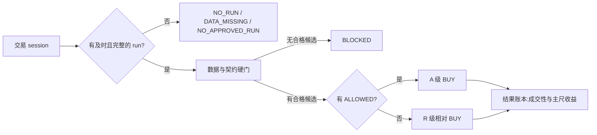

# 每日相对 BUY 可靠性 Implementation Plan

> **For agentic workers:** REQUIRED SUB-SKILL: Use superpowers:subagent-driven-development (recommended) or superpowers:executing-plans to implement this plan task-by-task. Steps use checkbox (`- [ ]`) syntax for tracking.

**Goal:** 在不放松数据、契约和明确负面硬门的前提下，让每个成功交易日尽量稳定地产出 1 只可解释的相对 BUY；若硬门后确实没有候选，则诚实输出 BLOCKED。

**Architecture:** 把目标拆成四层：运行层先证明报告按时完整交付；L3 层保证所有补位路径遵守同一资格不变量；L3/L4/E6 共用 `T+1 收盘买 → T+2 开盘卖` 主尺；E6 将候选范围、排序和 A/R 展示分开验证。生产排序不凭 15 份旧报告直接改，先累积新版真实运行，再做预注册的样本外比较。

**Tech Stack:** Python 3.12、pandas、pytest、`uv run --no-sync`、Markdown agent contracts、确定性 scan ledger；所有命令显式设置 `AUTORESEARCH_ENGINE=codex`。

**Evidence:** 本计划依据本机审计目录 `reports_codex/research/daily_buy_audit_20260927/`，其中 [审计报告](../../../reports_codex/research/daily_buy_audit_20260927/report.md)、[逐场证据](../../../reports_codex/research/daily_buy_audit_20260927/evidence.json)和[受控复现](../../../reports_codex/research/daily_buy_audit_20260927/probes.json)只作开发证据，不作为收益回测。

---

## 1. 产品口径与边界

### 1.1 成功交易日

“成功交易日”必须同时满足：

1. 对应交易 session 有一个及时可用的 `SELECTED` run；
2. run 完成到正式发布，`verify-report --level full` 的 canonical 报告绑定通过；
3. E6 决策文件存在且可读；
4. 运行没有日级 `data_a` 或发布契约失败。

`NO_RUN`、`DATA_MISSING`、`NO_APPROVED_RUN` 不属于 0-BUY 日。它们分别是运行、证据或审批问题，不代表系统做出了空仓判断。

### 1.2 BUY 规则

- A 级：硬门全过，非持仓，卡片明确写“允许入场”。
- R 级：硬门全过，非持仓，但入场为“条件”或“未知”；A 级为空时，选相对最优的一只。
- BLOCKED：A/R 两池都为空。
- 每日最多 1 只 BUY；本计划不启用第二只。

目标是“有效候选存在时尽量每天选出相对最优”，不是“无论数据质量和风险都必须报一只”。

### 1.3 明确不做

- 不降低 `data_a`、`contract`、`no_redflag`、`rebalance_close` 硬门。
- 不把 `PROHIBITED`、Sell、Underweight 或已知红灯票改成 BUY。
- 不新增研究 agent、召回渠道、闭环学习系统或第二套账本。
- 不用旧卡静态重算的 14/15 结果宣称胜率、收益或新版覆盖率。
- 不因合成测试通过自行把 `session_v1` 从 PILOT 切为默认；仍遵守双宿主 REAL_SESSION proof 门。
- 不在本计划中调整 `MAIN_RULER`、`CHASE_1D_PCT` 或卡片执行线阈值。

## 2. 已知事实

### 2.1 历史样本

| 引擎 | 留存 E6 决策 | 原始有 BUY | 版本 |
|---|---:|---:|---|
| Codex | 7 | 5 | 全部 `e6.v3.0` |
| Claude | 8 | 2 | 全部 `e6.v3.0` |

Claude 的 7 场 9 月报告中：2 场已有 BUY，2 场有通过硬门的候选但被旧 `composite` 池挡住，3 场被数据或卡片契约故障阻断。该拆分说明旧零 BUY 不能统一解释为“策略门太严”。

将当前规则静态应用到旧输入时，Codex 7/7、Claude 7/8 产生 R 级 BUY。该检查没有重新生成 L0–L4，15 份输入均缺 `index_events.csv`，旧卡大量解析成 UNKNOWN，因此只能证明软件选择空间，不能证明交易效果。

### 2.2 当前代码状态（2026-09-27）

- 前奏中继壳被终止的问题已有 `autoresearch/trace/detach.py` 和 `tests/trace/test_detach.py::test_job_survives_when_caller_process_tree_is_killed`；剩余工作是真实 scan 验收。
- E6 当前版本为 `e6.v4.1`，生产配置目标是 `pool=finalists`、A/R 分级和调样门。
- 当前工作树正在进行 scan 配置单源改造；实施本计划前必须先把该改造收敛到一个可复现提交，再建立独立 worktree。
- L3 追高不变量在当前工作树仍可复现两种绕过：
  - 被剔除的 `trend` 追高票可被后续 lane quota 重新换回 finalist；
  - chase 回填会选中另一只同样超过阈值的 bench 票。
- L3 仍写“明天开盘真金买入”，L4 和主尺则规定 `T+1 收盘买 → T+2 开盘卖`。
- `buyability.wall` 描述的是 A 级形成路径；R 级 BUY 存在时仍可能是 `cards_refused`。当前 brief 把 R 级统一写成“卡面无买点”，无法区分 CONDITIONAL 与 UNKNOWN。

## 3. 状态流与唯一责任



| 层 | 唯一责任 | 主要文件 |
|---|---|---|
| 运行 | 生成完整、可验证、及时的报告 | `autoresearch/trace/detach.py`、`autoresearch/session_agent/`、`autoresearch/scan/scan_run.py` |
| L3 合并 | 形成 finalist，并保持追高、确信度、行业帽等不变量 | `autoresearch/scan/l3/merge.py` |
| 研究契约 | 用统一隔夜时点表达 conviction、机制和入场 | `.claude/agents/l3-rank.md`、`.claude/agents/l4-card.md` |
| E6 | 只在合格池中选 A 或 R；记录实际排序依据 | `autoresearch/scan/relative_buy.py` |
| 展示 | 说明 BUY 类型、条件和 A 级缺口 | `autoresearch/scan/relative_facts.py`、`brief.py`、`buyability.py` |
| 评价 | 按 session 去重，分开交付率、覆盖率、成交性、收益 | `autoresearch/scan/ledger_views.py`、`populations.py`、`outcome.py` |

---

## 4. 实施任务

### Task 0: 固定实现基线并验证现有运行修复

**Files:**
- Read: `autoresearch/trace/detach.py`
- Read: `tests/trace/test_detach.py`
- Read: `docs/session-agent/acceptance.md`
- Create after real run: `docs/research/2026-09-27-daily-buy-real-session-acceptance.md`

- [ ] **Step 1: 在当前配置改造提交完成后建立独立 worktree**

Run:

```bash
export AUTORESEARCH_ENGINE=codex
git status --short
git log -1 --oneline
git worktree add ../TradingAgents-daily-buy -b feat/daily-relative-buy HEAD
```

Expected: 记录执行基线 commit；`../TradingAgents-daily-buy` 建立在配置改造的最终提交上，且不包含当前用户工作树中的未提交文件。若仍有并行改动，先结束当前配置工作，再执行 `git worktree add`。

- [ ] **Step 2: 验证 detach 与 workflow 接线**

Run:

```bash
export AUTORESEARCH_ENGINE=codex
uv run --no-sync python -m pytest -q tests/trace/test_detach.py tests/scan/test_forensic_workflow.py
```

Expected: 全绿；其中必须执行“caller 进程树被杀后 detached job 仍完成”的测试。

- [ ] **Step 3: 完成一场新版真实 scan 并验证 canonical 报告**

按 [session agent 操作说明](../../session-agent/README.md)执行最近一个数据完备的交易日，完成 `begin → next → claim → execute/宿主推理 → submit → finish`。`finish` 后对机器返回的 canonical 路径执行：

```bash
export AUTORESEARCH_ENGINE=codex
uv run --no-sync python -m autoresearch.session_agent verify-report \
  --report-path reports_codex/scan/20260925-0925_2200 \
  --expected-run-id 20260925-0925_2200 \
  --level full
```

Expected: `report_covered=true`、`publication_ok=true`、`orchestration_verified=true`、`completeness_ok=true`。实际 run id 和 canonical 路径必须取自当场 `finish` 返回；上面的 `20260925-0925_2200` 是该验收记录的固定示例，不得在真实执行时猜路径。

- [ ] **Step 4: 记录真实验收结果**

`docs/research/2026-09-27-daily-buy-real-session-acceptance.md` 必须记录：baseline commit、engine、analysis date、run id、canonical report、四个验证布尔值、E6 rule version、pool、tiering、rebalance source、BUY/BLOCKED、失败阶段。没有通过时保留失败 capsule，不绕过 GATE1/GATE4。

### Task 1: 修复 L3 追高候选被回填或配额重新引入

**Files:**
- Modify: `autoresearch/scan/l3/merge.py`，函数 `_drop_and_backfill`、`_swap_lane_quota`、`merge_l3_finalists_v3`
- Test: `tests/scan/test_l3_merge_v3.py`

- [ ] **Step 1: 写两个失败测试**

把以下测试追加到 `tests/scan/test_l3_merge_v3.py` 的 chase 段：

```python
def test_chase_backfill_skips_another_chase_candidate():
    judged = pd.DataFrame([
        _pick("000001", 70, lane="value", finalist=True, pct_1d=10.0, sector="A"),
        _pick("000002", 68, lane="value", finalist=True, pct_1d=0.0, sector="B"),
        _pick("000003", 60, lane="value", finalist=False, pct_1d=11.0, sector="C"),
        _pick("000004", 58, lane="value", finalist=False, pct_1d=0.0, sector="D"),
    ])
    fin, bench = merge_l3_finalists_v3(judged, budget=2, finalist_max=2)
    assert set(fin["code"]) == {"000002", "000004"}
    assert fin.set_index("code").loc["000004", "guard"] == "chase_backfill"
    assert bench.set_index("code").loc["000003", "guard"] != "chase_backfill"


def test_lane_quota_cannot_reintroduce_a_chase_candidate():
    judged = pd.DataFrame([
        _pick("000001", 70, lane="trend", finalist=True, pct_1d=10.0, sector="A"),
        _pick("000002", 60, lane="value", finalist=True, pct_1d=0.0, sector="B"),
        _pick("000003", 59, lane="value", finalist=True, pct_1d=0.0, sector="C"),
        _pick("000004", 58, lane="value", finalist=False, pct_1d=0.0, sector="D"),
    ])
    fin, bench = merge_l3_finalists_v3(judged, budget=3, finalist_max=3)
    assert "000001" not in set(fin["code"])
    assert bench.set_index("code").loc["000001", "guard"] == "chase_1d"
```

- [ ] **Step 2: 跑红，确认两个不同入口都能复现**

Run:

```bash
export AUTORESEARCH_ENGINE=codex
uv run --no-sync python -m pytest -q tests/scan/test_l3_merge_v3.py \
  -k "chase_backfill_skips or lane_quota_cannot"
```

Expected: 两个测试都 FAIL；第一个错误选中 `000003`，第二个重新选中 `000001`。

- [ ] **Step 3: 建立所有补位路径共享的资格谓词**

在 `autoresearch/scan/l3/merge.py` 的 `_guarded_lanes_before` 后加入：

```python
_DISQUALIFIED_REPLACEMENT_GUARDS = frozenset({"chase_1d", "lt55", "dup"})


def _replacement_eligible(m: pd.DataFrame, conv: pd.Series, i: int, *,
                          qualify_conv: float, chase_1d_pct: float) -> bool:
    """所有 backfill/quota 补位共用的 finalist 资格门。"""
    if conv.loc[i] < qualify_conv:
        return False
    if str(m.loc[i, "guard"] or "") in _DISQUALIFIED_REPLACEMENT_GUARDS:
        return False
    if "pct_1d" not in m.columns:
        return True
    pct = pd.to_numeric(pd.Series([m.loc[i, "pct_1d"]]), errors="coerce").iloc[0]
    return bool(pd.isna(pct) or pct < chase_1d_pct)
```

把 `_drop_and_backfill` 内部的局部 `_DISQUALIFIED` 与 pool 条件替换为调用该函数；`chase_1d_pct` 从同一次 `guards_cfg()` 取得。把 `_swap_lane_quota` 的 `bench_pool` 也改成调用该函数。两条路径必须共用这个函数，禁止各抄一份追高判断。

- [ ] **Step 4: 在所有 lane quota 之后再执行一次最终 chase 不变量**

在 `merge_l3_finalists_v3` 中，lowturn quota 后、sector cap 前，复用 `_drop_and_backfill`：

```python
    if "pct_1d" in m.columns:
        _p1 = pd.to_numeric(m["pct_1d"], errors="coerce")
        fin_idx = _drop_and_backfill(
            m, conv, fin_idx,
            [i for i in sorted(fin_idx) if _p1.loc[i] >= g["chase_1d_pct"]],
            "chase_1d", "chase_backfill", sector_cap=g["sector_cap"])
```

这一步是最终防线：以后新增配额逻辑即使忘记预过滤，也不能把追高票留在 finalist。

- [ ] **Step 5: 跑目标测试和 L3 相关测试**

Run:

```bash
export AUTORESEARCH_ENGINE=codex
uv run --no-sync python -m pytest -q \
  tests/scan/test_l3_merge_v3.py \
  tests/scan/test_composite_seat.py \
  tests/scan/test_config_l3_knobs.py
```

Expected: 全绿；边界 `pct_1d == chase_1d_pct` 仍被剔除，NaN 仍按既有契约放行，席位不足时允许少席而不塞入失格票。

- [ ] **Step 6: 提交独立 bugfix**

```bash
git add autoresearch/scan/l3/merge.py tests/scan/test_l3_merge_v3.py
git commit -m "fix(l3): keep chase guard invariant across backfill and lane quotas"
```

### Task 2: 统一 L3 与 L4 的隔夜交易时点

**Files:**
- Modify: `.claude/agents/l3-rank.md`
- Test: `tests/test_agent_defs.py`
- Verify only: `.claude/agents/l4-card.md`
- Modify: `docs/flow-handbook.md` 的 L3 能力卡与时间口径说明

- [ ] **Step 1: 先写契约测试**

在 `tests/test_agent_defs.py::test_l3_rank_anchors_present` 后追加：

```python
def test_l3_rank_uses_the_same_c1_to_o2_horizon_as_l4():
    agent = _agent_text("l3-rank")
    assert "T+1 收盘" in agent
    assert "T+2 开盘" in agent
    assert "明天开盘真金买入" not in agent
```

- [ ] **Step 2: 跑红**

Run:

```bash
export AUTORESEARCH_ENGINE=codex
uv run --no-sync python -m pytest -q tests/test_agent_defs.py \
  -k "l3_rank_uses_the_same or l3_rank_anchors_present"
```

Expected: 新测试因旧文案“明天开盘真金买入”而 FAIL。

- [ ] **Step 3: 修改 L3 行为化定义**

把 `.claude/agents/l3-rank.md` 的第⑥维和 conviction 定义改成：

```markdown
⑥ **隔夜兑现机制**:thesis 必须回答“为什么到 T+1 尾盘仍值得按执行线买入、T+2 开盘谁来承接”;机制与②资金/④催化共振才算硬。

`conviction`(0-100,**隔夜 c1→o2 行为化定义**):≥70 = 我能说明 T+1 尾盘仍有买入理由、执行线可满足，且愿意在 T+1 收盘新开仓，目标在 T+2 开盘兑现(**每日 ≥70 至多 ~5 只**);50-69 = 值得 L4 深核但我不背书;<50 不该出现在入选里。
```

同步修改 `mechanism` 字段说明，要求写明 `T+1 尾盘入场理由 + T+2 开盘承接者`。不要改 L4 的主尺和执行线。

- [ ] **Step 4: 更新手册并跑契约测试**

Run:

```bash
export AUTORESEARCH_ENGINE=codex
uv run --no-sync python -m pytest -q tests/test_agent_defs.py tests/scan/test_l3_profile_lint.py
```

Expected: 全绿；`rg -n "明天开盘真金买入" .claude/agents docs/flow-handbook.md` 无输出。

- [ ] **Step 5: 提交契约对齐**

```bash
git add .claude/agents/l3-rank.md tests/test_agent_defs.py docs/flow-handbook.md
git commit -m "docs(scan): align L3 conviction with the c1-to-o2 trading horizon"
```

### Task 3: 分开表达“有无 BUY”和“为何没有 A 级”

**Files:**
- Modify: `autoresearch/scan/relative_facts.py`
- Modify: `autoresearch/scan/brief.py`
- Test: `tests/scan/test_relative_facts.py`
- Test: `tests/scan/test_brief.py`

不改变 `_buyability.json` 的五态词表，不改变 E6 选择，不新增硬门。只修读模型和文案。

- [ ] **Step 1: 让共享读模型携带赢家的入场立场**

在 `relative_facts()` 返回值中加入：

```python
        "entry_stance": ((top or {}).get("card_context") or {}).get("entry_stance"),
```

在 `tests/scan/test_relative_facts.py::_doc` 的第一只候选增加：

```python
"card_context": {"entry_stance": "CONDITIONAL"},
```

并在 `test_buy_fields` 断言：

```python
    assert out["entry_stance"] == "CONDITIONAL"
```

- [ ] **Step 2: 为 R 级三态文案写失败测试**

在 `tests/scan/test_brief.py` 的 A/R 段增加两个测试，复用现有 `scan` fixture：

```python
def test_r_tier_conditional_is_labeled_as_condition_pending(scan):
    doc = json.loads((scan / brief.DECISION_FILENAME).read_text(encoding="utf-8"))
    doc["mode"] = "active"
    doc["buys"][0].update({"tier": "R", "basis": "relative_forced"})
    doc["tiering"], doc["tier_counts"] = True, {"A": 0, "R": 2}
    winner = doc["buys"][0]["code"]
    next(x for x in doc["candidates"] if x["code"] == winner)["card_context"] = {
        "entry_stance": "CONDITIONAL"}
    (scan / brief.DECISION_FILENAME).write_text(json.dumps(doc, ensure_ascii=False), encoding="utf-8")
    line = next(x for x in brief.build(scan, run_folder=_RUN)["markdown"].splitlines()
                if "relative BUY" in x)
    assert "R 级·条件待满足·相对最优" in line
    assert "卡面无买点" not in line


def test_r_tier_unknown_is_labeled_as_unconfirmed_entry(scan):
    doc = json.loads((scan / brief.DECISION_FILENAME).read_text(encoding="utf-8"))
    doc["mode"] = "active"
    doc["buys"][0].update({"tier": "R", "basis": "relative_forced"})
    doc["tiering"], doc["tier_counts"] = True, {"A": 0, "R": 2}
    winner = doc["buys"][0]["code"]
    next(x for x in doc["candidates"] if x["code"] == winner)["card_context"] = {
        "entry_stance": "UNKNOWN"}
    (scan / brief.DECISION_FILENAME).write_text(json.dumps(doc, ensure_ascii=False), encoding="utf-8")
    line = next(x for x in brief.build(scan, run_folder=_RUN)["markdown"].splitlines()
                if "relative BUY" in x)
    assert "R 级·入场信息未确认·相对最优" in line
    assert "卡面无买点" not in line
```

- [ ] **Step 3: 根据 `entry_stance` 渲染 R 级**

在 `brief._buy_lines` 中把 R 级固定标签替换为：

```python
    elif tier == "R":
        stance = rel.get("entry_stance")
        qualifier = {
            "CONDITIONAL": "条件待满足",
            "UNKNOWN": "入场信息未确认",
        }.get(stance, "入场未获明确允许")
        tag = tag.replace("✅", "🟥") + f" · **R 级·{qualifier}·相对最优**"
```

`PROHIBITED` 在 tiering 开启时已被硬门排除；这里的 fallback 只服务旧 schema 或防御性展示，不改变门。

- [ ] **Step 4: 将 buyability 展示明确命名为 A 级状态**

把 `brief._buyability_line` 的首段渲染改成：

```python
    gloss = {
        "cards_silent": "(没有卡写入场行)",
        "cards_refused": "(入场未明确允许)",
    }.get(wall, "")
    head = ("A 级状态:**已形成**" if wall == "none"
            else f"A 级缺口:**{wall}**{gloss}")
    text = (f"{head} · tiering {tier(ba.get('tiering'))}"
```

其余菜单、卡片和硬门计数保持原样。同步更新 `tests/scan/test_brief.py` 中所有“不可买归因”字面断言：R 级 BUY 可以存在，此行只说明为什么没有 A 级。

- [ ] **Step 5: 跑读模型和报告测试**

Run:

```bash
export AUTORESEARCH_ENGINE=codex
uv run --no-sync python -m pytest -q \
  tests/scan/test_relative_facts.py \
  tests/scan/test_buyability.py \
  tests/scan/test_brief.py
```

Expected: 全绿；A 级仍用绿色明确展示，R-CONDITIONAL 与 R-UNKNOWN 文案不同，BLOCKED 仍显示硬门原因。

- [ ] **Step 6: 提交展示语义修复**

```bash
git add autoresearch/scan/relative_facts.py autoresearch/scan/brief.py \
  tests/scan/test_relative_facts.py tests/scan/test_brief.py
git commit -m "fix(report): separate relative BUY from A-tier formation reasons"
```

### Task 4: 用现有账本建立三层验收读数

**Files:**
- Verify: `autoresearch/scan/ledger_views.py`
- Verify: `autoresearch/scan/populations.py`
- Verify: `autoresearch/scan/outcome.py`
- Create: `docs/research/2026-09-27-daily-buy-acceptance-readout.md`

本任务优先复用现有 `runs.csv`、`session_calendar.csv`、`stage_rulers.csv`，不新建账本。

- [ ] **Step 1: 重建既有视图和评价表**

Run:

```bash
export AUTORESEARCH_ENGINE=codex
uv run --no-sync python -m autoresearch.scan.ledger_views build
uv run --no-sync python -m autoresearch.scan.populations build
```

Expected: `reports_codex/scan/_ledger/views/runs.csv`、`session_calendar.csv` 和 populations 读数生成；视图明确保留 `SELECTED / NO_RUN / NO_APPROVED_RUN / DATA_MISSING`。

- [ ] **Step 2: 在读数文档中固定三个分母**

`docs/research/2026-09-27-daily-buy-acceptance-readout.md` 使用下列定义：

```text
按时交付率 = SELECTED session 数 / 全部可信交易 session 数
BUY 覆盖率 = n_buy > 0 的 SELECTED session 数 / SELECTED session 数
A 级占比   = n_buy_a > 0 的 BUY session 数 / BUY session 数
```

收益段只统计 `status=MATURE`、买腿可成交且 actionability 合格的 BUY；主指标为成本前后 `gap_c1_o2`，同时报告相对市场、P10/最差日和样本数。不得把 `NO_RUN` 填成 0-BUY。

- [ ] **Step 3: 设置成熟门**

覆盖率从第一场新版真实 run 起逐日记录；排序效果在至少 20 个 `SELECTED` session 且至少 10 个成熟可成交 BUY 前只展示样本，不下结论。A/R 分开报告。

### Task 5: 拆开“候选池扩大”和“排序变化”的实验

**Files:**
- Create: `docs/research/2026-09-27-e6-ranking-experiment.spec.json`
- Create: `docs/research/2026-09-27-e6-ranking-experiment.md`
- Modify only after experiment passes: `autoresearch/scan/relative_buy.py`
- Test only after experiment passes: `tests/scan/test_relative_buy.py`

本任务先立实验，不立即改生产排序。`pool=finalists` 解决候选参与范围；四面 Borda 是否优于 `target_align` 是独立问题。

- [ ] **Step 1: 冻结实验族**

spec 固定以下四组，同一批 session 共用硬门、A/R 分级、持仓排除和主尺：

| 组 | 候选范围 | 排序 | 用途 |
|---|---|---|---|
| A | composite | target_align | 旧规则参考 |
| B | finalists | target_align | 单独测扩大候选范围 |
| C | finalists | 当前四面 Borda | 当前新版 |
| D | finalists | 只以 eligible 候选计算分位的 Borda | 测无资格候选对排序的影响 |

`2026-09-27-e6-ranking-experiment.spec.json` 写入以下完整预注册配置；`end_session=null` 表示只由成熟门结束采集，不表示允许执行者事后挑截止日：

```json
{
  "schema_version": 1,
  "experiment_id": "e6-ranking-20260927",
  "registered_at": "2026-09-27",
  "start_session": "2026-09-28",
  "end_session": null,
  "decision_rule_version": "e6.v4.1",
  "primary_ruler": "gap_c1_o2",
  "relative_ruler": "rel_gap_market",
  "round_trip_cost_pp": 0.15,
  "split": {"kind": "chronological", "development_share": 0.6, "evaluation_share": 0.4},
  "minimums": {"selected_sessions": 20, "mature_buy_observations_per_arm": 10},
  "arms": [
    {"id": "A", "pool": "composite", "ranking": "target_align", "reference_population": "all_dispatched"},
    {"id": "B", "pool": "finalists", "ranking": "target_align", "reference_population": "all_dispatched"},
    {"id": "C", "pool": "finalists", "ranking": "borda", "reference_population": "all_dispatched"},
    {"id": "D", "pool": "finalists", "ranking": "borda", "reference_population": "eligible_only"}
  ],
  "primary_metric": "mean_cost_adjusted_gap_c1_o2_minus_market",
  "safety_metrics": ["p10_cost_adjusted_gap_c1_o2", "worst_day_cost_adjusted_gap_c1_o2"],
  "diagnostics": ["buy_coverage", "exec_ok_share", "sector_concentration", "winner_stability"],
  "promotion": {
    "primary_improvement_gt_pp": 0.0,
    "max_p10_degradation_pp": 0.20,
    "max_worst_day_degradation_pp": 0.20,
    "single_day_contribution_share_lt": 0.50,
    "single_sector_contribution_share_lt": 0.50
  },
  "insufficient_sample_status": "INSUFFICIENT_SAMPLE"
}
```

- [ ] **Step 2: 使用按时间切分的样本外比较**

前 60% session 只用于检查数据与实现；后 40% 才评价。主判据：成本后 `gap_c1_o2` 相对市场均值提高，且 P10/最大单日损失不恶化超过 0.20pp。次判据：BUY 覆盖率、成交条件满足率、结果对候选集合扰动的稳定性。

- [ ] **Step 3: 设置生产变更门**

只有同时满足以下条件才修改 `relative_buy.py`：

1. 至少 20 个 SELECTED session；
2. 每个比较组至少 10 个成熟、可成交的 BUY；
3. 胜出组的成本后主尺优于当前组；
4. P10 与最大损失不越过预注册容忍线；
5. 结果不是由单日或单行业贡献；
6. 变更后 `rule_version` 或 `rule_params_sha256` 能区分历史。

若样本门未满足，生产继续使用当前排序；实验文档写 `INSUFFICIENT_SAMPLE`，不得选择样本内最好组上线。

### Task 6: 整体验证与文档同步

**Files:**
- Modify: `docs/flow-handbook.md`
- Modify when behavior changes: `.claude/skills/scan-market/STAGES.md`
- Verify: `docs/ops/scan-ops.md`

- [ ] **Step 1: 跑目标回归集**

Run:

```bash
export AUTORESEARCH_ENGINE=codex
uv run --no-sync python -m pytest -q \
  tests/trace/test_detach.py \
  tests/scan/test_l3_merge_v3.py \
  tests/scan/test_composite_seat.py \
  tests/scan/test_relative_buy.py \
  tests/scan/test_relative_facts.py \
  tests/scan/test_buyability.py \
  tests/scan/test_brief.py \
  tests/scan/test_outcome_buy_tier.py \
  tests/scan/test_ledger_views.py \
  tests/scan/test_populations.py \
  tests/test_agent_defs.py
```

Expected: 全绿。

- [ ] **Step 2: 跑配置标准和全量测试**

Run:

```bash
export AUTORESEARCH_ENGINE=codex
uv run --no-sync python -m autoresearch.scan.config_standard
uv run --no-sync python -m pytest -q
```

Expected: 配置标准通过；全量测试通过。完成后无需重复跑同一套测试，除非又修改了相关代码。

- [ ] **Step 3: 更新手册的最终口径**

手册必须明确：

- 成功交易日、SELECTED 与真实 0-BUY 的区别；
- A / R / BLOCKED 三态；
- R-CONDITIONAL 与 R-UNKNOWN 的展示差异；
- L3/L4 共用 `T+1 收盘买 → T+2 开盘卖`；
- `buyability.wall` 是 A 级形成诊断，不是“有无任何 BUY”；
- 候选池和排序实验是两个独立变量；
- 排序没有通过样本外门前不改变生产。

---

## 5. 验收标准

| 类别 | 必须满足 |
|---|---|
| 运行 | detach 回归通过；至少一场新版真实 run 到达 canonical full verification |
| L3 | 任何最终 finalist 的 `pct_1d` 都小于生效的 chase 阈值，NaN 延续既有放行契约 |
| 时点 | L3、L4、E6 说明和结果账本均使用 `T+1 收盘 → T+2 开盘` |
| 决策 | 有合格非持仓候选时最多 1 个 BUY；A 优先，A 空则 R；无候选才 BLOCKED |
| 展示 | R-CONDITIONAL、R-UNKNOWN、A、BLOCKED 四种情况可一眼区分 |
| 归因 | NO_RUN、DATA_MISSING、运行失败、硬门否决分别计数 |
| 评价 | session 去重；只使用当时可得数据；主尺、成交性、成本、样本数同时披露 |
| 风险 | 未放松现有硬门，未增加第二只 BUY，未改变主尺 |

## 6. 回滚边界

- Task 1 是资格 bugfix：如出现回归，只回滚该提交；不通过调高 chase 阈值补救。
- Task 2 是契约文案：回滚不会改变确定性 E6，但会恢复时点不一致，应阻止新版研究运行直到修正。
- Task 3 是读模型和展示：回滚不改变买单，但会恢复语义混淆；机器决策文件保持兼容。
- Task 5 的任何排序变化必须独立提交，并携带规则版本或参数哈希；实验失败时无需回滚生产，因为默认不切换。
- 运行层仍保留失败 capsule；不得通过删除失败现场或手改 canonical 报告制造通过。

## 7. 推荐提交顺序

1. `fix(l3): keep chase guard invariant across backfill and lane quotas`
2. `docs(scan): align L3 conviction with the c1-to-o2 trading horizon`
3. `fix(report): separate relative BUY from A-tier formation reasons`
4. `docs(research): record daily BUY acceptance readout`
5. 排序实验通过后才允许出现 E6 排序提交

每个提交都能单独测试和回滚。Task 0 的真实运行验收是进入策略实验的前置条件，不与业务规则修改混在一个提交中。
