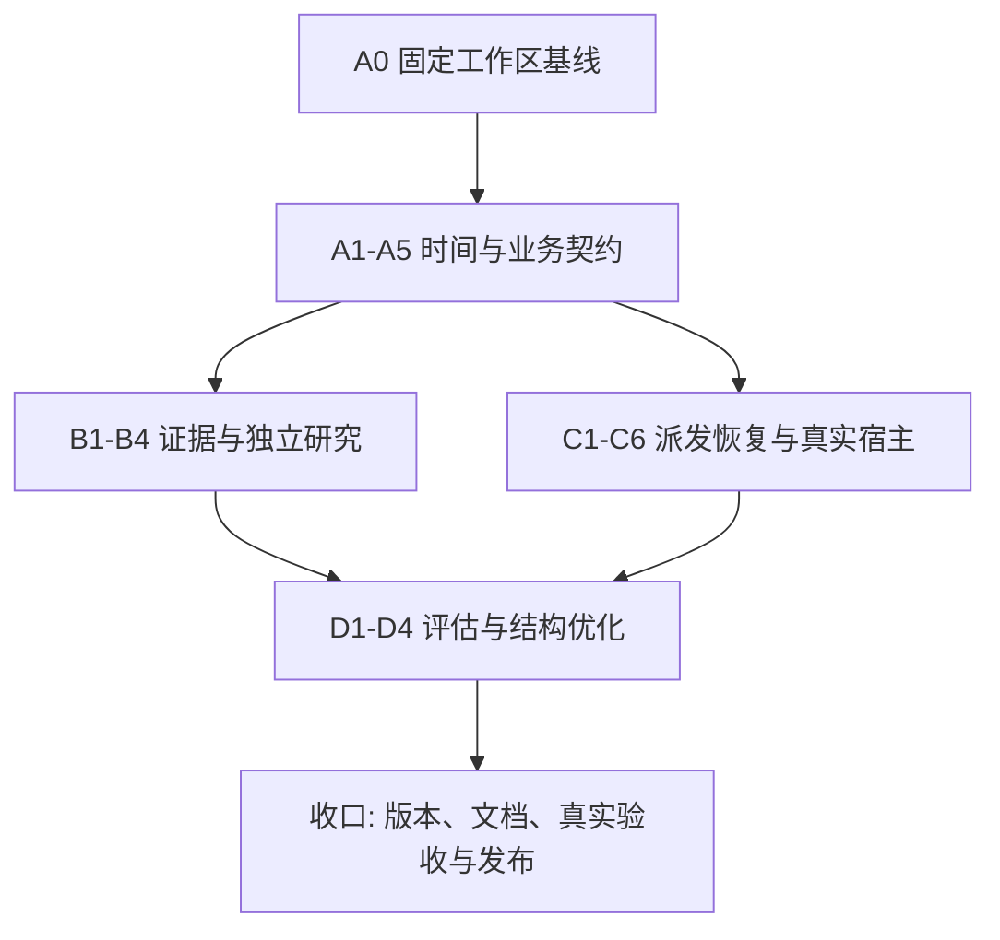

# Agent Skills 研究可靠性与编排收敛开发文档

> **For agentic workers:** REQUIRED SUB-SKILL: Use superpowers:subagent-driven-development (recommended) or superpowers:executing-plans to implement this plan task-by-task. Steps use checkbox (`- [ ]`) syntax for tracking.

**Goal:** 以 `gap_c1_o2`（T+1 收盘买 → T+2 开盘卖）统一全部交易研究，修复证据传递、业务校验和任务派发缺口，并用现有研究工具验证 agent 的增量价值与执行效果。

**Architecture:** 保留“确定性数据与计算 → 有界研究推理 → 确定性决策与发布”的分工；复用现有 ResearchCard、claim binding、execution、session_v1 和研究实验契约。按四个开发批次交付，业务行为变化采用明确版本与受控验证，宿主默认入口继续由既有真实验收门决定。

**Tech Stack:** Python 3.12、pandas、pytest、Markdown 角色契约、JSON/JSONC、现有 Claude/Codex 订阅会话、`uv run --no-sync`。

**状态:** 软件开发、独立审查与全仓回归已完成，详见 [全计划收口记录](../../research/2026-09-30-agent-skills-completion-readout.md)。真实双宿主与未来观察仍待证据。历史分批范围与证据：逐任务范围、代码入口、实际验证和未完成项见 [第一批记录](../../research/2026-09-30-agent-skills-implementation-readout.md) 、[第二批记录](../../research/2026-09-30-agent-skills-batch2-readout.md) 、[第三批记录](../../research/2026-09-30-agent-skills-batch3-readout.md) 、[第四批记录](../../research/2026-09-30-agent-skills-batch4-readout.md) 、[第五批记录](../../research/2026-09-30-agent-skills-batch5-readout.md) 、[第六批记录](../../research/2026-09-30-agent-skills-batch6-readout.md) 与 [第七批记录](../../research/2026-09-30-agent-skills-batch7-readout.md)。本文的步骤清单仍是完整验收要求，不能据分批交付推定全计划完成或投资效果改善。

**用户裁定:** 2026-09-30，用户确认“都按决策卡与主尺”，其余按本轮审计建议执行，要求交付详细开发文档。

**审计基线:** `HEAD=431d5dc01c539c1a5d68bdd2a7f8d80379eda110` 加当前未提交工作区改动。HEAD 单独不能复现本次审计；尤其配置单源、runner、角色提示词均存在未提交修改。

---

## 全计划收口进度（2026-09-30）

用户要求继续完成全部开发。以下清单按当前源码核对；历史分批交付不代替本表的收口要求。

| 工作项 | 当前状态 | 验证与边界 |
|---|---|---|
| 取消确认回归 | 软件完成、独立审查通过 | 暂态 EPERM 有界重查，持续不可观测仍未确认 |
| A1 / A4 | 软件完成、独立审查通过 | 跨市场卡身份、情景入场分母、共用 rubric、未知时钟限制执行 |
| B2 | 软件完成、独立审查通过 | 已知断言人口、用途/必要性映射及来源结果进入有效维度与门 |
| C6 软件 | 软件完成、独立审查通过 | 签名、原生调用与 hook 证据核对；无真实证明仍 PENDING |
| D1 | 软件完成、独立审查通过 | 前向冻结、生产导出、阶段比较、实际执行和效率分组 |
| D2 | 软件完成、独立审查通过 | 宏观六组候选；默认仍 serial21 |
| D3 | 软件完成、独立审查通过 | 确定性地形、来源冲突/时间绑定、分类和复用失效 |
| D4 | 软件完成、独立审查通过 | 三类事实、维护历史、发布锁内双哈希防覆盖、技能与模板 |
| 集成与交付 | 软件验收完成 | 8,390 passed / 12 skipped / 4 subtests passed；完整清单与源码哈希对账，交付记录见收口文档 |
| 真实双宿主 / 前向观察 | 证据待积累 | 工作流 0/28、边界 0/22；60 个分析交易日及标签成熟尚待真实观察 |

最终实现与逐项验收以 [全计划收口记录](../../research/2026-09-30-agent-skills-completion-readout.md) 为准。
下文保留批准时的详细规格清单；其中 `skills-gap-v2` 已由本轮明确的 `skills-gap-v3` 业务规则承接，
请求 schema v4 与跨市场卡身份各自版本化，旧版本语义不原位改写。清单包含真实宿主和未来观察要求，不能批量勾选为已完成。

开发保全基线与逐项日志位于 `context_codex/development/20260930-agent-skills-completion/`。
未来观察与真实宿主缺项单列，不阻止继续完成尚可实施的软件工作，也不以软件测试代填。

## 0. 阅读与执行顺序

1. 先读第 1 节的产品裁定和第 2 节的事实边界。
2. 按第 3 节的依赖图安排四个批次；每批拥有独立的测试与发布门。
3. 每个任务先补能暴露目标问题的测试，再实现、运行局部验证、审查差异、提交本任务文件。
4. 代码块中标为“新增接口”的 API 是本计划要求实现的接口；未标新增的模块和方法来自当前仓库。
5. 本文列出验收命令；哪些已实际执行及其结果，以开发进度与验证记录为准。
6. 文中示例证券、价格与消息均为测试夹具，不是投资判断。
7. 本文采用一份总文档、四个独立工作包，避免多份规格重复定义主尺、评级和发布语义。

## 1. 已确认的产品与研究裁定

### 1.1 唯一交易主尺

`D` 是行情分析所锚定的已结算交易日。`D1` 和 `D2` 必须由该标的所属交易日历取 D 之后的第一、第二个交易 session。

```text
信息截止 knowledge_cutoff
          ↓
D 已结算行情 → D1 运营截止前复核 → D1 收盘入场 → D2 开盘退出
                                      C1             O2

主尺 gross_gap = O2 / C1 - 1
```

- 四个 skill 的可执行交易结论、L3 mechanism、L4 情报、FULL/LITE 决策、情景收益与结果评价统一使用这条主尺。
- FULL/LITE 只表达研究深度。FULL 可以读完整财务与产业材料，交易持有期仍按主尺。
- 年报、产业周期、政策路径属于事实或背景假设；使用其支持本笔交易时，必须说明信息在 D1 收盘后至 D2 开盘的相关性。
- `SWING_RULER` 的既有影子产物可留作历史兼容和辅助观察；本项目工作包不将其接入评级、入场或正式 BUY。
- T+1/T+2 均指交易日，禁止用自然日加一/加二推算，必须覆盖跨周末与长假。
- A 股使用既有 trade_cal。美股使用其交易日历和交易所时区；无法证明日历或时间边界时输出 UNKNOWN。连续交易资产在没有既定 session 定义时只提供事实研究，不生成可执行隔夜结论。
- 已有持仓的实际入场日和成本按真实记录保留；持仓复核回答最近可执行退出窗口与风险，不把旧持仓伪造成 D1 新买入。

### 1.2 价格、收益与执行的区别

| 字段/概念 | 唯一解释 | 禁止混用 |
|---|---|---|
| analysis_price | D 的已核实参考价格 | 不作为实际买入价 |
| assumed_entry_price | 情景计算声明的假设 D1 买入价，可未知 | 不伪称未来 C1 已知 |
| entry_price_band | 可接受的入场区间，带依据和失效条件 | 不把任意现价涨跌幅改名为隔夜 EV |
| exit_price_scenario | D2 开盘价格情景 | 不混用 D2 收盘 |
| conditional_return | 出场情景价 / 假设入场价 − 1 | 分母未知时不输出精确百分比 |
| realized_return | 实际成交价与实际费用计算的收益 | 不由行情 open/close 冒充成交 |
| holding_window_breached | 计划退出未完成或发生自主延长 | 单列原因、持仓与损益，不计为按计划退出 |

卡面三种开盘分支统一为高开/平开/低开下的退出安排。涨跌停、停牌或成交失败时记录未成交与剩余仓位；不以“平开再等等”“高开留余仓”悄然延长策略。D2 开盘后继续持有的实际行为记入偏离与真实持仓账，不给主尺业绩补记理想成交。

14:45 等运营截止继续读取既有配置。截止时只能使用 last/high_so_far/low_so_far；最终收盘涨幅和收盘位置仅属于事后 EOD_PROXY。快照条件与收盘条件的差异必须在报告和评价中可见。

### 1.3 四种判断分别保留

| 判断 | Owner | 对外含义 |
|---|---|---|
| research_rating | 六维判断 + 三门 + `rubric_rating` | 本股研究评级 |
| entry_stance | 卡片入场契约与确定性约束 | ALLOWED / CONDITIONAL / PROHIBITED / UNKNOWN |
| relative_action | E6 硬门与排序 | A 级、R 级、BLOCKED；相对选择 |
| execution_outcome | 执行证据与成交账 | 未委托、未成交、部分成交、成交与损益 |

R 级相对 BUY 可以来自符合既定硬门的条件型候选，这项产品语义保留。明确禁止入场、数据/契约硬失败、Sell/Underweight 等仍按现行 E6 硬门处理。候选为空允许 BLOCKED，任务成功率和 BUY 数量分别评价。

### 1.4 本次授权与既有计划的关系

| 既有工作 | 本文处理 |
|---|---|
| 09-26 daily-engine 收敛 A/C 线 | 复用 runner、mailbox、headless、计量和发布；本文补能力接线、故障隔离与真实验收 |
| 09-26 双尺 B 线 | 交易决策口径以本次用户裁定为准；影子历史按原口径保留 |
| 09-27 daily-relative-buy 计划 | 合并其时间窗、L3 回填资格和 A/R 展示任务，避免重复实现 |
| 09-27 project-slimming 设计 | 本文 D 批承接任务合并与模板瘦身；先证明质量，再评价性能 |
| scan_config 单源改造 | 先保全当前改动；新增配置必须通过现有注册表和 config_standard |
| 09-06 research/claim/execution 计划 | 复用已存在的计算、证据、实验和执行模块，补生产消费点 |
| learning 层退役 | 继续“只记不学”；实验不自动回注 prompt、不自动改门或权重 |
| 既有规则观察窗 | 本次业务改动使用新版本、新窗口；旧窗口封存，不能把前后样本混作同一固定策略 |
| session_v1 PILOT | 按现有双宿主 REAL_SESSION proof 门切换，合成 PASS 不改变默认 |

本次批准覆盖以下有界优化，不视为授权新建通用法证框架、自动学习系统、额外付费模型接口或自动交易执行器。

## 2. 现状、证据与完成判据

### 2.1 审计发现登记

| ID | 静态事实/风险 | 主要证据文件 | 对应任务 |
|---|---|---|---|
| F01 | intel 与卡片交易窗口不同；EV 分母有歧义 | `.claude/agents/l4-intel.md`、`l4-card.md`、`common/ruler.py` | A1 |
| F02 | FULL 深度与长持有期混在一起 | `stock-research/SKILL.md`、`engine-playbook.md` | A1、B1 |
| F03 | STAGES 沿用旧尺的 IC/门价值强结论 | `scan-market/STAGES.md`、`research/edge_census.py` | A2 |
| F04 | FULL 评级/动作一致性缺口，宏观非法评级可回退 Hold | `session_agent/validation.py`、`macro/assemble.py` | A3 |
| F05 | 默认 MD 路线主要读取模型自报 rubric，机器重算接线不完整 | `scan/l4/rubric.py`、`card_io.py`、`self_review.py` | A4 |
| F06 | L3 约束、ins75、行业帽、补位规则优先级不一致 | `scan/l3/merge.py`、`.claude/agents/l3-rank.md` | A5 |
| F07 | FULL 综合节点缺显式关键输入，摘要链可能损失事实 | `session_agent/workflows/stock.py` | B1 |
| F08 | intel 断言侧车部分仍 binding=none | `scan/l4/intel_guard.py`、`news/claim_binding.py` | B2 |
| F09 | “独立初判”前已经暴露 L3 论点与 conviction | `scan/l4/prompts.py`、`context.py`、`dispatch.py` | B3 |
| F10 | 复核触发与正式 BUY 覆盖范围不同，SELL 折回文案有冲突 | `decision_finalize.py`、`ens_review.toml` | B4 |
| F11 | sector 双输入与 _only 冲突，FULL 角色派发不完整 | `session_agent/dispatch.py`、`executors/base.py` | C1 |
| F12 | 单票/复核失败影响全局汇合 | `runner.py`、`workflows/scan.py` | C2 |
| F13 | 迟到回执被挡，迟到文件写入仍有污染风险 | `executors/mailbox.py`、`service.py` | C3 |
| F14 | 输入 hook 弱于“只读本任务包”的文字承诺 | `scripts/hooks/agent_input_boundary.py` | C4 |
| F15 | 确定性 lane 与复核全局屏障限制流式调度 | `runner.py`、`workflows/scan.py` | C5 |
| F16 | 请求 effort 与宿主实际生效值可能不同 | `executors/base.py`、`.claude/agents/l3-rank.md` | C1、C6 |
| F17 | 多路召回/深核/evidence 排名存在重复偏好的可能 | `relative_buy.py`、`l4/rubric.py` | D1 |
| F18 | 宏观 21 段串行、行业纯字段转述有合并空间 | `workflows/macro.py`、`sector/brief.py` | D2、D3 |
| F19 | dossier 入口说明与实际能力不统一 | `CLAUDE.md`、`.claude/agents/dossier-init.md` | D4 |

F13、F17、F18 的影响大小需要故障实验或受控比较；本文不宣称已经观察到实际文件污染、收益损失或固定比例性能提升。

### 2.2 三组验收分开

1. **软件正确性：**契约、数值、业务状态、任务依赖、重试隔离的测试通过。
2. **宿主可运行性：**真实 Codex/Claude 独立上下文、工具、恢复、原文证据与 canonical 报告验证通过。
3. **研究有效性：**固定规则下的样本外/前向比较和执行评价。软件与宿主通过不等于盈利优势成立。

## 3. 四批依赖与责任边界



| 批次 | 目标 | 可独立完成的交付 |
|---|---|---|
| A | 统一问题定义与机器决策语义 | 新旧口径可区分；错误输出被识别；门与映射有唯一 owner |
| B | 关键证据可用，初判与复核的输入边界真实 | 输入包、来源绑定、两段初判、明确复核契约 |
| C | 同一入口可运行、可恢复、不会被迟到写入污染 | 支持矩阵、隔离尝试、局部恢复、真实验收 |
| D | 判断哪里值得花 token | 阶段实验、宏观任务合并、行业渲染、档案与文档收口 |

A5 与 B/C 的状态机改动不并发修改同一文件。`roles.py`、`dispatch.py`、`workflows/scan.py`、`validation.py`、配置注册表各设一个集成负责人；其他任务先交接口与测试，再由该负责人合入。实施者必须保留当前工作区其他人的修改。

## 4. 文件与能力的单一归属

| 责任 | 现有 owner | 本文允许的扩展 |
|---|---|---|
| 主尺与可交易标签 | `common/ruler.py`、`common/forward_returns.py` | 口径引用与一致性测试 |
| 时间/执行契约与计算 | `contracts/execution.py`、`common/execution_math.py`、`scan/exec_anchor.py` | DecisionFrame、入场假设与退出偏离 |
| 评级词表与格式 | `contracts/agent_output.py`、`agents/utils/rating.py` | 严格评级动作验证 |
| 六维与三门派生 | `scan/l4/rubric.py` | 接通生产消费 |
| 卡读写与展示 | `scan/l4/card_io.py`、`card_render.py`、`contracts/research_card.py` | 可辨版本的迁移和语义验证 |
| 来源与断言 | `news/catalog.py`、`claim_binding.py`、`claim_support.py`、`material_claims.py` | 关键断言的真实绑定 |
| 角色与任务输入 | `session_agent/roles.py`、`workflows/*.py`、`dispatch.py` | 明确输入图、角色支持矩阵 |
| 尝试/回执/发布 | `session_agent/service.py`、`store.py`、`executors/*.py` | 私有输出、有效尝试发布 |
| 研究实验 | `research/stage_value.py`、`robustness.py`、`probability_eval.py`、`execution_audit.py` | 现有实验族内的适配与读数 |
| 参数 | `contracts/scan_config.py` + `scan_config.jsonc` | 类型/默认/宿主/消费者/测试成套登记 |

历史 run、已经发布的卡片和报告不得原位改写成新规则。新代码读取旧 schema 时保留版本及未知状态。

---

## 5. 批 A：时间与业务契约

### A0. 固定当前工作区基线

**Files:** 读取 `AGENTS.md`、`CLAUDE.md`、本计划关联文件；记录实施基线到 `docs/research/2026-09-30-agent-skills-implementation-readout.md`（新增）。

- [ ] 运行以下只读命令，记录 HEAD、当前工作分支和相关未提交文件：

```bash
export AUTORESEARCH_ENGINE=codex
git rev-parse HEAD
git status --short
git diff --stat
```

- [ ] 由集成负责人保全并收敛现有配置单源等改动；不得 stash、reset 或整批提交无关用户修改。源码快照必须能复现“HEAD + 审计所见改动”。
- [ ] 在可复现基线上建立本工作的分支/独立 worktree；若基线尚未收敛，先写文档与独立测试，不从裸 HEAD 开始重做已存在功能。
- [ ] 基线验证只运行 A 批涉及的现有测试，记录既有失败。全量回归放在集成收口，失败不能靠删除测试消失。
- [ ] 提交本工作生成的文档/测试时显式列文件，禁止 `git add .`。

**验收:** readout 有 commit、相关工作区摘要、engine、测试命令/结果、既有失败清单；后续结果均绑定该版本。

### A1. 统一时间轴、FULL/LITE 期限和情景分母

**Modify:**
`autoresearch/contracts/execution.py`、`autoresearch/common/execution_math.py`、`autoresearch/scan/exec_anchor.py`、`autoresearch/scan/l4/prompts.py`、`autoresearch/session_agent/workflows/stock.py`、`autoresearch/session_agent/workflows/macro.py`、`autoresearch/session_agent/workflows/sector.py`、`autoresearch/contracts/artifacts.py`；
`.claude/agents/l3-rank.md`、`l4-intel.md`、`l4-card.md`；四个 skill 及对应 playbook。
**Tests:** 扩展 `tests/contracts/test_execution_contract.py`、`tests/common/test_execution_math.py`、`tests/session_agent/test_stock_lite_context.py`、`tests/test_agent_defs.py`。

- [ ] 在 `contracts/execution.py` 增加 DecisionFrame v1 的严格字段验证；在 common 层构建，交易日历由领域层注入，contracts 不向上 import。

```json
{
  "schema_version": 1,
  "analysis_session": "2026-09-14",
  "knowledge_cutoff": "2026-09-14T21:30:00+08:00",
  "venue": "XSHG",
  "timezone": "Asia/Shanghai",
  "ruler": "gap_c1_o2",
  "research_depth": "FULL",
  "usage": "standalone",
  "entry_session": "2026-09-15",
  "entry_phase": "CLOSE",
  "exit_session": "2026-09-16",
  "exit_phase": "OPEN",
  "return_basis": "ENTRY_PRICE",
  "calendar_quality": "trade_cal"
}
```

`usage` 枚举为 `standalone/scan/holding_review/macro/sector`；深度为 `FULL/LITE`。venue、timezone 与注入日历必须一致。日历不足时入场/退出 session 可为 null，必须同时标明日历质量不足，禁止生成 actionability。示例日期由测试夹具的交易日历给出，不在生产硬编码。

D1 复核产生新的 frame 版本，保留对 D 的行情锚定，但冻结新的 knowledge_cutoff 和输入哈希；不能原位扩充昨夜卡片的知识截止。事件是否可用按带时区的时间戳比较，不按“日期不晚于 D”粗判。

- [ ] 将以下新增纯函数放到 `common/execution_math.py`，用于情景价的分母校验；已存在同义计算时调用同一 owner，避免双份算法。

```python
from autoresearch.contracts.execution import parse_amount

def conditional_gap(exit_price: str | None, entry_price: str | None) -> str | None:
    exit_value = parse_amount(exit_price, field="exit_price")
    entry_value = parse_amount(entry_price, field="entry_price")
    if exit_value is None or entry_value is None:
        return None
    if exit_value <= 0 or entry_value <= 0:
        raise ValueError("scenario prices must be positive")
    return format(exit_value / entry_value - 1, "f")
```

- [ ] 加入分母回归测试：

```python
from autoresearch.common.execution_math import conditional_gap

def test_overnight_scenario_uses_declared_entry_price():
    assert conditional_gap("10.20", "10.00") == "0.02"
    assert conditional_gap("10.20", None) is None
```

- [ ] 任务包注册并传递 `research.frame`，不得由每个 agent 重新手算日历。把 intel 的判断问题改为“何时定价、D1 收盘仍存何种未兑现影响”，移除旧开盘买/收盘卖及 FULL 默认 6–12 月交易模板。
- [ ] 卡面声明假设入场价或入场区间；无入场价时可写价格情景，EV/R:R 写未核，不输出伪精确收益。持仓模板明确原仓成本与退出偏离。
- [ ] 覆盖周末、长假、跨时区、截止后的新闻、缺日历、未成交与无法退出。验证全部活跃角色定义引用同一主尺；历史文档中的旧尺保留历史标识。

```bash
export AUTORESEARCH_ENGINE=codex
uv run --no-sync python -m pytest -q tests/contracts/test_execution_contract.py tests/common/test_execution_math.py tests/session_agent/test_stock_lite_context.py tests/test_agent_defs.py
```

**验收:** 同一 run 的所有推理任务时间轴一致；旧 EV 分母测试失败、新分母通过；信息截止后事件不能进入当时的判断。

### A2. 将实证结论绑定口径和适用范围

**Modify:** `.claude/skills/scan-market/STAGES.md`、`docs/research/scan-negative-results.md`、`docs/flow-handbook.md`；涉及四个 skill 中的效果主张。
**Create:** `docs/research/2026-09-30-agent-skills-evidence-register.md`。
**Tests:** 扩展 `tests/test_agent_defs.py`；新增 `tests/test_skill_evidence_refs.py`。

- [ ] 将 STAGES 的旧尺 IC +0.55、门价值 +4.35pp 从“现行已证优势”改为历史观察并链接原记录；同样核对 4.8% 召回率、value 胜率等结论的窗口与策略版本。
- [ ] 每条影响生产规则的结论登记如下字段，直接引用现有研究产物，不另建运行时数据库：

```json
{
  "claim_id": "historical_l4_rejection_value",
  "ruler": "fwd_2_oc",
  "strategy_version": "historical",
  "sample_window": null,
  "sample_status": "REQUIRES_REVIEW",
  "evidence_path": "docs/research/2026-08-22-edge-census.md",
  "applicability": "HISTORICAL_ONLY",
  "revalidation_trigger": ["ruler", "selection_rule", "execution_policy"]
}
```

这是原窗口尚未核定时的“需复核”示例。实施时从原记录提取的窗口使用含 start/end 的明确区间；未披露则保留 null 与 REQUIRES_REVIEW，不猜样本数或日期。

- [ ] 证据状态限定为 CURRENT_SUPPORTED / HISTORICAL_ONLY / INSUFFICIENT / REQUIRES_REVIEW / REFUTED；正、负结果都携带适用边界。
- [ ] 新测试检查活跃说明中的效果数字有证据引用、主尺一致；文档检查只约束现行段，不重写冻结历史研究。
- [ ] 主尺或策略版本变化时，复用已有代码/prompt/config hash 标识标记待重验；此登记不给 L3/L4 增加历史绩效先验。

```bash
export AUTORESEARCH_ENGINE=codex
uv run --no-sync python -m pytest -q tests/test_skill_evidence_refs.py tests/test_agent_defs.py
```

**验收:** 现行操作说明不能把历史尺结果写成新尺优势；证据不足有明确状态。

### A3. 统一严格评级与动作校验

**Modify:** `autoresearch/agents/utils/rating.py`、`autoresearch/session_agent/validation.py`、`autoresearch/session_agent/domain_ops.py`、`autoresearch/analyze/assemble.py`、`autoresearch/macro/assemble.py`、`autoresearch/macro/state.py`。
**Tests:** `tests/test_rating.py`、`tests/analyze/test_assemble.py`、`tests/macro/test_assemble.py`、`tests/macro/test_state.py`、`tests/session_agent/test_stock_full_products.py`。

- [ ] 在 rating owner 增加共用映射函数，FULL/LITE 和 assemble 共用：

```python
def proposal_for_rating(rating: str) -> str:
    mapping = {
        "Buy": "BUY", "Overweight": "BUY", "Hold": "HOLD",
        "Underweight": "SELL", "Sell": "SELL",
    }
    if rating not in mapping:
        raise ValueError("invalid rating")
    return mapping[rating]
```

- [ ] 对 FULL 的 `_stock_pm`、`stock_full_validate`、单股 assemble 调用现有严格锚点解析，再使用上面函数验证一致。多条彼此冲突的 Rating/FINAL 一律拒绝，不能取第一条掩盖第二条。
- [ ] 宏观 keyed 行单独匹配 `- KEY: **Rating**: VALUE`，先切出评级值，再核对五档词表；不能把整条 keyed 行直接交给要求行首 Rating 的 strict parser。
- [ ] `parse_allocation` 增加可选 `expected_keys`：未知评级、重复 KEY、非空评级行格式错误均抛 ValueError；key 集合来自本 run 请求/确定性资产与行业清单。禁止强制每次覆盖全部申万行业，也禁止让模型自行扩展 key。
- [ ] 宏观 state 只接受完整校验结果；失败保留旧文件并记录其原 as-of，不能写一份带今天日期的 Hold 状态。

```python
import pytest
from autoresearch.macro.assemble import parse_allocation

@pytest.mark.parametrize("body", [
    "- USD: **Rating**: Maybe",
    "- USD: **Rating**: Buy\n- USD: **Rating**: Sell",
])
def test_allocation_rejects_invalid_or_duplicate_rating(body):
    with pytest.raises(ValueError):
        parse_allocation(body)
```

- [ ] 追加合法 Hold、中文 KEY、空结果、缺 required key、未知 key、Buy+SELL 矛盾和宏观 state 原子写测试；保留旧报告的显式 legacy 读取方式。

```bash
export AUTORESEARCH_ENGINE=codex
uv run --no-sync python -m pytest -q tests/test_rating.py tests/analyze/test_assemble.py tests/macro/test_assemble.py tests/macro/test_state.py tests/session_agent/test_stock_full_products.py
```

**验收:** “未知/错误/中性”三态不会相互替代；两条入口均拒绝评级与动作冲突。

### A4. 将 rubric 接入生产判定，保留可审计偏离

**Modify:** `autoresearch/scan/l4/card_io.py`、`card_render.py`、`rubric.py`、`parsers.py`、`autoresearch/contracts/research_card.py`、`autoresearch/scan/decision_finalize.py`、`self_review.py`、`autoresearch/session_agent/validation.py`、`autoresearch/contracts/profiles.py`。
**Tests:** `tests/scan/test_research_card_migration.py`、`tests/contracts/test_research_card.py`、`tests/scan/test_self_review.py`、`tests/session_agent/test_stock_lite.py`。

- [ ] 对新规则卡片强制解析六维和三门，状态只能来自真实卡面或结构输出。历史 parser_bridge 缺维度仍标未核，不回填成“中”伪装已研究。
- [ ] 新增语义验证入口 `validate_card_decision(card)`，由发布与 session submit 共用。返回机器建议与约束因，不原位改卡：

```python
from autoresearch.agents.utils.rating import proposal_for_rating
from autoresearch.contracts.research_card import validate_card

def validate_card_decision(card: dict) -> tuple[str, str]:
    validate_card(card)
    suggested, reason = rubric_rating(
        card["dimensions"],
        {gate: state == "PASS" for gate, state in card["gates"].items()},
    )
    if card["proposal"] != proposal_for_rating(card["initial_rating"]):
        raise ValueError("rating/proposal mismatch")
    if card["initial_rating"] in {"Buy", "Overweight"}:
        if card["early_stop"] is not None:
            raise ValueError("early stop cannot be buy-rated")
        if any(state != "PASS" for state in card["gates"].values()):
            raise ValueError("buy-rated card requires all OW gates")
    if card["initial_rating"] != suggested and not card["rating_deviation_reason"].strip():
        raise ValueError("rating deviation requires explicit reason")
    return suggested, reason
```

该入口新增于 `scan/l4/rubric.py`，同文件已有 `rubric_rating`；`proposal_for_rating` 来自 A3。contracts 继续只负责结构，不导入 scan。

- [ ] 偏离允许解释同一硬边界内的判断差异；模型自行写“接受门失守”不能越过 ≥OW 三门。这样的旧卡按历史规则读取，新版任务卡必须修正并重新提交。
- [ ] 首先保持现有 MD 外部契约，解析为 ResearchCard 后进行语义检查并记录机器计算值；另行完成 `candidate_json` 对拍后，才按已冻结 profile 启用 JSON 权威。
- [ ] 任何迁移模式都保留原始模型评级与机器建议；修改卡片内容会生成新 attempt，禁止 assemble 悄悄重写研究卡或伪造模型输出。
- [ ] 持仓质量/偿付未核保留原始卡片作为失败证据；不得发布“持仓已完成深核”。这是流程完整性失败，不靠拒卡后把该票从分母删除来消失。

```bash
export AUTORESEARCH_ENGINE=codex
uv run --no-sync python -m pytest -q tests/scan/test_research_card_migration.py tests/contracts/test_research_card.py tests/scan/test_self_review.py tests/session_agent/test_stock_lite.py
```

**验收:** 模型自报 Rubric 不再是唯一依据；失败门不可能通过文本偏离获得 ≥OW；E6 的 R 级语义不因本任务被改成必须 ≥OW。

### A5. 统一 L3 规则优先级及全部补位资格

**Modify:** `autoresearch/scan/l3/merge.py`、`validation.py`、`prompt.py`、`autoresearch/contracts/agent_output.py`、`.claude/agents/l3-rank.md`。
**Tests:** `tests/scan/test_l3_merge_v3.py`、`tests/session_agent/test_scan_l3.py`、`tests/session_agent/test_scan_l3_merge_caps.py`。

- [ ] 将规则优先级固定为：合法身份与可交易性 → 已有硬剔除/结构化风险拒绝 → 非持仓候选资格 → 席位和 cap → soft quota/行业分散 → 解释记录。持仓为强制研究通道，不能据此获得 BUY 豁免。
- [ ] 行业帽的当前高 conviction/lane 例外先如实写成软约束，例外必须输出原因；本任务不凭静态审计直接重新优化行业席位数字。
- [ ] L3 输出增加版本化的 `veto_reasons` 字段，对应现有 B/E 类拒绝，词表在 agent_output 定义。新增字段由输出契约、任务模板、校验、merge 一起迁移；旧产物无此字段标 UNKNOWN，不事后猜 prose。
- [ ] 首版词表只登记 `L3_CONSTRAINT_B`（命中 B 且未满足原有例外）和 `L3_CONSTRAINT_E`（命中 E 且不能给出支持性反证）。每项包含 reason_code、reason_text、evidence_refs；misread 旗出现本身不自动等于 E 拒绝，lowturn 例外仍按原有门判断。
- [ ] 把 09-27 daily-relative-buy 计划中的 replacement eligibility 合并到所有 chase_backfill、lane quota、sector_backfill、ins75 入口。共享谓词最少检查：conviction、当前 guard、追高状态、结构化拒绝；未知字段处理沿现有数据质量门。
- [ ] 写明以下回归场景并逐个跑红：追高票被剔后不得因 trend quota 回来；bench 追高票不得替补；conviction≥75 且有硬拒绝不能因 ins75 强插；行业例外必须被记录；pinned 不参与新买榜资格。
- [ ] 改 prompt 中“明天开盘真金买入”为 A1 时间轴；conviction 仍是序数确信度，不能按百分比胜率解释。

```bash
export AUTORESEARCH_ENGINE=codex
uv run --no-sync python -m pytest -q tests/scan/test_l3_merge_v3.py tests/session_agent/test_scan_l3.py tests/session_agent/test_scan_l3_merge_caps.py
```

**验收:** 相同候选无论从哪条补位路径进入，都执行同一资格逻辑；软例外和硬门在 prompt、代码、测试中含义一致。

**A 批退出条件:** A1–A5 局部测试通过；新增业务规则版本已冻结；历史卡仍按原版本读取；新口径不能与旧窗口混合统计。

## 6. 批 B：证据传递与独立研究

### B1. 修复 FULL 输入图，明确 standalone 与 scan 的差异

**Modify:** `autoresearch/session_agent/workflows/stock.py`、`roles.py`、`dispatch.py`、`validation.py`、`autoresearch/contracts/artifacts.py`、`.claude/agents/l4-card.md`、`.claude/skills/stock-research/lite-playbook.md`、`engine-playbook.md`。
**Create:** `.claude/agents/stock-full.md`（FULL 逻辑角色的共享说明，由任务明确指定本次角色）。
**Tests:** `tests/session_agent/test_stock_full_roles.py`、`test_stock_full_products.py`、`test_stock_lite_context.py`、`test_scan_freeze_inputs.py`。

- [ ] 将单股任务显式标记 `usage=standalone/scan/holding_review`、`research_depth=FULL/LITE`。角色说明只定义一次共性，差异由任务字段决定，不能靠“独立研究时另见某文档”的未装载指针。
- [ ] 给 FULL 增加确定性生成的 `stock.evidence_bundle` artifact。它是现有产物的清单和哈希，不复制成第二份数据湖，不自行产生研究观点。
- [ ] 清单至少包含 DecisionFrame、原始市场/新闻/基本面输入、已完成的质量/估值/偿付/仓位/同业分析、来源索引、数据缺口。每个实际使用的文件均登记为任务 input；目录路径或 prose 中的路径不等于授予读取权限。
- [ ] 冻结以下显式输入图，原有观点摘要作为附加上下文：

| 节点 | 必须可见的输入 | 需要解决的问题 |
|---|---|---|
| RealityCheck | 完整 evidence bundle、市场/新闻/基本面、质量/估值/偿付/仓位产物 | 检查跨模块冲突，避免只核三个浅层摘要 |
| bull | evidence bundle、RealityCheck | 论点能够追溯到事实 |
| bear | evidence bundle、RealityCheck；bull 作为反驳对象 | 能独立发现 bull 漏掉的风险 |
| manager | evidence bundle、bull、bear、RealityCheck | 分辨事实争议与价值判断 |
| premortem/risk | evidence bundle、manager、已识别冲突 | 检查隔夜路径与失败条件 |
| PM | evidence bundle、manager、premortem、risk、DecisionFrame | 核定最终评级/动作/退出与未解决争议 |

- [ ] 将 FULL 各逻辑角色的必要指令提取到 `stock-full.md`，按任务中的 `full_role` 选择章节。运行时只装载适用指令，整份 skill 保留为主会话手册。
- [ ] LITE 保留按需要深入的逻辑：候选需要深核或属于既有持仓时，deep 产物须成为实际输入，并有来源读取证据；“文件存在”不再等于“已核验”。
- [ ] 可通过宿主 transcript、工具回执与来源哈希证明实际读取；模型自报“我读过”不能独立充当证明。宿主没有相应证据能力时标记未核/证据不可用，不能补造读取记录。
- [ ] 加入故障夹具：solvency 独有的债务风险必须进入 RealityCheck 和 PM 输入清单；manager 未提到该风险不应删除来源；冻结之后源文件改变不能静默改变已派发输入。

```bash
export AUTORESEARCH_ENGINE=codex
uv run --no-sync python -m pytest -q tests/session_agent/test_stock_full_roles.py tests/session_agent/test_stock_full_products.py tests/session_agent/test_stock_lite_context.py tests/session_agent/test_scan_freeze_inputs.py
```

**验收:** 从任何最终结论可以定位可用证据；关键原始事实不会因为中间摘要遗漏而失去后续可读性。FULL 与 LITE 都输出 A1 主尺下的决策。

### B2. 接通关键断言与来源绑定

**Modify:** `autoresearch/scan/l4/intel_guard.py`、`intel_gate.py`、`autoresearch/news/claim_binding.py`、`claim_support.py`、`claim_extract.py`、`claim_ledger.py`、`material_claims.py`、`autoresearch/session_agent/evidence.py`、`validation.py`、`.claude/agents/l4-intel.md`。
**Tests:** `tests/news/test_claim_binding.py`、`test_claim_support.py`、`test_claim_extract.py`、`test_claim_acceptance.py`、`tests/scan/test_intel_guard.py`、`tests/forensics/test_acceptance_claims.py`、`tests/session_agent/test_news_evidence.py`。

- [ ] 复用现有来源回执、blob、quote_refs、calculation_ids。`material_claims` 已有完整侧车，不新建同义 Evidence 数据库。
- [ ] 把来源登记与语义支持分成两个结果：原文和哈希存在，只证明有可追溯出处；主体、金额、发生状态、有效期与原文一致，才可能得到语义支持。
- [ ] 将 `intel_guard` 调用 `support_bound_claim` 时的空 observations/texts 和空 decision_at 替换为本 run 冻结的真实输入。没有可核来源时保留 UNKNOWN。
- [ ] 只把确定性来源字段或已经人工核定的字段放入 `trusted_fields`。模型自行抽取的字段不得直接标可信，再用这些字段验证同一模型的断言。
- [ ] 在既有 source/claim 契约中明确发布时间、首次可得时间、系统收到时间、决策截止；事件生效日单列。各字段保留原始精度与时区。无法证明“当时可得”的历史事实，不进入 point-in-time 有效样本。
- [ ] `session_agent.validation._evidence_time` 的新版本使用 DecisionFrame 的 knowledge_cutoff，替换只按 analysis_date 判未来的逻辑；覆盖同日截止后新闻、D1 合法复核新闻和跨时区日期不同但时间顺序正确的案例。旧 schema 显式保持历史读取规则。
- [ ] 时间字段如需新增，应升级其所属严格 schema；不要往当前 `material_claims` 的闭集字段随意追加元数据。
- [ ] 情报任务先核对会改变评级或入场的关键断言，例如正式公告与传闻、合同签订与框架协议、公司直接受益与产业链映射。搜索次数和来源预算沿现有配置冻结，非关键背景不扩展成无限搜索。
- [ ] 报告显示关键断言的来源状态、语义支持状态、时效状态和冲突。UNKNOWN 不冒充“已证伪”；关键前提不足时由现有门产生未核/不可执行结果，不硬编确定性评级。

以下是**现有接口的调用形态**，不是新的侧车格式：

```python
sidecar = bind_material_claim(
    capsule,
    engine="codex",
    run_id=run_id,
    task_id=task_id,
    attempt=attempt,
    claim_id=claim_id,
    statement=statement,
    source_receipt_ids=[receipt_id],
    quote_refs=[{
        "blob_hash": blob_hash,
        "start": quote_start,
        "end": quote_end,
        "text": original_text[quote_start:quote_end],
    }],
    calculation_ids=calculation_ids,
)
```

| 必备夹具 | 期望 |
|---|---|
| 正确主体、金额、时间，可信结构字段与原文一致 | 允许支持该具体断言 |
| 来源存在但只出现行业名称 | 不足以支持“本公司确定受益” |
| 引文跨度或哈希改变 | 侧车验证失败 |
| 来源在决策截止后才可得 | 不进入当时有效证据 |
| 来源真实，但金额单位转换错误 | 数值核验失败 |
| 模型抽取内容无可信字段或人工核定 | 语义支持保留 UNKNOWN |
| 同一事件存在撤回或更正 | 冲突/更正可见，旧断言不得继续当现行事实 |

```bash
export AUTORESEARCH_ENGINE=codex
uv run --no-sync python -m pytest -q tests/news/test_claim_binding.py tests/news/test_claim_support.py tests/news/test_claim_extract.py tests/news/test_claim_acceptance.py tests/scan/test_intel_guard.py tests/forensics/test_acceptance_claims.py tests/session_agent/test_news_evidence.py
```

**验收:** 关键催化不再停留在“附了一个网址”；证据覆盖率的分母包括所有关键断言，UNKNOWN 不从分母删除。

### B3. 将独立初判落实为两段输入

**Modify:** `autoresearch/scan/l4/prompts.py`、`context.py`、`autoresearch/session_agent/workflows/scan.py`、`workflows/stock.py`、`dispatch.py`、`roles.py`、`validation.py`、`autoresearch/contracts/research_card.py`、`autoresearch/scan/l4_tasks.py`、`.claude/agents/l4-card.md`。
**Tests:** `tests/scan/test_blind_cards.py`、`test_l4_dispatch_pack.py`、`tests/session_agent/test_independent_context.py`、`test_scan_l4_owner.py`、`test_stock_lite_resume.py`。

- [ ] 采用同一逻辑研究角色的两个 INFERENCE task：`initial` 和 `decision`。第一次完成后，将初判作为不可变 artifact 交给第二次；不假设当前 executor 能恢复一个已完成任务的对话。
- [ ] 每次调用使用独立、明确的上下文；`supports_reattach` 仍仅表示重连同一次派发，不能解释为“已完成研究可以无成本继续”。
- [ ] 第一次只接收事实包、DecisionFrame、描述性市场/行业信息和来源。不传 L3 conviction、L3 选股论点、召回排名、原评级、已有 BUY 结论或能直接揭示这些值的 force_full 原因。
- [ ] 必须控制拼接结果和全部可读文件；把偏见字段藏到附件、标题或文件名同样不合格。标的身份与真实事实允许保留，不宣称这是一项完全盲法试验。
- [ ] 初判输出新版本的结构对象，最少包含：`subject`、`frame_hash`、`fact_manifest_hash`、`initial_dimensions`、`initial_gates`、`initial_rating`、`key_risks`、`missing_evidence`、`evidence_refs`。在 `research_card.py` 中登记专用验证函数，不把半张卡误认成可发布完整卡。
- [ ] 第二次才装载 L3 先验、初判和条件触发的深核输入；输出最终卡，并结构化记录 changed_fields、change_reason、new_evidence_refs。后见先验导致改判可以发生，必须留下依据。
- [ ] 持仓或确定性输入已要求深核时，可在初判前提供深层事实，但不得夹带先前评级。初判提出的新缺口可以触发第二阶段深读。
- [ ] 单票 taskbook 继续只有一个业务 owner，两段任务与其 attempt 关联；初判成功、决策重试时复用同一冻结初判，不重跑已成功阶段，也不能把部分成功计为卡完成。

```text
事实包 → initial task → immutable initial_assessment
                                     ↓
事实包 + 初判 + L3 先验 + 必需深核 → decision task → ResearchCard
```

- [ ] 测试既要搜最终 prompt，也要遍历 allowlist 内全部文件；用带唯一标记的 conviction/论点夹具检测泄漏。
- [ ] D1 记录新增调用的 token/耗时、改判率、改判依据质量与阶段增量。该方案增加一次推理，是否默认启用由评估决定，不能预先承诺既更独立又零成本。

```bash
export AUTORESEARCH_ENGINE=codex
uv run --no-sync python -m pytest -q tests/scan/test_blind_cards.py tests/scan/test_l4_dispatch_pack.py tests/session_agent/test_independent_context.py tests/session_agent/test_scan_l4_owner.py tests/session_agent/test_stock_lite_resume.py
```

**验收:** 初判的信息边界能从实际输入证明；最终卡与初判均可复现；两段任务不会产生两份业务完成记录。

### B4. 对齐 ensemble 语义和覆盖范围

**Modify:** `autoresearch/scan/decision_finalize.py`、`autoresearch/session_agent/workflows/scan.py`、`.claude/agents/l4-card.md`、`.codex/agents/ens_review.toml`。
**Tests:** `tests/scan/test_ensemble_fold.py`、`test_relative_buy.py`、`tests/session_agent/test_scan_l4_review.py`。

- [ ] 冻结本批默认触发：初判 ≥OW，以及 pinned SELL 的既有复核。E6 的条件型 R 级候选不因“也叫 BUY”被暗中纳入新的复核规则。
- [ ] 修正角色说明中的单向降级承诺：≥OW 复核以风险审查为主；pinned SELL 的折回规则按现有政策表达，不能被“只能更悲观”错误覆盖。
- [ ] 输出 `review_policy_version`、`review_trigger`、`review_required`、`review_status`、`review_coverage_reason`。字段在既有 decision/review 产物契约内升级，报告明确显示哪些 BUY 经过复核、哪些没有。
- [ ] 保留前两票相同即可跳过第三票的既有中位数优化；测试相同、分歧、超时和 pinned SELL 四条路径。
- [ ] 复核者不读首卡评级和首卡论证全文；共享事实包允许相同，复核任务之间不共享各自结论。触发类型可能暴露评级所属区间，文档如实说明，不宣称完全无先验。
- [ ] 同模型多次调用属于重复独立上下文，不等于统计独立。D1 使用现有 error_overlap 与具体分歧事件检查共同遗漏。
- [ ] “将复核扩到 R 级”只建立离线候选实验，冻结额外成本和拒绝条件；没有新版本与证据前不改变默认覆盖。

```bash
export AUTORESEARCH_ENGINE=codex
uv run --no-sync python -m pytest -q tests/scan/test_ensemble_fold.py tests/scan/test_relative_buy.py tests/session_agent/test_scan_l4_review.py
```

**验收:** 相同 trigger 在 prompt、折回函数和卡面含义一致；未复核的 R 级候选不会展示成“已完成独立复核”。

**B 批退出条件:** FULL 输入覆盖、关键断言绑定和双阶段输入边界均有反例测试；复核覆盖可见；研究节点不能用自述代替证据。

---

## 7. 批 C：派发、恢复、边界与真实宿主

### C1. 完成角色能力映射和启动前检查

**Modify:** `autoresearch/session_agent/roles.py`、`executors/base.py`、`dispatch.py`、`runner.py`、`workflows/sector.py`、`workflows/macro.py`、`autoresearch/contracts/scan_config.py`、`.claude/skills/scan-market/scan_config.jsonc`。
**Create:** `.claude/agents/l3-repair.md`、`macro-full.md`、`sector-full.md`；`.codex/agents/stock_full.toml`、`macro_full.toml`、`sector_full.toml`、`company_intel.toml`、`us_intel.toml`、`sector_intel.toml`、`global_intel.toml`。
**Reuse/Modify:** `.claude/agents/company-intel.md`、`us-intel.md`、`sector-intel.md`、`global-intel.md`、B1 新建的 `stock-full.md`。
**Tests:** `tests/session_agent/test_executor.py`、`test_roles.py`、`test_sector.py`、`test_stock_full_roles.py`、`tests/test_agent_defs.py`、`test_codex_agent_defs.py`、`tests/contracts/test_scan_config_registry.py`。

- [ ] 将逻辑角色、物理宿主角色、配置 key 和 executor 能力集中登记。现有 `ROLE_DISPATCH` 与 `CODEX_AGENT_NAMES` 可保留为派生视图，不能再人工维护两个不一致的真值。
- [ ] 一组 FULL 逻辑角色可共享一个物理宿主定义，但每个 task 必须携带明确的逻辑角色、指令节、输入与输出契约。共享定义不意味着共享会话上下文。
- [ ] 补齐以下映射并在 plan 可运行性检查中覆盖：

| 逻辑能力 | 物理角色/适配方向 | 特别要求 |
|---|---|---|
| stock FULL 各节点 | stock-full | 按 B1 明确 full_role；工具权限按逻辑角色收窄 |
| macro.research | macro-full | 覆盖当前段落任务及 D2 分组任务 |
| sector.research | sector-full | FULL 与地形 brief 分开 |
| company/us/sector intel | 复用已有 Claude 说明，新增 Codex 包装 | 不再留 config_role=None 导致 Codex 无法派发 |
| global.intel | 将已有 global-intel 登记并接入宏观 FULL | 输入限定本次所需实体、时点和 readthrough |
| scan.l3.repair | 独立 l3-repair 宿主定义 | Claude 不再借 l3-rank 的高 effort 声明执行中档修复 |

- [ ] sector LITE 的 dispatch 使用 artifact ID 取 `sector.pack` 与 `sector.reuse`，拒绝缺项和未知项；删除这一路径对“仅有一个 input”的假设，保留其他真正单输入角色的校验。
- [ ] 宏观 FULL 情报请求由确定性层生成，列实体、截止、需核事件和来源预算。消费点必须在 workflow 中连到相应研究节点；只创建 global-intel 角色而无消费者不算完成。
- [ ] 对潜在角色全集在重数据任务之前做 preflight；动态展开后再检查新增 task。报告须逐项给出 role、engine、executor、配置来源、独立上下文、web/工具、输出边界能力。
- [ ] 不支持的组合明确返回不可运行原因。允许显式 legacy 回退的入口按已有规则选择；禁止自动退成 general-purpose 后声称执行了登记角色。
- [ ] 新模型/effort/config 字段遵循 scan_config 注册表：类型、默认、可用宿主、消费者和测试同步变更。不给文档中的候选实验偷偷添加生产默认值。

```bash
export AUTORESEARCH_ENGINE=codex
uv run --no-sync python -m pytest -q tests/session_agent/test_executor.py tests/session_agent/test_roles.py tests/session_agent/test_sector.py tests/session_agent/test_stock_full_roles.py tests/test_agent_defs.py tests/test_codex_agent_defs.py tests/contracts/test_scan_config_registry.py
```

**验收:** 每个已声明的 workflow/mode 均能在相应宿主派发，或在昂贵取数前准确报告能力缺口；不再到半途才遇到角色 KeyError。

### C2. 局部故障恢复与完整性发布分开

**Modify:** `autoresearch/session_agent/runner.py`、`workflows/scan.py`、`service.py`、`autoresearch/scan/l4_tasks.py`、`decision_finalize.py`、`self_review.py`。
**Tests:** `tests/session_agent/test_failure_matrix.py`、`test_scan_runner_gaps.py`、`test_scan_l4_recovery.py`、`test_scan_l4_review.py`、`test_scan_finish.py`。

- [ ] 区分“某票依赖链阻塞”和“全局依赖不可用”。前者只阻止该链继续，runner 继续调度其他可运行任务；后者停止相应下游并输出原因。
- [ ] 复核超时/暂时工具失败使用既有 retry 分类，仅重试对应复核 attempt。成功的主卡、其他票和已成功的复核不得被一并重跑。
- [ ] 有效但偏空、早停或 UNKNOWN 的研究输出属于业务结果；非法结构、来源伪造、读取边界失败属于任务失败。不能靠把任务失败改写成 Hold 提升完成率。
- [ ] 继续采用当前状态枚举与 retry owner。`NO_DATA`、`REVIEW_UNAVAILABLE` 等作为结果或错误原因记录，不另造一套与 session 状态竞争的状态机。
- [ ] 分别计算任务终态覆盖、成功卡覆盖、必需深核覆盖、复核覆盖和报告完整性，分母来自冻结人口/任务簿。

| 场景 | 调度动作 | 发布动作 |
|---|---|---|
| 一票主卡失败，其他票就绪 | 其他票继续；失败票按现有政策恢复 | 必需票未完成时不得发布完整正式报告 |
| 一票必需复核失败 | 仅复核链重试，其余继续 | 保留主卡但标未完成；不能伪造最终复核结果 |
| 合法早停卡 | 接受业务结果 | 依现有覆盖规则正常纳入 |
| pinned 质量/偿付深核失败 | 其他工作继续，持仓缺口保留 | 完整性门不通过 |
| 全局数据包/运行模式契约损坏 | 阻断依赖该输入的所有任务 | 禁止正式发布 |
| 0 BUY 且研究流程完整 | 正常完成 | 允许正式报告，呈现 BLOCKED/无可执行候选 |

- [ ] 可保存诊断性部分结果以便恢复；其状态必须明确未完成。当前发布契约不支持正式 partial 时，不新造一个 PASS 变体绕过 finish。
- [ ] 测试使用三票夹具：A 成功、B 主卡超时、C 复核超时；确认 A 不重跑，B/C 单独恢复，必需缺口解决前 completeness 不为 true。

```bash
export AUTORESEARCH_ENGINE=codex
uv run --no-sync python -m pytest -q tests/session_agent/test_failure_matrix.py tests/session_agent/test_scan_runner_gaps.py tests/session_agent/test_scan_l4_recovery.py tests/session_agent/test_scan_l4_review.py tests/session_agent/test_scan_finish.py
```

**验收:** 一票故障不浪费其他有效工作；尚未完成的必需研究不会因故障隔离被包装成完整报告。

### C3. 从第一次 attempt 起隔离输出并原子接受

**Modify:** `autoresearch/session_agent/service.py`、`store.py`、`artifacts.py`、`dispatch.py`、`runner.py`、`executors/mailbox.py`、`executors/headless_claude.py`、`autoresearch/scan/l4_tasks.py`。
**Tests:** `tests/session_agent/test_mailbox.py`、`test_submission_recovery.py`、`test_scan_l4_recovery.py`、`test_transactional_publication.py`、`test_headless_claude.py`。

- [ ] 首次、重试、修复均写 attempt 私有目录；L3 JSON、L4 MD、intel 与复核输出一致执行。示意：

```text
run staging/
  _attempts/<task_id>/a0001/outputs/   # 此次 agent 唯一可写输出
  _attempts/<task_id>/a0002/outputs/   # 重试拥有另一目录
  accepted/<task_id>/<generation>/   # runner 捕获并验证后的不可变快照
  task artifact manifest            # 指向已接受快照的版本/哈希
```

- [ ] agent 不直接写 canonical 卡或报告。下游按已接受 manifest 解析 artifact；人类可读的固定路径是已提交结果的投影，不是多 attempt 共用写入点。
- [ ] 接受流程：核对 run/task/attempt 与当前有效尝试 → 复制输出字节到 runner 管理的快照 → 验证文件类型、路径、结构和语义 → 计算快照哈希 → 在既有事务/锁内再次核对 attempt → 原子提交 artifact manifest。
- [ ] 哈希绑定被接受的快照字节；不能验证私有文件后再指向仍会被 agent 改写的同一文件。多文件产物整体提交，避免部分卡/部分 sidecar 已可见。
- [ ] 拒绝越界路径、符号链接逃逸和未声明输出。使用已经规范化的 task ID，不把模型文本拼成目录。
- [ ] abandoned marker 继续拦截回执。迟到回执可登记为失败 attempt 的审计证据，迟到文件只能留在其私有目录，不能改变 accepted 哈希。
- [ ] executor 记录取消能力与取消确认。headless 能终止自身进程组时执行；mailbox 无法证明 agent 已停止时标记未确认，仍依输出隔离保证结果安全。
- [ ] runner 崩溃后，根据既有提交记录判定“已接受/未接受”，重复回执幂等。不能因再次启动把同一 attempt 派发两遍；不支持 reattach 的宿主按 orphan 策略处理。
- [ ] retention 只清理达到既有保留条件的 attempt 临时文件；审计所需失败来源与发布证据不提前删。

| 必测时序 | 必须成立 |
|---|---|
| a1 超时 → a2 成功 → a1 迟到写卡 | canonical/accepted 仍是 a2 字节 |
| a1 发送两次相同回执 | 只接受一次，结果相同 |
| a1 在复制过程中改写私有文件 | 被接受的完整快照自洽，否则拒绝 |
| 复制后、提交前崩溃 | 恢复时无半提交 |
| 提交后、返回成功前崩溃 | 恢复幂等，不再派发 |
| 输出是指向 canonical 的 symlink | 拒绝 |
| L3 修复与旧 L3 同时完成 | 仅当前有效 attempt 能被使用 |

```bash
export AUTORESEARCH_ENGINE=codex
uv run --no-sync python -m pytest -q tests/session_agent/test_mailbox.py tests/session_agent/test_submission_recovery.py tests/session_agent/test_scan_l4_recovery.py tests/session_agent/test_transactional_publication.py tests/session_agent/test_headless_claude.py
```

**验收:** 旧 attempt 的回执和文件两条通道都无法污染已接受结果；所有下游输入均可绑定确切字节。

### C4. 让研究输入边界与实际执行能力一致

**Modify:** `scripts/hooks/agent_input_boundary.py`、`agent_input_boundary.sh`、`.codex/hooks.json`、`.claude/settings.json`、`autoresearch/session_agent/dispatch.py`、`executors/base.py`、`hosts/codex.py`、`hosts/claude.py`。
**Tests:** `tests/test_agent_input_boundary_hook.py`、`tests/session_agent/test_tool_boundaries.py`、`test_scan_freeze_inputs.py`、`test_hosts.py`。

- [ ] 从实际 DispatchRequest 的 instruction_refs、input_paths、output_paths 派生每任务访问清单；读取范围不再是整个本引擎 context/reports/skills 根。
- [ ] 角色说明引用的必要指令片段由根会话预先解析并登记。条件深核输入在授权后加入相应阶段任务；研究 agent 不自行扩大到源码、其他 run 或另一引擎。
- [ ] 清单规范化真实路径、解析 symlink，读取仅允许已冻结文件，写入只允许 C3 的本次 outputs。manifest 自身仅由编排器生成。
- [ ] 针对结构化读写工具检查其真实路径字段。对研究角色的 shell 不采用“移除引号内容后再搜字符串”作为授权逻辑。
- [ ] 宿主支持受限文件工具/沙箱时采用现有能力；不能可靠解析的通用 shell/interpreter 请求拒绝，并引导使用已登记文件工具。确定性命令壳与根会话沿现有例外职责运行。
- [ ] hook 异常对受保护研究角色返回边界不可用/拒绝，不能静默放行；对不属于研究角色的调用保持明确分支，避免把主会话误锁。
- [ ] 明确两种证据：hook 已配置，不等于操作系统强隔离。只有实际宿主验证能够阻止越界，才声明该能力 ENFORCED；否则保持不满足对应验收门，不写虚假隔离证明。
- [ ] hook 更新需要宿主重载/启动审查时，在运行手册写明一次性操作及生效证据；真实验收应在已加载的新配置下进行。

测试矩阵至少包括：正常声明输入、另一票私有文件、同引擎其他 run、另一引擎根、源码文件、已授权 deep、未授权 deep、符号链接、带引号路径、heredoc、shell 命令替换、解释器动态读取、缺失 manifest、解析异常、首次 attempt 输出、根会话与确定性壳例外。

```bash
export AUTORESEARCH_ENGINE=codex
uv run --no-sync python -m pytest -q tests/test_agent_input_boundary_hook.py tests/session_agent/test_tool_boundaries.py tests/session_agent/test_scan_freeze_inputs.py tests/session_agent/test_hosts.py
```

**验收:** 文字约束与真实能力记录一致；未经声明的材料不能在合格宿主上被研究角色读取。

### C5. 解除非必要调度屏障，保留状态写入顺序

**Modify:** `autoresearch/session_agent/runner.py`、`workflows/scan.py`、`progress.py`、`autoresearch/scan/observability.py`。
**Tests:** `tests/session_agent/test_runner.py`、`test_scan_runner_full.py`、`test_scan_runner_gaps.py`、`test_scan_l4_review.py`、`tests/scan/test_stage_timing.py`。

- [ ] 将每票 review.plan 的就绪依赖缩为该票成功主卡和必需证据；一票达到复核条件即可开始，不等待全部主卡。
- [ ] 第三票复核只等待本票前两票的有效结果；其他证券的复核不构成屏障。
- [ ] 保持最终汇合和 gate4/assemble 的完整性约束。流式研究不等于提前发布。
- [ ] 将“计算/I/O 执行中”与“可提交任务状态”分开。只有已确认不会并发修改 run 状态、共享文件或进程环境的确定性工作可与推理派发重叠。
- [ ] plan 展开、claim、submit、retry 与 artifact 接受继续由单一状态写入者串行执行；禁止简单把 domain_ops 全部扔进线程池。
- [ ] 复用既有并发上限和预算配置，不增加隐蔽硬编码。达到预算/宿主容量时记录排队，不能无限派发。
- [ ] 增加 first_card、last_card、first_review、last_review、ready_queue_wait、slot_idle 与 deterministic_lane_busy 的可观测时间。统计使用单调时钟计算耗时，跨进程事件附墙钟和来源。
- [ ] 测试用可控事件/模拟时钟证明开始顺序与依赖，避免靠长 sleep 形成偶然通过。
- [ ] 同一冻结输入比较旧/新调度的产物、调用次数、重试次数和耗时。输入和业务版本相同才可把差异解释为调度效果。

```bash
export AUTORESEARCH_ENGINE=codex
uv run --no-sync python -m pytest -q tests/session_agent/test_runner.py tests/session_agent/test_scan_runner_full.py tests/session_agent/test_scan_runner_gaps.py tests/session_agent/test_scan_l4_review.py tests/scan/test_stage_timing.py
```

**验收:** 不相关的慢任务不阻止就绪研究；数据依赖、有效 attempt 与发布结果保持一致；性能收益用实测表示。

### C6. 真实双宿主验收与计量闭环

**Modify:** `autoresearch/session_agent/host_evidence.py`、`evidence.py`、`evaluation.py`、`autoresearch/trace/capsule.py`、`docs/session-agent/acceptance.md`、`current-surface.md`、`operations.md`。
**Tests:** `tests/session_agent/test_acceptance_matrix.py`、`test_cutover.py`、`test_usage.py`、`tests/forensics/test_host_evidence.py`、`test_report_verification.py`。

- [ ] 每次推理记录 requested、resolved、observed 三层 model/effort。observed 取真实宿主证据；宿主不提供时为 null/UNKNOWN，不拿配置值回填成实际值。
- [ ] 输入/输出 token、cached token、调用次数、运行耗时分别记录计量覆盖。估算价格、代理输入量和真实 token 分栏；缺计量不是零。
- [ ] 以 `evaluation.required_acceptance_scenarios` 为固定验收分母，下面表格作为可读摘要；代码新增场景时同步更新文档与契约。

| workflow | 每个宿主的既定场景 |
|---|---|
| stock-research | A 股 FULL、美股 FULL、LITE 早停、LITE 满卡 |
| macro-research | FULL、LITE |
| sector-research | FULL、LITE 且实际发生 reuse |
| dossier-init | INIT、新 session 恢复 |
| scan-market | FULL、FORCED_FULL、SENTINEL_EMPTY、SENTINEL_PINNED；仅代码允许的场景可用 REAL_SESSION_DRILL |

- [ ] C2–C5 的迟到写入、局部重试、隔离拒绝、独立复核作为补充真实故障演练记录；不得用额外演练抵消固定场景缺项。
- [ ] Codex 只在自身产物根运行；Claude 由其真实会话完成对应矩阵。通过机器生成的 portable proof 在验收层汇合，不通过读取另一引擎原始工作目录代填。
- [ ] 每个 `finish` 的报告，严格使用机器返回的 canonical 路径及 run_id 执行：

```bash
export AUTORESEARCH_ENGINE=codex
uv run --no-sync python -m autoresearch.session_agent verify-report --report-path "$CANONICAL_REPORT_PATH" --expected-run-id "$VERIFIED_RUN_ID" --level full
```

`CANONICAL_REPORT_PATH` 与 `VERIFIED_RUN_ID` 必须由该次 finish 返回值赋值，不能从最新文件名猜测；这是运行模板，使用前先提取实际值。

- [ ] 交付声明只引用该 VerificationResult，逐项保留 report_covered、publication_ok、orchestration_verified、completeness_ok 与 missing。UNBOUND_REPORT 不当作通过。
- [ ] 默认入口只由现有 `evaluation.accept_workflow` 的证据门决定。PILOT 缺项保持可见；协议测试 PASS、旧文档的通过数字和手工 PASS 字符串均不替代真实 proof。
- [ ] 完成本批时更新验收日期与本轮命令结果；保留历史测试数字的历史标签，不将旧统计复制成新结果。

```bash
export AUTORESEARCH_ENGINE=codex
uv run --no-sync python -m pytest -q tests/session_agent/test_acceptance_matrix.py tests/session_agent/test_cutover.py tests/session_agent/test_usage.py tests/forensics/test_host_evidence.py tests/forensics/test_report_verification.py
```

**验收:** 软件完成、真实宿主完成、默认入口启用三个状态分别可见；真实成本与实际生效配置可追溯。

**C 批退出条件:** 能力矩阵和故障回归通过；不存在共享输出写入通道；真实矩阵缺项必须原样记录。双宿主未齐时可交付代码并继续 PILOT，不能宣称默认切换完成。

---

## 8. 批 D：增量价值、成本与结构优化

### D1. 用现有研究工具评价各阶段与重复偏好

**Modify:** `autoresearch/research/stage_value.py`、`registration.py`、`probability_eval.py`、`robustness.py`、`efficiency_baseline.py`、`execution_audit.py`、`execution_ledger.py`、`autoresearch/scan/populations.py`；仅当适配实验标签确有需要时改这些生产/研究边界。
**Create:** `docs/research/2026-09-30-agent-stage-evaluation-protocol.md`。
**Tests:** `tests/research/test_stage_value.py`、`test_probability_eval.py`、`test_robustness.py`、`test_registration.py`、`test_efficiency_baseline.py`、`test_execution_audit.py`、`test_execution_ledger.py`。

#### D1.1 固定实验身份和比较对象

- [ ] 对输入已完整的离线评价，在第一次查看实验结果之前，通过现有 `freeze_validated_spec` 冻结完整研究方案；使用真实 commit、prompt hash、输入清单 hash、策略/执行版本和引擎。
- [ ] 当前工作区存在行为改动时，先完成 A0 的可复现基线。`registration.verify_code_provenance` 不应为方便实验而放松脏工作区校验。
- [ ] 每个实验先冻结 population、selection、基线、主指标、切分、purge/embargo、成熟门、停止规则和多重比较方法；改变其中任一项需新 experiment_id。
- [ ] 按以下顺序建立候选比较，每次只改变表中指定因素：

| 实验 | 基线 | 候选变化 | 要回答的问题 |
|---|---|---|---|
| L3 价值 | 同一 eligible L2 人口的确定性基线 | L3 的保留/拒绝 | 在相同可选集合上是否增益 |
| L4 价值 | 同一 L3 finalists | L4 评级/入场门 | 拒绝了什么风险、错过了什么 |
| 复核价值 | 同一触发人群的首卡 | ensemble 折回 | 是否减少事实/推理错误及尾部损失 |
| 两段初判 | 同一事实输入的一段研究 | B3 两段研究 | 锚定、信息增量与额外成本是否值得 |
| E6 召回因子 | 当前 E6 固定实现 | 仅去掉召回相关排序面 | 是否重复奖励多路召回 |
| E6 证据因子 | 当前 E6 固定实现 | 仅去掉/调整结构性饱和的证据排序面 | 排名是否在奖励流程深度本身 |

去掉排序面时必须事先固定剩余面的合成方式和 tie-break，不能看完候选结果再挑最优权重。所有 E6 候选保留相同硬门、池、max_buys 和 A/R 语义。

- [ ] 单独追踪“L3 多路召回 → force_full → evidence_depth → E6 名次”的路径。不把多路召回、深核发生、来源数量当成三份独立投资证据。
- [ ] 已有四面 Borda 或任一统计关联不直接认定为错误；消融数据支持什么，再修什么。候选排序只在研究路径生成，正式输出维持冻结版本。

#### D1.2 统一统计与标签

- [ ] 主尺 `gap_c1_o2`、收益单位 fraction、日等权固定；沿既有 `paired_daily_selection` 的 eligible 配对口径。按证券简单平均不能替代日等权。
- [ ] 拒绝票和未入选票保留在评价人口中；只统计推荐成功样本会隐藏误杀和选择偏差。
- [ ] 使用按日期分块的 bootstrap 与现有 purge/embargo；并列报告 block=1/5/10 的敏感性。样本数要同时给日期数、证券日数、有效可配对天数和行业集中度。
- [ ] 冻结历史 train/validation/test 的具体半开日期区间，且区间不重叠；purge 依据真实标签结束时点。不得用本日排名去选择日后数据是否纳入。
- [ ] 历史重放标 RETRO_REPLAY；现代模型可能知道历史后续事实，即使文件截止正确也不宣称完全消除模型记忆泄漏。因此历史模型重跑不单独证明可交易优势。
- [ ] 前向实验默认观察冻结版本启用后的连续 60 个分析交易日，并等待相应 D2 标签成熟；第 1 日与终止日由交易日历预先生成并落盘，不随收益曲线延长/缩短。
- [ ] 前向实验采用两次冻结：开始前冻结协议、日期清单、代码/prompt/config 与比较规则；每天在决策前冻结当日输入。标签成熟后才生成最终评价输入清单和现有 evaluation spec，在 readout 绑定原始协议 commit/hash。未来文件的哈希不得提前捏造，最终评价 spec 也不能冒充早已存在的预注册证据。
- [ ] 固定 60 日是首轮观察窗口，不保证统计功效。给区间宽度、有效样本与既有成熟判定；证据不足标 INSUFFICIENT，下一窗口另立方案。监控发现契约/来源故障可提前停止，但记为故障终止，不记成功收官。
- [ ] 现有 `stage_value` 仅接受 EOD_PROXY/RETRO_REPLAY 与 `cost_model_version=none`，继续输出毛标签；净收益经 `execution_audit` 独立评价。要扩展模式必须连同 schema、适配器和测试开发，不能给当前 CLI 填它不支持的净成本模式。

#### D1.3 执行与概率评价

| 评价层 | 输入与含义 | 必须显示的限制 |
|---|---|---|
| EOD_PROXY | 日线 C1/O2 对主尺的代理读数 | 不证明运营截止时可买、能成交或真实滑点 |
| SNAPSHOT_SIMULATED | 有时间证据的快照、入场规则、版本化模拟成本 | 是模拟；保留快照覆盖、最大时延、部分成交假设 |
| OBSERVED_FILL | 明确授权导入的实际成交与费用、成交匹配 | 缺成交/费用标缺失；只描述实际执行人口 |

- [ ] 对运营截止时的 snapshot 同时核对市场发生、收到、记录、决策与有效截止等既有时间约束；D1 high_so_far 不得换成最终 high。
- [ ] 报告候选数、可下单数、委托数、成交数、退出完成数、超窗持仓数，分别计算转化；不同分母不能共用“胜率”一词而不解释。
- [ ] 真实收益使用既有成交匹配/账本。停牌、涨跌停、部分成交和未完成退出保留真实状态，禁止按理论开盘价补成交。
- [ ] 成本使用版本化 policy 与真实记录，不在计划中硬编码未核实的税费。不得自动连接券商或替用户提交交易。
- [ ] 概率实验事件固定为“计划隔夜窗、声明执行模式和费用口径下，完整样本净收益 > 0”。没有成交或费用时 y=null，不能赋 0。
- [ ] conviction 不是概率，不把 70 直接改成 p=0.7。只有明确输出该事件的主观概率才调用 `probability_metrics`；Brier、固定分箱可靠性、基准发生率并列。
- [ ] 用 `error_overlap` 评价首卡与复核共同错误。来源可信度、事实支持率和收益概率分别给出，不能相加抵消。

#### D1.4 评价阈值与结果处理

- [ ] 软件语义错误、未来信息泄漏、越界、丢失必需证据、错误发布：容忍度为 0，发现即停止该候选进入正式路径。
- [ ] 对会改变选股/评级的候选，主指标的日等权配对差异与区间完整展示；同时登记尾部损失、覆盖率和成本约束。区间跨零时不写“已证增益”。
- [ ] 对纯调度、模板化候选，先要求确定性字段一致、关键证据无遗漏和契约无退步，再比较实际 token/延迟。任何质量下降不得用省 token 抵消。
- [ ] 真实效率至少累计同一引擎/模式下 10 次完整运行后再给稳定比较；少于此数报告逐次读数与观察中。新旧来源/缓存覆盖不同则分别分层。
- [ ] 多个候选的检验族、主要比较数和修正方式在方案中冻结；报告全部尝试，包括负结果与中止。实验结果由开发变更显式采纳，永不自动回写生产权重或 prompt。

```bash
export AUTORESEARCH_ENGINE=codex
uv run --no-sync python -m pytest -q tests/research/test_stage_value.py tests/research/test_probability_eval.py tests/research/test_robustness.py tests/research/test_registration.py tests/research/test_efficiency_baseline.py tests/research/test_execution_audit.py tests/research/test_execution_ledger.py
```

**验收:** 能回答每个推理阶段“纠正了哪些问题、改变了哪些选择、花了多少成本、证据有多强”，且毛标签与真实成交效果不混称。

### D2. 将宏观 FULL 作为六组任务的受控候选

**Modify:** `autoresearch/session_agent/workflows/macro.py`、`dispatch.py`、`validation.py`、`autoresearch/macro/assemble.py`、`.claude/skills/macro-research/macro-playbook.md`、C1 的 `.claude/agents/macro-full.md`。
**Tests:** `tests/session_agent/test_macro.py`、`test_macro_run_kind.py`、`tests/macro/test_assemble.py`、`tests/session_agent/test_comparison.py`。

- [ ] 先完成 A3、B1 的显式输入原则和 C1 global-intel 消费；不在缺输入的串行图上直接压缩任务数。
- [ ] 保留现行 21 个必需产物路径与可选产物语义；六组任务各自产多个独立 artifact，每个输出独立校验，任务整体成功才可接受。
- [ ] 按下表建立候选 DAG。第 1–3 组具备相同冻结原始数据和相关情报；第 4–6 组读取表中完整前置结果，不能只拿“上一段”。

| 组 | 产物（沿用相对路径） | 依赖 |
|---|---|---|
| 1 区域 | `3_regional/us.md`、`china.md`、`global.md` | harvest + 情报 |
| 2 跨资产 | `4_crossasset/rates.md`、`fx.md`、`equities.md`、`commodities.md`、`crypto.md`；可选 `credit.md` | harvest + 情报 |
| 3 行业与流量 | `2_meso/flows.md`、`sentiment.md`、`themes.md`；可选 `6_meso_evidence/industry_cycle.md` | harvest + 情报 |
| 4 中美与分歧 | `5_sinous/divergence.md`、`desync.md`、`geopolitics.md`、`relative.md` + `1_spine/variant.md` | 1、2、3 + 原始输入 |
| 5 风险 | `1_spine/crossfire.md`、`calendar.md`、`premortem.md`；可选 `debate.md` | 1–4 + 原始输入 |
| 6 决策 | `1_spine/decision.md` + `2_meso/sector_map.md` | 1–5 + DecisionFrame |

表中简写文件名沿用该行最近一个目录；例如 `china.md` 为 `3_regional/china.md`。

- [ ] 这六组是候选布局，不预先宣称六次调用一定更好。更长上下文、单组超时及重试成本也要计量；不得为了任务数目标丢掉字段。
- [ ] 宏观深层分析继续解释产业/政策背景；最终可执行倾向和事件日历按主尺写明短窗相关性。宏观方向不注入 scan 的 L3/L4 评级输入。
- [ ] 检查必需产物集合完全等于旧集合；allocation 严格评级不退回 Hold 容错；每组漏一个文件、输出冲突或格式错误都能被准确定位并局部重试。
- [ ] 以相同冻结输入对拍旧 DAG 和新 DAG：检查事实引用、重要风险覆盖、分歧留存、最终评级理由、真实计量；判断性差异保留原值，不按“文风相似”归一化消失。
- [ ] 通过 D1 质量门后启用版本化候选；旧任务图保留至真实运行证明恢复和发布有效。

```bash
export AUTORESEARCH_ENGINE=codex
uv run --no-sync python -m pytest -q tests/session_agent/test_macro.py tests/session_agent/test_macro_run_kind.py tests/macro/test_assemble.py tests/session_agent/test_comparison.py
```

**验收:** 任务合并后产物和证据覆盖完整，跨模块依赖明确；成本是否改善有实测结论。

### D3. 行业 LITE 字段确定性渲染，事件按需补充

**Modify:** `autoresearch/sector/brief.py`、`pack.py`、`reuse.py`、`autoresearch/session_agent/workflows/sector.py`、`dispatch.py`、`.claude/skills/sector-research/sector-playbook.md`、`.claude/agents/sector-brief.md`。
**Tests:** `tests/sector/test_pack.py`、`test_brief_inject.py`、`test_reuse.py`、`test_readthrough_pack.py`、`tests/session_agent/test_sector_prerequisites.py`、`test_sector_products.py`。

- [ ] 为已有行业 pack 增加纯确定性 terrain renderer：行情、资金、广度、估值/景气已知字段、日期及缺口逐项输出；缺值写未核，不要求模型润色成事实。
- [ ] 保留 `## 地形段` 标题、`extract_terrain` 消费方式和描述性约束；sector_healthy_top3、超配/低配和买入方向不能进入 L3/L4 地形。
- [ ] 当前覆盖 K 和 K≤6 的上限沿冻结配置保留；本任务不改为“只有 finalist 所属行业才生成”，避免与此前覆盖规则冲突。
- [ ] 只有 pack 标识重大新事件、来源冲突或必要缺口时，才让已有 sector-intel/brief 角色补充有来源的事件事实；输出同样通过 B2 绑定，禁止为填模板编造行业催化。
- [ ] 字段模板与事件补充使用同一确定性合成器；agent 不重算行情数值。无事件时整个 LITE 可由确定性层完成。
- [ ] 给行业键加明确分类元数据：原始 provider/分类体系/版本/行业 code/name、映射目标、映射覆盖和歧义。当前细分行业不能直接标称申万一级；映射影响行业 cap 或横向统计时作为独立行为版本。
- [ ] standalone 行业任务自行检查当日必要输入；若依赖扫描 pack，明确取数/构建步骤或返回缺口，不能暗中启动全市场扫描，也不能把旧日期数据标成当日。
- [ ] 复用现有 reuse/TTL，并增加基于实际字段的失效检查：交易日、行情/财务/事件 hash 变化、来源更正、分类映射版本变化。仅稳定事实可跨日沿用，价格地形必须对应当前目标日。
- [ ] 对拍时逐字段比较原始值与单位、来源、缺口、输入日期、地形注入范围；事件补充单独计量，不把“少做了事件核实”算省 token。

```bash
export AUTORESEARCH_ENGINE=codex
uv run --no-sync python -m pytest -q tests/sector/test_pack.py tests/sector/test_brief_inject.py tests/sector/test_reuse.py tests/sector/test_readthrough_pack.py tests/session_agent/test_sector_prerequisites.py tests/session_agent/test_sector_products.py
```

**验收:** 固定字段不再消耗无效推理；真实新信息仍可核实；行业口径和复用日期清晰可见。

### D4. 档案与技能说明收口

**Modify:** `autoresearch/dossier/schema.py`、`builder.py`、`delta.py`、`reconcile.py`、`pool.py`、`autoresearch/session_agent/workflows/dossier.py`、`.claude/agents/dossier-init.md`、`CLAUDE.md`、`AGENTS.md`、四个项目 `SKILL.md` 及 playbook、`docs/session-agent/current-surface.md`。
**Tests:** `tests/dossier/test_schema.py`、`test_builder.py`、`test_delta.py`、`test_reconcile.py`、`tests/session_agent/test_dossier.py`、`test_docs_examples.py`、`tests/test_agent_defs.py`。

- [ ] 保留一个档案 INIT 入口说明：主会话使用登记的 session 能力；角色只执行被派发的任务包。移除指向不存在的 `_dossier-init` skill 的活跃指令，已存在的 legacy 入口明确其回退地位。
- [ ] 档案内容区分三类，并复用既有 schema/delta/reconcile：

| 类型 | 示例 | 更新规则 |
|---|---|---|
| 稳定事实 | 主业结构、竞争位置、实际控制关系 | 带来源和有效日；新公告/更正触发重新核对 |
| 动态快照 | 价格、估值、债务期限、盈利预测、催化日历 | 明确 snapshot/available_at；本次研究按目标日刷新 |
| 研究假设 | 竞争优势持续、订单兑现、盈利敏感性 | 带提出时点、证据与反证条件；过期或冲突后失效 |

- [ ] “复用档案”只复用可证明仍有效的事实；L4 当前 slim、新闻、主尺和执行条件每次重新生成，不恢复被否决的整卡 TTL 缓存。
- [ ] delta 输出新增/变化/冲突/过期/缺来源，reconcile 不让新猜测无痕覆盖旧事实；历史值和来源可追溯。
- [ ] 将技能文档组织为稳定入口和按需参考：SKILL 说明 trigger、输入、模式、控制循环、输出和硬不变量；角色说明承担研究任务；Python 承担数值和业务门；STAGES 承担编排流程。
- [ ] 相同规则只设一个规范来源，其余引用或由测试核对。主尺、评级映射、模型 effort 和运行模式不在多个说明里手工维护不同版本。
- [ ] legacy JS 与 session Python 的共用研究模板先抽到已有模板 owner/数据结构，再对拍两入口；真实验收门未过前，不以“重复代码”为由删除 legacy。
- [ ] 四个 skill 的 `FULL/LITE` 命名保持研究深度含义；“轻量”不能意味着跳过本次必需的业务门；宏观/行业地形与个股判断的职责边界保持明确。
- [ ] softlink 安装仍按 AGENTS 的项目技能规则；不复制 skill 到多个家目录形成分叉。
- [ ] 文档测试验证活跃引用存在、示例 CLI 受当前 parser 支持、role 与 config 匹配；历史计划只加 superseded/适用版本引用，不大范围改写过去的研究记录。

```bash
export AUTORESEARCH_ENGINE=codex
uv run --no-sync python -m pytest -q tests/dossier/test_schema.py tests/dossier/test_builder.py tests/dossier/test_delta.py tests/dossier/test_reconcile.py tests/session_agent/test_dossier.py tests/session_agent/test_docs_examples.py tests/test_agent_defs.py
```

**验收:** 档案事实能安全复用，当前判断保持新鲜；不存在找不到文件、找不到宿主角色或两个入口解释不同主尺的活跃说明。

**D 批退出条件:** 评价协议和适配器可复现；宏观/行业候选完成质量与成本对拍；证据不充分的收益/成本结论保持待观察。研究收益观察可以跨越开发发布，不虚构等待期已经完成。

---

## 9. 版本、迁移和兼容规则

### 9.1 哪些是修复，哪些会改变研究行为

| 类型 | 包含任务 | 发布要求 |
|---|---|---|
| 正确性修复 | A3、C1 的缺映射、C2/C3、明确边界缺口 | 反例回归 + 受影响入口真实运行；不能用兼容性要求保留错误发布 |
| 明确改变研究行为 | A1/A4/A5、B1/B2/B3、复核覆盖候选、E6 消融 | 冻结新规则版本，记录与基线差异，开启新观察窗口 |
| 结构/成本候选 | C5、D2、D3 | 先证明契约/证据不退步，再比较真实成本 |
| 文档/事实收口 | A2、D4 的引用与入口 | 链接、口径、角色与配置一致；历史结论保留适用范围 |

- [ ] 以 `skills-gap-v2` 作为本批新业务规则的可读标识，绑定实际 code/prompt/config hashes；它不是绕过现有 profile schema 的任意新字段。字段归属与严格版本升级在 `contracts/profiles.py` 及相应 run profile 中实现。
- [ ] DecisionFrame 自有 schema v1；ResearchCard、claim/source、DispatchRequest、host receipt 各按自身变更升级，不能把“业务版本 2”误当作所有 JSON 的 schema 都加一。
- [ ] ResearchCard v1 当前校验六位 A 股 code。美股、宏观和行业保留各自合法身份契约，使用相同 DecisionFrame 和卡面语义；禁止把 NVDA 等标的硬塞进 A 股 code 字段。需要统一跨市场机器卡时应新增明确的 symbol/venue 身份版本及适配测试。
- [ ] 新字段由一个生产者写、一个 schema 验证，所有消费者显式适配。旧产物缺字段读为“旧版本未记录”，不填成“新门已通过”。
- [ ] B3 两段研究、D2 六组宏观、D3 renderer 和 E6 候选分别拥有可辨策略/profile 身份。评估时一次切一个因素，不能一次全开再把效果归给某个 agent。
- [ ] 运行中的 task 使用 begin/claim 冻结的契约与规则；部署新代码不改变其输入身份。无法继续旧协议的任务明确终止后新建 run，不在中途混合两版产物。
- [ ] 已发布报告、旧观察窗、failed attempts 与历史 spec 只读保留。数据库/JSON 迁移须写新文件并验证，不做不可逆原位批改。

### 9.2 四个 skill 的最终产品形态

| 入口 | 最终产品 | 推理职责 | 确定性职责 |
|---|---|---|---|
| scan-market | 全市场报告 + 个股决策卡 + A/R/BLOCKED | 比较式 L3、事实核验、个股 rubric 与有界复核 | 漏斗、输入包、资格、数值、E6、任务与发布 |
| stock-research LITE | 主尺决策卡 | 初判、必要深核、风险和入退场条件 | 日历、价格/收益计算、评级动作校验 |
| stock-research FULL | 主尺决策卡置顶 + 完整研究证据附录 | 深层研究、冲突与情景；最终问题仍是该交易窗 | 完整性、关键输入图、计算与卡面验证 |
| macro-research | FULL 深研或 LITE 地形；执行含义绑定 frame | 跨资产事实、机制、事件及风险 | 数据包、分类、日历、结构/评级与发布 |
| sector-research | FULL 行业研究或 LITE 描述性地形 | 来源核验、竞争/景气解释与新事件 | 行业字段、映射、失效、地形渲染 |
| dossier INIT | 可追溯事实档案与差异 | 稳定事实提炼、假设及反证条件 | 字段契约、来源、增量与版本 |

FULL 输出首屏应能直接看到：标的与市场、数据/知识截止、D1/D2、研究评级、入场状态、假设入场价或未知原因、三门、主要风险、退出安排、来源缺口。冗长背景放附录，不让读者从几十段里猜最终决策。

宏观/行业跨多个市场时，每条可执行建议关联一个有日历的 frame；没有可交易标的或可定义 session 的项目只给事实与短窗风险提示。不能为了“全都统一”强行发明一种全球共同开收盘时间。

---

## 10. 集成验证与交付验收

### 10.1 按层验证

实施阶段按“局部测试 → 相关领域 → session 故障矩阵 → 全仓 → 真实宿主”的顺序执行。修复必须先有能暴露旧行为的反例；只检查字符串存在不能替代执行路径验证。

| 层 | 最小验收内容 |
|---|---|
| 纯契约/数学 | decimal、空值、单位、日历、严格枚举、版本与身份 |
| 研究语义 | Rating/FINAL、六维三门、偏离、早停、主尺、持仓深核 |
| 输入与证据 | 来源时间、关键断言、冻结哈希、盲初判、FULL 输入覆盖 |
| 编排 | 全角色支持、多输入、局部恢复、旧 attempt、原子接受、动态 DAG |
| 产品 | FULL/LITE、standalone、pinned、所有 scan 运行模式、0 BUY |
| 真实宿主 | 上下文、工具边界、生效模型、回执、实际计量、finish/verify |
| 研究评价 | 人口、标签、日等权、缺失与多重比较、成交证据分层 |

- [ ] 验证 `gate1 <date> --decide-run-mode` 仍只产生一份权威 run_mode；FULL/FORCED_FULL/SENTINEL_EMPTY/SENTINEL_PINNED 的下游不从 finalists 空否反推模式。
- [ ] 验证市场 `sector_healthy_top3` 仅流向 L5 展示，不通过 bundle、附件或宏观汇总泄漏到 L3/L4。
- [ ] 验证 0 BUY、合法早停和真实 UNKNOWN 都能正确呈现；不得放松门凑买入。
- [ ] A 股继续走 tushare/共享确定性 lake；A级空帧拒入湖，不为提高完成率改成空数据成功。
- [ ] 验证另一引擎目录隔离、失败任务分母、持仓必需研究、canonical 报告绑定。
- [ ] 全量回归命令：

```bash
export AUTORESEARCH_ENGINE=codex
uv run --no-sync python -m pytest -q
```

记录开始/结束时间、完整命令、commit、环境、passed/failed/skipped；skip 必须解释。已有失败和新增失败分别列示，未通过就不写“全量通过”。

### 10.2 三张结果表

最终 implementation readout 必须包含：

1. **开发完成表**：A0–D4 每项状态、实现 commit、相关测试与剩余问题。
2. **入口验收表**：按引擎/workflow/mode 给真实 run_id、proof、VerificationResult；未发生的场景明确未验收。
3. **研究观察表**：策略版本、样本窗口、证据模式、有效样本、覆盖/成本/效果读数、结论强度。

完成实现不要求虚构 60 日前向数据。开发收口可以写“软件与指定入口已验收，研究效果仍在固定窗口观察”；不能写“投资能力已提升”。

### 10.3 可交付文件清单

| 文件/产物 | 生成阶段 | 内容 |
|---|---|---|
| 本开发文档 | 当前已创建 | 范围、接口、20 个任务、验证与发布 |
| `docs/research/2026-09-30-agent-skills-implementation-readout.md` | A0 建立，持续更新 | 基线、实现、命令、验收和差异 |
| `docs/research/2026-09-30-agent-skills-evidence-register.md` | A2 | 影响规则的证据、主尺、历史适用性 |
| `docs/research/2026-09-30-agent-stage-evaluation-protocol.md` | D1 | 实验族、标签、成本、停止与采纳条件 |
| `docs/session-agent/acceptance.md` | C6 | 真实双宿主进度和机器 proof |
| 本引擎的任务/报告/实验产物 | 实施及真实运行时 | 由既有路径 owner 与身份契约生成 |

除本开发文档外，表中新增 readout/register/protocol 及运行产物均为后续实施交付，不表示已经生成。

---

## 11. 发布顺序与回滚

### 11.1 按依赖启用

1. **基线与 A 批**：先收敛时间、评级和资格，修正活跃说明。兼容旧报告读取，生产新 run 使用可辨规则版本。
2. **C1/C3/C4 基础能力**：先能正确派发并约束读写，再扩大新的研究任务图。C2 恢复逻辑在隔离输出后启用。
3. **B 批**：接通事实证据和独立输入；B3 先以候选 profile 运行，记录新增调用成本。
4. **C5/C6**：受控启用流式调度，逐入口补真实 proof；只有对应入口通过 accept_workflow 才切默认。
5. **D 批**：宏观分组、行业 renderer、E6/复核实验分别对照，合格的结构优化逐项启用，研究性权重变化等待其证据门。
6. **收口**：文档、配置、角色与入口状态同步；开始或延续新规则的固定前向窗口。

阶段内可按依赖并行独立文件任务；`roles.py`、`dispatch.py`、`workflows/scan.py`、`validation.py`、配置注册表仍由指定集成负责人串行合入。

### 11.2 回滚触发与动作

| 触发 | 动作 | 不能做的事 |
|---|---|---|
| 新 schema 误拒合法历史产物 | 回滚新读取适配或修复版本路由 | 原位重写全部历史卡 |
| rubric/评级错误接受 | 停止受影响新 run 发布，修复后新 attempt/run | 降低三门或把错误改成 Hold 掩盖 |
| 两段研究质量不稳定/成本不合格 | 关闭候选 profile，保留初判数据用于评估 | 删除不利实验结果 |
| 宏观合并漏证据/超时增加 | 回到已验收任务图 | 省略产物让合并“通过” |
| attempt 边界或输入隔离失效 | 停止相关 executor，保留证据；启用已有合格路径或维持 PILOT | 声明隔离仍是 ENFORCED |
| 真实宿主门不满足 | 继续显式 PILOT/允许的 legacy 回退 | 以合成 proof 切默认 |
| 前向效果不足 | 保留固定窗口结果，按预注册拒绝候选 | 改主尺、日期或过滤失败成交美化收益 |

- [ ] 回滚只影响尚未 begin 的 run；运行中的 run 按冻结版本完成或明确终止，不半途混搭。
- [ ] 每次发布记录当前可回退代码版本、profile、配置与输入契约版本，以及是否允许继续处理旧 attempt。
- [ ] 回滚不删除 provenance、failed attempt、evidence 或已发布报告；需要修正报告时生成新版本并关联原 run。

---

## 12. 实施优先级与最终检查表

### 12.1 优先级

| 优先级 | 任务 | 先做的原因 |
|---|---|---|
| P0 | A0–A4、C1、C3 | 决策问题必须一致；非法结论、无法派发和迟到写入风险直接影响正确性 |
| P1 | A5、B1–B4、C2、C4、C6 | 保障候选资格、证据独立性、故障恢复和宿主事实 |
| P2 | C5、D1–D4 | 在可靠基础上评价增益、减少重复工作并收敛说明 |

优先级表示风险排序；实际执行遵循依赖。D1 的实验协议应在候选结果生成前完成，不等 P2 全部开发后补写。前向观察、真实双宿主运行属于外部时间成本，应与编码工作分别排期。

### 12.2 开发完成定义

- [ ] 20 个任务逐项有实现/验证记录，未完成项没有被“主要已完成”掩盖。
- [ ] 四 skill、相关 agent、FULL/LITE 与所有可执行建议统一主尺和决策卡语义。
- [ ] 所有新增字段与能力都有生产写入点、真实消费点、契约和反例测试。
- [ ] 新 profile 与旧规则可区分，旧报告不被伪造升级。
- [ ] 当前业务规则、实验候选和正式默认状态在报告中可区分。
- [ ] 软件验收、双宿主验收和研究效果评价分别陈述。
- [ ] 成本/速度用真实计量，收益用明确主尺、样本和执行证据，不先给承诺数字。
- [ ] 本轮只修改任务负责文件；已有用户改动完整保留。

---

## 13. 关联依据与阅读入口

### 项目内依据

- [项目操作手册](../../../CLAUDE.md) 与 [Codex 适配规则](../../../AGENTS.md)
- [session_v1 入口](../../session-agent/README.md) 与 [真实验收规则](../../session-agent/acceptance.md)
- [09-27 daily relative buy 计划](2026-09-27-daily-relative-buy-development-plan.md)
- [09-26 daily engine 总设计](../specs/2026-09-26-daily-engine-consolidation-design.md)
- [09-27 slimming 设计](../specs/2026-09-27-project-slimming-design.md)
- [现有证据开发计划](2026-09-06-claim-evidence-verification.md)、[现有结构卡计划](2026-09-06-structured-research-cards.md)
- [现有执行评价计划](2026-09-06-execution-evaluation.md)、[现有阶段价值计划](2026-09-06-research-methods-and-stage-value.md)

这些历史计划帮助解释现有模块与裁定。本文件与旧计划发生期限冲突时，以 2026-09-30 用户确认的决策卡与主尺裁定为准；其余按现行项目契约合并实现。

### 方法参考

- [Building effective agents](https://www.anthropic.com/engineering/building-effective-agents)：工作流复杂度与任务需求匹配，支持本文先验证再增加推理步骤的取向。
- [Demystifying evals for AI agents](https://www.anthropic.com/engineering/demystifying-evals-for-ai-agents)：代码验证、判断评价与真实运行证据各有作用，支持分层验收。
- [The Probability of Backtest Overfitting](https://www.davidhbailey.com/dhbpapers/backtest-prob.pdf)：多次选择策略会引入选择偏差，支持冻结假设并报告全部实验。

外部方法不构成本项目的收益证据；实际改善只能来自上述冻结比较与真实执行读数。
