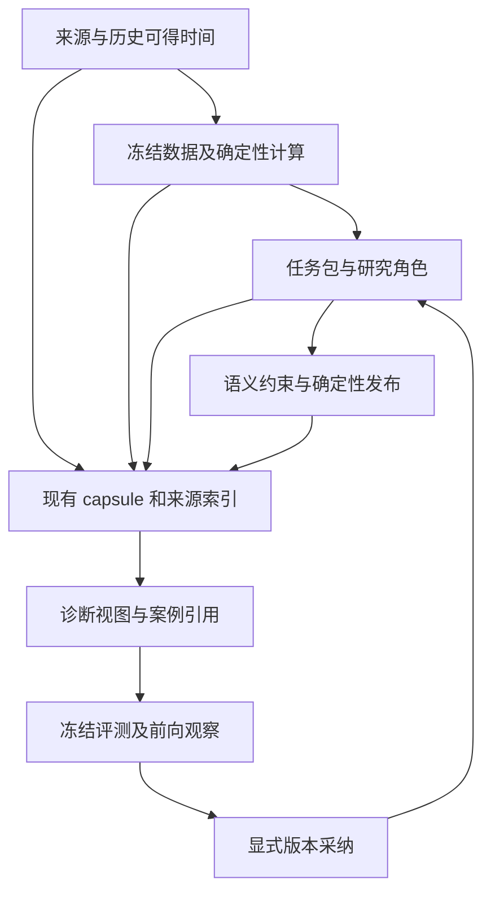
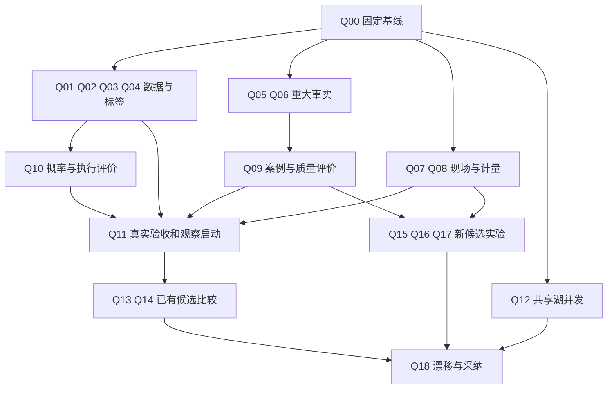

# 研究准确性、现场复盘与运行效率开发计划

> **For agentic workers:** REQUIRED SUB-SKILL: Use superpowers:subagent-driven-development or superpowers:executing-plans to implement this plan task-by-task. Steps use checkbox (`- [ ]`) syntax for tracking. 本文件保留开发前冻结的验收清单；当前实施状态以交付记录和机器台账为准，勾选必须绑定实际证据。

**Goal:** 修正研究数据与评价口径，贯通可诊断的研究现场和受控改进流程，并在研究质量约束下验证速度与 token 优化。

**Architecture:** 保留“确定性数据与计算 → 冻结任务包 → 有界研究推理 → 确定性校验和发布”架构。扩展现有 source receipt、claim、capsule、研究实验和计量模块；案例、诊断、成本和实验结果均引用既有证据。候选研究方法通过冻结比较和真实宿主验收后，以显式版本采纳。

**Tech Stack:** Python（项目声明 `>=3.10`，实施时冻结实际解释器版本）、pandas、PyArrow、pytest、Markdown、JSON/JSONC、tushare、FRED/ALFRED、现有 Claude/Codex 订阅宿主、`uv run --no-sync`。

**日期:** 2026-10-01，Asia/Singapore。

**状态:** 用户已授权并推进实施。本文保留原始规格与复选框；软件、条件性候选及外部证据的当前状态见 [实施交付记录](../../research/2026-10-01-quality-evidence-efficiency-readout.md) 和本引擎开发目录 `tasks.json`。未勾选的原始步骤不能用来推断当前软件状态，也不能据软件交付推断真实宿主或未来观察已完成。

**审计基线:** `HEAD=431d5dc01c539c1a5d68bdd2a7f8d80379eda110` 加当前未提交工作树。HEAD 单独不能重现本次分析。实施前由 Q00 固化真实工作区内容。

**阅读导航:** [现状与缺口](#3-已有能力与本轮缺口) · [架构](#4-架构与责任归属) · [19 项开发任务](#7-任务清单) · [各 skill 变化](#8-四个-skill-的具体交付变化) · [验收矩阵](#9-验收矩阵和指标定义) · [实验设计](#10-实验矩阵与运行纪律) · [交付批次](#12-交付批次与完成定义) · [研究资料](#13-一手资料与本项目采用范围)

## 1. 使用方法与交付边界

面向接手本项目的开发者、研究方法负责人和真实宿主验收操作者。先读第 2—5 节，再按依赖图执行任务。每项任务写清责任文件、输入输出、反例、实施步骤和验收标准；代码片段用于说明本计划定义的新增接口或最小反例，不代表这些接口已存在。

本计划承接 [09-30 软件收口](../../research/2026-09-30-agent-skills-completion-readout.md)，不重新实施已经交付的 A1—D4。已有 [阶段评价协议](../../research/2026-09-30-agent-stage-evaluation-protocol.md)、[研究 profile](../../session-agent/research-profiles.md)、[宿主验收规则](../../session-agent/acceptance.md) 继续有效。

工作分为五个包：

| 工作包 | 任务 | 可独立验收的交付 |
|---|---|---|
| 数据与标签 | Q01—Q04 | 历史版本、交易日、行业基准、指标语义正确 |
| 证据与现场 | Q05—Q08 | 可信字段生产、重大结论覆盖、可观察现场、完整成本 |
| 研究评价 | Q09—Q11 | 案例集、概率与执行评价、真实宿主及前向观察 |
| 运行优化 | Q12—Q17 | 缓存竞争修复、已有候选验收、有界方法和调度实验 |
| 发布与维护 | Q00、Q18 | 可复现基线、版本兼容、漂移检查和采纳记录 |

软件交付、真实宿主通过、研究效果改善分别报告。外部证据尚缺时，软件任务可以交付，真实证据项保持未完成；不能通过减少场景、伪造人工标签或放宽门来完成清单。

## 2. 产品约束

1. 交易主尺为 `gap_c1_o2`：分析日 D 之后第一个交易 session 的收盘入场，第二个 session 的开盘退出。FULL/LITE 表示研究深度。
2. 保留 `research_rating`、`entry_stance`、`relative_action`、`execution_outcome` 四种判断。0 买入日、R 级条件选择、未知执行状态维持各自含义。
3. 六维三门、现行 E6 和持仓强制深核遵循已冻结规则；性能开关不改变候选资格、评级、行业覆盖和必需证据。
4. Codex 的开发运行产物写 `context_codex/`、`reports_codex/`。Claude 自行产生其宿主证据；跨宿主仅通过合法交接的 portable proof 核验，不访问另一引擎产物目录。数据湖 `lake/` 继续共享。
5. 历史已发布报告、原始模型输出、拒稿和失败现场保留原字节。更正使用独立版本、差异清单及前驱引用。
6. 复用现有法证和研究实验体系；诊断视图及案例索引不另建通用事件总线、平行证据账本或自动生产学习层。
7. 模型推理由现有订阅宿主完成，数据与确定性计算由 Python 完成。研究评价不连接自动交易执行器。
8. 修改 skill、配置或配置消费者时遵守 [配置九条标准](../../../.claude/skills/scan-market/config-standard.md)。新运行时参数需注册、双宿主实际消费和测试；实验参数先属于冻结 experiment spec。
9. `session_v1` 默认启用继续由现有双宿主 REAL_SESSION 与边界证明决定；配置文件存在和测试通过不能代替宿主已加载。
10. 报告交付使用 `finish` 返回的 canonical 路径和 `verify-report --level full` 的机器结果。语义评价和投资效果不借用该结果冒充已验证。

## 3. 已有能力与本轮缺口

### 3.1 已有能力

已实现的数据湖、输入冻结、attempt 隔离、局部恢复、六维三门、来源绑定、报告核验、确定性回放、前向两次冻结、阶段消融和 attempt 计量均作为本轮基础。`six_groups_v1`、`deterministic-v1`、两阶段独立初判已有候选实现，属于待验收能力。

09-30 收口记录在 10-01 写明真实工作流 `0/28`、边界 `0/22`，至少同组 10 次真实运行和 60 个分析交易日前向观察仍待积累。这是记录中的当时状态；实施者须保存启动时的新状态，不能沿用本文数字作为实时结果。

### 3.2 审计发现登记

| ID | 当前发现 | 证据 owner | 状态与处理 |
|---|---|---|---|
| F01 | FRED 只限制 observation 日期，没有指定历史 realtime vintage | `dataflows/fred.py:get_macro_data` | 静态确认参数缺口；历史受影响范围待查，Q01 |
| F02 | 人口标签用湖文件列表下标生成 D1/D2 | `scan/populations.py:ruler_frame` | 静态确认条件性错日；Q02 先构造缺分区反例 |
| F03 | outcome 行业映射来自候选，行业基准可能退化为候选内均值 | `scan/outcome.py:compute_outcome/_relative_columns` | 静态调用链确认；Q03 加生产入口反例 |
| F04 | `net_mf_amount` 展示为“主力净流入”，容易被解释成机构身份 | `data/tushare_enrich.py:ashare_market_context_ts` | 数值和投资语义分开修正，Q04 |
| F05 | `claim_fields.v1` 有可信消费门，仓内未定位到实际字段复核生产适配器 | `news/material_claims.py`、`scan/l4/intel_guard.py` | 外部导入路径仍需核实；Q05 接真实生产者 |
| F06 | 已声明用途的验证不能证明全文没有遗漏关键事实 | `news/card_claims.py` | 代码明确 `semantic_completeness=UNKNOWN`，Q06 |
| F07 | stock/macro 分节提交主要验证结构，弱于决策卡业务语义 | `session_agent/validation.py` | 指分节提交门，非断言所有下游检查缺失；Q06 |
| F08 | 放弃且无回报 attempt 可豁免部分 transcript/tool/source 要求 | `session_agent/evidence.py` | 是已有规则边界；Q07 展示观察盲区 |
| F09 | attempt 计量不能独立代表根会话加子任务的完整成本 | `session_agent/metering.py`、`trace/usage_panorama.py` | Q08 去重合并，不按 prompt 字符数冒充 token |
| F10 | 概率评价仪器已有，真实生产声明和成熟标签消费尚未贯通证明 | `research/probability_eval.py` | Q10 接线、Q11 积累读数 |
| F11 | stage_value 主要衡量双方有选择日期的毛标签差异 | `research/stage_value.py` | 保留该仪器，Q10 增加完整执行日评价 |
| F12 | 湖冷 miss 无按 key 去重，原子写使用固定临时文件名 | `data/cache.py:get_or_fetch/_atomic_write` | 静态并发窗口，Q12 先做进程级反例 |
| F13 | 宏观默认串行 21 段；单股 FULL 多级综合链重复读取和成文 | `session_agent/workflows/macro.py/stock.py` | Q13/Q15 做方法比较，不预报节省比例 |
| F14 | sector 稳定事实按整包指纹失效，可能有过度失效 | `sector/reuse.py` | 待真实失效统计，Q14 第二阶段处理 |

历史 Codex 产物抽查有完整性缺失，也有同分析日多次 outcome。它们用于提出反例和采样，不用于宣称当前新版本已经失败或形成足够独立交易样本。

## 4. 架构与责任归属



### 4.1 文件组织

新增模块仅承担下表声明的职责；发现现有等价 owner 时优先扩展它，在任务记录中说明替换路径。

| Owner | 文件 | 职责 |
|---|---|---|
| 历史宏观数据 | 现有 `autoresearch/dataflows/fred.py` | vintage 参数、观测响应和时间元信息 |
| 交易日纯规则 | 新增 `autoresearch/common/outcome_sessions.py` | 从已取得的可信日历解析窗口；不联网、不读湖 |
| 基准成员读取 | 新增 `autoresearch/data/benchmark_members.py` | 读取有来源、当时有效的全市场分类与成员 |
| 基准纯计算 | 新增 `autoresearch/common/benchmarks.py` | 可交易等权基准、缺失传播和覆盖统计 |
| 指标语义 | 新增 `autoresearch/data/metric_semantics.py` | 源字段、单位、统计口径、可支持的解释 |
| 字段复核生产 | 新增 `autoresearch/news/source_fields.py` | 对已冻结来源执行登记适配器，产生复核 payload |
| 现场诊断 | 新增 `autoresearch/research/run_diagnostics.py` | 只读连接 task、attempt、claim、source、usage 和结果 |
| 研究案例 | 新增 `autoresearch/contracts/research_case.py`、`autoresearch/research/casebook.py` | 引用型案例、标签出处、冻结 split 与去重 |
| 语义评价 | 新增 `autoresearch/research/quality_eval.py` | 结构化错误、遗漏、评审一致性和比较读数 |
| 概率与执行 | 现有 `research/probability_eval.py`、`execution_audit.py`、`execution_ledger.py` | 事前声明、标签和所有分析日的执行评价 |
| 现场和计量 | 现有 `session_agent/evidence.py`、`metering.py`、`trace/*` | 原证据与归档、真实计量事实源 |
| 编排与发布 | 现有 `session_agent/*` | 冻结 plan、受限访问、单一状态写入者、profile 与验收 |

依赖保持 `contracts → common/data → domain → session orchestration/research consumers` 的既有分层约束。`common` 不反向 import `scan`；诊断和评价不得成为生产评级的隐式依赖。

### 4.2 协作 ownership

数据负责人拥有 Q01—Q04/Q12；证据负责人拥有 Q05—Q07；评价负责人拥有 Q09—Q11；编排负责人拥有 Q08/Q13—Q18。`contracts`、`session_agent/dispatch.py`、`validation.py`、`workflows/*.py`、`scan_config` 各由一个集成 owner 合并。并行开发使用隔离工作树，以冻结基线为父版本，保留其他人的改动。

## 5. 共用契约与评价口径

### 5.1 证据引用

新派生结果统一引用已存在的 artifact、source receipt 或 transcript segment。以下是新增诊断/案例结果使用的引用形状，生产输入仍须经过现有访问与身份检查：

```json
{
  "kind": "artifact",
  "engine": "codex",
  "run_id": "synthetic-example",
  "task_id": "stock.news",
  "attempt": 1,
  "object_id": "stock.full.intel",
  "sha256": "aaaaaaaaaaaaaaaaaaaaaaaaaaaaaaaaaaaaaaaaaaaaaaaaaaaaaaaaaaaaaaaa",
  "locator": {"type": "line", "start": 12, "end": 18}
}
```

此例仅说明形状，不是有效证据。`kind` 首版闭集为 `artifact|source_receipt|transcript_segment|published_report`。`locator` 仅支持已登记的行号、字节或 JSON Pointer；验证器检查对象真实字节与边界。路径文本、相同 URL、文件修改时间不能替代身份。

### 5.2 时间与标签

每个新标签至少绑定：`analysis_date`、`venue`、`ruler`、`entry_session`、`exit_session`、`calendar_digest`、`price_input_hashes`、`label_version`、`status`、`missing_reasons`。时间未知、日历不可信、未来 session 未到、市场分区缺失、单票缺行情分别保留。

源时间继续采用现有 `contracts/source_time.py` 的 `published_at/first_available_at/received_at` 及各自精度。观测期和 FRED vintage 放入来源 payload 与规范化参数，不把观测日填成公开日。

### 5.3 五个结论分别展示

| 结论 | 来源 | 不包含的证明 |
|---|---|---|
| 字节完好 | MANIFEST/hash/发布绑定 | 不证明正文正确 |
| 要求证据齐全 | EvidencePlan/completeness | 不证明失联任务的全部活动被捕获 |
| 确定性部分可回放 | ReplayResult | 不证明新模型能逐字再现旧推理 |
| 重大结论受支持 | claim/语义评测/人工复核 | 不证明隔夜预测有优势 |
| 决策有效 | 冻结前向与执行评价 | 不证明未来市场仍有同样效果 |

### 5.4 质量与效率共同约束

- 工程优化先验证业务字段和确定性输出一致，再测成本与延迟。
- 研究方法变化先冻结比较人口、信息截止、模型/effort、执行假设、评价集和唯一变化因素。
- 严重事实错误、未来信息泄漏、必需证据丢失和错误发布：冻结回归集内新增错误容忍数为 0。该标准不等于对未见样本零风险的证明。
- 样本外非劣界限默认 0；任何非零容忍界限须在实验开始前明确记录理由。区间跨越非劣界限时为不确定，不能以“不显著”宣称等价。
- 同组至少 10 次完整真实运行是现有计量最低门，不是统计充分性保证。小样本尾部时延只报经验读数和样本量。
- 60 个分析交易日按现有协议固定，结束后等待标签成熟。不能按收益曲线提前结束或临时延长。
- 真实 token、字符代理、估算价格分别展示；缓存输入和 reasoning 是否属于总量的子集，按宿主 adapter 语义归一化，禁止重复相加。

## 6. 实施顺序



数据修正、证据适配、现场计量和湖并发可按文件 ownership 并行。默认业务行为变更等待对应真实验收与研究质量条件；纯软件任务不以未来 60 日数据作为编码前置。

## 7. 任务清单

### Q00 固定基线与实施台账

**类型:** 前置开发保全。**依赖:** 无。**Owner:** 集成负责人。

**文件:** 本计划；开发产物目录 `context_codex/development/20261001-research-quality-evidence-efficiency/`。

- [ ] 保存真实 HEAD、tracked/untracked 文件清单、当前字节哈希、dirty diff 和依赖环境摘要；不保存凭证明文。
- [ ] 从当前工作树内容建立实施基线，后续工作树包含本次未提交实现，不能只从旧 HEAD 开始。
- [ ] 建立 `tasks.json`，每任务保存 `status/owner/base_hash/changed_files/test_commands/test_results/evidence_refs/remaining_external_evidence`。
- [ ] 保存当时 `acceptance-status`、`boundary_proof status` 的输出；缺真实证明保持原状态。
- [ ] 提交只包含本任务相关差异；每次同步前比较目标当前哈希，冲突交给明确 owner 处理。

只读基线命令：

```bash
export AUTORESEARCH_ENGINE=codex
git rev-parse HEAD
git status --short
uv run --no-sync python -m autoresearch.session_agent acceptance-status
uv run --no-sync python -m autoresearch.session_agent.boundary_proof status
```

**验收:** 任一开发提交可追溯到完整工作树基线；文档状态、软件测试状态、真实运行状态分栏。

### Q01 修复 FRED 历史可得性

**类型:** P0 数据正确性。**依赖:** Q00。**Owner:** 数据负责人。

**修改:** `autoresearch/dataflows/fred.py`、`autoresearch/agents/utils/agent_utils.py`、`autoresearch/macro/harvest.py`、对应路由参数消费者。

**测试:** `tests/test_fred.py`、`tests/macro/test_harvest.py`；新增 `tests/data/test_fred_vintages.py`。

**拟议接口:** `get_macro_data(indicator, curr_date, look_back_days=None, *, vintage_date=None, knowledge_cutoff=None)`。原三个位置参数继续可调用；新增参数必须传到真实取数点。仅日期调用提供日期级版本，不承诺盘中已公开。

vintage 缺省取 `curr_date`。`series` 元信息和 `series/observations` 均携带 `realtime_start=realtime_end=vintage_date`；vintage 晚于声明研究截止日期拒绝。每条原始观察保留 FRED 返回的 real-time 元信息。盘中仅有日精度时按现有 `latest_possible` 规则处理，不能把该日所有值当作开盘前已知。

最小参数反例，先加入新增测试文件：

```python
from autoresearch.dataflows import fred


def test_fred_pins_historical_vintage(monkeypatch):
    calls = []

    def request(path, params):
        calls.append((path, dict(params)))
        if path == "series":
            return {"seriess": [{"title": "CPI", "units": "Index", "frequency": "Monthly"}]}
        return {"observations": [{"date": "2025-06-01", "value": "100",
                                  "realtime_start": "2025-07-15", "realtime_end": "2025-07-15"}]}

    monkeypatch.setattr(fred, "_request", request)
    fred.get_macro_data("cpi", "2025-07-15", 90)
    assert calls
    for _, params in calls:
        assert params["realtime_start"] == "2025-07-15"
        assert params["realtime_end"] == "2025-07-15"
```

- [ ] 加入上面的参数反例，并增加“后来修订值不同”“发布日期晚于截止”“日精度不足”“缺 key/空观察”案例；所有网络模拟。
- [ ] 运行目标用例确认当前实现因缺 realtime 参数失败，保存输出。
- [ ] 在取数点实现参数传递，修正文档中“只限 observation 日期即可防前视”的表述。
- [ ] 将原始响应和时间限制登记到现有 source receipt；已有 `source_timing` 可表达的内容不另建时间字段体系。
- [ ] 若该调用链已有缓存，规范参数/key 包含 vintage 与适配版本；只知道 observation 日期的旧缓存不能命中历史 vintage 请求。
- [ ] 跑新旧路由及宏观取数测试，核对历史 vintage 缺失时明确输出缺口。
- [ ] 生成受影响历史 run 的引用清单与可重算性分类；不使用当前修订值静默补写旧报告。

```bash
uv run --no-sync python -m pytest -q tests/test_fred.py tests/data/test_fred_vintages.py tests/macro/test_harvest.py
```

**验收:** 历史日期固定历史版本；同日时点不清楚的值不能取得盘中已知资格；实际前向运行的源时间与收据可对应。

### Q02 统一人口与 outcome 的交易日窗口

**类型:** P0 标签正确性。**依赖:** Q00。**Owner:** 数据负责人。

**新增:** `autoresearch/common/outcome_sessions.py`、`tests/common/test_outcome_sessions.py`、`tests/scan/test_population_calendar.py`。

**修改:** `autoresearch/scan/outcome.py`、`populations.py`、`prelude.py`、`autoresearch/research/forward_study.py`；现有 `tests/scan/test_outcome_calendar.py`、`tests/scan/test_populations.py`、`tests/research/test_forward_study.py`。

新纯函数 `resolve_sessions(analysis_date, *, sessions, quality, today, horizons)` 接收已获取日历。日历 IO 仍由现有来源负责；`outcome.resolve_outcome_sessions` 保留兼容包装。`market_panel.lake_trade_days` 继续只表示分区库存，不能承担交易日事实源。

最小纯函数反例：

```python
from autoresearch.common.outcome_sessions import resolve_sessions


def test_holidays_are_defined_by_supplied_calendar():
    result = resolve_sessions(
        "2026-09-30",
        sessions=["20260930", "20261008", "20261009"],
        quality="trade_cal", today="2026-10-09", horizons=(1, 2),
    )
    assert result["sessions_by_horizon"] == {1: "20261008", 2: "20261009"}
    assert result["status"] == "OK"
```

此日历是合成夹具，不用于证明实际交易所安排。关键集成反例：日历为 D、D1、D2、D3，湖只有 D、D2、D3；D3 设置与 D2 显著不同的开盘价。调用生产 `build_population` 后，`gap_c1_o2` 必须缺失并标记缺 D1，不能计算 C2→O3。

- [ ] 先补生产入口反例，再运行确认当前人口链错日可被捕获。
- [ ] 将已有日历纯规则抽到 common；兼容 wrapper 的既有可信/弱日历语义保持可辨版本。
- [ ] `ruler_frame` 接收来源日历与 evaluation 截止；`forward_frame` 的位置列表使用日历，行情只按精确日期读取。
- [ ] 各尺独立检查 maturity、价格腿和单票数据；T10 缺失不影响已成熟的隔夜尺。
- [ ] 新人口版本增加窗口身份和缺失原因；旧表只能按旧语义读取，不补填 TRUSTED。
- [ ] `forward_study` 标签接收同时核对标签中的 entry/exit session、calendar digest、price hashes 与冻结窗口，身份匹配不能代替日期正确。
- [ ] 对周末、长假、未到成熟日、弱日历、整日分区缺失、单票停牌和退出受限完成覆盖；退出受限样本保留。

```bash
uv run --no-sync python -m pytest -q tests/common/test_outcome_sessions.py tests/scan/test_population_calendar.py tests/scan/test_outcome_calendar.py tests/scan/test_populations.py tests/research/test_forward_study.py
```

**验收:** 人口、outcome 和前向接收使用同一窗口身份；任何缺分区都不能通过顺延计算成熟收益。

### Q03 修正全市场行业基准

**类型:** P0 评价正确性。**依赖:** Q02。**Owner:** 数据负责人。

**新增:** `autoresearch/data/benchmark_members.py`、`autoresearch/common/benchmarks.py`、`tests/data/test_benchmark_members.py`、`tests/common/test_benchmarks.py`。

**修改:** `autoresearch/scan/outcome.py`、`populations.py`、`autoresearch/research/production_export.py`、对应 outcome 迁移与 population 测试。

成员输入冻结字段：`analysis_date/classification_provider/classification_version/universe_rule/source_refs/members/expected_codes/membership_hash/status`。每个成员有 `subject/sector/valid_from/valid_to`。历史只有当前分类或当前存续列表时，不能声称历史基准完整；退市、分类变更和历史可交易性均按当时证据处理。

计算仍采用现行主尺的可交易全市场行业等权口径，包含本股，不在本任务偷偷改成 leave-one-out。完整行业只有一只股票时，零超额可能正确；必须报告基准成员数。问题是错误地把“唯一入围”当成“行业只有一只”。

拟议纯接口 `sector_excess(gaps, eligible, membership)`，返回 `values/meta`。这里的 `membership` 是 IO 适配器从上述完整成员记录按 `analysis_date` 校验后生成的计算视图，精确包含 `status/expected_codes/members`；`members` 为 code → sector 映射，完整来源身份由调用者绑定到输出。模型自填 `status=VERIFIED` 不能授予来源资格。成员映射未覆盖预期基准人口时首版将行业超额标 UNKNOWN，同时输出覆盖率；市场超额与绝对收益独立保留。

```python
import pandas as pd
import pytest
from autoresearch.common.benchmarks import sector_excess


def test_unselected_peer_remains_in_sector_benchmark():
    result = sector_excess(
        pd.Series({"000001": 0.04, "000002": -0.02, "000003": 0.00}),
        pd.Series({"000001": True, "000002": True, "000003": True}),
        {"status": "VERIFIED", "expected_codes": ["000001", "000002", "000003"],
         "members": {"000001": "S1", "000002": "S1", "000003": "S2"}},
    )
    assert result["values"]["000001"] == pytest.approx(0.03)
    assert result["meta"]["sector_counts"]["S1"] == 2
```

- [ ] 加纯算法和生产调用双层反例：finalists 只含 000001，基准仍包含 000002。
- [ ] 从已有冻结市场资料读取完整成员，记录真实来源；不从 `facts['rows']`、top1000 或最终评级反推成员。
- [ ] outcome 与 populations 使用共同构建器和纯计算；缺 mapping 不静默降级为候选均值。
- [ ] 发布基准 population、成员 hash、缺失价格数、未知可交易数、分类覆盖率与版本。
- [ ] 扩展现有迁移机制的 plan/apply 与前后差异；原始报告不可变，更正评价有独立 ID。
- [ ] 对同业未入选、行业真实单例、缺分类、分类变更、历史退市、涨跌停代理未知完成测试。

```bash
uv run --no-sync python -m pytest -q tests/data/test_benchmark_members.py tests/common/test_benchmarks.py tests/scan/test_outcome.py tests/scan/test_outcome_migration.py tests/scan/test_populations.py
```

**验收:** 基准身份和研究选择独立；行业超额不会因只研究一只同行而机械变成零。

### Q04 校正资金流等代理指标语义

**类型:** P1 事实解释。**依赖:** Q00。**Owner:** 数据负责人。

**新增:** `autoresearch/data/metric_semantics.py`、`tests/data/test_metric_semantics.py`。

**修改:** `autoresearch/data/tushare_enrich.py`、`autoresearch/data/tushare_source.py`、`autoresearch/common/research_prompts.py`、实际使用指标的角色片段。

首版登记 `moneyflow.net_mf_amount`：单位万元；基于主动买卖单的净额；不直接携带交易者机构身份。与 `buy_lg_amount/buy_elg_amount` 的分组口径分别登记，不把它们直接加减冒充官方净流入定义。

```python
METRICS = {
    "tushare.moneyflow.net_mf_amount": {
        "display_name": "主动买卖单净流入",
        "unit": "万元",
        "identity_evidence": False,
        "supports": ("该统计口径下的净额和时间变化",),
        "does_not_establish": ("机构身份", "持续吸筹", "隔夜正收益"),
    }
}
```

- [ ] 先锁定数值不变、单位不变、来源明确和非身份字段的测试。
- [ ] 渲染器使用登记名称；原值、换算和历史标签读取保持可区分，避免解析方因改名丢失字段。
- [ ] 将“主力真在”的依据写成可核对证据项；代理字段只能支持其覆盖范围，三门数值阈值不在本任务修改。
- [ ] 建立真实机构披露与交易规模代理混淆的研究评测案例，交 Q09。
- [ ] 运行同步模板检查与相关数据/提示词测试，提交语义变化说明。

```bash
uv run --no-sync python -m pytest -q tests/data/test_metric_semantics.py tests/data/test_tushare_enrich.py tests/scan/test_l4_dispatch_pack.py
uv run --no-sync python -m scripts.sync_research_prompts --check
```

**验收:** 研究可以引用资金流数字，但不能从该字段单独确认机构身份；该事实变化不自动授予或否决评级。

### Q05 接通可信字段复核生产者

**类型:** P1 证据生产。**依赖:** Q00。**Owner:** 证据负责人。

**新增:** `autoresearch/news/source_fields.py`、`tests/news/test_source_fields.py`。

**修改:** `autoresearch/news/claim_binding.py`、`autoresearch/news/material_claims.py`、`autoresearch/news/claim_extract.py`、`autoresearch/news/claim_acceptance.py`、`autoresearch/scan/l4/intel_guard.py`；登记 operation 的 `autoresearch/session_agent/operations.py` 与工具文档。

先支持现有四种谓语的真实来源字段复核。后续新增业绩修正、监管处罚、客户变化时，每种谓语必须有独立 schema、时间口径和 gold 数据，不靠扩充关键词取得 PASS。

复用现有消费端要求的 `claim_fields.v1` payload：

```python
def review_payload(source_receipt_id, source_hash, event, checked_fields, reviewer):
    return {
        "schema_version": 1,
        "source_receipt_id": source_receipt_id,
        "source_hash": source_hash,
        "event": event,
        "checked_fields": sorted(set(checked_fields)),
        "reviewer": reviewer,
    }
```

该构造函数仅组织字段；授予可信来源资格必须由实际适配器或人工复核完成。生产入口按 `source_receipt_id` 获取冻结字节，不接受研究模型自填 provider、任意 URL 或 PASS。`checked_fields` 只能列真正核对的字段。适配器版本放入规范化参数和证据引用，不擅自增加 v1 payload 字段。

- [ ] 搜索并记录所有已有外部导入能力；若已有可用生产者，完成其真实接线，避免重复适配器。
- [ ] 为计划/实施/完成、金额上限/实际金额、主体不符、撤回/更正、截断原文写最小反例。
- [ ] 实现首个登记来源的确定性字段 adapter：来源结构、字段路径、单位、生命周期全部明确；不支持的格式保持 UNKNOWN。
- [ ] 冻结原文及提取依据，产生绑定当前 run/task/attempt 的 source receipt；同来源重抓不能计独立确认。
- [ ] 人工复核入口要求真实 reviewer 与引用，模型意见进入另一种评价状态，不能冒用 `human_review`。
- [ ] 接 `intel_guard → material_claims → effective_card`，覆盖普通卡、重试、整稿拒绝和更正链。
- [ ] 按当前 `claim_acceptance` 的四谓语各 20 条、共 80 条人工案例要求验收。Q09 的启动案例集不能替代这项成熟门。

```bash
uv run --no-sync python -m pytest -q tests/news/test_source_fields.py tests/news/test_claim_support.py tests/news/test_claim_binding.py tests/news/test_claim_acceptance.py tests/session_agent/test_card_claim_uses.py
```

**验收:** 至少一个真实来源生产者贯通到卡片证据消费；错误 PASS、错误 FAIL、UNKNOWN、缺原文均有分母。缺真实人工样本时仪器交付、成熟验收保持未完成。

### Q06 扩展重大结论覆盖与 FULL 章节审计

**类型:** P1 语义质量。**依赖:** Q05。**Owner:** 证据负责人。

**修改:** `autoresearch/news/card_claims.py`、`autoresearch/contracts/research_card.py`、`autoresearch/session_agent/validation.py`、`autoresearch/session_agent/workflows/stock.py`、`autoresearch/session_agent/workflows/macro.py`、`autoresearch/session_agent/workflows/sector.py`、相应 FULL 角色片段。

**新增测试:** `tests/session_agent/test_material_conclusion_coverage.py`；扩展 `tests/news/test_card_claims.py`。

在现有用途声明上登记最小重大结论清单：三门依据、关键催化、重大负面、精确 EV/R:R 的前提、配置表核心假设。每条结论引用 `claim_id` 或确定性计算 artifact，并注明 `FACT/INFERENCE/HYPOTHESIS`。推断额外列必需前提和反证；前提被支持不等于推断已被证实。

语义审计第一版输出 `coverage_state=DECLARED_ONLY|AUDITED_WITH_GAPS|AUDITED`、`known_material_count`、`mapped_count`、`omission_candidates`、`unresolved_conflicts`、`review_refs`。`AUDITED` 表示完成声明范围的审计，不能将其解释为全文完备证明。首版使用实验 spec 中的 `material_conclusion_audit_v1` 评价 profile，审计结果作为派生产品；不新增 begin 字段。需要把审计任务升为生产必需任务时，再走请求、角色访问和业务规则版本登记。

- [ ] 加“正文关键催化未声明”“关键负面误列背景”“原文只支持计划”“经理摘要遗漏偿债反证”的固定案例。
- [ ] 对决定性的数值与字段继续用确定性检查；独立模型只提出遗漏候选、矛盾和推断问题，不授予来源 PASS。
- [ ] 将 stock/macro/sector FULL 的重大结论接到共同覆盖检查，保持原章节与输出数量；审计先作为显式候选 profile 的观测产物。
- [ ] 审计触发的业务约束复用已有未知来源/必要事实规则。改变阻断语义时冻结新规则版本，旧报告不重判。
- [ ] 增加 source 到初判、终判、机器约束的用途引用，交 Q07 的诊断视图使用。
- [ ] 对人工 gold 评价遗漏审计的准确率与召回率，结果按判断类型分桶。

```bash
uv run --no-sync python -m pytest -q tests/session_agent/test_material_conclusion_coverage.py tests/news/test_card_claims.py tests/session_agent/test_stock_evidence_bundle.py tests/session_agent/test_macro_groups.py tests/session_agent/test_sector_products.py
```

**验收:** 能定位重大结论依赖的原始事实及未解决前提；结构 PASS、来源 PASS、语义审计和收益概率保持独立。

### Q07 保存失败现场并提供单次运行诊断视图

**类型:** P1 可观察性。**依赖:** Q00；结论用途视图随后接 Q06。**Owner:** 证据负责人。

**修改:** `autoresearch/session_agent/evidence.py`、`host_evidence.py`、`autoresearch/trace/transcripts/snapshot.py`、现有 transcript adapters 与 completeness 展示。

**新增:** `autoresearch/research/run_diagnostics.py`、`tests/research/test_run_diagnostics.py`。扩展 `tests/session_agent/test_news_evidence.py`、`tests/trace/test_transcript_snapshot.py`、`tests/trace/test_completeness.py`。

“有现场”按实际可记录的信息定义：输入、工具调用及响应、来源字节、模型可见输出、简短判断依据、提交/拒绝/重试、最终取舍均可定位。宿主没有提供的内部推理不作为必需数据，也不事后生成一段解释冒充当时记录。

沿用原始归档位置。新诊断模块只产出带哈希引用的 `research-run-diagnostics-v1` 派生 JSON 和 Markdown；它不是新的事实源，不参与生产判断，不修改已封存 capsule。

| 诊断块 | 内容 | 原始 owner |
|---|---|---|
| identity | run、engine、代码/prompt/config、研究截止、profile | 冻结请求与 manifest |
| attempts | 所有任务/attempt，包括失败、撤回、过期、未回报 | plan、task state、EvidencePlan |
| evidence | 输入、工具、来源、输出、接受结果及缺失原因 | capsule、source receipt、transcript |
| decision_changes | 原始初判、复核意见、机器约束、最终字段的差异 | 已绑定的卡片与阶段产物 |
| coverage | 必需证据覆盖、实际活动观察覆盖、未知区间 | EvidencePlan 加真实宿主观察 |
| cost | Q08 的真实用量与覆盖 | 原始 usage records |
| outcomes | 成熟标签或未成熟状态 | Q02/Q03/Q10 的版本化结果 |

- [ ] 在 claim/首次可观察回报、合法轮询点、submit、失败、取消和恢复时复用现有 snapshot 能力，记录稳定前缀、实际捕获边界及未闭合记录。
- [ ] 按宿主能力决定捕获方式；无法取得 transcript 时保存具体原因，不能把手写文本当作原生归档。
- [ ] 对放弃 attempt 保留原规则的豁免原因，同时在新视图显示 `activity_visibility=UNKNOWN|PARTIAL|OBSERVED`。现有 completeness PASS 不转换成“全过程已观察”。
- [ ] 用冻结计划作为任务分母，attempt 记录作为已知尝试分母；真实已执行调用数未知时只报已观察下界。
- [ ] 对已开始且应当可观察的 attempt，缺 transcript、缺工具响应或缺来源分别计数。尚未派发任务和无法观察的任务单列。
- [ ] 研究终态出现后建立引用视图；迟到的合法外部观察写独立派生版本，不改旧报告的 MANIFEST。
- [ ] 判断变化采用字段差异和原始简短理由。若“为何改变”未声明，标 `REASON_NOT_RECORDED`，事后归因只列分析假设。
- [ ] 新增一个失败后重试成功的完整案例，以及中断无回报、归档截断、旧 attempt 迟到、同 session 多 run 的反例。

**拟议只读 API:** `build_run_diagnostics(run_ref, *, outcome_refs=())`。`run_ref` 必须解析到本引擎授权的 canonical 产物或合法诊断输入；函数不能随意扫描全盘宿主会话。第一版通过 Python API 使用，CLI 如有必要再登记，本文不预设已有命令。

```bash
uv run --no-sync python -m pytest -q tests/research/test_run_diagnostics.py tests/session_agent/test_news_evidence.py tests/trace/test_transcript_snapshot.py tests/trace/test_completeness.py
```

**验收:** 任一研究结论可沿引用回到当时输入和已观察输出；失败尝试不会因最后成功而消失；每个缺口有对象、阶段和原因，不能用一个“完整率”掩盖不可观察活动。

### Q08 建立根会话与子任务的完整成本读数

**类型:** P1 优化前置。**依赖:** Q07。**Owner:** 编排负责人。

**修改:** `autoresearch/session_agent/metering.py`、`autoresearch/trace/usage_panorama.py`、transcript adapters、`autoresearch/research/efficiency_baseline.py`。汇总结果由 Q07 诊断视图引用。

**测试:** 扩展 `tests/session_agent/test_metering.py`、`tests/trace/test_usage_panorama.py`、`tests/research/test_efficiency_baseline.py`；新增 `tests/research/test_run_usage_join.py`。

现有 `session_metering` v1 精确字段契约继续有效，尤其保留 `dispatch_count_basis=FROZEN_HANDOFF_NOT_MODEL_EXECUTION`。首次开发将完整运行成本作为派生视图，不原地向 v1 塞字段或改变历史含义。

新增派生块包含 `scope`、`adapter_versions`、`source_refs`、`unique_usage_records`、`overlap_resolution`、`root_only`、`task_attempts`、`unattributed`、`metrics`、`measurement_coverage`。根会话只统计有 run 绑定及边界的区间；同一会话其他项目或前后闲聊不混入。

- [ ] 先逐宿主明确 usage 是本次增量、累计量还是包含子任务的总量，并冻结 adapter 版本。
- [ ] 优先使用可验证的宿主原生记录 ID 去重；缺原生 ID 时使用受验证的 session/源记录序号映射。不同 snapshot digest 不代表不同调用，内容相同也不必然代表同一次调用。
- [ ] 识别累计量重置、重叠 snapshot、同 attempt 重复提交、父记录包含子记录、断点恢复和取消后迟到记录。
- [ ] 归一化 input/output/cached input/cache creation/reasoning 的包含关系；无法证明互斥的父子总量不直接相加。
- [ ] requested、resolved、observed model/effort 分栏；宿主没有返回 actual model 时保持 UNKNOWN。
- [ ] 每个指标沿用“完整时才给 total，部分时给 observed_total 与 coverage”的原则。阶段分摊未知不阻止展示已知总量，总量未知也不按字符填补。
- [ ] 保留准备、根编排、研究、修复、复核、发布、恢复的观察成本；失败和拒稿成本计入总运行。
- [ ] 墙钟使用实际边界，子任务并行区间使用并集；各任务 duration 之和不能称为总时延。跨 runner segment 保留缺测历史区间。
- [ ] 若展示估算价格，注明价格表日期、模型匹配与未计费项；订阅额度消耗、token 和现金支付不互相代替。

最小固定算例：root 独有输入 100，子任务 A 输入 200，A 的同一记录被两个归档重复引用，子任务 B 输入 300。完整去重总输入应为 600，不是 800；其中缓存输入若为 150，不能再把它加到 600 上。若 B 只有未知 usage，总量为 null，已观察输入为 300，并报告 B 缺测。

```bash
uv run --no-sync python -m pytest -q tests/session_agent/test_metering.py tests/trace/test_usage_panorama.py tests/research/test_efficiency_baseline.py tests/research/test_run_usage_join.py
```

**验收:** 同一批原生记录重归档不改变总量；各阶段加总只在互斥且完整时成立；真实效率比较包含根会话和失败开销。

### Q09 建立可归因案例集与研究质量评价

**类型:** P1 改进机制。**依赖:** Q05—Q08。**Owner:** 评价负责人。

**新增:** `autoresearch/contracts/research_case.py`、`autoresearch/research/casebook.py`、`autoresearch/research/quality_eval.py`、`tests/research/test_casebook.py`、`tests/research/test_quality_eval.py`、`tests/contracts/test_research_case.py`。

**复用:** `research/registration.py`、`experiment_io.py`、现有 claim gold 与 Q07 引用；不恢复已退役的自动生产 learning 包。

案例第一版字段如下，最终精确契约由上述 contracts owner 定义：

| 字段组 | 最小字段 |
|---|---|
| 身份 | case_id、schema_version、engine、event_family、security、analysis_date |
| 场景 | workflow、profile、knowledge_cutoff、question、expected_behavior |
| 引用 | input_refs、attempt_refs、claim_refs、decision_refs、outcome_refs |
| 人工标签 | label_state、reviewer、reviewed_at、label_version、disagreements |
| 错误 | failure_type、severity、suspected_stage、confirmed_cause、counterexample |
| 评价用途 | split、group_id、eligibility、exclusion_reason |

`expected_behavior` 可以是“证据未知时暂缓执行”“必须指出该公告仍在计划阶段”。市场结果有随机性，不能把盈利样本一概标好推理、亏损样本一概标坏推理。

首批建设 **40 条研究过程案例**，覆盖事实错、时间错、口径错、关键遗漏、推断越界、重复证据、访问/发布故障、执行错配、无交易和正常成功。它是评测系统启动集，不替代 Q05 的 80 条 claim 人工成熟样本，也不支持收益有效性结论。每类目标配额和排除理由在标注前固定。

- [ ] 按原始事件和发行人关联聚类，关联公告、更正稿、同一事件重跑必须进入同一 split；时间切分保留 Q02 的真实标签成熟边界。
- [ ] 人工确认标签与模型提出的标签分开。模型可推荐 failure_type 和疑似原因，但不能把自身结论写成已确认 gold。
- [ ] 对严重或有争议样本由第二位真实复核者核对；只有一位复核者时如实标单人标注，不能虚构一致性。
- [ ] 确定性 grader 检查数字、单位、日期、引用、业务字段；模型 grader 检查推断和遗漏，须先在人工集上报告自身错判。
- [ ] 保存 case 版本、grader/prompt/model 版本、逐项判断、置信边界和原始评价输出；不要只保存总分。
- [ ] 使用 `SUPPORTED/CONTRADICTED/INSUFFICIENT` 等可复核标签，并分别计算已知分母上的准确率、召回、错误 PASS 和遗漏率。
- [ ] 评测若抽样，冻结抽样规则及 seed；记录未评样本，不能把抽中的正常样本分数外推为全文完整。
- [ ] 建立“问题案例 → 最小反例 → 开发改动 → 冻结集回归 → 未见事件留出集 → 真实观察 → 采纳记录”的手动晋级流程。
- [ ] 留出集不进入 prompt 优化与日常示例检索；反复查看导致泄漏时登记污染并重新建立未来留出窗口。

**拟议 API:** `validate_case(case)`、`freeze_casebook(cases, *, split_spec, output_dir)`、`evaluate_cases(casebook_ref, *, candidate_ref, grader_spec)`。冻结目录排他创建；这些是待实现 API，不能引用为当前能力。

```bash
uv run --no-sync python -m pytest -q tests/contracts/test_research_case.py tests/research/test_casebook.py tests/research/test_quality_eval.py tests/news/test_claim_acceptance.py
```

**验收:** 每次改进都可回答“修复了哪些已知问题、在未见案例上如何、是否引入新错误”；缺人工标签时只交付候选案例和工具，不宣布质量提高。

### Q10 接通概率评价与所有分析日的执行评价

**类型:** P1 投资有效性。**依赖:** Q01—Q03/Q07/Q09。**Owner:** 评价负责人。

**修改:** `autoresearch/research/probability_eval.py`、`execution_audit.py`、`execution_ledger.py`、`forward_study.py`、现有声明与执行计划的契约消费者。

**测试:** 扩展 `tests/research/test_probability_eval.py`、`test_execution_audit.py`、`test_execution_ledger.py`、`test_forward_study.py`；新增 `tests/research/test_execution_day_panel.py`。

#### Q10-A 概率声明与成熟标签

复用 `planned_overnight_net_positive_v1` 和现有 `execution_probability_row`。声明绑定真实执行计划哈希、事件、执行模式、费用口径、事前时间和 p。候选可以拒绝给出概率并说明信息不足；不能从 conviction、rating 或来源支持程度反推 p。

- [ ] 将事前概率声明作为冻结候选产物接到真实运行；在入场窗开始后生成的声明拒绝进入事前评价。
- [ ] 标签从已有 `observed_execution` 与真实日历取得，未完成退出、缺费用、计划不匹配均 `y=null`。
- [ ] Brier、固定分箱可靠性、事件发生率、覆盖和事件数一起报告；样本按日期/事件聚类，不能把同日重跑当独立市场样本。
- [ ] 在冻结训练窗估计简单基线概率，验证窗选择方法，测试窗仅评价；不拿测试期实际胜率回填基线。
- [ ] 首卡和复核共同错误用现有 `error_overlap`；披露各自错误率、共同错误及共同可评价人口。共用事实与同模型意味着统计相关，独立上下文不能证明误差独立。
- [ ] 修正文档中“任一方零错误则 Jaccard 分母为空”的表述，使之符合现有算法：只有双方错误集合的并集为空时才为 null。

固定算例：`p=[0.8, 0.2]`、`y=[1, 0]` 的 Brier 为 0.04；第三条未退出样本 `y=null` 不进入 Brier 分母，但必须计入缺失覆盖。两组均无错误时共同错误比值无定义，保持 null。

#### Q10-B 完整执行日面板

现有 `stage_value` 继续回答有选择日期的阶段毛标签差异。扩展 `execution_audit` 增加日级评价，输入为冻结分析日清单、选股/入场决定、执行计划、可得快照或成交、费用政策，以及初始现金和存续持仓。三种证据模式分别生成结果。

| 日或订单状态 | 处理 |
|---|---|
| 正常完成研究且选择持币 | 保留 `ABSTAIN`；只有现金状态完整时按预注册现金收益假设计收益 |
| 研究任务失败或市场数据不全 | `TASK_FAILED/DATA_UNKNOWN`；不解释成主动持币 |
| 已委托但有证据未成交 | `NO_FILL`；现金与费用按已知事实记录 |
| 缺成交记录、无法判断是否执行 | `EXECUTION_UNKNOWN`；不等同未成交 |
| 部分成交、退出未完成、超窗持仓 | 保留头寸及原因；不能在计划开盘价虚构卖出 |
| 完整成交且费用已知 | 按实际净现金流与预注册组合规则计量 |

- [ ] 在既有执行 episode 之上构造全日历面板，补的是“日历行”，不补价格、成交、费用或收益。
- [ ] 资金、权重、最多持仓数、同票重复计划处理、费用和现金收益假设在比较前冻结；不能用事后收益决定仓位。
- [ ] 模拟面板要求当时可得快照；日线价格只能进入 EOD_PROXY，不能替代盘中最高价或可成交性。
- [ ] 未平仓头寸持续带到后续日；估值缺失则组合收益未知。计划窗收益、持仓市值变化和真实平仓损益分栏。
- [ ] 样本完整时报告净收益、回撤、尾部、换手、持仓/行业集中、现金天数；不完整时报告覆盖与已知读数，不拼接虚构完整净值。
- [ ] 比较基准预先固定相同资金、执行模式和费用假设；Q03 行业相对标签与组合净收益分别展示。
- [ ] 人工授权导入真实成交才可标 OBSERVED_FILL；开发测试只用明确标注的 synthetic fixtures。

```bash
uv run --no-sync python -m pytest -q tests/research/test_probability_eval.py tests/research/test_execution_audit.py tests/research/test_execution_ledger.py tests/research/test_execution_day_panel.py tests/research/test_forward_study.py
```

**验收:** 零买入日、研究失败、无成交、未知执行、缺标签均有分母；新指标不会把现有毛标签包装成真实可执行收益。

### Q11 完成真实宿主验证并启动受控前向观察

**类型:** P1 运行验收；长期研究。**依赖:** Q01—Q10 的相应软件交付。**Owner:** 评价负责人协调真实宿主操作者。

**主要使用现有能力:** `docs/session-agent/acceptance.md`、`access-boundary.md`、`autoresearch/session_agent/evaluation.py`、`boundary_proof.py`、`autoresearch/research/forward_study.py`。本任务首先执行和留证，不为“完成验收”重写验收器。

- [ ] 从启动时状态导出需要补齐的真实工作流/边界场景，不把文档的历史 `0/28`、`0/22` 当当前查询结果。
- [ ] Codex、Claude 各自在本宿主重新加载 hook/配置并产生真实允许/拒绝证据；根会话只核验依法交接的证明，不跨引擎遍历产物。
- [ ] `CONFIGURED_UNVERIFIED`、PILOT、单宿主通过各按本意展示；离线模拟不能签成 REAL_SESSION。
- [ ] 对每个真实运行保留 begin 到 finish 的任务、attempt、来源与根/子 usage；执行 mandatory `verify-report --level full`。
- [ ] 对 Q13/Q14 等候选按 engine、工作流、模式、来源/缓存条件分组，先积累同组至少 10 次完整真实运行。两候选的完整运行次数和配对数分别展示。
- [ ] 将用于研究观察的行为代码、prompt 和 config 收口到实际干净版本；不是让当前用户工作树丢弃未提交内容。
- [ ] 按现有两次冻结协议注册 60 个分析交易日；逐日冻结当时人口，拒绝票、失败票与零选择日均纳入。
- [ ] 修正后的日历、基准和 source timing 版本进入协议；标签成熟后再 finalize。
- [ ] 若中途发现契约或信息泄漏故障，按故障规则停止并保留旧窗口；修复后开新协议，不覆盖旧窗口或事后更换基线。

现有可执行入口示意，尖括号均须换成本次真实值：

```bash
export AUTORESEARCH_ENGINE=codex
uv run --no-sync python -m autoresearch.session_agent acceptance-status
uv run --no-sync python -m autoresearch.session_agent.boundary_proof status
uv run --no-sync python -m autoresearch.session_agent verify-report \
  --report-path <finish返回的canonical路径> --expected-run-id <本次run_id> --level full
uv run --no-sync python -m autoresearch.research.forward_study begin \
  --parent <本引擎实验父目录> --template <冻结协议模板.json> \
  --calendar <有来源的交易日历.json> --start-date <首个分析交易日> \
  --sources <prompt和config清单.json> --repo-root <真实干净代码目录>
```

**验收:** 宿主验收按已有机器门完成；研究观察按原始固定窗口和成熟条件完成。两者可以在不同时间完成，60 日结束也可能得出 `INSUFFICIENT`。

### Q12 修复共享数据湖冷 miss 的并发竞争

**类型:** P0 可靠性兼 P2 性能。**依赖:** Q00；真实收益测量依赖 Q08。**Owner:** 数据负责人。

**修改:** `autoresearch/data/cache.py`。**测试:** 扩展 `tests/data/test_cache.py`，新增 `tests/data/test_cache_concurrency.py`。

缓存锁使用共享湖中的规范化 key，包含 provider、endpoint、规范参数及当前契约要求的版本。两个引擎访问同一数据 key 时必须竞争同一把锁；不能按 engine 分锁。已有发布锁若职责不相符，在 cache owner 内实现私有锁助手，不扩展通用锁框架。

```text
无锁快路径读有效缓存
  → miss 后获取 key 锁
  → 锁内再次检查缓存
  → 仍缺失才调用 fetcher
  → 校验数据契约
  → 同目录唯一临时文件写入并完成必要落盘
  → 原子替换目标
  → 释放锁，返回已校验数据
```

- [ ] 用两个真实进程和可控 barrier 构造同 key 冷 miss；旧实现应暴露重复 fetch 或写冲突，新实现只有一次有效 fetch。
- [ ] 使用与 macOS/Linux 部署相容的文件锁；进程退出自动释放，锁文件存在本身不意味着仍被持有。网络文件系统支持范围需明示。
- [ ] 临时文件名唯一、同目录，异常时只清理本进程拥有的临时文件；原子发布前保持旧有效缓存可读。
- [ ] miss 的失败、取消和超时不写成有效命中；A级空帧继续拒绝入湖。锁超时/重试采用已有政策；必须新增参数时遵循配置九条。
- [ ] 测同 key 多调用者、不同 key 并行、首进程崩溃、fetch 异常、无效帧、旧缓存替换和捕获的 payload/hash 一致。
- [ ] 缓存命中仍为每个消费者产生本次来源使用引用；不能因为共享网络响应而共享研究结论或跨引擎状态。

```bash
uv run --no-sync python -m pytest -q tests/data/test_cache.py tests/data/test_cache_concurrency.py tests/data/test_frame_lake_routing.py
```

**验收:** 同 key 竞争只发生一次有效源读取，异 key 可并发，原字节/取数契约无退步；网络调用减少量与端到端时延各自实测。

### Q13 验收已有宏观六组候选

**类型:** P2 研究编排效率。**依赖:** Q01/Q06/Q08/Q09；真实运行按 Q11。**Owner:** 编排负责人。

**已有 owner:** `autoresearch/session_agent/workflows/macro.py`、`workflows/macro_groups.py`、`.claude/agents/macro-full.md`、`docs/session-agent/research-profiles.md`。

**测试:** `tests/session_agent/test_macro_groups.py`。只有实际比较发现缺陷时才改实现，新增反例放入该测试文件。

当前已实现 `macro_research_profile=six_groups_v1`，默认仍为 `serial21`。实验不重复开发分组逻辑。

| 已有组 | 必需输出 | 依赖 |
|---|---|---|
| regional | 美、中、全球，共 3 份 | 冻结原始输入 |
| crossasset | 利率、外汇、股票、商品、加密，共 5 份 | 冻结原始输入 |
| meso | 流动、情绪、主题，共 3 份 | 冻结原始输入 |
| sinous | 四份中美比较及 variant，共 5 份 | 前三组 |
| risk | crossfire、calendar、premortem，共 3 份 | 所有此前组 |
| decision | decision、sector_map，共 2 份 | 所有此前组 |

具体路径由现有 `grouped_products()` 和 `required_macro_products()` 生成。21 份输出逐份验证；已登记 optional 仅在两侧都选中时纳入该次比较。

- [ ] 冻结同一原始宏观包、intel、frame、截止、可选产物和模型设置；唯一方法变化为 profile。
- [ ] 按现有 `compare_macro_candidate` 的六项检查提供真实引用：产物契约、事实引用、风险覆盖、分歧保留、配置理由和实际计量。
- [ ] 使用 Q06/Q09 核查组内事实串扰、风险遗漏、不同资产窗口混用、共同理由压平和可选产物挤占必需内容。
- [ ] 对组中一份输出失败测试整组未完成、合法重试和下游阻断；不能接受其余文件后静默补齐缺文件。
- [ ] 计量完整运行含重试。分别报告任务数、model calls、真实 token、总墙钟及关键路径。
- [ ] 对样本充分性和非劣条件给结论；“21 个任务变成 6 个”本身不能推导任何 token 或延迟节省比例。

```bash
uv run --no-sync python -m pytest -q tests/session_agent/test_macro_groups.py tests/session_agent/test_metering.py tests/session_agent/test_material_conclusion_coverage.py
```

**验收:** 完整产物与重大事实质量满足冻结条件，并有同组真实成本读数；未满足时保留候选身份。

### Q14 验收行业确定性地形，按证据细化稳定事实失效

**类型:** P2 数据复用与 token 效率。**依赖:** Q03/Q04/Q06/Q08。**Owner:** 编排负责人，数据负责人协作。

**已有 owner:** `autoresearch/sector/terrain.py`、`reuse.py`、`brief.py`、`autoresearch/session_agent/workflows/sector.py`、`.claude/agents/sector-brief.md`。

**测试:** `tests/sector/test_deterministic_terrain.py`、`test_reuse.py`、`test_terrain_session.py`、`tests/session_agent/test_sector_prerequisites.py`、`test_sector_products.py`。

#### Q14-A 先验收已有候选

- [ ] 比较 `sector_brief_profile=legacy` 与已实现的 `deterministic-v1`，共同要求覆盖全部 L3 涉及的行业，不只比较最后入选股票所在行业。
- [ ] 数值地形每个目标日从冻结 pack 重建；标明实际数据日、单位、来源及分类覆盖。
- [ ] 重大事件、冲突、必需缺口按既有事件触发规则处理。某行业没有事件任务与该行业被遗漏分别计数。
- [ ] 对旧 Markdown 复用规则与其文字承诺做核对；没有实现的新闻失效条件不能在横幅上声称已检查。
- [ ] 验证描述性边界，不将行业偏好、`sector_healthy_top3` 或买卖方向传给 L3/L4。
- [ ] 比较来源覆盖、事实错误、必要事件漏报与真实 token/时延；不以“文本更短”代替结果验证。

#### Q14-B 观察到过度失效后再细化

当前稳定事实按市场、财务、事件、更正和映射指纹失效。先记录真实 miss 原因；若确有大量“仅日价变化导致无关稳定事实失效”，再改为 fact 级依赖。

拟议依赖记录为 `fact_id → source_receipt_ids + validity + dependency_classes + dependency_hashes`。依赖类只登记 `price|financial|event|correction|classification`；缺依赖声明的旧事实采用保守失效，不自动升级成可复用事实。

- [ ] 反例一：只改日价，产业链结构事实仍有效，但动量/估值地形必须重建。
- [ ] 反例二：原来源更正或公司业务重组，相关稳定事实失效，即使旧 TTL 未到。
- [ ] 反例三：行业分类变更，行业映射事实失效；代码相同不能沿用旧行业归属。
- [ ] 反例四：假设到期或反证出现，进入历史，不当作 STABLE 事实继续喂模型。
- [ ] 缓存命中保留本次引用和来源时效判断。整张股票卡、评级、新闻搜索结果不纳入这项稳定事实复用。

```bash
uv run --no-sync python -m pytest -q tests/sector/test_deterministic_terrain.py tests/sector/test_reuse.py tests/sector/test_terrain_session.py tests/session_agent/test_sector_prerequisites.py tests/session_agent/test_sector_products.py
```

**验收:** 行业覆盖与事件召回不退步；仅在事实所依赖的输入未变化时复用，节省量由实测确认。

### Q15 评估单股 FULL 综合链的阶段价值

**类型:** P3 研究方法候选。**依赖:** Q06/Q08/Q09；先完成基线阶段价值读取。**Owner:** 编排负责人和研究方法负责人。

**修改候选 owner:** `autoresearch/session_agent/workflows/stock.py`、`autoresearch/session_agent/roles.py`、`autoresearch/contracts/agent_roles.py`、`autoresearch/contracts/session_task.py`、`.claude/agents/stock-full.md`、对应 Codex 角色适配；新增 `tests/session_agent/test_stock_full_grouped_profile.py`。

现有七段下游为 reality_check → bull → bear → manager → risk → premortem → pm，且都可读取原始证据和分析师材料。首先回答每段带来多少新事实纠错、反证、决策改变及成本，不按角色名称假设价值。

首个拟议候选称 `grouped3_v1`，只有基线数据支持继续时才实现。其 begin 字段 `stock_full_profile` 尚不存在；若采纳开发，新增请求 schema 版本，枚举为 `serial7_v1|grouped3_v1`，默认 `serial7_v1`，旧版本继续解析为现行串行行为，显式适用 stock FULL。该命名是本任务新增契约，不代表当前已有可用参数。

| 拟议任务 | 对原有产物的责任 | 输入与限制 |
|---|---|---|
| stock.group.evidence_synthesis | `2_research/reality_check.md`、`2_research/bull.md`、`2_research/bear.md`、`2_research/manager.md` | 原始包、intel、analyst 产物；保留对立证据和未解决分歧 |
| stock.group.risk_review | `3_risk/debate.md`、`3_risk/premortem.md` | 完整原始证据与综合结果；不同宿主上下文，记录审查自身相关性 |
| stock.group.portfolio_decision | `4_portfolio/decision.md`、`4_portfolio/calendar.md`、`2_research/variant.md`、`2_research/faceoff.md` | 全部原始证据、综合及风险结果 |

这是合并综合过程的候选，不能把同一任务产生的 bull/bear 当作两份独立研究。风险审查与最终决策保留单独任务；所有旧必需路径和下游完整性门继续存在。

- [ ] 从 Q07/Q08 生成基线逐段新增事实、错误修复、决策变化和成本表；无计量阶段先补观察。
- [ ] 冻结候选三组的角色责任、产物路径和输入集合；建立精确产品集合相等测试。
- [ ] 请求版本、host 能力、配置消费者、冻结 plan、role access、submit validator 与 replay 一起接线；只有一个宿主支持时明确限制，不伪装双宿主可用。
- [ ] 每组输出原子接受；组内任一必需产物失败则组未完成。原始证据读取权限不能靠 evidence_bundle 索引扩张。
- [ ] 先不同时更换模型、缩短原始证据或移除 analyst，从而使实验只有一个方法变化。
- [ ] 用 Q09 比较关键遗漏、错判修复、相反观点保留、精确数值依据和 Q10 的前向差异。
- [ ] 若候选同质化、漏反证或只是输出更长，保留失败结果并结束本候选；不为既定三组目标继续削弱质量约束。

```bash
uv run --no-sync python -m pytest -q tests/session_agent/test_stock_full_grouped_profile.py tests/session_agent/test_stock_full_roles.py tests/session_agent/test_stock_full_products.py tests/session_agent/test_stock_evidence_bundle.py tests/session_agent/test_task_access.py
```

**验收:** 研究方法非劣条件和实际效率同时满足才提交采纳；未实现的候选不出现在默认 skill 文档中。

### Q16 按研究阶段校准模型、effort 与上下文用量

**类型:** P3 成本质量比较。**依赖:** Q08/Q09；概率与收益主张还需 Q10/Q11。**Owner:** 研究方法负责人。

**现有 owner:** `autoresearch/session_agent/roles.py`、`config.py`、`hosts/codex.py`、`hosts/claude.py`、`autoresearch/scan/user_config.py`、`autoresearch/contracts/scan_config.py`、角色指令与现有 search budget 消费者。

**测试:** `tests/session_agent/test_roles.py`、`test_hosts.py`、`test_task_access.py`、`tests/scan/test_web_budget_wiring.py`；新增 `tests/research/test_stage_effort_comparison.py`。

首版所有比较参数放入冻结实验 spec；有明确生产收益后才成为可维护的运行 profile。文档不硬编码当下某个商业模型是最便宜或最优，候选以宿主实际可用能力及 observed model 为准。

按顺序做三个独立实验：

1. **模型或 effort 变化：** 同阶段、相同输入与产物要求，仅改变一项模型设置；确定性转发任务不增加模型推理。
2. **上下文读取变化：** 同模型、同信息集合，先读索引和相关片段；决定性事实与相反证据必须能按原权限读回。冻结清单可以减少重复呈现，不能删去必要证据。
3. **搜索深度变化：** 在既有有界搜索规则上比较重复查询和来源去重；保留重大冲突、必要缺口、来源未知的升级条件。

- [ ] 为每个实验固定角色、难度层、源覆盖、输入哈希、允许工具、总预算、停止条件与主要质量指标。
- [ ] 采用相同案例的配对重复运行，并按原事件聚类评价；运行顺序交错，缓存冷/热分层。宿主不支持固定 seed 时记录这一限制。
- [ ] 冻结预算升级规则：缺必要原文、来源冲突、数值矛盾、评级临界或强制深核进入较高研究预算。升级本身不提高评级或 E6 排名。
- [ ] 预算分配条件只使用本阶段允许资料；不能通过模型选择、时限或任务标签暗传 L5 偏好给 L3/L4。
- [ ] token 前缀缓存仅在宿主有实际缓存证据时计收益；不假设订阅宿主等同 API 的缓存控制能力。
- [ ] 沿用已实现的 intel 搜索限制、P3/P4 参数与局部修复，不新增无消费者的跳过开关或重新启用整卡 TTL。
- [ ] 报告各难度层的升级比例、遗漏、严重错误、重试、总成本和尾部耗时，防止只在简单案例上看到节省。
- [ ] 将结论表示为质量约束内的成本/时延选择；不同候选互有优劣时保留多个显式 profile，不强行合成单一总分。

实验成本目标定义为 `min E[measured_run_tokens]`，约束包含 Q05/Q06 事实与覆盖门、冻结非劣检验和访问/发布零新增故障。未达到质量条件的便宜候选不进入可选集合。

```bash
uv run --no-sync python -m pytest -q tests/session_agent/test_roles.py tests/session_agent/test_hosts.py tests/session_agent/test_task_access.py tests/scan/test_web_budget_wiring.py tests/research/test_stage_effort_comparison.py
```

**验收:** 每个被采纳的预算降低都有适用阶段、真实用量、质量证据和升级条件；不能承诺所有市场环境下最少 token 或绝对相同文本。

### Q17 在单一状态写入者约束下缩短关键路径

**类型:** P2 调度效率。**依赖:** Q08/Q12；遵循已有调度实现。**Owner:** 编排负责人。

**修改 owner:** `autoresearch/session_agent/runner.py`、实际调度配置消费者、已登记纯计算 operation 的 prepare/execute/commit 适配器。

**测试:** `tests/session_agent/test_runner_single_writer.py`、`test_prepared_facts.py`、`test_scheduling_metrics.py`、`test_scan_schedule_comparison.py`、`test_scan_per_stock_schedule.py`。

当前逐票复核已能先于其他股票结束而开始；`research.card.facts` 已有允许 owner 处理推理结果的纯计算捕获模式。这两项不重复建设。

- [ ] 从真实 scheduling segment 识别 READY 等待、宿主槽位空闲、确定性 lane 忙碌和最长依赖链；未知历史区间不填零。
- [ ] 有效并发由冻结配置、当前宿主已证明能力、外部来源速率限制共同约束。某个配置上限不是当前会话真的拥有的并发槽位数。
- [ ] 首个候选只改变合法 READY 队列优先次序，优先缩短已知关键依赖链，并以等待时间防止饥饿；不改变必需任务和覆盖。
- [ ] 逐票必须覆盖持仓/保送和所有已声明 finalist；先完成哪只票不改变 E6 排名、评级或 mandatory join。
- [ ] 对确定性瓶颈逐项证明能否拆为不可变输入上的纯计算；没有证明的取数、gate、共享 staging、发布等继续独占。
- [ ] 扩展纯计算时复验 prepare 的输入哈希、commit 的当前 attempt 与取消状态；owner 仍串行执行 claim/submit/retry/expand，子进程不能写共享任务状态。
- [ ] 用模拟时钟证明调度依赖和业务产物一致，再测真实时延。不同任务顺序下的调度日志可不同，确定性业务输出应一致。
- [ ] 注入取消、子进程异常、重复回调、迟到提交和恢复事件，证明没有幽灵任务、双重接受和提前发布。

```bash
uv run --no-sync python -m pytest -q tests/session_agent/test_runner_single_writer.py tests/session_agent/test_prepared_facts.py tests/session_agent/test_scheduling_metrics.py tests/session_agent/test_scan_schedule_comparison.py tests/session_agent/test_scan_per_stock_schedule.py
```

**验收:** 固定输入下业务契约与结果保持，实际墙钟改善并可解释；调用数和 token 可能不变，分别报告。

### Q18 建立版本采纳、漂移复查和 skill 维护规则

**类型:** P1 发布治理。**依赖:** 相应任务验收；投资效果结论依赖 Q11。**Owner:** 集成负责人。

**修改:** `docs/session-agent/research-profiles.md`、相关验收文档、四个 `.claude/skills/*/SKILL.md`、`.claude/agents`、`.codex/agents` 适配、`autoresearch/contracts/agent_roles.py`、共享模板的现有消费者；确需变更默认时修改其唯一注册 owner。

**测试:** `tests/test_skill_docs_refs.py`、`tests/test_skill_evidence_refs.py`、`tests/test_doc_budgets.py`、`tests/session_agent/test_roles.py`、`tests/contracts/test_scan_config_registry.py`。

- [ ] 每次采纳建立独立 readout：候选/基线版本、真实代码、输入及协议引用、完整结果、负结果、采纳范围、owner、回滚版本和剩余限制。
- [ ] skill 保持入口、关键不变量和执行路由；具体阶段流程留在现有 owner 文档，配置数值只放注册配置。不要把本计划全文塞进每个角色 prompt。
- [ ] 角色权威源仍为 `.claude/agents`；核对 `contracts/agent_roles.py` 的 instruction_refs、角色 manifest 与 `.codex/agents` 物理配置，按实际消费者同步改动。`scripts.sync_research_prompts` 只检查共享 L4 模板到 legacy Workflow 的生成块，不能当成 Codex 角色同步证明。
- [ ] 漂移复查在实际模型/宿主适配/来源 schema/重大 prompt 变更时触发；定期频率在实验协议或已有运维配置中明确，不能产生隐蔽默认参数。
- [ ] 使用冻结、未污染的小型 canary 检测事实、数值、证据权限、输出契约及成本异常；对随机输出做重复与历史区间比较。canary PASS 只说明该集合未发现回归。
- [ ] observed model 未提供时标 UNKNOWN；不能仅凭 requested 名称没变就断言底层模型未变。
- [ ] 市场状态变化分层监测来源覆盖、错误率、校准、选择率和执行约束，样本不足时报告不足；不根据短期盈亏自动改 prompt 或放宽三门。
- [ ] 工程修正完成即可按其回归和宿主门发布；研究方法默认升级必须满足该候选预注册条件。不能把工程修正阻塞到 60 日之后，也不能借工程发布夹带方法升级。
- [ ] 回滚候选 profile 时保留已发布报告、案例、试验失败和成本；回滚不恢复已知错误标签或 FRED 未来版本数据。

```bash
uv run --no-sync python -m scripts.sync_research_prompts --check
uv run --no-sync python -m autoresearch.scan.config_standard
uv run --no-sync python -m pytest -q tests/test_skill_docs_refs.py tests/test_skill_evidence_refs.py tests/test_doc_budgets.py tests/session_agent/test_roles.py tests/contracts/test_scan_config_registry.py
```

**验收:** 每个默认方法变化都有可审查的证据和明确回退；skill 精简、配置有真实消费者，真实效果与工程完成状态不会混写。

## 8. 四个 skill 的具体交付变化

| Skill / 入口 | 准确性 | 现场与改进 | 效率 | 对应任务 |
|---|---|---|---|---|
| scan-market | 同一可信日历、全市场行业基准、代理指标语义、关键 claim 支持 | L2 拒绝到 L5 选择的全人口，初判/复核/机器约束差异，零选择日 | 湖按 key 去重、行业确定性地形、现有逐票复核与关键路径调度 | Q02—Q10、Q12、Q14、Q16、Q17 |
| stock-research LITE | 三门与精确 EV/R:R 的事实和入场前提可查；缺依据保留 UNKNOWN | 卡片重大结论映射、两阶段初判差异、失败重试引用 | 减重复输入与搜索；严格验证模型/effort 变化 | Q04—Q10、Q16 |
| stock-research FULL | 分节结构校验补充重大结论审计；推断前提与反证可查 | analyst 到 PM 的判断变化和阶段价值 | 先测七段综合链，再决定是否开发三组候选 | Q05—Q10、Q15、Q16 |
| macro-research | 历史 vintage、可得时间、资产配置结论的前提与分歧 | 21 份输出逐项绑定，组内失败与重试可追 | 验收已有六组候选，21 份必需产物保持 | Q01、Q05—Q09、Q13 |
| sector-research | 行业分类/数据日期/单位明确，产业事实与投资方向分离 | 事件触发、未触发、证据未知分别记录 | 验收确定性 brief，按真实依赖复用稳定事实 | Q03—Q09、Q14 |
| dossier 首覆与维护 | 复用既有 STABLE/DYNAMIC/HYPOTHESIS 和维护链规则 | 更正、失效、反证与被引用历史可定位 | 只复用仍有效事实；当前价格/新闻/执行条件重新取得 | Q07、Q09、Q14、Q18 |

### 8.1 在三个目标外补充的研究要求

以下是建议纳入 Q06/Q09 的研究标准，不宣称当前实现均有缺陷。

1. **消息与持仓期限一致。** 每条重大催化写明预计影响窗口、传导路径、当时尚未兑现的部分和反证。三年行业空间本身不能成为 D1 收盘到 D2 开盘的精确概率依据。
2. **证据数量与独立性分开。** 多家媒体转发同一公告只算一条根来源；“多 agent 同意”不能替代新的原文或独立判断。
3. **区分未知和否定。** 没查到、无权访问、原文不足、原文相反分别保留；UNKNOWN 不能因需要出结论被填为 PASS 或 FAIL。
4. **评价主动不交易的能力。** 未满足事实或执行条件时的持币决定需要可解释，同时披露错失；不能只看命中票胜率。
5. **组合风险与个股评级分离。** 好股票可能导致持仓同质化；行业集中、共同催化和退出流动性由组合与执行评价负责，不偷偷改个股 rubric。
6. **控制结论精度。** 数值来自确定性计算时可精确；执行、费用或概率不足时展示区间/未知，不能用小数位制造确定性。

## 9. 验收矩阵和指标定义

### 9.1 质量和观察指标

| 指标 | 分子 / 分母或定义 | 验收用途 |
|---|---|---|
| 严重事实错误 | 人工或确定性确认的严重错误 / 可评价重大事实 | 冻结回归集新增严重错误数为 0；同时报样本量 |
| 字段错误 PASS | 实际不支持却判 PASS / 判 PASS 的条目 | 沿用 claim_acceptance 口径，不能混称普通假阳性率 |
| 字段错误 FAIL | 实际支持却判 FAIL / 判 FAIL 的条目 | 与 UNKNOWN 和缺原文率并列；零分母为 null |
| 重大结论覆盖 | 有合法引用的已知重大结论 / 审计范围内已知重大结论 | 人工 gold 上再评价遗漏召回；不称全文完整率 |
| 来源时间覆盖 | 有可核对可得时间的必需来源 / 必需来源 | 日期级精度与时点级精度分开 |
| 活动观察覆盖 | 已观察 attempt / 已知开始的 attempt | 失联 attempt 单列；未知实际调用不估分母 |
| 确定性回放一致 | 通过重算的已登记确定性产物 / 可回放产物 | 不要求 LLM 逐字重生 |
| 语义评审可靠性 | 模型 grader 对人工标签的混淆表与分层误差 | 未校准 grader 的总分不能自动采纳方法 |
| 隔夜概率 | Brier、固定分箱可靠性、基准概率和有效事件数 | 不是事实可信度，也不单独证明校准 |
| 策略表现 | 完整日期上的净收益、尾部、回撤、覆盖与现金占比 | 严格按 EOD_PROXY / SNAPSHOT_SIMULATED / OBSERVED_FILL 分组 |

统计单位优先为分析日、原始事件或冻结任务族；重复 prompt 运行衡量随机性，不能增加独立交易日样本数。回归集是定向反例，不能据其比例估计真实市场总体错误率。

### 9.2 效率指标

| 指标 | 定义 | 必须同时披露 |
|---|---|---|
| 完整运行 token | 根/子原生 usage 去重后的输入和输出 | model、adapter、缓存包含关系、覆盖 |
| 单有效研究成本 | 完整成本 / 明确定义的有效研究单位数 | 分母、失败数、未完成数、模式 |
| wall time | begin 到完成边界的真实耗时 | 人工等待、恢复缺段、缓存状态 |
| model calls | 可确认原生调用记录数 | 冻结 dispatch 数另列 |
| 搜索效率 | 独立有效来源、重复查询、有效事实增量 | 查询数、失败、预算升级原因 |
| 重试浪费 | 失败/拒稿/修复的实际 token 与 wall | 错误类型、是否最终成功 |
| 关键路径等待 | 合法 READY 到启动的已观察等待 | 下界标记、宿主容量、外部限速 |

统一表达节省率为 `1 - candidate_cost / baseline_cost`，仅在两侧口径一致、数值完整且基线大于 0 时计算。逐次原始值必须可读；均值、中位数和区间的选择在 spec 冻结，不取最漂亮的一种。

### 9.3 五种验收不能互相替代

| 层级 | 实际动作 | 通过所需证据 |
|---|---|---|
| 软件单元/集成 | 运行各任务列出的确定性测试与最终回归 | 命令、退出状态、版本、真实输出 |
| 法证/发布 | 重放、来源与 canonical report 校验 | 正式 VerificationResult 与边界证据 |
| 宿主真实运行 | 两宿主实际执行指定工作流与越界场景 | 既有 REAL_SESSION / portable proof |
| 研究过程质量 | 人工集校准、固定回归和留出事件评价 | 逐案例结果、错误分析与不确定性 |
| 投资与成本效果 | 冻结前向窗、成熟标签、完整成本读数 | 研究 readout；可得结论也可能是不确定 |

## 10. 实验矩阵与运行纪律

| 实验 ID 前缀 | 比较 | 唯一处理因素 | 首要指标 | 必需约束 |
|---|---|---|---|---|
| EXP-CACHE | Q12 前/后 | 按 key 去重和临时文件竞争修复 | fetch 次数、失败率、wall | 同源参数与返回字节/契约相同 |
| EXP-MACRO6 | serial21 / six_groups_v1 | 宏观任务分组 | 完整 token、wall | 21 产物、重大事实、风险和分歧不退步 |
| EXP-SECTOR | legacy / deterministic-v1 | 行业 brief 生产方法 | token、必需事件漏报 | 全行业覆盖、数值与来源一致 |
| EXP-STOCK3 | 现行串行 / grouped3_v1 | FULL 下游综合分组 | 重大遗漏与完整成本 | 原产物集合、相反证据、执行判断 |
| EXP-EFFORT | 单一阶段设置 A/B | model 或 effort 二选一变化 | 分层错误与成本 | 相同输入、工具、产物、允许升级规则 |
| EXP-CONTEXT | 当前读取 / 索引分段读取 | 信息呈现/读取方式 | token、关键证据漏读 | 相同可用证据、合法读回、反证保留 |
| EXP-SCHEDULE | 当前 / 候选就绪顺序 | 调度优先规则 | 完整 wall、READY 等待 | 必需任务、业务字段、证据相同 |

表内前缀不是已注册实验 ID。每次运行由真实协议生成独立 ID 和哈希，先冻结假设、比较次数及停止规则，再查看结果。

Q01—Q03 是正确性修正；旧错误口径不作为以收益优劣决定取舍的候选。后续研究方法比较的两侧都使用修正后的同一数据和标签版本，防止把数据修正与 prompt 效果混在一起。

### 10.1 最小实验步骤

- [ ] 明确属于工程等价验证、研究方法比较还是探索性分析。
- [ ] 冻结人口/事件族、输入截止、基线、候选、评价器、主次指标、非劣界限、运行次数和成本预算。
- [ ] 登记所有候选尝试及多重比较处理；同一测试集反复调参后必须声明其已成为开发集。
- [ ] 运行前核实真实模型能力与访问范围，执行顺序交错；来源获取成本与同输入推理成本按预注册范围区分。
- [ ] 保存每次原生输出和全部失败。重跑不删除首次失败，不把多次尝试最好的一次作为默认效果。
- [ ] 生成配对结果、缺失表、严重错误列表和成本覆盖；冻结后再由研究负责人形成结论。
- [ ] 结论只允许 `支持采纳 / 不支持采纳 / 证据不足`，附适用范围。探索结果只能提出下一个冻结实验。

### 10.2 改进经验如何进入 skill

一条可采纳经验必须包含：适用场景、失败机制、最小反例、修复动作、代价、禁用条件及验证引用。比如“回购计划金额不能当已执行金额”可以形成来源核对规则；“某次利好后上涨”不能直接形成通用 BUY 规则。

允许 agent 在开发流程提出 prompt diff；由测试和研究比较决定是否合并。规则按主题增量维护，保留反例和适用边界。案例库不在生产时全量注入；生产角色只得到其任务需要且已登记的材料。

## 11. 版本兼容、历史修正和回滚

### 11.1 契约变更

1. 新 begin 字段使用新的 schema 版本；旧冻结请求和 role manifest 按旧版本解释。
2. 新 source 字段优先使用已有 v2 时间/更正链；不偷偷修改严格 v1 字段集合。
3. 新标签和行业基准绑定 `label_version`、`calendar_digest`、成员 hash；旧结果不补上新版本标识。
4. 新诊断/案例/全运行成本是引用型派生产品；原证据 schema 不因为展示需要反复扩张。
5. 混合版本不能直接合并绩效读数。重新计算使用新实验 ID，readout 展示版本断点与受影响人口。

### 11.2 历史修正流程

- [ ] 先输出影响清单：原 run、原结果 hash、涉及数据/标签规则、能否取得当时版本、计划生成的新结果路径。
- [ ] 对可重算样本用可信历史日历、完整当时成员和历史来源重算；无法补齐者标 `UNRECOVERABLE/UNKNOWN`，不删除。
- [ ] 产生独立新评价产物及 before/after 差异；列出绝对收益、行业超额、成熟状态和选择统计变化。
- [ ] 核对旧 canonical 报告和其验证字节保持原样；旧错误可通过更正索引被发现。
- [ ] 发布后先读新版本索引；消费者遇到旧无版本文件时按旧规则或拒绝当前比较，不能自动升级可信度。

FRED 缓存如存在，key/规范参数必须包含 vintage、相关截止和适配版本；当前版本的缓存不能作为历史版本命中。共享湖 key 的变更需要两个引擎采用兼容规范，但两个引擎的研究账本仍分别维护。

### 11.3 回滚边界

回滚研究候选时切回已知 profile 和 prompt/config 版本，保留所有新证据和失败案例。数据正确性修复出现运行故障时先隔离受影响结果并修复，不能将已知有前视、错日或候选内基准的结果重新声明可信。

角色/配置更新后需要新宿主加载和相应证明；修改磁盘文件不能使正在运行的旧宿主自动变成已验收版本。

## 12. 交付批次与完成定义

### 12.1 推荐交付批次

| 批次 | 内容 | 可交付成果 | 外部依赖 |
|---|---|---|---|
| B0 基线 | Q00 | 工作树清单、任务台账、真实验收初始状态 | 现有工作区 |
| B1 正确性 | Q01—Q04、Q12 | 已修数据/标签规则、代理语义、共享缓存竞争 | 历史源/分类可得性影响历史修复覆盖 |
| B2 现场 | Q05—Q08 | 字段生产接线、重大结论审计、失败现场、完整用量 | 真实来源适配、宿主可观察能力 |
| B3 评价 | Q09、Q10、Q11 启动 | 案例集、概率/执行面板、冻结观察协议 | 真实人工复核、合法成交输入、日历 |
| B4 已有候选 | Q13、Q14、Q17 首轮 | 宏观/行业/调度配对读数与缺口 | 同组真实运行与完整计量 |
| B5 新方法 | Q15、Q16 | 按证据选择的候选实现及留出评价 | 基线阶段价值和质量样本 |
| B6 收口 | Q18；Q11 成熟 readout | 版本采纳、真实效果结论、长期维护说明 | 真实宿主矩阵与固定观察窗口 |

批次表示交付依赖，不表示必须串行等待。已有宿主边界验收可以从 B0 开始；60 日前向窗口在所需数据/代码/协议冻结后启动；不影响已完成工程修正先交付。不给未经测量的“若干天全部上线”或固定节省百分比承诺。

### 12.2 每个软件任务的执行循环

开始新的 shell 时先设置 `export AUTORESEARCH_ENGINE=codex`。各任务列出的 pytest 命令供后续实施验收使用，本次编写文档未运行这些测试。

- [ ] 检查 owner 文件与基线差异，保留他人已有改动。
- [ ] 写出该任务已定义的最小反例，先运行具体目标测试；确认失败原因对应真实缺口。
- [ ] 实现满足契约的最小变更；数据修正、方法改变、展示改名分开提交。
- [ ] 运行该任务指定测试并保存实际退出状态；新增用例不是因 import/fixture 写错而假失败。
- [ ] 修改公共契约/配置/模板时运行分层、注册和文档同步检查；最终集成运行全量回归。
- [ ] 更新任务记录、产物/测试引用和剩余外部证据；软件完成不勾选真实验收栏。
- [ ] 在已授权的开发提交流程内仅提交本任务文件，保留可独立审查和回退的边界。

未来实施的最终回归命令：

```bash
export AUTORESEARCH_ENGINE=codex
uv run --no-sync python -m scripts.sync_research_prompts --check
uv run --no-sync python -m autoresearch.scan.config_standard
uv run --no-sync python -m pytest -q
```

测试输出必须来自该次真实执行。09-30 记录中的历史通过数不作为本计划实施后的测试结果。

### 12.3 Readout 最小模板

```markdown
# [真实任务或实验名称] 交付记录

## 版本与范围

记录任务 ID、真实代码/工作树身份、配置、prompt、输入及协议引用。

## 修改与证据

列出实际变更、原反例、新行为、测试命令及退出状态。

## 结果

分别记录软件、宿主、事实/语义、投资、成本结论；未测量项写 UNKNOWN。

## 全人口与限制

记录拒绝、失败、空选择、缺标签、缺 usage、未完成人工样本及外部依赖。

## 采纳或回退

记录适用范围、owner、下一实际动作、回退版本和不能支持的结论。
```

这是一份填写结构，不是证明文件。签名、哈希、session 身份和收益字段只从实际系统取得，不预填样例值为正式证据。

## 13. 一手资料与本项目采用范围

资料于 2026-10-01 核对。下表的“采用”是本计划的工程判断；原论文/厂商文章没有验证本项目的 A 股隔夜收益，也不能用其中的性能百分比预测本项目节省量。

| 一手资料 | 支持的事实或方法 | 本计划采用及边界 |
|---|---|---|
| [FRED Real-Time Periods](https://fred.stlouisfed.org/docs/api/fred/realtime_period.html) | real-time 默认今天，可指定历史已知版本 | Q01 显式 vintage；仍需区分日期与盘中可得时间 |
| [Tushare moneyflow](https://tushare.pro/document/2?doc_id=170) | 金额单位、主动买卖单统计、净额不能简单由大小单加减重构 | Q04 规范指标解释；“机构身份不能由该字段确认”是依据字段能力作出的判断 |
| [Evaluating LLMs in Finance Requires Explicit Bias Consideration](https://arxiv.org/abs/2602.14233) | 讨论前视、幸存者、叙事、目标和成本五类偏差 | Q01—Q03/Q09—Q11 显式处理；这是方法论支持，非策略有效性证明 |
| [StockBench](https://arxiv.org/abs/2510.02209) | 静态金融问答表现不必然转化为动态交易能力 | Q10 单独评价执行与策略；不把该基准交易制度照搬到 A 股隔夜 |
| [Anthropic: Demystifying evals for AI agents](https://www.anthropic.com/engineering/demystifying-evals-for-ai-agents) | 研究评价结合事实支持、覆盖、来源质量，模型 grader 需人工校准 | Q06/Q09 分层评价与真实失败案例起步；40 条是本计划启动规模 |
| [GEPA](https://arxiv.org/abs/2507.19457) | 从执行轨迹反思、提出 prompt 变体并比较候选 | Q09/Q18 用作开发候选生成思路；不自动修改生产 prompt，不移植论文增益数值 |
| [ACE](https://arxiv.org/abs/2510.04618) | 结构化增量维护上下文，避免反复摘要丢失领域细节 | 案例经验按适用范围增量维护；不扩建无人审核的生产记忆层 |
| [Google Research: Scaling agent systems](https://research.google/blog/towards-a-science-of-scaling-agent-systems-when-and-why-agent-systems-work/) | agent 架构效果取决于任务可分解性、顺序依赖和协调成本 | Q13/Q15/Q17 先测任务结构与阶段价值；不把更多 agent 预设为更准 |
| [Anthropic: Effective context engineering](https://www.anthropic.com/engineering/effective-context-engineering-for-ai-agents) | 按需取得相关上下文、压缩与持久信息组织 | Q14/Q16 使用索引和合法读回；关键原始事实和反证不能因压缩丢失 |

### 13.1 仓库内权威入口

- [CLAUDE.md](../../../CLAUDE.md)：产品不变量、当前架构和已退役功能。
- [09-30 软件收口](../../research/2026-09-30-agent-skills-completion-readout.md)：既有任务交付及真实证据待办。
- [阶段价值评价协议](../../research/2026-09-30-agent-stage-evaluation-protocol.md)：人口、split、成熟、执行、前向与效率口径。
- [Session Agent 入口](../../session-agent/README.md)：控制循环与报告验证。
- [研究 profile](../../session-agent/research-profiles.md)：现有候选及旧版本兼容。
- [访问边界](../../session-agent/access-boundary.md)：研究身份、受限材料和真实加载证明。
- [宿主验收](../../session-agent/acceptance.md)：默认切换的真实证明要求。
- [调度和计量](../../session-agent/scheduling.md)：逐票复核、单一状态写入者与计量含义。
- [配置标准](../../../.claude/skills/scan-market/config-standard.md)：新增参数和消费者约束。

## 14. 实施起点

第一批明确交付 Q00、Q01、Q02、Q03 和 Q12：固定真实基线，修复已定位的数据/标签问题和共享缓存竞争。并行准备 Q05—Q08 的来源、现场和计量接线。获得可信质量/成本基线后，再推进候选方法比较。

最终目标的可操作表述是：**每条重要结论有可核对依据，每次判断变化有当时现场，每项改进有未见案例和真实运行证据，每项节省有完整成本分母。**
