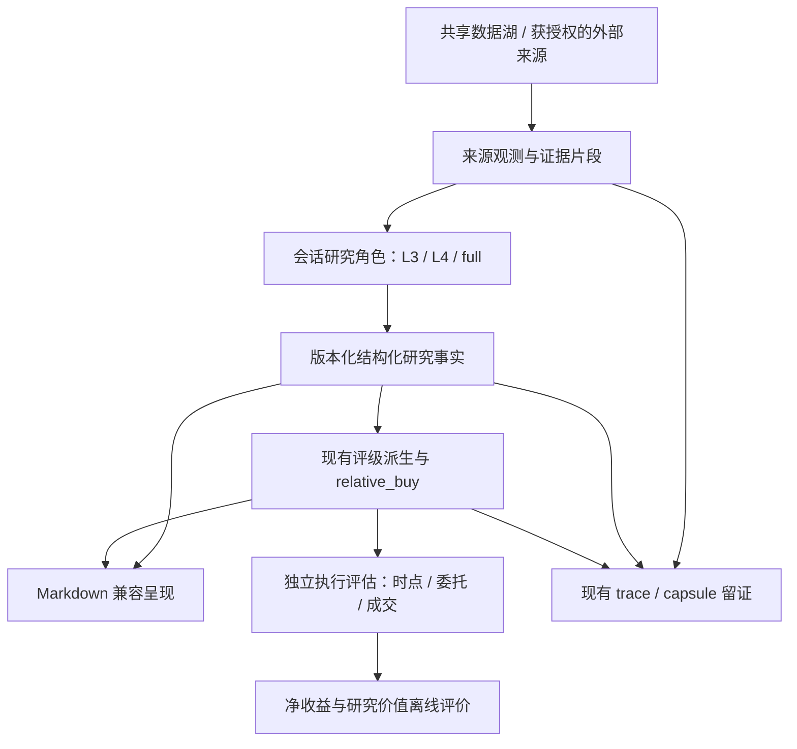

# AutoResearch 研究可信度与系统演进开发设计

> 日期：2026-09-06
>
> 代码基线：`cfd1371`
>
> 状态：开发设计稿。**工作包 A 已实施**（2026-09-06，见 §5 状态行）；B/C/D/E/F 仍为设计，功能未实施。
>
> 适用对象：项目维护者、股票研究人员、后续开发 agent。
>
> 实施入口：[A–F 全阶段开发计划与依赖索引](../plans/2026-09-06-research-system-implementation-index.md)。A 已有实施记录，B–F 详细计划已补齐，待分别实施。

## 1. 目标与决策摘要

本设计将项目优化分成三个连续目标：研究事实可信、收益评估可执行、工程运行可维护。先修正判断依据，再降低运行成本，最后依据独立证据调整研究方法。

第一轮讨论中的统计问题需要收窄：`overnight_census/core.py::cell_stats` 的点估计与置信区间确有不同权重，但 `overnight_census/__main__.py::_stat_cell` 已在上层重算日等权区间。问题是底层接口不一致、上层需要补偿；本次证据不足以认定现有 CLI 普查报告的置信区间错误。

建议采用路线 A：

| 路线 | 工作顺序 | 收益 | 主要代价 | 本设计取舍 |
|---|---|---|---|---|
| A：可信度先行 | 统计口径、事实核验、执行评估，再做工程收敛 | 后续每项策略优化有可靠尺度 | 前期不以新增 BUY 或提高收益为验收条件 | 推荐 |
| B：工程效率先行 | 接续现有 token 方案，减少命令壳与重复调度 | 较快改善耗时和资源使用 | 研究评价缺口仍然存在 | 可独立推进已设计的低风险部分 |
| C：研究能力扩张 | 新数据、新因子、新角色、新模型 | 扩大研究覆盖 | 增加维护成本、试验次数和归因难度 | 放在基础评价能力之后 |

开发成功不等于策略已证明盈利。每个里程碑分别验收功能正确性、研究证据、真实运行效率。

## 2. 范围与项目不变量

### 2.1 本设计覆盖

1. 统一日等权统计量及其置信区间入口。
2. 增强重大新闻断言的证据支持性校验。
3. 建立下单时点、实际成交与净收益的独立评估契约。
4. 逐步用结构化研究事实替代对 Markdown 的反向解析。
5. 复用现有任务簿与法证能力，收敛确定性编排。
6. 降低跨层依赖，明确各模块的唯一职责。
7. 明确 full/lite 研究目标与 L3/L4 的增量价值评价方法。

### 2.2 不变量

| 编号 | 必须保持的边界 |
|---|---|
| I01 | Codex 进程先设置 `AUTORESEARCH_ENGINE=codex`；研究产物仅落本引擎 `context_codex/`、`reports_codex/`。开发文档与源码按仓库路径管理。 |
| I02 | 不读写另一个引擎的 context、reports、档案、权重、账本或 transcript。数据湖 `lake/` 是唯一共享的研究数据根。 |
| I03 | 扫描与 lite 的主尺保持 `gap_c1_o2`：数据日 D，D+1 收盘买入、D+2 开盘卖出。full 深研另有自己的估值期限。 |
| I04 | 个股研究评级保持现有 rubric 三门；最终 BUY 仍由 `relative_buy` 所有。工程优化不改评级阈值、不扩大 BUY 数量。 |
| I05 | 零买日合法，不为产出率、成本分母或展示要求放宽门槛。 |
| I06 | 市场、行业输入给 L3/L4 的仍为描述性地形；`sector_healthy_top3` 的操作含义不进入个股判断。 |
| I07 | A 级数据异常阻断且拒绝入湖；B 级缺失显式降级。未知不冒充已验证或零风险。 |
| I08 | 不恢复已退役的自动学习、prompt 战绩回注、自动调权或实验晋升状态机。离线研究只供人判断。 |
| I09 | 不恢复 L4 决策卡跨日 TTL 复用、菜单 carryover、L3.5 或未经新证据支持的 L2 模型路线。 |
| I10 | 冻结 run 及历史报告不原地改写。重算、修复对照与新增事后信息写独立目录。 |
| I11 | 现有 scan 产物名称、评级词表、GATE1/2/4、任务终态和法证完整性义务保持兼容。新增契约按版本迁移。 |
| I12 | 不新增付费 LLM API 路线。跨引擎编排通过会话宿主提供推理结果，普通 Python 进程不假设自己能直接调用会话模型。 |

配置以 `.claude/skills/scan-market/scan_config.jsonc` 为现有单一入口。本设计不另设生产策略配置中心。`pinned.jsonc` 的用户改动不属于本次工作。

## 3. 现状证据与问题边界

### 3.1 已确认的实现事实

| 编号 | 证据 | 当前结论 | 不可扩大解释为 |
|---|---|---|---|
| F01 | `core.cell_stats` 使用日均值计算 `mean_pp`，对原始事件行调用 bootstrap | 底层均值和区间权重不同 | 所有已发布研究都错误 |
| F02 | CLI 的 `day_equal_ci` 先聚合为一日一行，`_stat_cell` 覆盖底层区间 | CLI 已有有效补偿；存在两处实现与两种默认 seed | CLI 完全未处理 F01 |
| F03 | `claim_ledger._supports` 对受控谓语按关键词命中返回 `PASS` | 不能完整判断主语、金额、否定与事件生命周期 | 所有新闻都虚假，或该子检查 PASS 即完整 claim 已 VERIFIED |
| F04 | `outcome.exec_ok` 使用 D+1 收盘终值；`exec_anchor` 的运营截止为 14:45 | 事后执行条件不能直接当作 14:45 已知条件 | 尾盘无法研究，或市场永远没有其他成交方式 |
| F05 | `DecisionRecord`、产出契约声明已经存在，部分事实仍从卡片文本提取 | 结构化迁移已有基础，应逐段接续 | 项目没有契约或没有结构化结果 |
| F06 | Workflow 仍通过 general-purpose agent 执行部分确定性命令 | 仍有编排壳成本与宿主适配空间 | 每个 agent 都应删除 |
| F07 | 分层测试显式登记存量向上依赖 | 需要沿依赖边减少耦合 | 按文件长度机械拆分能解决依赖问题 |
| F08 | 结果账本已有收益、时间锚、来源质量；集中普查已有固定成本假设 | 已有记录基础，仍需实际成交和账户成本模型 | 项目没有收益记录、没有成本研究 |

### 3.2 合成探针的可复现结果

统计探针：40 个交易日，前 20 日每天 100 行、收益均为 +1pp，后 20 日每天 1 行、收益均为 −1pp。

| 入口 | 点估计 / 区间 |
|---|---|
| `core.cell_stats(..., value_col="gap_pp")` | 日等权均值 0pp；区间约 `[0.963534, 0.989288]pp` |
| CLI `day_equal_ci` | 区间 `[-0.3, 0.3]pp` |

差异来自估计对象，不能通过增加 bootstrap 次数解决。两条入口的 seed 不同也需要显式保留或版本化，但 seed 差异不是上述权重错误的原因。

新闻探针：断言为“公司已完成 10 亿元回购”，正文为“公司公告终止回购计划，尚未实施回购”。调用 `_supports` 返回 `PASS`。此结果仅证明内容支持性子检查存在盲点，不证明该断言在真实扫描中已通过其他检查或影响 BUY。

### 3.3 验证基线

前一轮只读检查执行以下测试，结果为 **139 passed**：

```bash
export AUTORESEARCH_ENGINE=codex
PYTHONDONTWRITEBYTECODE=1 uv run --no-sync python -m pytest -q -p no:cacheprovider \
  tests/contracts/test_layering.py \
  tests/contracts/test_registry_parity.py \
  tests/scan/test_exec_anchor.py \
  tests/scan/test_outcome.py \
  tests/research/test_oc_core.py
```

该结果是既有实现的局部基线，不是本设计已实施的证明，也不是全量测试或完整实盘验收。

## 4. 目标架构与所有权



执行评估输出供人查看，首版不反向连接评级、召回或 BUY 所有者。事后执行记录写 run 外的本引擎研究目录，通过 `run_id` 和内容 hash 引用原 run。

| 层 | 所有者 | 允许依赖 | 主要职责 |
|---|---|---|---|
| 契约 | `autoresearch/contracts/` | 标准库和本层声明 | schema、词表、状态、版本 |
| 纯计算 | `autoresearch/common/` | 契约、数值基础库 | 统计、收益口径、成本算术 |
| 来源 | `autoresearch/data/`、`news/` | 现有取数和留证接口 | 数据契约、观测时点、证据定位 |
| 研究 | `analyze/`、`sector/`、`scan/l3/`、`scan/l4/` | 上述输入 | 形成研究事实与论点 |
| 决策 | `decision_finalize`、`relative_buy` | 结构化研究事实、现行守卫 | 评级折回、最终 BUY |
| 呈现 | 现有 report model / publisher / brief | 已确定的事实 | 报告、对账与可读解释 |
| 离线评价 | `autoresearch/research/` | 冻结输入、共享计算 | 评价研究增量与执行结果 |
| 编排 | 现有 Workflow，后续薄 runner | CLI、任务簿、宿主 adapter | 调度、失败分类、恢复 |

不为通过静态分层测试而单纯把 import 换成字符串。动态加载若仍形成运行时业务环，必须记录并处理该依赖。

## 5. 工作包 A：统计口径收敛

> **状态(2026-09-06)：已实施**，分支 `feature/statistical-estimator-convergence`（4 提交，全量 4985 passed / 6 skipped，新增 27 条测试）。§5.3 的 A01–A05 全部有对应测试；A04 另有 6 种形状的逐位 parity 探针，**08-28 读数的数字不变**。实施时按评审有 4 处偏离（引擎中立、输出隔离与覆盖拒绝、inf 声明为行为变更并做真面板预检、meta 补 seed/n_boot），逐条见[实施计划 §4/§5](../plans/2026-09-06-statistical-estimator-convergence.md#4-实施偏离4-处均按用户批准的评审结论)。
> **§5.2 的后续统计研究一件未做**；B/C/D/E/F 五个工作包未开工。

### 5.1 首期设计

新增 `common.stats.day_equal_bootstrap`，负责将有效事件行聚合为一日一行，再调用既有 `date_cluster_bootstrap`。返回的 `Interval.point`、`lo`、`hi` 对应同一个日等权估计量；`n` 保留有效事件行数，`n_clusters` 保留有效日数。

现有 `date_cluster_bootstrap` 保持原语义，避免无意改变其他研究模块的事件加权口径。`core.cell_stats` 接入新函数；CLI 保留公共 `day_equal_ci` 包装器，`_stat_cell` 改为一次正确计算，取消随后覆盖区间的补偿。

| 行为 | 明确约定 |
|---|---|
| 单位 | `pp` 为百分点；`0.15pp = 15bps = 0.0015` 小数收益 |
| 日权重 | 先计算每日事件均值，再对有观测日等权 |
| 日内复制不变性 | 将某一天的全部事件等比例复制，点估计和区间不变 |
| 空数据 | `point/lo/hi=None`；有效行数和日数为零 |
| 单日 | 可报告点估计；`lo/hi=None`，不声称跨日稳定性 |
| 缺必要列 | 显式抛异常，不能退化为逐行独立样本 |
| seed | core 默认保留 `20260828`，CLI 默认保留统计公共层的 `20260803`；相同显式 seed 才要求两入口数值严格一致 |
| 历史 | 旧文件保留；新重算记录版本、代码 SHA、输入范围和排除计数 |

首期不将独立日重采样替换为 block bootstrap，也不更换成本门或正证据判据。时间相关性的处理属于后续独立研究方法变更。

### 5.2 后续统计研究

1. 时间相关性：以交易日历对齐的日收益序列评估 moving-block 方法；“有观测日相邻”不直接等价于“连续交易日”。
2. 多重比较：报告尝试过的完整参数族与格数，同时呈现校正前后结果；不只展示赢家。
3. 稀疏事件：区分事件出现日的条件收益与完整日历上的组合收益。无事件日现金收益与数据缺失分别编码。
4. 统计版本：每次更换估计量、重采样方法或人口定义，独立记录版本；不得将新旧数值直接拼成趋势。
5. 样本不足：保持 `UNKNOWN/IMMATURE`，不能以“不显著”证明等价或证明无害。

### 5.3 验收

- A01：不等行数合成样本的点估计与区间同口径。
- A02：每日完整事件集合复制后结果不变；缺失日期不会生成伪独立样本。
- A03：core 与 CLI 在相同 seed 下区间一致。
- A04：CLI 对既有有效样本的日等权结果保持一致，原始通用 bootstrap 行为保持一致。
- A05：无历史 run、历史研究报告或旧 JSON 被自动覆盖。

## 6. 工作包 B：重大事件证据校验

### 6.1 两步交付

第一步降低错误确信：仅命中“回购”等谓语时，`content_supports` 应为 `UNKNOWN`；来源没有相应内容也不直接等于断言为假。只有证据包足以证明或反驳相应事实时才给确定结论。

第二步增加结构化匹配能力。优先覆盖回购、减持、中标三类，不一次性制作所有事件的自然语言推理系统。既有 `typed_events` 的生命周期词表可作候选提取线索，不能单凭标题标签证明正文事实。

### 6.2 新增内部契约：ClaimEvidence v2

以下为拟新增字段，不是现有模块已经实现的接口。

| 字段 | 类型 | 规则 |
|---|---|---|
| `claim_id` | string | 引用现有 claim；不重新生成股票身份 |
| `subject_code` | string | 六位代码；与来源记录明确关联 |
| `event_id` | string | 同一公司多项回购或多份中标公告必须区分 |
| `predicate` | enum | 首版限回购、减持、中标 |
| `lifecycle` | enum | `plan/in_progress/completed/terminated/unknown` |
| `assertion_kind` | enum | `actual/forecast/conditional/quotation` |
| `polarity` | enum | `affirmed/negated/uncertain` |
| `amount_value` | decimal string 或 null | 避免金额二进制浮点舍入；未知不置零 |
| `amount_unit` | enum 或 null | `CNY/shares/percent`，不混百分比与百分点 |
| `amount_basis` | enum 或 null | `planned_cap/executed_total/contract_total/unknown` |
| `effective_at` | 带时区时间或日期范围 | 事件生效时点，保留精度 |
| `source_observation_ids` | string[] | 指向已保存的观测 |
| `quote_spans` | object[] | 每项含 blob hash、字符起止位置与原文；可重新定位 |
| `extraction_origin` | enum | `official_structured/human_review/session_extraction` |
| `verification_basis` | string[] | 哪些字段由机械检查、人工复核或语义判断确认 |
| `rule_version` | string | 新校验版本，与旧版本分列 |

处理流程：规范单位与实体 → 锁定同一事件 → 匹配状态/否定/金额口径 → 对齐时点 → 输出每个字段的 verdict → 汇总内容支持结论。

### 6.3 结论规则

| 情况 | 结论 | 处理 |
|---|---|---|
| 仅有关键词，主体或事件不确定 | `UNKNOWN` | 保留未核实状态 |
| “拟回购上限 10 亿元”被写成“已回购 10 亿元” | 有同事件完整证据时 `FAIL`，否则 `UNKNOWN` | 标注计划与实施混淆 |
| “终止本次回购”支持“本次回购已完成” | 同事件且完整证据下 `FAIL` | 标注生命周期冲突 |
| 正文包括另一家公司回购 | `UNKNOWN` 或有明确错引证据时 `FAIL` | 不能只因同关键词通过 |
| 一家公司完成旧计划，同时终止新计划 | 先按 `event_id` 分离 | 不把终止词跨事件传播 |
| 只拿到截断页、摘要或抓取失败 | `UNKNOWN` | 不以未找到证明不存在 |
| 主体、事件、金额口径、时点都可核对 | `PASS` | 保留所用原文与验证方式 |

`PASS` 表示证据支持相应断言，不表示事件利多、不等于 BUY，也不保证来源本身永不更正。源错误、错引、过期事实仍沿现有 blame 体系区分。

### 6.4 接入与迁移

- 复用 `news/catalog.py` 的观测身份和 `trace/blobs.py` 的原文留档。
- 新增 `news/claim_support.py` 承担字段级比较；`claim_ledger.py` 负责兼容入口与汇总。
- 新记录先进入本引擎独立研究结果，检查生产调用链是否实际生成原文和引用 ID；不能将“定义了 schema”当作“已经接通”。
- 后续进入现有 lint 时，明确旧测试中“关键词即 VERIFIED”的期望需要语义修正。
- 只拒绝或降级缺乏支持的断言，不直接拒绝股票；现有 OHLCV 价格核对保持独立。
- 证据完善可能影响研究判断，属于研究行为变更，不能声称所有卡片评级必须保持字节一致。

### 6.5 验收

合成验收集覆盖上表全部情况。另做至少 60 条经人工标注的案例作为功能验收集：3 类事件各 20 条，包含可支持、反驳、资料不足三种情形。该数量是开发验收规模，不是统计有效性证明。

必须报告错误 PASS、错误 FAIL、UNKNOWN 占比和缺原文比例。不能通过把全部结果改成 UNKNOWN 宣称语义校验能力提高；第一步保守降级与第二步提高可验证覆盖率分别报告。

## 7. 工作包 C：执行时点与净收益评价

### 7.1 第一版范围

先实现导入与离线评估，不接券商下单，不建立自动交易。输入来自明确标注来源、时点和单位的行情快照及成交记录；没有可靠盘中来源时，评估状态就是缺少证据。

D+1 的 14:45 作为首版快照锚，用于研究当前运营截止附近的信息。实际下单若晚于快照时间，另记录 `order_submitted_at`；快照不自动被解释为委托或成交。

当前 D+1 收盘 `exec_ok` 保持事后诊断含义，新字段命名为 `entry_condition_at_snapshot`。二者并列，不改旧字段含义。

### 7.2 证据模式

| 模式 | 输入证据 | 可回答的问题 |
|---|---|---|
| `EOD_PROXY` | 日线收盘/开盘 | 价格收益代理与事后条件；不能证明决策时可见或成交 |
| `SNAPSHOT_SIMULATED` | 有来源的盘中快照，加明确成交假设 | 在假设成立时的模拟执行；不能冒充实盘 |
| `OBSERVED_FILL` | 实际委托与成交记录 | 实际数量、成交均价、费用与未成交状态 |

三个模式分别统计，禁止混算为一个“真实收益率”。

### 7.3 拟新增契约

`ExecutionSnapshot` 必需字段：

| 字段组 | 内容 |
|---|---|
| 身份 | `schema_version`, `snapshot_id`, `engine`, `run_id`, `code`, `venue`, `session_date` |
| 时点 | `decision_at`, `market_event_at`, `provider_published_at`, `received_at`, `persisted_at`, `timezone` |
| 行情 | `last`, `previous_close`, `high_so_far`, `low_so_far`, `volume_so_far`, `amount_so_far` |
| 状态 | `suspended`, `limit_up_price`, `limit_down_price`, `price_adjustment_basis` |
| 质量 | `source_observation_id`, `payload_hash`, `timestamp_precision`, `quality_flags` |

线上捕获要求事实在 `decision_at` 前可获得；`received_at > decision_at` 的事后导入不能冒充当时系统已经看见。历史供应商若证明当时已公开，可用于标为模拟的历史实验，仍不可冒充真实收到的快照。未知时间不填成交易日零点。

`ExecutionAssessment` 必需字段：

| 字段组 | 内容 |
|---|---|
| 关联 | `assessment_id`, `run_id`, `snapshot_id`, `code`, `policy_version`, `cost_model_version` |
| 判定 | `evidence_mode`, `entry_condition_at_snapshot`, `entry_status`, `exit_status`, `reason_codes` |
| 委托 | `order_submitted_at`, `requested_qty`, `order_limit_price` |
| 成交 | `entry_filled_at`, `entry_filled_qty`, `entry_vwap`, `exit_filled_at`, `exit_filled_qty`, `exit_vwap` |
| 金额 | `buy_notional`, `sell_notional`, `fees_paid`, `tax_paid`, `net_pnl_cash` |
| 敞口 | `remaining_qty`, `mark_price`, `unrealized_pnl`, `corporate_action_receivable` |
| 评价 | `ruler`, `scheduled_exit_session`, `holding_window_breached`, `net_return_realized` |

金额字段用明确币种的 decimal string；收益用小数比例，展示时再转 pp/bps。实际成交腿的分母是对应成本基数，部分卖出按可核对的成本分配方法计算，未平仓部分不能并入已实现收益。

### 7.4 状态与缺失处理

入场状态为 `UNKNOWN/NOT_SUBMITTED/NO_FILL/PARTIAL_FILL/FILLED/CANCELLED`；撤单前已有成交时保留成交数量，不把撤单当作从未成交。

退出状态为 `NOT_DUE/UNKNOWN/NO_FILL/PARTIAL_FILL/FILLED`。D+2 开盘卖不出，继续记录剩余持仓及市值，同时标记偏离计划退出窗口；不能删掉该样本，也不能把后续某天成功卖出的收益标成原隔夜尺收益。

成本分两路：

- 实际成交记录：以实际成交价和费用计算，滑点相对参考价单列诊断，避免重复扣除。
- 模拟成交：在基准价上应用显式滑点/冲击，再扣按日期和市场适用的税费与佣金。最低佣金、部分成交、订单合并口径均写进版本化成本参数。

除权除息需区分价格调整、股票数量、现金到账与应收权益，不能同时使用复权收益又叠加同一份红利。送转股尚未可卖时，不默认全部数量在 D+2 开盘可卖。

### 7.5 路径与输出

生产源码一律通过 `workspace` 解析引擎根，下面仅列 Codex 的实际目录示例：

```text
context_codex/execution/<experiment_id>/snapshots.jsonl
context_codex/execution/<experiment_id>/fills.jsonl
reports_codex/research/execution/<experiment_id>/assessments.jsonl
reports_codex/research/execution/<experiment_id>/daily_metrics.csv
reports_codex/research/execution/<experiment_id>/readout.md
reports_codex/research/execution/<experiment_id>/manifest.json
```

新目录须经 `mkdir(exist_ok=False)` 或同等排他创建，避免覆盖前次试验。原始成交文件若含账户身份，在复制进研究目录前最小化并脱敏；不保存账号或访问 token。

### 7.6 验收

- C01：14:45 快照不包含 15:00 才确定的最终高低点或收盘价。
- C02：未来时间、未知时间、过期来源均不会得到“当时已知”的肯定判定。
- C03：缺快照、缺成交、缺费用三类缺失分别可见，不能混成收益零。
- C04：未成交、部分成交、封板卖不出、停牌跨日均有固定测试案例。
- C05：三种 evidence mode 分开汇总；原 `gap_c1_o2` 代理收益与实际实现收益分列。
- C06：所有产物写 run 外，本引擎旧冻结报告 hash 不变。
- C07：第一版不影响生产评级、召回配额、BUY 或持仓动作。

## 8. 工作包 D：结构化研究事实与报告迁移

### 8.1 内部对象

新增版本化 `ResearchCard`，只表达研究者判断和证据：`code`、`analysis_date`、`ruler`、六维评价、三门状态、早停阶段与原因、论点前提、证据引用、独立初判、P4 倾向、情景及其假设、持仓管理说明。

终评级继续由既有 rubric 与复核折回生成；`ResearchCard` 不允许写一个凌驾于 `relative_buy` 的正式交易 BUY。研究三档情景的主观概率单独标记 `probability_basis=subjective`，不能展示为经过样本校准的发生概率。

### 8.2 迁移顺序

1. 定义 schema，生成与现行词表同源的校验器及宿主需要的声明。
2. 用固定 fixture 验证结构化对象可渲染出当前机读锚点。
3. 新运行先产生候选内部对象，与现有卡片解析结果比较；该阶段旧路径仍是事实所有者。
4. 确认所有消费者字段映射后，按版本将新运行切到结构化对象所有；Markdown 变成该版本的派生视图。
5. 旧 run 保留旧 parser，新 run 结构化对象缺失或损坏时明确失败，不能静默回退解析 Markdown。

迁移前后只允许一个真值所有者。过渡期的比较文件不是第二个生产决策来源。

### 8.3 验收

`Rating`、`proposal`、gate states、early stop、evidence refs、持仓身份与最终报告逐项同源。测试包括标题改写、全角标点、否定句含 Buy、缺 Rating、持仓复核缺失等案例。沿用 `decision_records.json` 和现有发布文件契约，不一次性更名全部产物。

## 9. 工作包 E：编排效率与依赖收敛

### 9.1 接续已有设计

先阅读 [2026-09-04 token 两线设计](2026-09-04-token-efficiency-two-lines-design.md) 及其已实施范围。本设计不重做 metering Wave 1，不引用其他引擎运行状态来替代 Codex 计量。

依现有路线，先测当前命令壳成本，再决定是否进入非 LLM runner。即使历史文档记录过高壳占比，也不能直接声称当前优化能节省相同比例。

### 9.2 runner 边界

确定性执行使用 argv 数组启动进程并复用 `exec_capture`，不拼接未经转义的 shell 字符串。重试、日志、信号和退出码均由程序处理。

推理阶段返回一个待处理信封，由当前宿主完成推理后交回结果。信封字段契约如下：

| 字段 | 类型与验证 |
|---|---|
| `schema_version` | 整数；首版为 1 |
| `engine` | 当前进程引擎；与输入路径所属引擎一致 |
| `run_id` | 通过 `workspace.validate_run_id` 的现有运行 ID |
| `task_id` | 现有任务簿身份；不能由宿主另造一套任务编号 |
| `role` | 现有角色词表中的研究角色 |
| `input_artifact_ids` | 已登记且已存在的输入产物 ID 数组 |
| `input_contract_hash` | 既有契约计算器生成的 64 位十六进制 hash |
| `expected_output_contract` | 已注册的输出契约及版本；结构化卡迁移后可为 `ResearchCard.v1` |
| `attempt` | 与任务簿一致的正整数尝试序号 |

不具备非 LLM 调度原语的宿主仍可使用旧 Workflow；runner 不模拟一个不存在的会话 API。任务重放复用既有任务簿终态与契约 hash，无法判断存活状态时不启动第二份相同任务。

### 9.3 首批依赖整理

| 依赖问题 | 处理方式 | 验收 |
|---|---|---|
| `scan → research` 的共享收益计算 | 下沉经确认被生产使用的纯计算，旧 import 提供兼容转发 | 结果同口径，旧接口可用 |
| `trace → scan` 的业务声明 | 由业务层向留证组件传入注册描述 | trace 公共 API 可由 scan 和 analyze 独立使用 |
| 业务组件惰性反向引用 scan | 拆出最小输入结构或参数注入 | 运行时依赖环减少，不能只让 AST 看不见 |
| 卡片事实依赖展示逻辑 | 将事实提取/校验与排版分开 | 展示变化不改变决策事实 |

### 9.4 验收指标

每 run 与每 finalist 分别报告真实 wall time、调用次数、失败/重试率、输入输出 token、加权成本代理及计量版本。沿用已有成熟样本门与质量约束，不为减少成本降低情报覆盖、取消研究或复用过期卡片。

## 10. 工作包 F：股票研究方法演进

### 10.1 三种问题分别评价

| 产品问题 | 主要指标 | 不能替代的指标 |
|---|---|---|
| 公司研究是否可靠 | 重大事实支持率、反证覆盖、论点可证伪性 | 一次涨跌 |
| 选股是否有相对优势 | 对齐人口的市场/行业超额、排序质量 | 卡片文笔、评级数量 |
| 交易是否值得执行 | 成本后收益、尾部损失、未成交、窗口偏离、资金占用 | 相对排名第一 |

当前相对 BUY 语义保持不变。新增经济评价不能自动改写 BUY 为持币；若后续要引入现金比较作为交易门，它属于独立策略设计。

### 10.2 full 研究

围绕公司经营驱动建立可核验的因果假设：价格、销量、利用率或订单质量如何影响利润与现金流；市场已经预期什么；差异将在何时被验证。

行业模板按核心经济关系区分，例如周期行业关注供需与价差，制造业关注订单兑现和营运资金，金融行业关注资产质量与负债成本。模板差异用于组织事实，不自动产生行业方向或改变 scan 三门。

每条核心论点附：可观察指标、来源、预期验证日期、反证条件、哪些信息尚不可知。卖方目标价只作预期参照，不能直接充当隔夜目标价。

### 10.3 lite 研究

研究窗保持 D+1 收至 D+2 开。新增事实的关注顺序为：

1. 信息何时首次可得，是否已被前一段价格变化反映。
2. 对目标窗口是否存在具体、可说明的传导机制。
3. 资金和价格证据能否支持该机制，是否存在相反解释。
4. 哪个事实会在入场前否决论点；卖不出时风险如何暴露。

现有“基本面好”“估值低”可支持公司质量判断，其对隔夜方向的预测价值需要独立评价。三档情景及 R:R 首先是条件假设，缺校准时不把主观概率当成统计概率。

### 10.4 L3/L4 边际价值研究

仅在本引擎数据内构建离线研究集，记录固定代码、prompt、配置和来源身份。依次比较确定性菜单、L3、L4、情报与复核所带来的变化。

- 选择能力：同一数据日与可比人口的排序和净收益差。
- 避雷能力：被否决股票的尾部损失，以及被错杀股票的机会损失。
- 事实能力：可验证断言准确度、未知率、重大反证发现率。
- 成本：每个成熟研究对象的耗时和资源使用。

旧数据若未覆盖被 L3/L4 切掉的候选，不能直接推断其 L4 反事实评级。确需补充研究时，从切掉的候选中事先固定抽样，在离线目录独立运行，不补回生产名单，也不启动退役的每日影子漏斗。

同模型多个角色的复核可能有相关错误，不能把三票一致解释成三个独立证据。评价时保留各自输入、是否看到原结论和错误重合率。

LLM 历史重跑还可能包含模型训练知识中的后见信息。严格的真实前向效果以当时冻结的研究记录和随后结果为准；事后生成的历史卡片必须标注为回放实验。

### 10.5 因子与概率评价

新因子先写出机制、方向、可得时点、标签窗口、对照基准和试验家族，再看结果。禁止在同一批结果上反复改定义后继续称其为未见样本。

置信度若将来量化为概率，先定义事件，例如“D+2 开盘的成本后收益大于零”，再评价概率误差与分组校准；不能混合“事实可信度”“论点把握度”“价格上涨概率”。首版保持现有高/中/低展示，不引入假精确数字。

## 11. 开发路线、任务边界与产物

| 工作包 | 交付物 | 依赖 | 建议优先级 | 粗略投入 |
|---|---|---|---|---|
| A：统计单源 | 共享日等权原语、两入口收敛、回归测试 | 无 | P0 | 1–2 工程日 |
| B1：语义保守判定 | 关键词不再代表完整支持，状态回归案例 | 无 | P0 | 1–2 工程日 |
| B2：重大事件字段核验 | 3 类事件契约、原文关联、人工验收集 | B1、实际来源覆盖检查 | P1 | 3–6 工程日 |
| C：执行离线评估 | 快照/成交导入、成本计算、独立读数 | 明确输入来源与字段时间语义 | P1 | 4–7 工程日 |
| D：卡片结构化 | 内部 schema、兼容渲染、版本切换 | B 的证据引用语义 | P2 | 4–7 工程日 |
| E：编排收敛 | 接续现有 token 计划、宿主适配、恢复测试 | 当前计量与任务簿 | P2 | 3–6 工程日，runner 另按宿主能力拆分 |
| F：研究增量评价 | 固定评价集、基准比较、研究结论 | A、C；足够真实样本 | P2 | 仪器 3–5 工程日；样本成熟不按工期保证 |

投入为熟悉代码的一名工程师的工作量估计，不含外部数据授权、真实样本积累及产品集成等待，也不作为收益承诺。

A 已独立实施。B–F 均已有分任务实施计划，统一从[全阶段索引](../plans/2026-09-06-research-system-implementation-index.md)进入；索引列明各包依赖、可独立推进的工作、覆盖矩阵及交付级别。各包仍按独立提交和验收推进，不混成一次大重构；文档补齐不等于 B–F 已上线。

### 11.1 拟涉及文件

| 工作包 | 修改既有文件 | 拟新增文件 |
|---|---|---|
| A | `common/stats.py`、`research/overnight_census/core.py`、`research/overnight_census/__main__.py` | `tests/common/test_day_equal_stats.py`、`tests/research/test_oc_statistics_contract.py` |
| B | `news/claim_ledger.py`、必要时 `news/typed_events.py`、`trace/evidence_index.py` | `contracts/claim_evidence.py`、`news/claim_support.py`、对应测试 |
| C | 仅复用 `scan/exec_anchor.py`、`scan/outcome.py` 的现有公开口径，首版不改写其输出 | `contracts/execution.py`、`common/execution_math.py`、`research/execution_audit.py`、对应测试 |
| D | `contracts/agent_output.py`、`scan/l4/parsers.py`、`decision_finalize.py`、相关 agent 模板 | `contracts/research_card.py`、`scan/l4/card_io.py`、对应测试 |
| E | 现有 Workflow、`l4_tasks.py`、`exec_capture.py` 的适配点 | 是否新增 runner 模块由宿主能力验证结果决定 |
| F | 现有研究仪器的适配入口，保持生产链无回注 | `research/stage_value.py`、固定研究说明与测试 |

表内未带前缀的生产模块均位于 `autoresearch/`。这些是设计中的新增路径，不表示文件已存在。

## 12. 测试、发布与回滚

### 12.1 测试分层

| 类型 | 覆盖 | 通过条件 |
|---|---|---|
| 纯计算 | 日等权、单位换算、成本、部分成交 | 固定输入下结果明确且可复现 |
| 契约 | 缺字段、无效版本、未知枚举、跨引擎路径 | 明确拒绝或降级，不走隐式猜测 |
| 语义边界 | 计划/完成/终止、金额口径、错主体、截断原文 | 无证据不足导致的肯定支持 |
| 集成 | 取数事实 → 研究结果 → 决策 → 呈现 | 单一所有者，字段一致，原有门照常有效 |
| 故障恢复 | 中断、重复任务、迟到结果、部分产物 | 不产生双任务、伪成功或覆盖冻结现场 |
| 研究有效性 | 真实前向样本与离线对照 | 报样本范围、不确定性、成本和限制 |

不因修改文档新增大量镜像测试。代码实施时，测试应针对上述失效模式，而不是检查注释里有某句话。

### 12.2 发布条件

1. 每包先过相关测试；跨模块迁移合入前运行仓库全量测试。
2. 同输入下，工程型变更要求现有决策事实保持一致；研究行为变更要求差异可解释，不能以字节 parity 否定必要的纠错。
3. 真实扫描验收必须按项目技能执行 GATE1/2/4；纯统计离线包不为验收而发起一次全市场扫描。
4. 记录代码 SHA、配置、统计/证据/执行版本以及输入身份。
5. 新产物缺少证据、计量或成交字段时，输出明确状态；不能以零代替未测。

### 12.3 回滚矩阵

| 工作包 | 回滚单位 | 数据处理 |
|---|---|---|
| A | 原子提交；如回退底层，原 CLI 补偿须同时保留 | 新旧研究版本并存，不覆盖旧结论 |
| B | 新语义匹配适配器 | 已知仅靠关键词的 PASS 不重新宣称完整验证；新证据可停止接入但保留未核实状态 |
| C | 独立导入和评价入口 | 保留原始快照与成交记录；生产决策链不受影响 |
| D | 新版本 run 的读写适配器 | 不在同一 run 中途切换所有者；旧版读取保持可用 |
| E | runner / Workflow 路由 | 在任务边界迁移；运行中任务完成或冻结后再切换 |
| F | 离线评价代码版本 | 结果单独归档，不改变生产参数 |

回滚使用普通可审计提交，不使用清空工作区或覆盖历史产物的方式。每个提交仅包含该任务文件，避免将用户持仓清单纳入。

## 13. 完成定义与后续决策入口

首期完成定义：共享日等权函数、core 和 CLI 接线、边界测试、文档及局部验证齐全；历史文件不变。其他工作包分别按其验收条款完成，不能以“主流程跑完”替代证据与执行验收。

需要外部输入时采用明确的降级设计：没有盘中来源就先接导入接口；没有真实成交就只报模拟；没有足够样本就报未成熟。不能为了推进进度构造不存在的数据或权限。

以下产品变化没有在本文中选定为生产行为：增加现金择时门、修改研究三门、改变相对 BUY 语义、启用盘后交易、扩大自动化交易范围、改变持有期。后续如研究证据支持，应分别作为策略设计讨论。

## 14. 参考资料与阅读顺序

### 14.1 项目资料

1. [CLAUDE.md](../../../CLAUDE.md) 与 [AGENTS.md](../../../AGENTS.md)：运行约束与引擎隔离。
2. [扫描技能](../../../.claude/skills/scan-market/SKILL.md) 与 [STAGES.md](../../../.claude/skills/scan-market/STAGES.md)：现行阶段、门与退役范围。
3. [个股研究技能](../../../.claude/skills/stock-research/SKILL.md) 与 [lite playbook](../../../.claude/skills/stock-research/lite-playbook.md)：full/lite 的不同研究期限。
4. [统计公共层](../../../autoresearch/common/stats.py)、[普查 core](../../../autoresearch/research/overnight_census/core.py)、[普查 CLI](../../../autoresearch/research/overnight_census/__main__.py)：统计问题的完整调用链。
5. [claim ledger](../../../autoresearch/news/claim_ledger.py)、[事件生命周期](../../../autoresearch/news/typed_events.py)：既有语义校验基础。
6. [时间锚](../../../autoresearch/scan/exec_anchor.py)、[结果账本](../../../autoresearch/scan/outcome.py)、[相对 BUY](../../../autoresearch/scan/relative_buy.py)：研究、推荐和执行的既有分工。
7. [8 月 28 日普查读数](../../research/2026-08-28-overnight-concentrated-census-readout.md)：事后可见条件与成本假设的历史记录；本文未重跑该历史研究。
8. [法证现场设计](2026-08-27-scan-forensic-run-capsule-design.md)、[token 两线设计](2026-09-04-token-efficiency-two-lines-design.md)：复用既有基础设施。

### 14.2 外部资料

- Bailey 等，[The Probability of Backtest Overfitting](https://www.davidhbailey.com/dhbpapers/backtest-prob.pdf)：解释多次尝试造成的虚假发现风险；本文据此要求显式报告试验家族，未声称某一种验证方法能保证盈利。
- 上交所，[2026 年交易规则修订说明](https://www.sse.com.cn/aboutus/mediacenter/hotandd/c/c_20260424_10816474.shtml)：2026-07-06 生效的修订包括扩展盘后固定价格交易范围。引用用于说明交易规则需要版本化；本文没有据此启用盘后策略或推断实际成交能力。

## 15. 文档自检记录

- 已区分已确认缺陷、上层已补偿的问题和拟新增能力。
- 已明确统计权重与 seed，不把修正估计对象和更换 bootstrap 方法混成一步。
- 已明确程序调度不等于获得会话模型 API。
- 已区分研究评级、相对 BUY、模拟执行和实际成交。
- 已定义新旧契约所有者与兼容顺序，未要求回写冻结产物。
- 已将 broad roadmap 拆成独立工作包，A–F 各有详细实施计划；全阶段索引含主设计到任务的覆盖矩阵。
- 初版文档交付时验证了 20 个本地文档链接、14 个内存回归样例；这是初版文档的历史自检记录。A 后续实施及验证情况以 §5 与 A 计划的实施记录为准。
- 本文及 B–F 计划仍是设计交付；A 有单独实施记录。不能以文档存在证明 B–F 已上线或研究优势已经验证。
